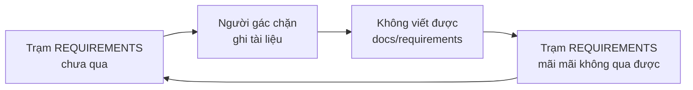
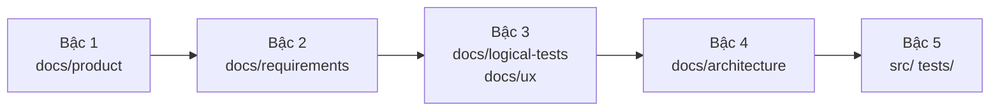
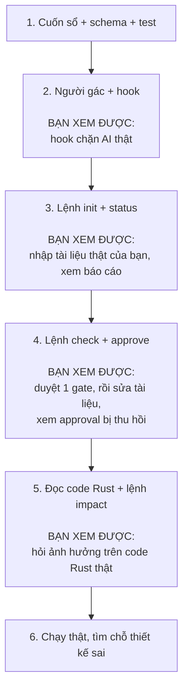

# Trả lời của Claude

Đã ghi lại 4 quyết định và viết xong đặc tả chi tiết: `design/KIDEA_SPEC_V0.1.md`.

Dưới đây là những chỗ bạn cần đọc kỹ trước khi tôi bắt đầu code.

---

## 1. Câu trả lời số 3 của bạn có một cái bẫy

Bạn chọn **chặn cứng cả code lẫn tài liệu**. Nếu tôi làm đúng nghĩa đen thì hệ thống **tự khoá chính nó**:

Muốn qua trạm nghiệp vụ thì phải viết tài liệu nghiệp vụ. Chặn viết tài liệu thì không bao giờ qua trạm.

**Nên tôi hiểu ý bạn là:** không phải "cấm viết tài liệu", mà là **"cấm viết tài liệu của bước sau khi bước trước chưa xong"**. AI không được nhảy sang viết tài liệu kiến trúc khi nghiệp vụ còn dang dở.

Cụ thể, mỗi thư mục có một **bậc**, và bậc hiện tại gọi là **mốc**:

| Trường hợp | Phán quyết |
|---|---|
| Ghi vào bậc **bằng hoặc thấp hơn** mốc | **CHO** |
| Ghi vào bậc **cao hơn** mốc | **CHẶN** |
| Sửa tài liệu **đã duyệt** ở bậc thấp | **CHO**, nhưng thu hồi approval và bắt làm lại mọi thứ phía sau |
| Ghi vào `state.yaml`, `graph.json`, `docs/source` | **CHẶN** luôn |

Hàng thứ ba quan trọng: **bạn luôn được quyền đổi ý về nghiệp vụ.** kidea không cấm bạn sửa, nó chỉ bắt mọi thứ phía sau phải làm lại cho khớp — đúng ý bạn viết trong draft là "làm đến cùng".

**Nếu tôi hiểu sai ý bạn, báo ngay bây giờ**, vì cái này quyết định toàn bộ phần người gác.

---

## 2. Tôi phải nói thẳng một giới hạn về Rust

Bạn chọn Rust. Có một chỗ tôi **không làm được hoàn hảo**, và tôi muốn bạn biết trước chứ không phát hiện sau.

Tấm bản đồ có hai lớp, như đã bàn. Lớp "máy tự đọc code" với Rust thì thế này:

| Loại quan hệ | Có bắt được không |
|---|---|
| `use` / import giữa module | Chính xác |
| Gọi hàm trực tiếp `foo::bar()` | Chính xác |
| Gọi method trên kiểu cụ thể | Gần chính xác |
| Gọi qua trait `dyn Trait` | **Bỏ sót** |
| Code sinh bởi macro | **Bỏ sót** |

Lý do: muốn chính xác 100% với Rust thì phải chạy qua `rustc` hoặc `rust-analyzer`, tức là project phải biên dịch được, và rất chậm. tree-sitter chỉ đọc cú pháp nên không biết `dyn Trait` thực tế trỏ tới đâu.

**Hệ quả thiết kế, và đây là điểm quan trọng:**

> Lớp **annotation** (`@kidea:implements BR-BAL-003` bạn viết trong code) là nguồn sự thật, dùng để gác cổng.
> Lớp **parser** chỉ để gợi ý khi trả lời `impact`, và luôn hiện kèm cảnh báo có thể sót.

Tôi **không xây luật cứng lên trên dữ liệu xấp xỉ**. Nếu project của bạn dùng nhiều trait object, phần gợi ý từ parser sẽ mỏng, và annotation gánh phần chính. Đổi lại annotation thì chính xác tuyệt đối vì do người viết ra.

Nếu sau này bạn cần chính xác hơn, v0.3 thêm được nguồn từ `rust-analyzer`.

---

## 3. Những gì đặc tả đã chốt xong

Không cần đọc hết, nhưng để bạn biết trong đó có gì:

- **Cuốn sổ `state.yaml`** — cấu trúc đầy đủ, mọi giá trị hợp lệ. Kèm hai luật bất khả xâm phạm: `human: APPROVED` chỉ đặt được bởi lệnh `/kidea approve`; và không duyệt được gate mà chính AI còn đang báo thiếu.
- **Cách viết annotation trong Rust** — dùng `///` hoặc `//`, kèm quy ước đặt ID.
- **`graph.json`** — cấu trúc node và cạnh, mỗi cạnh ghi rõ đến từ annotation hay parser.
- **`log.jsonl`** — sổ ghi thêm, không sửa. Đây là bằng chứng: ai duyệt gì, lúc nào, trên commit nào.
- **Sáu lệnh v0.1** — điều kiện, các bước, kết quả, cách thất bại của từng lệnh.
- **Thông điệp khi chặn** — phải nói được 3 điều: chặn vì sao, đang kẹt ở đâu, làm gì tiếp. Nếu không AI sẽ loay hoay thử lại.

---

## 4. Những gì v0.1 cố tình KHÔNG làm

Ghi rõ để sau này không ai tưởng là tôi quên:

`next` · `change` · `adopt` · `slice` · context pack và subagent · sinh logical test tự động · nhập UX · tài liệu kiến trúc → **v0.2**

Deploy · CI · production gate → **v0.3**

Ngôn ngữ khác Rust · call graph chính xác qua rust-analyzer → **sau khi Rust chạy ổn**

Nếu có cái nào bạn thấy **bắt buộc phải có ngay**, nói bây giờ.

---

## 5. Tôi sẽ code theo thứ tự này

Mỗi mốc là thứ bạn **bấm vào xem được**, không phải một dòng báo cáo tiến độ. Mốc đầu tiên bạn thấy được là **bước 2** — lúc đó bạn có thể tự thử bảo tôi viết code khi gate chưa qua, và xem tôi bị chặn.

---

## 6. Bốn chỗ tôi nghĩ có thể sai

Nói trước để bạn để ý khi chạy thử:

1. **Hook chặn `Bash` không sạch.** Đọc câu lệnh shell để đoán nó ghi vào đâu là việc bẩn. Tôi chặn được các dạng phổ biến (`>`, `>>`, `tee`, `sed -i`, `cp`, `mv`), nhưng chắc chắn có đường vòng tôi không nghĩ ra. Mục tiêu là chống AI trôi dạt, không phải chống kẻ cố tình phá.
2. **Ranh giới bậc có thể quá thô.** Đời thật sẽ có file không thuộc bậc nào rõ ràng — script build, migration, config. Tôi để sẵn danh sách miễn trừ, nhưng nó sẽ phải chỉnh dần.
3. **Call graph Rust sẽ sót**, như mục 2.
4. **Ép working tree sạch trước khi duyệt có thể phiền.** Đúng về kỹ thuật — không băm được nội dung nếu file đang dở — nhưng có thể gây khó chịu khi dùng thật.

---

## Cần bạn làm gì bây giờ

Đọc `design/KIDEA_SPEC_V0.1.md`, chú ý ba chỗ:

- **Mục 1** — cách tôi diễn giải "chặn cứng cả tài liệu". Sai thì phải sửa trước khi code.
- **Mục 6** — giới hạn call graph Rust. Đây là chỗ kỳ vọng dễ lệch nhất giữa chúng ta.
- **Mục 10** — danh sách v0.1 không làm.

Ổn rồi thì trả lời **"duyệt spec"**, tôi bắt đầu code ngay từ bước 1.
