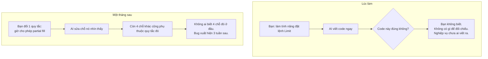
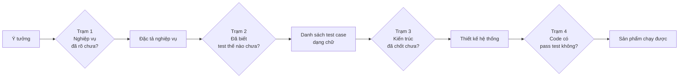
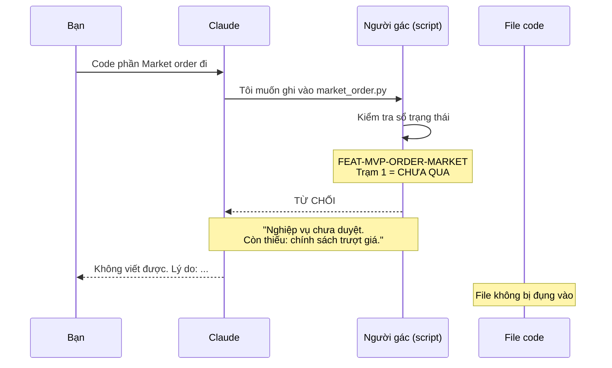
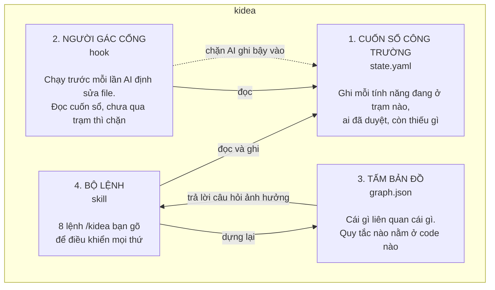
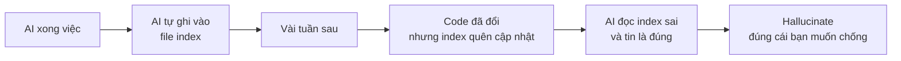
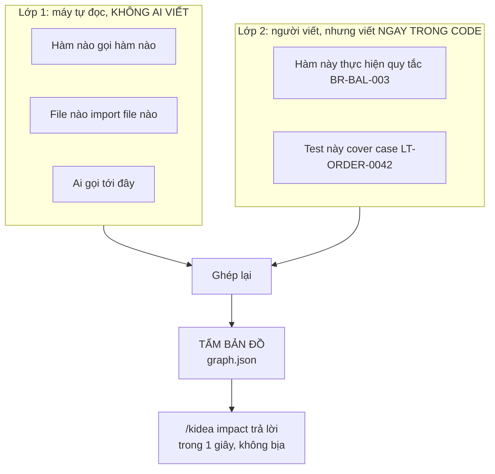
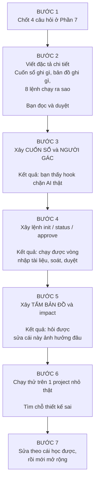

# Trả lời của Claude

Tôi giải thích lại từ đầu, bỏ hết thuật ngữ.

---

## Phần 1 — Vấn đề bạn đang gặp

Bạn đã tự nói ra rồi: *"tôi biết cách tôi tận dụng AI chưa tốt, nó chưa theo 1 khung nào cả nên nó làm tôi khó control."*

Cụ thể nó hỏng ở hai chỗ:



Hai vấn đề này khác nhau:

- **Vấn đề 1: AI làm quá sớm.** Nó viết code khi nghiệp vụ chưa rõ. Code ra thì trông có vẻ chạy được, nhưng sai ngay từ giả định.
- **Vấn đề 2: AI không nhớ hết.** Sửa một chỗ nhưng không biết chỗ đó liên quan tới đâu.

`kidea` sinh ra để chặn đúng hai thứ này. Không phải để "làm AI thông minh hơn".

---

## Phần 2 — kidea là gì, nói bằng ẩn dụ

Hãy nghĩ tới **quy trình xây nhà**.

Bạn không được đổ móng trước khi bản vẽ được duyệt. Không phải vì thủ tục hành chính, mà vì đổ móng sai thì phải đập cả nhà.

`kidea` đặt các **trạm kiểm tra** trên đường từ ý tưởng tới sản phẩm. Mỗi trạm có một câu hỏi. Chưa trả lời được thì không đi tiếp.



**Điểm mấu chốt: ai là người gác trạm?**

Trong bản Codex cũ, người gác trạm là *lời dặn trong prompt*. Tức là bạn dặn AI "đừng đi qua trạm khi chưa duyệt". AI đọc, gật đầu, rồi 20 phút sau nó quên và đi qua.

Trong bản tôi thiết kế, người gác trạm là **một đoạn script chạy tự động, đứng ngoài AI**. AI muốn viết code, script kiểm tra trạm trước đã, chưa qua thì **chặn thẳng**. AI không cãi được vì nó không phải người quyết định.

Đây là khác biệt lớn nhất, và là lý do đáng giá nhất để bạn rời Codex.

---

## Phần 3 — Một ngày làm việc với kidea trông như thế nào

Đây là phần quan trọng nhất. Tôi kể một kịch bản thật.

### Ngày 1 — Nhập tài liệu từ ChatGPT

Bạn gõ:

```
/kidea init ../chatgpt-san-crypto
```

kidea đọc toàn bộ tài liệu ChatGPT của bạn, rồi báo:

```
Đã đọc 14 file tài liệu.

Tìm thấy 12 tính năng:
  MVP     8
  Future  3
  Idea    1

Đã kiểm tra nghiệp vụ 8 tính năng MVP:
  5 tính năng: tài liệu đủ rõ
  3 tính năng: THIẾU THÔNG TIN

TRẠM 1 CHƯA QUA. Chưa được sang bước sau.
Gõ /kidea status để xem thiếu gì.
```

Bạn gõ `/kidea status`:

```
FEAT-MVP-ORDER-MARKET — Đặt lệnh Market
  Thiếu 1: Thanh khoản không đủ thì xử lý thế nào?
  Thiếu 2: Có cho phép khớp một phần không?
  Thiếu 3: Giới hạn trượt giá bao nhiêu?

  Tôi đề xuất:
    1. Khớp được bao nhiêu thì khớp, phần còn lại huỷ
    2. Có, cho phép khớp một phần
    3. Cho người dùng tự đặt mức trượt giá tối đa

  Đây là ĐỀ XUẤT, chưa phải quyết định. Bạn chốt.
```

Bạn trả lời trong chat, AI cập nhật tài liệu. Khi bạn thấy ổn, bạn gõ:

```
/kidea approve requirements FEAT-MVP-ORDER-MARKET
```

Chỉ **bạn** mới gõ được lệnh này. AI không có đường tự duyệt cho chính nó.

### Ngày 5 — Khoảnh khắc kidea chứng minh giá trị

Giả sử còn 1 tính năng chưa duyệt, nhưng bạn sốt ruột và bảo AI:

> "Thôi code luôn phần đặt lệnh Market đi"

AI định viết file `services/order/market_order.py`. Nhưng:



Kể cả AI *muốn* nghe lời bạn, nó cũng không làm được. Đây là điều Codex không làm được, và là thứ bạn cần.

Nếu bạn thật sự muốn đi tiếp, bạn phải duyệt chính thức. Tức là **bạn phải nhìn vào cái mình đang bỏ qua** trước khi bỏ qua nó.

### Ngày 30 — Đổi một quy tắc nghiệp vụ

Bạn muốn đổi quy tắc giữ số dư. Bạn gõ:

```
/kidea impact BR-BAL-003
```

kidea trả lời:

```
Sửa BR-BAL-003 sẽ ảnh hưởng:

  Tài liệu      2 file
  Test case     5 case (LT-ORDER-0042, 0043, 0051, 0052, 0067)
  Code          3 file
                  services/balance/reserve.py
                  services/order/place_order.py
                  services/risk/precheck.py
  Test code     4 file
  Màn hình      2 (Web đặt lệnh, Admin xem số dư)

  Approval sẽ bị thu hồi: requirements, logical_tests, architecture
```

**Đây là câu trả lời của một cái máy, không phải trí nhớ của AI.** Nên nó không bịa.

Và sau khi bạn sửa BR-BAL-003, kidea đánh dấu 16 thứ ở trên là "chưa đồng bộ". Người gác sẽ không cho đóng việc chừng nào còn thứ chưa đồng bộ. Đúng ý bạn viết trong draft: *"khi sửa hoặc xoá thì truy ra các bên liên quan và làm đến cùng."*

---

## Phần 4 — Vậy tôi sẽ xây cái gì?

Bốn mảnh. Tôi đặt tên đời thường cho dễ hình dung.



Nói rõ từng cái:

**1. Cuốn sổ công trường.** Một file duy nhất ghi trạng thái. Vì sao cần? Vì hôm nay bạn mở Claude Code, ngày mai mở lại, AI đã quên sạch. Cuốn sổ nằm trong repo nên nó **không quên**. Mở session mới, gõ `/kidea init`, AI đọc sổ và biết ngay đang ở đâu.

**2. Người gác cổng.** Đoạn script chạy tự động trước mỗi thao tác của AI. Đây là thứ biến "lời dặn" thành "luật".

**3. Tấm bản đồ.** Cái này cần giải thích kỹ hơn, xem Phần 5.

**4. Bộ lệnh.** 8 lệnh:

| Lệnh | Nghĩa đời thường |
|---|---|
| `/kidea init` | Bắt đầu, hoặc mở lại project cũ |
| `/kidea status` | Tôi đang ở đâu, kẹt cái gì |
| `/kidea check` | Soát lại xem có gì sai lệch không |
| `/kidea index` | Vẽ lại tấm bản đồ |
| `/kidea next` | Làm bước tiếp theo hợp lệ |
| `/kidea approve` | Tôi duyệt. Chỉ bạn gõ được |
| `/kidea impact` | Sửa cái này thì ảnh hưởng đâu |
| `/kidea change` | Mở một việc mới: sửa bug, thêm tính năng... |

---

## Phần 5 — Tấm bản đồ: chỗ tôi sửa yêu cầu của bạn

Trong draft bạn viết:

> *"Sau khi xong 1 task con thì update trong 1 file index hoặc mapping nào đó để biết các file/module đã làm gì, đang gọi đến đâu và được đâu gọi đến."*

Ý bạn đúng. Nhưng **cách làm** thì tôi đề xuất khác, và đây là chỗ quan trọng nhất tôi muốn bạn hiểu.

### Cách bạn nói: AI tự khai vào một file index



Vấn đề: một cuốn sổ do AI tự khai thì **không đáng tin hơn trí nhớ của AI**. Nó chỉ đổi chỗ cất vấn đề.

### Cách tôi đề xuất: máy tự đọc code rồi vẽ bản đồ

Bạn đã nhắc đúng từ khoá mà chưa khai thác hết: **Doxygen**.

Doxygen không bắt ai duy trì file index. Nó **đọc source code rồi tự sinh ra index**. Người lập trình chỉ viết chú thích ngay cạnh hàm.

Áp dụng vào kidea, chia làm hai lớp:



Lớp 2 trông thế này trong code thật:

```python
# @kidea:thuc-hien BR-BAL-003, BR-BAL-004
def reserve_balance(user_id, amount):
    ...
```

**Vì sao viết trong code lại tốt hơn viết ra file riêng?**

Vì ai sửa hàm đó cũng **nhìn thấy dòng chú thích ngay trên đầu**. Còn file index để chỗ khác thì không ai nhìn thấy, nên không ai nhớ cập nhật.

Còn lớp 1 thì **không thể sai**, vì mỗi lần chạy lại nó đọc code hiện tại. Code đổi thì bản đồ đổi theo. Không có chuyện lệch.

---

## Phần 6 — Tôi sẽ làm theo thứ tự nào



Ý đồ của tôi ở đây: **bạn nhìn thấy thứ chạy được từ Bước 3**, chứ không phải đợi hết mọi thứ. Nếu thiết kế của tôi sai, tôi muốn biết sớm, lúc mới mất vài ngày, chứ không phải sau vài tuần.

Đây cũng chính là triết lý bạn muốn áp dụng cho sản phẩm của bạn. Tôi áp dụng nó cho `kidea` trước.

---

## Phần 7 — Bốn câu hỏi, giải thích dễ hiểu

### Câu 1: Viết mấy đoạn script này bằng ngôn ngữ gì?

Người gác cổng và các lệnh `/kidea` là chương trình nhỏ, phải viết bằng một ngôn ngữ nào đó.

**Tôi đề xuất Python.** Nó có sẵn thư viện đọc code của mọi ngôn ngữ khác, chạy nhanh, dễ đọc khi bạn muốn kiểm tra AI viết gì.

Bạn chỉ cần nói "được" trừ khi máy bạn không có Python hoặc bạn ghét nó.

### Câu 2: Project đầu tiên bạn định dùng kidea viết bằng ngôn ngữ gì?

Cái này cần bạn trả lời thật.

Vì lớp 1 của tấm bản đồ phải **đọc hiểu code**, mà mỗi ngôn ngữ có cú pháp khác nhau. Tôi phải viết bộ đọc riêng cho từng ngôn ngữ.

Làm hết mọi ngôn ngữ ngay từ đầu là phí thời gian. Tôi muốn làm **đúng một ngôn ngữ bạn sắp dùng thật**, cho chạy ngon, rồi mới thêm cái khác.

Bạn định làm sàn crypto, hay project khác? Backend viết bằng gì — Go, Java, TypeScript, Python, Rust?

### Câu 3: Người gác cổng nên chặn cứng, hay chỉ cảnh báo?

Hai lựa chọn:

| | Chặn cứng | Chỉ cảnh báo |
|---|---|---|
| Khi gate chưa qua | AI **không** ghi được file | AI ghi được, nhưng hiện dòng nhắc |
| Ưu | Kỷ luật thật | Linh hoạt |
| Nhược | Có lúc vướng khi bạn muốn thử nhanh | Quay lại đúng vấn đề cũ: AI bỏ qua nhắc nhở |

**Tôi đề xuất: chặn cứng với code, chỉ cảnh báo với tài liệu.**

Lý do: viết sai tài liệu thì sửa lại dễ. Viết sai code khi nghiệp vụ chưa rõ thì phải đập đi làm lại, và thường phát hiện rất muộn.

Và luôn có đường thoát: bạn gõ `/kidea approve` là qua. Chỉ là bạn phải **cố ý** làm điều đó, chứ AI không tự lách được.

### Câu 4: Có nên dùng kidea để xây chính kidea không?

Nghe rất hay. "Dùng công cụ để tự xây công cụ" là phép thử tốt nhất.

**Nhưng tôi đề xuất: chưa, không phải lúc này.**

Vì đến giờ `kidea` chưa tồn tại. Muốn dùng nó để xây nó thì phải xây nó trước đã — con gà và quả trứng. Ép làm sẽ chậm gấp mấy lần và bạn phải chờ rất lâu mới thấy thứ gì chạy được.

Tôi đề xuất: xây tay `kidea` v0.1 → dùng nó cho project thật của bạn → học được chỗ nào dở → sửa. Sau khi nó đủ chín, lúc đó mới quay lại tự áp dụng cho chính nó.

---

## Tóm lại trong 5 dòng

1. `kidea` đặt **trạm kiểm tra** giữa ý tưởng và code, để AI không viết code khi nghiệp vụ chưa rõ.
2. Trạm được gác bởi **script chặn tự động**, không phải bởi lời dặn trong prompt.
3. Có **tấm bản đồ sinh ra từ chính code** để trả lời "sửa cái này ảnh hưởng đâu" mà không bịa.
4. Trạng thái nằm trong **file trong repo**, nên đóng máy mở lại vẫn nhớ.
5. Tôi xây từng mảnh, **bạn thấy thứ chạy được từ bước 3**, sai thì sửa sớm.

Bạn đọc xong, thấy chỗ nào vẫn khó hiểu thì hỏi tiếp. Khi nào bạn thấy rõ rồi thì trả lời 4 câu ở Phần 7, tôi bắt đầu viết đặc tả chi tiết.
