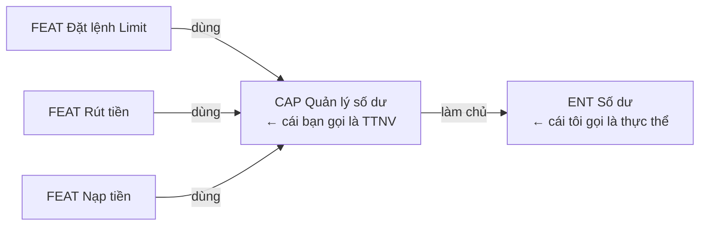
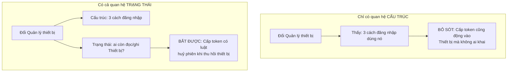
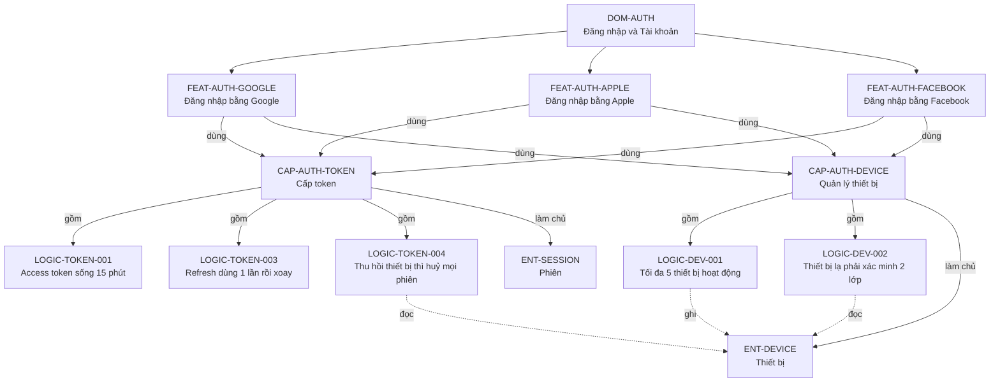
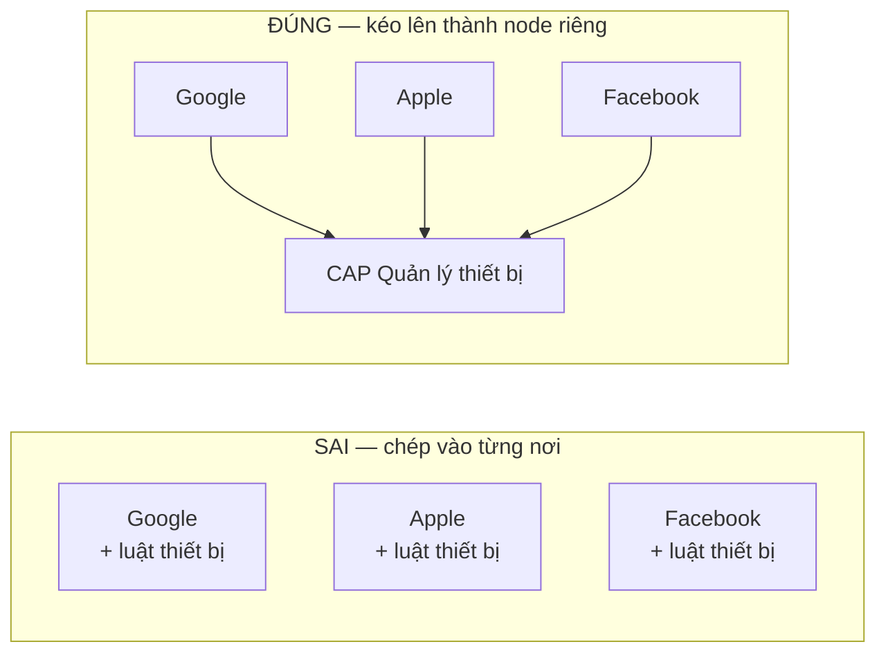
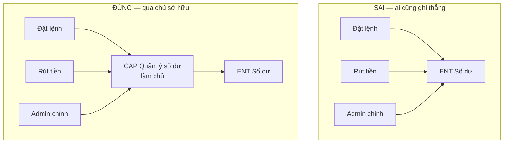
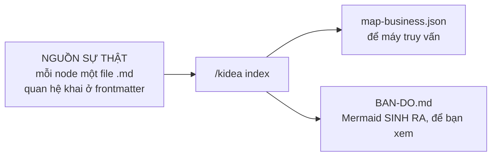

# Trả lời của Claude

Tôi hiểu trăn trở của bạn, và đây là vấn đề có thật, có lịch sử. Đã thiết kế xong: `design/04-BAN-DO-NGHIEP-VU.md`.

---

## Trước hết: bạn đoán đúng về lịch sử

Bạn nói *"trong quá khứ mô hình phát triển phần mềm đã gặp vấn đề này rồi"*.

Đúng. Nó có tên: **ma trận truy vết yêu cầu**. Ngành hàng không, thiết bị y tế và ô tô **bắt buộc** phải có theo luật — phần mềm điều khiển máy bay không được chứng nhận nếu không truy được từ yêu cầu xuống tận dòng code và test.

Nên câu hỏi đúng không phải *"tại sao chưa ai làm"* mà là **"tại sao hầu hết không làm"**:

| Lý do | Ngày xưa | Với AI |
|---|---|---|
| Bảo trì tốn quá nhiều công | Người ngồi cập nhật tay | **AI cập nhật, cùng lúc với việc sửa** |
| Cập nhật xong vẫn lệch, không ai biết | Không có cách phát hiện | **Băm nội dung, lệch là máy báo** |
| Lợi ích đến muộn, chi phí đến sớm | Vài tháng sau mới thấy giá trị | **AI hưởng lợi ngay** |

Dòng cuối là chỗ lật ngược tình thế. Ngày xưa bản đồ là **gánh nặng tài liệu**. Bây giờ nó là **nhiên liệu cho AI** — không có nó thì AI phải đọc mò cả repo; có nó thì AI được đưa đúng thứ cần.

---

## Năm loại mảnh ghép

Lấy đúng ví dụ của bạn để đặt tên:

| Loại | Mã | Là gì | Trong ví dụ của bạn |
|---|---|---|---|
| **Miền** | `DOM-*` | Vùng lớn, thuần gom nhóm | Đăng nhập/Đăng ký · Risk Engine · Spot Matching |
| **Tính năng** | `FEAT-*` | Thứ người dùng gọi tên được, đòi được | Đăng nhập bằng Google |
| **Năng lực** | `CAP-*` | Việc dùng chung, không ai đòi nhưng nhiều tính năng cần | **Quản lý thiết bị · Cấp token** |
| **Luật** | `LOGIC-*` | Phát biểu nguyên tử, **kiểm được đúng/sai** | Tối đa 5 thiết bị hoạt động |
| **Thực thể** | `ENT-*` | Thứ có trạng thái | Thiết bị · Phiên · Số dư |

### Vì sao tách Tính năng và Năng lực

Chính ví dụ của bạn chỉ ra. `Đăng nhập bằng Google` là thứ bạn viết vào danh sách MVP. `Quản lý thiết bị` thì không — **không ai đòi "cho tôi tính năng quản lý thiết bị"**, nhưng cả ba cách đăng nhập đều cần nó.

Tính năng mang nhóm MVP/Future/Idea, mang kênh web/mobile/admin. Năng lực thì **suy ra**: tính năng nào dùng nó là MVP thì nó là MVP.

### Đơn vị nhỏ nhất — phép thử, không phải cảm tính

Bạn hỏi leaf node nên là gì. Đây là phép thử:

> **Một mảnh là Luật khi bạn viết được một test trả lời đúng/sai cho riêng nó, không cần biết gì khác.**

| Phát biểu | Là Luật? | Vì sao |
|---|---|---|
| "Tối đa 5 thiết bị đang hoạt động" | **Có** | Thêm cái thứ 6 → phải bị từ chối. Test được |
| "Refresh token dùng một lần rồi xoay" | **Có** | Dùng lại token cũ → bị từ chối. Test được |
| "Quản lý thiết bị an toàn" | Không | Không test được. Là mong muốn, chưa phải luật |

Phép thử này chặn cả hai lỗi: chẻ quá nhỏ, và gom quá to.

### Và "TTNV" của bạn — hoá ra cả hai chúng ta đều đúng

Lần trước bạn nói đơn vị nhỏ nhất là *"quản lý số dư của 1 user"*. Tôi bảo nên là danh từ "Số dư". Giờ thì rõ là **hai thứ khác nhau, và cần cả hai**:



Bạn nghĩ đúng, chỉ là gộp hai khái niệm vào một tên.

---

## Ý quan trọng nhất: hai loại quan hệ

Đây là phần tôi muốn bạn đọc kỹ nhất.

**Cạnh cấu trúc** — do người khai: `gồm` · `dùng`. Đây là cây phân rã bạn mô tả.

**Cạnh trạng thái** — lưới an toàn: `làm chủ` · `đọc` · `ghi`.



> **Cấu trúc cho biết bạn *nghĩ* cái gì liên quan. Trạng thái cho biết cái gì *thực sự* liên quan.**

Cạnh cấu trúc phụ thuộc vào việc AI có nhớ khai không. Cạnh trạng thái thì không — chỉ cần mỗi node khai nó đọc/ghi thực thể nào, máy tự bắt cặp.

---

## Ví dụ của bạn, vẽ ra đầy đủ



Chú ý đường **nét đứt** từ `LOGIC-TOKEN-004` sang `ENT-DEVICE`. Nó **không nằm trong cây phân rã** — `Cấp token` và `Quản lý thiết bị` là hai nhánh riêng. Nhưng chúng đụng nhau qua thực thể `Thiết bị`.

Đó chính là loại quan hệ mà con người hay bỏ sót.

---

## Kịch bản: đổi "tối đa 5 thiết bị" thành 3

```text
$ /kidea impact LOGIC-DEV-001

═══ LAN TRUYỀN ═══

Vòng 1 — cạnh CẤU TRÚC
  CAP-AUTH-DEVICE          làm chủ luật này        → CẦN XEM LẠI

Vòng 2 — ai dùng CAP-AUTH-DEVICE
  FEAT-AUTH-GOOGLE                                 → CẦN XEM LẠI
  FEAT-AUTH-APPLE                                  → CẦN XEM LẠI
  FEAT-AUTH-FACEBOOK                               → CẦN XEM LẠI

Vòng 3 — cạnh TRẠNG THÁI: ai còn động vào ENT-DEVICE
  LOGIC-TOKEN-004  "Thu hồi thiết bị thì huỷ phiên"
                   ↳ đọc ENT-DEVICE, thuộc CAP-AUTH-TOKEN
                   ↳ KHÔNG có quan hệ cấu trúc với CAP-AUTH-DEVICE
                   ⚠ ĐÂY LÀ CHỖ DỄ SÓT NHẤT       → CẦN XEM LẠI

═══ CÂU HỎI CHO HUMAN ═══

1. Giảm còn 3 thì user đang có 5 thiết bị xử lý sao?
   Đề xuất: giữ nguyên, chỉ chặn thêm mới. Cần LOGIC mới.

2. LOGIC-TOKEN-004 có phải sửa không?
   Tôi đánh giá: KHÔNG. Nó không phụ thuộc con số 5.
   → Dừng lan truyền nhánh này. NHƯNG VẪN PHẢI TEST LẠI.

3. Ba cách đăng nhập có phải sửa không?
   Tôi đánh giá: KHÔNG. Chúng chỉ gọi, không tự đếm.
   → Dừng lan truyền. VẪN PHẢI TEST LẠI cả ba.
```

Điểm ăn tiền là **vòng 3**. Không có lớp thực thể thì không ai nghĩ tới `LOGIC-TOKEN-004` — nó nằm ở nhánh khác hoàn toàn của cây.

---

## Bảy luật chia node

Bạn hỏi *"nên xây dựng cụ thể và các rule, structure thế nào"*. Đây là bảy luật:

| # | Luật | Nghĩa |
|:--:|---|---|
| 1 | **Một node, một lý do để đổi** | Sửa vì hai lý do không liên quan → tách |
| 2 | **Leaf phải kiểm được** | Chưa viết được test riêng cho nó → chưa phải leaf |
| 3 | **Dùng chung thì phải kéo lên** | Từ 2 nơi trở lên dùng → thành node riêng, không chép |
| 4 | **Không có vòng lặp** | `A gồm B` và `B dùng A` là mô hình sai |
| 5 | **Mỗi thực thể một chủ** | Nhiều nơi đọc được, nhưng **ghi phải qua chủ** |
| 6 | **Sâu vừa phải** | 3–5 tầng. Sâu hơn không ai đọc nổi |
| 7 | **Đặt tên nhất quán** | Điều kiện để tìm trùng lặp chạy được |

Luật 3 chính là `Quản lý thiết bị` của bạn:



Luật 5 là luật giá trị nhất về lâu dài:



Bên trái: bất biến *"khả dụng + bị giữ = tổng"* không ai canh, mỗi chỗ tự lo. Bên phải: một chỗ canh cho tất cả.

---

## Lưu bằng gì — Mermaid để xem, không để lưu

Bạn nói *"giả sử ta dùng Mermaid đi… thực tế dùng cái nào phù hợp nhất nhé"*.

| | Một file Mermaid lớn | Một file markdown mỗi node |
|---|---|---|
| Xem bằng mắt | Tốt | Phải sinh ra mới xem |
| Máy truy vấn | Khó | Dễ |
| **Băm nội dung từng node** | **Không được** | Được — cần cho cơ chế phát hiện lệch |
| Hai người sửa hai node khác nhau | Đụng nhau khi merge | Không đụng |
| Đưa subagent đúng phần nó cần | Phải cắt tay | Lấy đúng file |



**Mermaid luôn được sinh lại, không bao giờ sửa tay.** Sửa tay là lệch ngay.

Một node trông như thế này:

```markdown
---
id: CAP-AUTH-DEVICE
kind: capability
title: "Quản lý thiết bị"
domain: DOM-AUTH

gom:      [LOGIC-DEV-001, LOGIC-DEV-002]
dung:     [CAP-NOTIFY-PUSH]

lam_chu:  [ENT-DEVICE]
doc:      [ENT-ACCOUNT]
ghi:      [ENT-DEVICE]
---

## Mục đích
Quản lý danh sách thiết bị mà một tài khoản đã đăng nhập.

## Không thuộc phạm vi
Không quản lý phiên đăng nhập — việc đó thuộc CAP-AUTH-TOKEN.
```

---

## Gộp và tách — dấu hiệu đếm được

| Dấu hiệu | Đề nghị |
|---|---|
| Node có trên 9 con | **Tách** |
| Node ghi vào từ 3 thực thể trở lên | **Tách** — đang làm quá nhiều việc |
| Hai node luôn cùng sửa trong 5 lần thay đổi gần nhất | **Gộp** — chúng thực ra là một |
| Node chỉ có một nơi dùng | **Gộp vào nơi dùng nó** |
| Node không ai dùng, không ai gồm | **Xoá hoặc nối lại** |

Dấu hiệu *"luôn cùng sửa"* lấy từ lịch sử git — đếm được, không cần đoán.

---

## Cần bạn quyết năm điểm

| # | Quyết gì | Đề xuất của tôi |
|:--:|---|---|
| 1 | Năm loại node có đúng và đủ không | Đủ. Nhưng nếu sàn crypto có loại nào không nhét vừa thì nói |
| 2 | Tách **Tính năng** và **Năng lực** làm hai loại | Nên tách |
| 3 | Luật 5 — ghi phải qua chủ sở hữu | Giữ. Luật giá trị nhất về lâu dài |
| 4 | Mỗi node một file, Mermaid sinh ra | Giữ |
| 5 | Gộp/tách là cảnh báo hay cổng chặn | Cảnh báo |

Đọc `design/04-BAN-DO-NGHIEP-VU.md` để xem đầy đủ. File `00-BAT-DAU-TU-DAY.md` đã cập nhật để trỏ sang.
