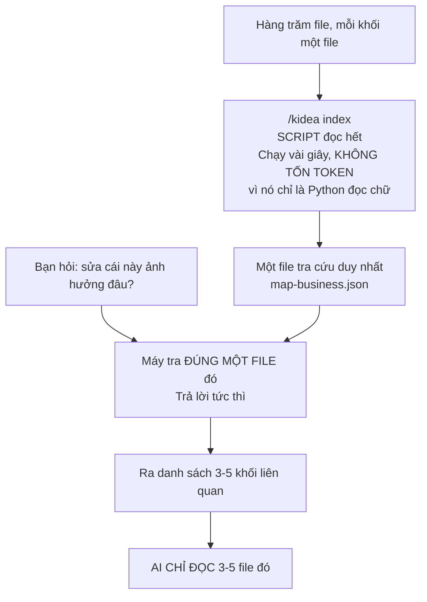
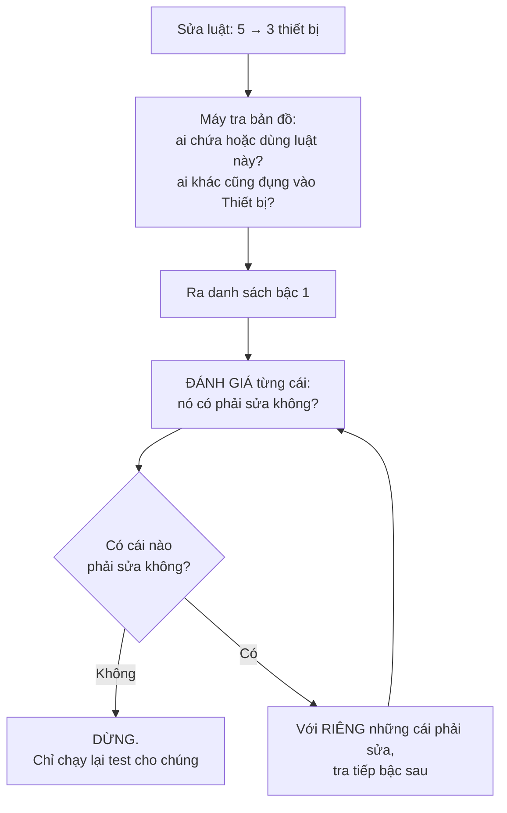
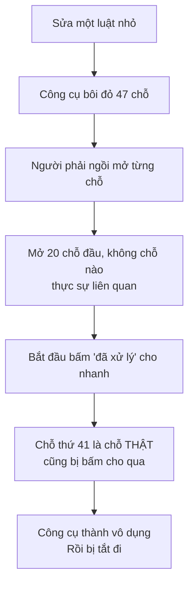

# Trả lời của Claude

Ba điểm bạn chốt tôi đã ghi vào tài liệu. Bốn thắc mắc trả lời ở dưới — **câu 4 thì bạn đúng, tôi sai**. Phần nghiên cứu ở cuối.

---

## Câu 1 — Năm loại khối là những loại nào

Lỗi của tôi, hỏi mà không nhắc lại là hỏi về cái gì.

| Loại khối | Nói dễ hiểu | Ví dụ của bạn |
|---|---|---|
| **Mảng** | Một vùng lớn của hệ thống | Đăng nhập · Risk Engine · Khớp lệnh Spot |
| **Tính năng** | Thứ người dùng đòi, gọi tên được | Đăng nhập bằng Google |
| **Phần dùng chung** | Việc mà nhiều tính năng cùng cần | Quản lý thiết bị · Cấp token |
| **Luật** | Một câu, đúng hay sai kiểm được ngay | Tối đa 5 thiết bị |
| **Dữ liệu** | Thứ hệ thống phải nhớ và cập nhật | Thiết bị · Phiên · Số dư |

Câu hỏi là: **sàn crypto của bạn có thứ gì không nhét vừa vào năm loại này không?**

---

## Câu 2 — Không, AI không phải đọc hết mọi file

Bạn hiểu sai một chỗ, và lỗi ở tôi vì không nói rõ. Đây là chỗ then chốt:

> **Có hai người đọc khác nhau. Script đọc hết. AI thì không.**



Cụ thể:

| Ai | Đọc gì | Tốn gì |
|---|---|---|
| **Script** | Hết tất cả file | Vài giây. Không tốn token — nó không phải AI, chỉ là chương trình đọc chữ |
| **Máy tra cứu** | Một file tổng hợp | Tức thì |
| **AI** | **Chỉ 3-5 file mà máy chỉ ra** | Đúng thứ cần, không thừa |

Và script chỉ chạy lại khi có file đổi. Không phải mỗi lần hỏi.

**Nên nó tiết kiệm token hơn hẳn cách để tài liệu dạng chữ.** Cách cũ: AI phải đọc cả đống tài liệu rồi tự lọc. Cách này: máy lọc trước bằng chương trình, AI chỉ đọc phần đã lọc.

---

## Câu 3 — Đúng, "khối" chính là "node" bạn nói

Cùng một thứ. Tôi đổi sang chữ "khối" vì lần trước bạn bảo tôi viết như dịch máy.

Bạn thích gọi "node" thì cứ gọi, tôi theo.

---

## Câu 4 — Bạn đúng. Ví dụ của tôi sai.

Bạn viết:

> *"Sau đó ta đánh giá tiếp là phần Quản lý thiết bị có cần update không, nếu có thì ta lại thấy các phần đăng nhập... Nếu phần Quản lý thiết bị không cần update thì ta chỉ cần test lại phần Quản lý thiết bị."*

Đúng. Và ví dụ của tôi làm sai điều đó — tôi bôi đỏ ba cách đăng nhập ở "vòng 2" **trước khi** đánh giá xong "vòng 1".

Tức là tôi vi phạm chính cái luật hai mức mà tôi tự đặt ra ở lần trước.

Đã sửa. Nguyên tắc đúng:

> **Đi từng bậc một. Đánh giá xong bậc này mới mở bậc sau.**



Chạy lại ví dụ cho đúng:

```text
═══ BẬC 1 ═══
  [1] Quản lý thiết bị        vì nó chứa luật này
  [2] Luật "thu hồi thiết bị thì huỷ phiên"
                              vì nó cũng đụng vào Thiết bị

  Chưa đi tiếp. Đánh giá 2 chỗ này trước.

═══ ĐÁNH GIÁ ═══
  [1] CÓ PHẢI SỬA — con số 5 nằm ngay trong đó
  [2] KHÔNG PHẢI SỬA — không dính gì tới con số 5
      → nhánh này dừng, nhưng vẫn chạy lại test

═══ BẬC 2 ═══
  Chỉ [1] phải sửa, nên chỉ tra tiếp từ [1]:
    Đăng nhập Google / Apple / Facebook

═══ ĐÁNH GIÁ ═══
  Cả ba KHÔNG PHẢI SỬA — chúng chỉ gọi sang, không tự đếm
  → dừng, vẫn chạy lại test cả ba
```

Nếu [1] hoá ra không phải sửa thì **ba cách đăng nhập không bao giờ bị nhắc tới**. Đây là chỗ giữ cho danh sách cảnh báo ngắn và đáng đọc — và cũng là chỗ tôi làm sai lần trước.

---

# Phần nghiên cứu

Tài liệu đầy đủ: `design/05-CAC-LOAI-THAY-DOI.md`.

## Ngành đã có sẵn ba thứ đáng lấy

### 1. "Liên kết đáng ngờ" — đúng cái bạn nghĩ ra, có hơn 20 năm rồi

Bạn nói: sửa một luật thì mọi thứ dựa vào nó phải bị đánh dấu, không cho đóng việc chừng nào chưa xử lý.

Ngành gọi nó là **suspect link**. Nối yêu cầu A với thiết kế B với test C. A đổi thì mọi liên kết từ A đi ra **tự động bị đánh dấu đáng ngờ**. Ai đó phải mở ra xem và xác nhận. Chưa xác nhận thì nó cứ nằm đó.

Đây là tính năng cốt lõi của IBM DOORS và Jama — công cụ mà hàng không, thiết bị y tế, ô tô bắt buộc phải dùng.

**Bạn nghĩ ra đúng cái người ta đã làm.** Khác biệt là ngày xưa con người phải ngồi mở từng cái.

### 2. Quyết định thì không xoá, chỉ thay thế

Có cách làm phổ biến: mỗi quyết định lớn ghi thành một tờ ngắn — bối cảnh, quyết định gì, hệ quả gì. **Không bao giờ xoá.** Muốn đổi thì viết tờ mới và đánh dấu tờ cũ là "đã bị thay thế".

Vì sao: sáu tháng sau có người hỏi *"sao hồi đó lại làm thế này?"* — vẫn tra ra. Xoá đi thì mất luôn lý do.

Đúng cái tôi đã đề xuất: khối bị bỏ thì đánh dấu **đã nghỉ**, nằm nguyên chỗ cũ.

### 3. Bốn cái rổ

| Rổ | Là gì |
|---|---|
| **Rổ khởi điểm** | Chỗ mình biết chắc phải sửa |
| **Rổ máy đoán** | Chỗ máy dò ra là có thể bị ảnh hưởng |
| **Rổ thật** | Chỗ cuối cùng thực sự phải sửa |
| **Rổ báo nhầm** | Máy bảo bị ảnh hưởng, hoá ra không |

Cái đáng học nằm ở rổ cuối.

---

## Bài học lớn nhất: báo thừa cũng chết như báo thiếu

Đây là thứ giá trị nhất tôi tìm được, và nó buộc tôi sửa thiết kế.

Các công cụ dò ảnh hưởng ngày xưa thất bại **không phải vì dò sót. Chúng dò ra quá nhiều.**



| Kiểu sai | Trước mắt | Kết cục thật |
|---|---|---|
| **Báo thiếu** | Không thấy gì | Bug ra production |
| **Báo thừa** | Danh sách dài | Người ta ngừng đọc → rồi cũng bug ra production |

Báo thừa **trông có vẻ an toàn** nhưng dẫn tới cùng một kết cục, chỉ chậm hơn.

### Ba chỗ tôi sửa vì bài học này

**Một — đi từng bậc.** Đúng cái bạn chỉ ra ở câu 4.

**Hai — chia mức chắc chắn, đừng dồn một đống:**

| Mức | Là gì | Máy nói sao |
|---|---|---|
| **Chắc** | A trực tiếp chứa hoặc cần B, mà B vừa đổi | "Phải xem" |
| **Có thể** | A và B cùng đụng một cục dữ liệu | "Nên xem, đây là chỗ hay quên" |
| **Xa** | Cách 3 bậc trở lên | "Ghi nhận, xem sau cũng được" |

**Ba — AI lọc trước, bạn chỉ xem cái khó.**

Đây là chỗ AI đổi cục diện. Ngày xưa người phải mở cả 47 chỗ. Giờ AI đọc 47 chỗ, loại 40 chỗ rõ ràng không liên quan, và đưa bạn **7 chỗ kèm lý do tại sao nó không chắc**.

Bạn vẫn quyết. Nhưng quyết trên 7 thứ đáng quyết, không phải 47 thứ.

---

## Mười bốn loại thay đổi thực tế

### Nhóm A — Nghiệp vụ đổi thật

| # | Loại | Ví dụ | Chỗ nguy hiểm |
|:--:|---|---|---|
| 1 | Thêm tính năng | Thêm đăng nhập bằng SMS | Quên kiểm xem có trùng cái cũ không |
| 2 | Đổi một luật | 5 → 3 thiết bị | Quên chỗ khác cũng đụng cùng cục dữ liệu |
| 3 | Đổi luồng | Chèn bước xác minh vào giữa | Luật cũ ngầm giả định thứ tự cũ |
| 4 | **Đổi dữ liệu** | Số dư tách khả dụng / bị giữ | **Nguy hiểm nhất.** Mọi nơi đụng vào đều lung lay |
| 5 | Bỏ tính năng | Bỏ đăng nhập Facebook | Phần dùng chung giờ chỉ còn một nơi dùng |
| 6 | Đổi ưu tiên | Kéo tính năng từ "để sau" lên MVP | Phần dùng chung của nó cũng thành MVP theo |

### Nhóm B — Mô hình đổi, hành vi giữ nguyên

| # | Loại | Bản đồ đổi gì |
|:--:|---|---|
| 7 | Tách một khối | Một thành nhiều — dễ chia cạnh sai |
| 8 | Gộp nhiều khối | Nhiều thành một — mã cũ đánh dấu đã nghỉ, không xoá |
| 9 | Refactor code | **Bản đồ nghiệp vụ không đổi.** Chỉ bản đồ code đổi |

Nhóm này cho thấy **ba tấm bản đồ đổi độc lập**. Refactor code thì tấm nghiệp vụ đứng yên.

### Nhóm C — Sửa cái sai

| # | Loại | Ai sai | Làm gì |
|:--:|---|---|---|
| 10 | Sửa bug | Code sai, tài liệu đúng | Viết test tái hiện lỗi trước, rồi sửa code |
| 11 | Sửa tài liệu | Tài liệu sai, code đúng | Sửa tài liệu, **và truy xem ai duyệt cái sai đó, vì sao lọt** |

Có trường hợp thứ ba hay bị bỏ qua: **cả hai đều nghe hợp lý nhưng khác nhau**. Lúc đó không phải sửa lỗi, mà là **phải quyết định**. Việc này của bạn, không của AI.

### Nhóm D — Sức ép từ ngoài

| # | Loại | Chỗ nguy hiểm |
|:--:|---|---|
| 12 | Đổi chỉ tiêu hiệu năng | Nghiệp vụ không đổi, nhưng có thể phải đổi cả kiến trúc |
| 13 | Yêu cầu tuân thủ mới | Cắt ngang rất nhiều tính năng cùng lúc |
| 14 | Bên thứ ba đổi | Trông như chuyện kỹ thuật, thực ra đổi nghiệp vụ |

Loại 14 hay bị coi nhẹ. Google bỏ một trường trong token — nghe như việc của lập trình viên. Nhưng nếu trường đó đang dùng để nhận diện thiết bị, thì luật *"thiết bị lạ phải xác minh 2 lớp"* đổi ý nghĩa. Đó là chuyện nghiệp vụ.

---

## Quy trình phải co giãn theo mức nặng

Ngành IT doanh nghiệp chia làm ba: **có sẵn quy trình** · **bình thường** · **khẩn cấp**.

kidea nên tương tự. Bắt mọi thay đổi đi đủ tám trạm thì sửa một dòng chữ cũng mất nửa ngày, và bạn sẽ bỏ dùng.

| Mức | Loại nào | Đi qua gì |
|---|---|---|
| **Nhẹ** | bug · sửa tài liệu · refactor | Dò ảnh hưởng → sửa → test lại → xong |
| **Vừa** | đổi luật · đổi luồng · bên thứ ba | Thêm: bạn duyệt phần nghiệp vụ |
| **Nặng** | thêm/bỏ tính năng · tách/gộp · đổi ưu tiên | Đi đủ các trạm |
| **Rất nặng** | **đổi dữ liệu** · hiệu năng · tuân thủ | Đủ trạm, cộng nghiệm thu hệ thống lại từ đầu |

Máy tự đoán mức và đề xuất. **Bạn nâng lên thì luôn được. Hạ xuống thì phải ghi lý do.**

---

## Thứ ngành chưa có, và là lý do bây giờ đáng làm

Cả ba thứ ở trên đều giả định **con người vừa dò vừa đánh giá**. Đó là lý do chúng đắt, chậm, và hầu hết công ty bỏ.

| Việc | Ngày xưa ai làm | Giờ ai làm |
|---|---|---|
| Cập nhật bản đồ khi code đổi | Người, và hay quên | **AI, ngay lúc sửa code** |
| Dò xem ai bị ảnh hưởng | Người, đọc tài liệu | **Máy, tra bản đồ. Không quên, không mệt** |
| Đánh giá "có thật sự phải sửa không" | Người, từng cái một | **AI lọc trước, người quyết cái khó** |

Việc còn lại của con người: **quyết**. Đó là việc đúng nên để cho con người, và là việc duy nhất máy không làm được.

---

## Cần bạn quyết

| # | Quyết gì | Tôi nghiêng về |
|:--:|---|---|
| 1 | 14 loại thay đổi có thiếu loại nào không | Bạn làm sàn, bạn biết loại nào hay gặp mà tôi chưa nêu |
| 2 | Bốn mức nặng nhẹ, loại nào thuộc mức nào | Như bảng trên |
| 3 | Máy đoán mức, bạn nâng được, hạ thì ghi lý do | Giữ |
| 4 | Chia ba mức chắc chắn khi báo ảnh hưởng | Giữ. Đây là chỗ tôi sửa sau khi tra cứu |

---

## Nguồn

- [IBM DOORS — liên kết và truy vết](https://www.ibm.com/docs/en/engineering-lifecycle-management-suite/doors/9.7.1?topic=requirements-links-traceability)
- [Jama Software — DOORS và giới hạn của nó](https://www.jamasoftware.com/blog/ibm-doors-software/)
- [Jama Software — dò ảnh hưởng thay đổi](https://www.jamasoftware.com/blog/2013/07/12/change-impact-analysis/)
- [Dò ảnh hưởng tích hợp cho quản lý thay đổi phần mềm](https://www.cs.wm.edu/~denys/pubs/ICSE12-ImpactAnalysis.pdf)
- [Nghiên cứu quy mô lớn về dự đoán ảnh hưởng dựa trên đồ thị lời gọi](https://arxiv.org/pdf/1812.06286)
