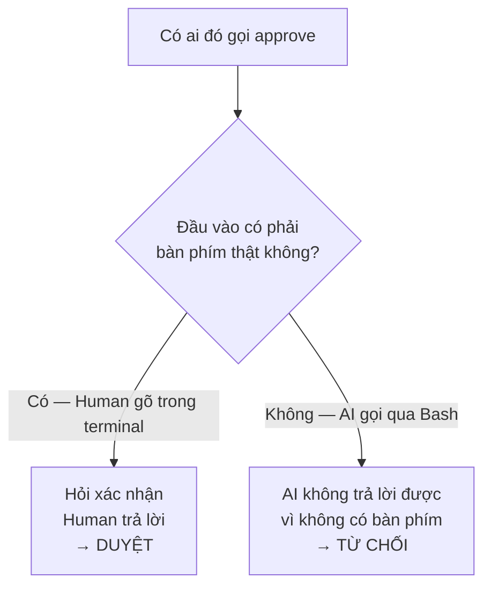
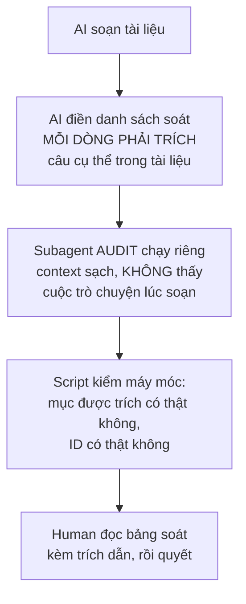

# Trả lời của Claude

Ba câu của bạn, rồi tôi tự soát lại và tìm ra một lỗ hổng lớn hơn cả ba.

---

## Câu 1 — "Giao diện web" là gì?

**Bạn không có ký ức về nó vì bạn chưa bao giờ nhắc tới nó. Tôi tự nghĩ ra.**

Tôi liệt kê nó trong danh sách "những thứ tôi cắt" — nhưng nó chưa bao giờ nằm trong danh sách "những thứ sẽ làm". Đưa một thứ chưa ai đề nghị vào danh sách cắt chỉ tạo nhiễu. Lỗi của tôi, đã xoá khỏi tài liệu.

### Nhưng có một chỗ dễ nhầm, nói rõ luôn

Trong cuộc trò chuyện cũ với Codex có bàn nhiều về **dashboard**. Đó là **dashboard của SẢN PHẨM bạn**, hoàn toàn khác:

| | Dashboard của sản phẩm | "Giao diện web" tôi vừa cắt |
|---|---|---|
| Là gì | Admin Console, Ops Dashboard, Business Dashboard của sàn giao dịch | Một trang web để xem trạng thái kidea |
| Ai dùng | Nhân viên vận hành sàn của bạn | Bạn, khi muốn xem project đang ở trạm nào |
| Còn không | **Còn.** Nó là tính năng của sản phẩm, kidea quản lý nó như mọi tính năng khác | Không. Chưa từng có |

Dashboard sản phẩm vẫn nguyên vẹn trong kế hoạch, vẫn có `FEAT-*`, vẫn đi qua đủ các trạm.

---

## Câu 2 — Đặt tên cho ba bản đồ

Bạn đúng, "bản đồ 1, 2, 3" thì ai nhớ nổi. Đã đổi tên trong toàn bộ tài liệu:

| Tên | File | Trả lời câu hỏi |
|---|---|---|
| **Bản đồ NGHIỆP VỤ** | `map-business.json` | *Đổi luật này thì luật nào lung lay?* |
| **Bản đồ CODE** | `map-code.json` | *Sửa hàm này thì ai gọi nó?* |
| **Bản đồ CẦU NỐI** | `map-link.json` | *Luật này nằm ở đoạn code nào?* |

Từ giờ không còn số nữa.

---

## Câu 3 — "Bố cục thư mục" là hỏi cái nào?

Tôi hỏi mập mờ. **Ý tôi là thư mục của PROJECT bạn sẽ xây bằng kidea** — ví dụ sàn giao dịch — chứ không phải thư mục của kidea.

Lý do hỏi: người gác cần biết `src/` là bậc 5, `docs/requirements/` là bậc 2. Bảng đó phụ thuộc bố cục project.

**Nhưng câu này không còn chặn nữa.** Tôi đã cho bảng ranh giới vào file cấu hình `kidea.yaml`, `init` sinh sẵn bản mặc định theo ngôn ngữ, bạn chỉnh sau khi thấy project thật. Rút câu hỏi.

---

## Bây giờ tới phần bạn nói đúng: "còn quá nhiều thứ mơ hồ"

Tôi rà lại toàn bộ đặc tả. Có **10 chỗ tôi viết cho có, chưa phải cơ chế thật**. Đã chốt hết trong `KIDEA_SPEC.md` mục 15. Ba chỗ đáng để bạn biết:

### Chỗ mơ hồ 1 — mâu thuẫn thật trong thiết kế của tôi

Tôi nói *"mốc lên khi MỌI tính năng MVP qua trạm"*. Nhưng tôi cũng nói *"làm theo vertical slice, từng tính năng một"*.

**Hai câu này chửi nhau.** Nếu phải đợi cả 8 tính năng MVP xong nghiệp vụ, xong test, xong UX, xong kiến trúc rồi mới được code — thì đó là waterfall, đúng thứ tôi bảo là sai.

**Cắt đôi để giải quyết:**

| Bậc | Cách tính mốc | Vì sao |
|:---:|---|---|
| 1 → 4 (tài liệu) | **Cả project.** Mọi tính năng MVP phải qua | Kiến trúc cắt ngang mọi tính năng. Thiết kế kiến trúc khi còn nửa số nghiệp vụ chưa rõ là thiết kế sai |
| 5 (code) | **Từng tính năng.** `slice start` mở riêng | Kiến trúc chốt rồi thì mỗi tính năng code độc lập được |

Vẫn giữ được điều bạn muốn từ đầu — *một tính năng MVP chưa rõ thì chặn cả flow* — mà không biến giai đoạn code thành waterfall.

### Chỗ mơ hồ 2 — "chỉ Human mới duyệt" thực ra ép bằng cách nào?

Tôi từng viết *"script kiểm tra một dấu hiệu do lệnh đó đặt ra"*. Đọc lại thì đó là nói cho có, không phải cơ chế.

Vì AI chạy được lệnh shell. Nó hoàn toàn có thể tự gõ `python kidea.py approve` để tự duyệt cho mình.

**Cơ chế thật, hai lớp:**

Công cụ Bash mà AI dùng chạy **không có terminal**, đầu vào nối vào thiết bị rỗng. Nên lệnh `approve` chỉ cần hỏi một câu xác nhận và đòi đọc từ terminal thật — **AI không có cách nào trả lời**.

Lớp thứ hai: người gác chặn luôn lệnh Bash khớp mẫu gọi `approve`, để AI nhận thông báo rõ ràng thay vì gặp lỗi khó hiểu.

Lớp 1 mới là lớp thật. Nó không dựa vào việc AI có chịu nghe lời hay không.

### Chỗ mơ hồ 3 — xoá một quy tắc thì sao?

Chưa nói bao giờ. Chốt: **ID không bao giờ được dùng lại, không bao giờ đánh số lại.**

Xoá một quy tắc thì nó chuyển `status: retired` và **nằm nguyên tại chỗ**. Vì code và test cũ vẫn có thể còn trỏ tới nó, và ta cần biết chúng đang trỏ vào một thứ đã chết — chứ không phải trỏ vào hư không.

### Bảy chỗ còn lại

File dùng chung nhiều tính năng · định nghĩa "đường dẫn nghiệp vụ" · git và nhánh · hai phiên chạy cùng lúc · gói ngữ cảnh trông thế nào · tài liệu tiếng Việt lẫn ID tiếng Anh · nếu `check` báo lỗi mà muốn đi tiếp. Đều đã chốt trong `KIDEA_SPEC.md` mục 15.

---

## Nhưng lỗ hổng lớn nhất thì khác — và nó lớn hơn cả 10 chỗ trên

Rà xong tôi mới thấy điều này, và nó giải thích vì sao bạn thấy mơ hồ:

> **Toàn bộ những gì tôi viết đến giờ là đặc tả BỘ MÁY. Chưa có một dòng nào về CÔNG VIỆC.**

| | Đã có | Chưa có |
|---|---|---|
| **Bộ máy** | Cuốn sổ, người gác, ba bản đồ, chín lệnh, luật băm và lan truyền | — |
| **Công việc** | — | AI thực sự **làm gì** ở mỗi trạm |

Cụ thể: tôi nói *"AI audit nghiệp vụ"* rất nhiều lần, nhưng chưa bao giờ nói **audit nghĩa là gì**. Kiểm theo danh sách nào? Thế nào là "đủ rõ"? Tài liệu ra trông ra sao?

Phần đó chiếm **90% thời gian chạy thật**. Đọc hết đặc tả cũ, bạn vẫn không biết `/kidea` thực sự tạo ra cái gì.

Nên tôi viết thêm `design/KIDEA_STATIONS.md`.

### Trong đó có gì

**Một luật chống AI tự chấm điểm mình.** Đây là phần tôi thấy quan trọng nhất. AI có động cơ tự nhiên là muốn qua trạm — để nó vừa viết vừa tự chấm thì nó tick hết ô cho xong. Bốn lớp chống:

Lớp 2 là chỗ Claude Code làm được mà Codex không: **người soát không phải người soạn**. Subagent audit chỉ nhận tài liệu, không thấy cuộc trò chuyện lúc viết ra nó, nhiệm vụ là **tìm lỗ hổng** chứ không phải bảo vệ.

**Trạm SCOPE và REQUIREMENTS viết đầy đủ.** Riêng trạm REQUIREMENTS có một **danh sách 21 dòng soát** — đây chính là định nghĩa cụ thể của "nghiệp vụ đủ rõ".

Ví dụ tài liệu chỉ viết *"Người dùng nhập giá và số lượng rồi gửi lệnh"*, subagent audit phải bật ra được:

| Dòng | Câu hỏi chưa trả lời |
|:--:|---|
| 3 | Số dư kiểm tra tại thời điểm nào |
| 8 | Số dư có bị giữ khi lệnh được nhận không |
| 5 | Giá Limit vượt giá bán tốt nhất thì khớp ngay hay nằm chờ |
| 15 | Hai request trùng `client_order_id` thì sao |
| 15 | Timeout nhưng lệnh đã tạo thật thì retry thế nào |
| 14 | Số dư đổi đồng thời do lệnh khác thì kết quả thế nào |

Mỗi câu thành một blocker, kèm đề xuất của AI, **chờ bạn quyết**.

**Danh sách soát thay đổi theo mức rủi ro.** Tính năng rủi ro thấp được bỏ qua vài dòng — nhưng phải kèm lý do. Tính năng dính tiền thì bốn dòng là **bắt buộc, không được bỏ qua kể cả có lý do**: đồng thời · trùng lặp và gửi lại · giới hạn và độ chính xác · ghi vết.

Đây là chỗ dòng `handles_money: true` trong cấu hình thực sự có tác dụng, thay vì chỉ là một dòng trang trí.

### Năm trạm còn lại tôi cố ý viết mỏng

`logical_tests` · `ux` · `architecture` · `implementation` · `release` mới ở mức khung.

**Cố ý.** Chi tiết hoá chúng bây giờ là viết dựa trên phỏng đoán về một project chưa tồn tại — đúng cái lỗi mà kidea sinh ra để chống. Chi tiết hoá dần khi đi tới.

---

## Còn đúng một câu hỏi

**Danh sách 21 dòng soát ở trạm REQUIREMENTS có thiếu gì không?**

| # | Mục | | # | Mục |
|:--:|---|---|:--:|---|
| 1 | Mục tiêu | | 12 | Quyền hạn |
| 2 | Actor | | 13 | Trường hợp lỗi và cách xử lý |
| 3 | Điều kiện trước | | 14 | Đồng thời |
| 4 | Đầu vào, đầu ra | | 15 | Trùng lặp, gửi lại, timeout |
| 5 | Luồng chính | | 16 | Giới hạn min/max, độ chính xác số |
| 6 | Luồng thay thế | | 17 | Trường hợp biên |
| 7 | Kiểm tra dữ liệu vào | | 18 | Phụ thuộc |
| 8 | Quy tắc nghiệp vụ | | 19 | Ghi vết |
| 9 | Máy trạng thái | | 20 | Tiêu chí nghiệm thu |
| 10 | Bất biến | | 21 | Câu hỏi còn mở |
| 11 | Thực thể đọc/ghi | | | |

Đây là câu duy nhất tôi cần trước khi code, vì nó định nghĩa "thế nào là nghiệp vụ đủ rõ" — thứ chi phối chất lượng mọi thứ phía sau.

**Bạn làm sàn giao dịch, bạn biết chỗ nào hay sập mà tôi không biết.** Thiếu gì thì thêm vào; không thiếu thì nói **"danh sách đủ rồi"**.
