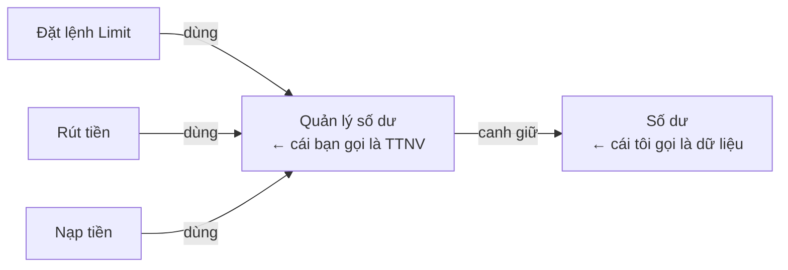
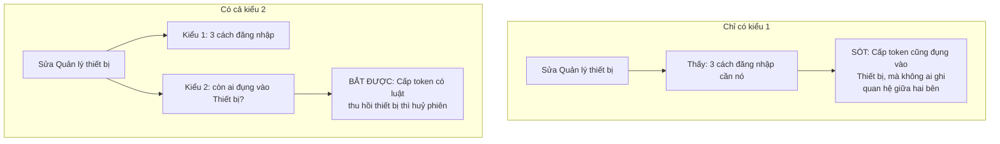
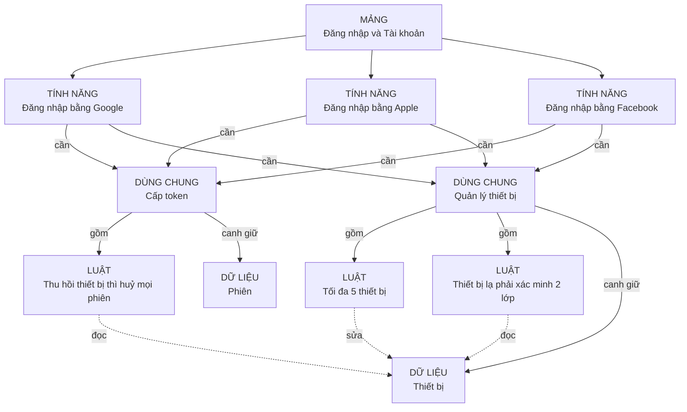
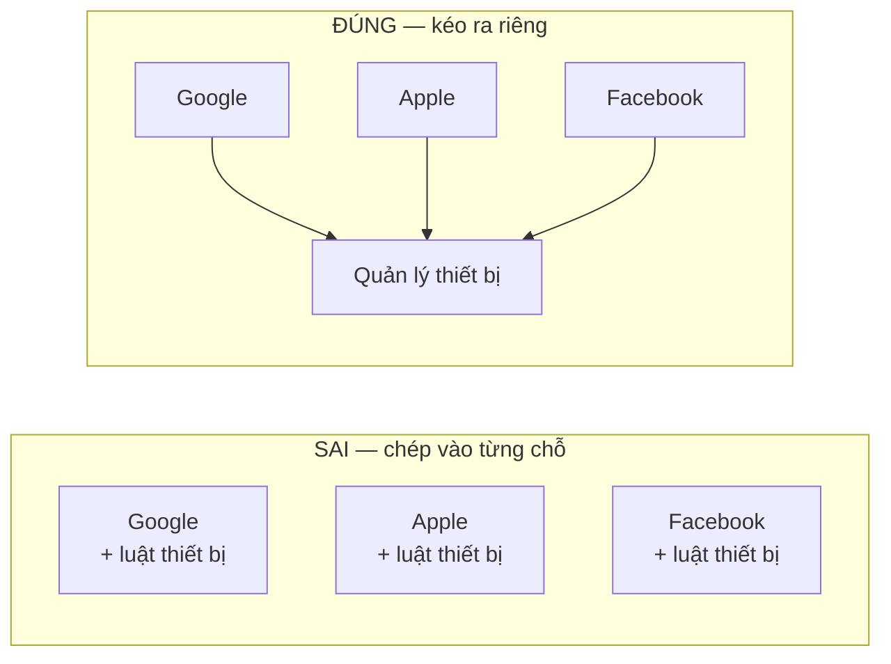
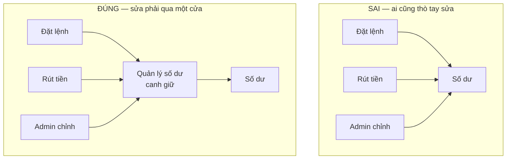
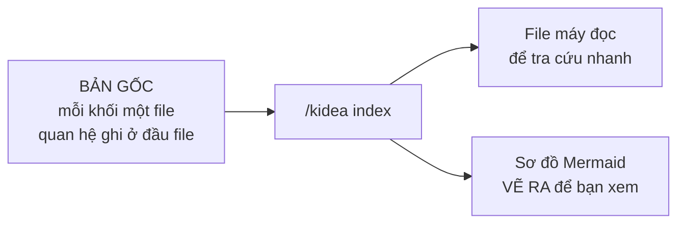

# Trả lời của Claude

Bạn nói đúng, tôi viết như dịch máy. Viết lại từ đầu bằng tiếng Việt bình thường, ý tưởng giữ nguyên.

Tài liệu `design/04-BAN-DO-NGHIEP-VU.md` cũng đã viết lại cho dễ đọc.

---

## Vấn đề gốc

Tài liệu để dạng chữ thì AI phải đọc hết rồi tự nhớ. Sửa chỗ nào, nó ngồi nghĩ xem chỗ nào bị ảnh hưởng.

Vấn đề nằm ở **số lượng**. Sàn giao dịch có hàng trăm quy tắc. Không ai nhớ nổi hết quan hệ giữa chúng.

Và tệ nhất là: khi nhớ sót, **không ai biết mình đang sót**. Bạn hỏi "sửa cái này ảnh hưởng đâu", AI trả lời 5 chỗ, nghe rất chắc chắn. Thực ra có 8 chỗ. Bạn không có cách nào biết.

Nên cách thoát chỉ có một:

> **Đừng bắt ai nhớ. Ghi ra rõ ràng, rồi để máy dò.**

---

## Chuyện này không mới, nhưng giờ mới làm nổi

Bạn đoán đúng là ngày xưa người ta đã gặp rồi. Nó có tên: **bảng dò ngược**. Từ một yêu cầu, dò được xuống tận dòng code nào lo cho nó, bài kiểm tra nào phủ nó.

Hàng không, thiết bị y tế, ô tô **bắt buộc** phải có. Phần mềm điều khiển máy bay không được cấp phép nếu không dò ngược được.

Vậy tại sao công ty phần mềm bình thường không làm?

| Lý do bỏ cuộc | Ngày xưa | Bây giờ |
|---|---|---|
| Cập nhật bảng quá mệt | Người ngồi gõ tay từng dòng | **AI gõ, và gõ ngay lúc sửa code** |
| Bảng lệch mà không ai biết | Không có cách kiểm | **Máy so nội dung, lệch là báo** |
| Làm cực mà lâu mới thấy lợi | Vài tháng sau mới dùng tới | **AI dùng ngay từ ngày đầu** |

Dòng cuối mới là chỗ đổi cục diện. Ngày xưa bảng này là **việc phải làm thêm**, ai cũng ghét. Bây giờ nó là **thứ giúp AI làm việc** — không có bảng thì AI mò cả repo, có bảng thì nó được đưa đúng phần cần đọc.

Từ gánh nặng thành công cụ.

---

## Chẻ nghiệp vụ ra thành năm loại khối

| Loại khối | Nói dễ hiểu | Ví dụ của bạn |
|---|---|---|
| **Mảng** | Một vùng lớn của hệ thống | Đăng nhập · Risk Engine · Khớp lệnh Spot |
| **Tính năng** | Thứ người dùng đòi, gọi tên được | Đăng nhập bằng Google |
| **Phần dùng chung** | Việc mà nhiều tính năng cùng cần | **Quản lý thiết bị · Cấp token** |
| **Luật** | Một câu, đúng hay sai kiểm được ngay | Tối đa 5 thiết bị |
| **Dữ liệu** | Thứ hệ thống phải nhớ và cập nhật | Thiết bị · Phiên · Số dư |

### Vì sao "Tính năng" và "Phần dùng chung" phải tách

Chính ví dụ của bạn cho thấy.

**Đăng nhập bằng Google** — có người đòi nó, bạn viết nó vào danh sách MVP.

**Quản lý thiết bị** — không ai đòi. Không ai nói "cho tôi tính năng quản lý thiết bị". Nhưng cả ba cách đăng nhập đều cần.

Nên: tính năng thì bạn xếp vào MVP hay để sau, ghi rõ chạy web hay mobile. Phần dùng chung thì **không xếp** — tính năng nào dùng nó là MVP thì nó cũng là MVP.

### Làm sao biết một câu đã đủ nhỏ

Bạn hỏi khối nhỏ nhất nên là gì. Đây là cách thử, không phải đoán:

> **Viết thử một bài kiểm tra cho riêng câu đó. Chạy được, ra đúng hoặc sai — thì nó đủ nhỏ.**

| Câu | Đủ nhỏ chưa? | Vì sao |
|---|---|---|
| "Tối đa 5 thiết bị hoạt động" | **Rồi** | Thêm cái thứ 6 phải bị chặn. Kiểm được ngay |
| "Quản lý thiết bị an toàn" | Chưa | Kiểm kiểu gì? Đây là mong muốn, chưa phải luật |
| "Đăng nhập bằng Google" | Chưa | Là cả mớ luật gộp lại. Đây là tính năng |

Cách thử này chặn được cả hai lỗi: chẻ vụn quá, và gom to quá.

### Chuyện "TTNV" lần trước — hoá ra cả hai đều đúng

Bạn nói khối nhỏ nhất là *"quản lý số dư của 1 user"*. Tôi bảo nên là danh từ "Số dư". Giờ nhìn lại thì đây là **hai thứ khác nhau, và cần cả hai**:



- **Số dư** là *con số được lưu*.
- **Quản lý số dư** là *nơi viết ra mọi luật về số dư*, và là nơi duy nhất được sửa con số đó.

Bạn nghĩ đúng, chỉ là hai thứ bị gộp vào một tên.

---

## Phần quan trọng nhất: hai kiểu quan hệ

### Kiểu 1 — mình tự viết ra

```text
A gồm B     B là một phần của A
A cần B     A phải có B mới chạy được
```

Đây chính là cây bạn mô tả: đăng nhập Google **cần** quản lý thiết bị; quản lý thiết bị **gồm** luật tối đa 5 cái.

Kiểu này do người viết. Ai đó phải nhớ và ghi.

### Kiểu 2 — máy tự thấy

Mỗi khối chỉ khai một câu: *"tôi đụng vào Thiết bị"*. Không cần biết ai khác cũng đụng.

Rồi máy tự ghép: **ai cùng đụng vào Thiết bị thì liên quan tới nhau.**

### Vì sao thiếu kiểu 2 là hỏng



Nói gọn:

> **Kiểu 1 chỉ có những gì mình nhớ ra và ghi lại.**
> **Kiểu 2 bắt được cả những gì mình quên.**

Kiểu 1 dễ hiểu, đọc là thấy. Kiểu 2 mới là cái lưới hứng.

---

## Ví dụ đăng nhập của bạn, vẽ đầy đủ



Nhìn đường **nét đứt** từ luật *"Thu hồi thiết bị thì huỷ mọi phiên"* sang **Thiết bị**.

Luật đó nằm trong **Cấp token**. Còn **Quản lý thiết bị** là nhánh khác hẳn. Trên cây, hai bên không dính gì nhau. Nhưng chúng đụng chung một chỗ: **Thiết bị**.

Đây đúng là loại quan hệ mà người ta hay quên.

---

## Thử sửa: đổi "tối đa 5 thiết bị" thành 3

```text
$ /kidea impact LOGIC-DEV-001

═══ MÁY DÒ ═══

Vòng 1 — theo quan hệ mình đã ghi
  Quản lý thiết bị       chứa luật này              → PHẢI XEM LẠI

Vòng 2 — ai cần Quản lý thiết bị
  Đăng nhập bằng Google                             → PHẢI XEM LẠI
  Đăng nhập bằng Apple                              → PHẢI XEM LẠI
  Đăng nhập bằng Facebook                           → PHẢI XEM LẠI

Vòng 3 — còn ai đụng vào Thiết bị nữa không
  Luật "Thu hồi thiết bị thì huỷ mọi phiên"
       nằm trong Cấp token
       trên cây KHÔNG dính gì tới Quản lý thiết bị
       ⚠ ĐÂY LÀ CHỖ DỄ QUÊN NHẤT                    → PHẢI XEM LẠI

═══ HỎI BẠN ═══

1. Giảm còn 3 thì user đang có 5 thiết bị xử lý sao?
   Tôi đề xuất: giữ nguyên cho họ, chỉ chặn thêm mới.

2. Luật "thu hồi thiết bị thì huỷ phiên" có phải sửa không?
   Tôi đánh giá: KHÔNG. Nó không dính gì tới con số 5.
   → Nhánh này dừng. NHƯNG VẪN PHẢI CHẠY LẠI TEST.

3. Ba cách đăng nhập có phải sửa không?
   Tôi đánh giá: KHÔNG. Chúng chỉ gọi sang, không tự đếm.
   → Dừng. VẪN PHẢI CHẠY LẠI TEST cả ba.
```

**Vòng 3 mới là chỗ ăn tiền.** Không có kiểu quan hệ thứ hai thì chẳng ai nghĩ tới luật đó — nó nằm ở nhánh khác hoàn toàn.

---

## Bảy luật chẻ khối

| # | Luật | Nói dễ hiểu |
|:--:|---|---|
| 1 | Một khối chỉ nên sửa vì một lý do | Phải sửa vì hai chuyện chẳng liên quan → chẻ đôi |
| 2 | Khối nhỏ nhất phải kiểm được | Chưa viết được bài kiểm riêng → chưa đủ nhỏ |
| 3 | Cái gì dùng chung thì kéo ra riêng | Hai chỗ trở lên dùng → thành khối riêng, không chép |
| 4 | Không được vòng tròn | *A gồm B* mà *B lại cần A* là chẻ sai |
| 5 | Mỗi cục dữ liệu chỉ một nơi canh giữ | Nhiều nơi đọc được, nhưng **sửa phải qua một cửa** |
| 6 | Đừng sâu quá | Ba tới năm tầng là vừa |
| 7 | Đặt tên theo một kiểu | Tên lung tung thì máy không nhận ra hai khối nói cùng một chuyện |

Luật 3 chính là ý *"manager device dùng chung"* của bạn:



Chép vào từng chỗ thì sửa một chỗ, quên hai chỗ. Kéo ra riêng thì sửa một chỗ, máy chỉ ra ngay cả ba.

Luật 5 đáng giá nhất về lâu dài:



Bên trái: cái điều luôn phải đúng — *khả dụng cộng bị giữ bằng tổng* — **không có ai canh**. Mỗi chỗ tự lo, chỉ cần một chỗ lo sai là số dư sai.

Bên phải: một chỗ canh cho tất cả.

---

## Lưu bằng gì — Mermaid để xem, không để lưu

| | Một file Mermaid to | Mỗi khối một file |
|---|---|---|
| Nhìn bằng mắt | Tốt | Phải vẽ ra mới xem |
| Máy tra cứu | Khó | Dễ |
| **So nội dung từng khối xem có đổi không** | **Không làm được** | Làm được |
| Hai người sửa hai khối khác nhau | Đụng nhau | Không đụng |
| Đưa cho AI đúng phần nó cần | Phải cắt tay | Lấy đúng file |

Dòng thứ ba quan trọng nhất. Cả cơ chế *"sửa cái này thì cái kia hết hiệu lực"* dựa vào việc so nội dung từng khối. Nhét chung một file thì sửa một chỗ, cả file đổi, không biết chỗ nào.



**Sơ đồ luôn vẽ lại từ đầu, không bao giờ sửa tay.** Sửa tay là lệch ngay.

---

## Gộp và tách — dấu hiệu đếm được

| Thấy gì | Đề nghị |
|---|---|
| Một khối có hơn 9 khối con | **Chẻ ra** |
| Một khối sửa từ 3 cục dữ liệu trở lên | **Chẻ ra** — nó ôm quá nhiều việc |
| Hai khối cứ sửa là sửa cùng nhau, 5 lần gần nhất đều thế | **Gộp lại** — chúng thực ra là một |
| Một khối chỉ có đúng một nơi dùng | **Gộp vào nơi đó** |
| Khối không ai dùng, không thuộc về đâu | **Xoá hoặc nối lại** |

Dấu hiệu *"cứ sửa là sửa cùng nhau"* lấy từ lịch sử git. Đếm được, không phải đoán.

**Đây là lời nhắc, không phải rào chặn.** Bắt dọn dẹp mỗi lần thì một tuần sau bạn sẽ tắt nó đi.

---

## Cần bạn quyết

| # | Quyết gì | Tôi nghiêng về |
|:--:|---|---|
| 1 | Năm loại khối có đủ không | Đủ. Nhưng sàn crypto có thứ nào không nhét vừa thì bạn nói |
| 2 | Tách "Tính năng" và "Phần dùng chung" | Nên tách |
| 3 | Luật 5 — sửa dữ liệu phải qua một cửa | Giữ |
| 4 | Mỗi khối một file, sơ đồ vẽ ra để xem | Giữ |
| 5 | Gộp/tách là lời nhắc hay rào chặn | Lời nhắc |
