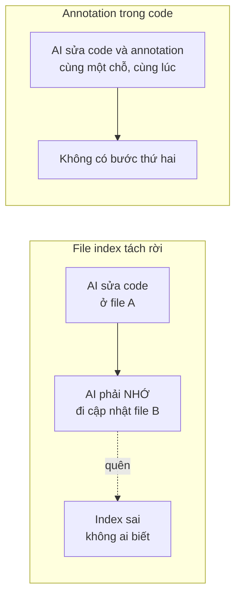
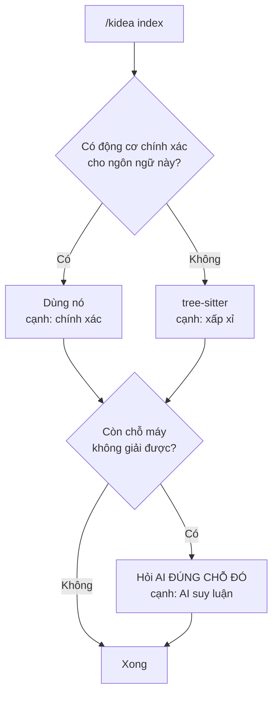
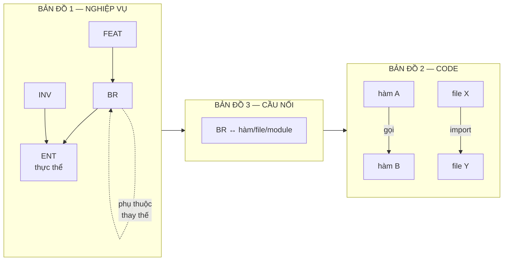
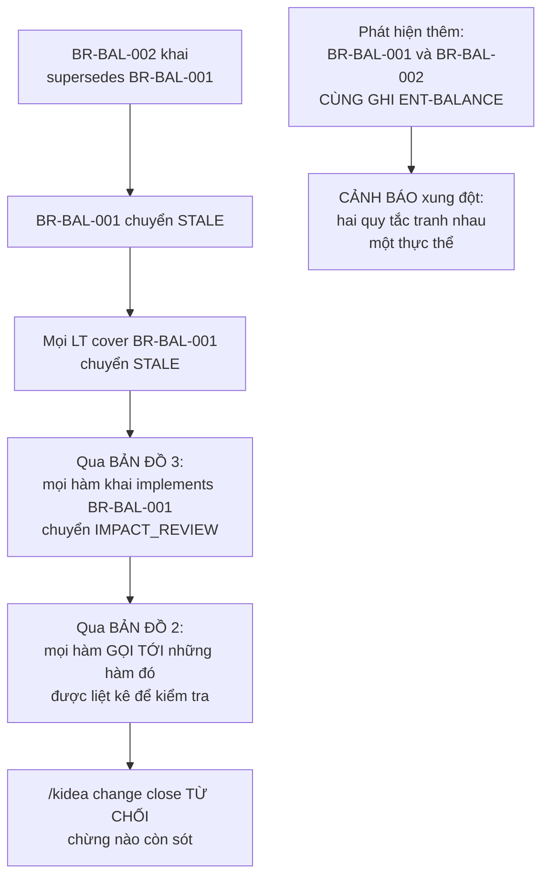
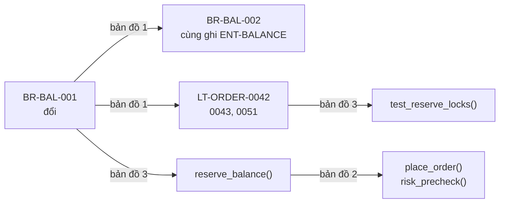
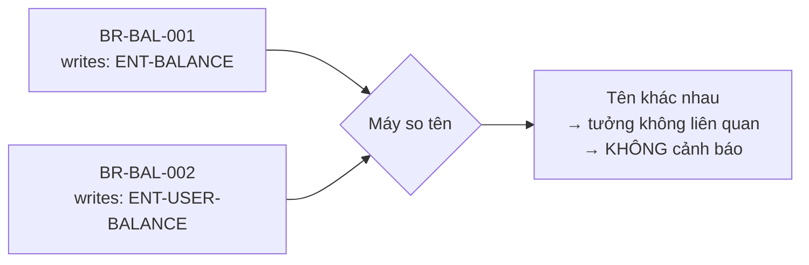

# Trả lời của Claude

Ý 2 của bạn là một chỉnh sửa **đúng**, và nó làm thay đổi thiết kế. Ý 3 bổ sung một mảnh tôi thiếu hẳn. Đã cập nhật `design/KIDEA_SPEC.md`.

---

## Ý 2 — Bạn đúng, và tôi sai ở một chỗ quan trọng

Bạn nói: *"Trong mô hình của Kidea thì Human không code đâu nhé"*. Tôi đã viết cả tài liệu như thể có người ngồi gõ annotation bằng tay. Sai.

Nhưng câu hỏi bạn đặt ra làm lộ một lỗ hổng thật trong lập luận của tôi, nên tôi phải trả lời cho tới nơi.

### Lỗ hổng

Tôi từng nói: *"index do AI kê khai thì không đáng tin hơn trí nhớ AI"*.

Nhưng annotation `@kidea:implements BR-BAL-003` **cũng do AI khai**. Vậy tôi tự mâu thuẫn à?

Không — nhưng lý do thật **không phải** là "ai gõ phím". Tôi nói nhầm chỗ nhấn mạnh. Lý do thật có hai điểm.

### Điểm 1 — cùng một hành động, không có bước thứ hai để quên



### Điểm 2 — quan trọng hơn: máy đối chiếu chéo được

Annotation không được tin vì "AI khai thì chắc đúng". Nó được tin vì **kidea kiểm tra được nó bằng một nguồn khác**:

| Luật kiểm tra | Bắt được lỗi gì |
|---|---|
| Mọi `BR` phải có ít nhất một hàm khai `implements` | Quy tắc chưa ai code |
| Mọi hàm trong đường dẫn nghiệp vụ phải khai `implements` | AI code mà quên khai |
| Mọi `LT` phải có ít nhất một test khai `covers` | Test case chưa có test code |
| Mọi ID trong annotation phải tồn tại thật | AI bịa ra `BR-BAL-999` |
| Hàm khai `implements BR-X` mà `BR-X` đã bị thay thế | Code chạy theo quy tắc hết hiệu lực |

**Một file index tách rời không có gì để đối chiếu, nên không kiểm được.** Đó mới là khác biệt thật.

### Và bạn đúng luôn về ngôn ngữ

*"Vậy nên tôi nghĩ việc các hệ thống dùng ngôn ngữ lập trình nào thì cũng xử lý được thôi."*

Đúng. Tôi đã bỏ hẳn phần "chọn C++ thì tốt hơn Rust". Lý do: **phần mang ý nghĩa nghiệp vụ đều do AI viết bằng chữ, không phụ thuộc ngôn ngữ.** Phần máy đọc chỉ trả lời "ai gọi ai" — thiếu vài cạnh thì mất một ít gợi ý, không làm hỏng luật gác cổng.

Thiết kế mới có ba lớp, dùng lớp nào có sẵn:



Lớp 3 chính là ý bạn nói *"hoặc các model AI làm được"*. Nhưng dùng đúng liều: **không bắt AI đọc cả codebase mỗi lần index** — 500 file mỗi lần thì vừa chậm, vừa tốn token, vừa có thể bịa. Chỉ hỏi khi máy bó tay, ví dụ một lời gọi qua interface không rõ trỏ đâu. Câu hỏi hẹp, câu trả lời kiểm chứng được.

**Nguyên tắc phân công:**

> **Máy** làm việc đếm được. **AI** làm việc hiểu được. **Human** quyết việc chọn được.

Kết quả: **chọn ngôn ngữ theo sản phẩm của bạn.** Rust, C++, Go, TypeScript, Python, Java đều chạy. Hai câu hỏi tôi định hỏi bạn về ngôn ngữ đã tự tan.

---

## Ý 3 — Ba tấm bản đồ. Bạn đã chỉ ra mảnh tôi thiếu hẳn.

Bạn muốn ba tấm. Tôi trước đó gộp làm một, và **tấm số 1 thì tôi thiếu thật** — không chỉ gộp mà là chưa thiết kế.



### Bản đồ 1 — cái khó nhất, và chìa khoá là "thực thể"

Ví dụ của bạn rất hay, tôi dùng luôn:

> *Trước đây sàn chỉ có lệnh Market thì phần quản lý số dư chỉ cần số dư tổng. Nhưng giờ thêm lệnh Limit thì cần available và locked.*

Tức là **thêm một tính năng làm hỏng một quy tắc đã có**. Làm sao máy phát hiện được?

**Chìa khoá là một khái niệm mới: `ENT` — thực thể nghiệp vụ.** Đây là *danh từ* mà các quy tắc cùng động vào: số dư, lệnh, sổ lệnh, tài khoản.

> Hai quy tắc **không biết nhau**, nhưng nếu **cùng ghi vào một thực thể** thì chúng liên quan tới nhau.

Cụ thể với ví dụ của bạn:

```yaml
# Trước — chỉ có lệnh Market
id: BR-BAL-001
title: "Số dư là một con số tổng"
writes: [ENT-BALANCE]

# Sau — thêm lệnh Limit
id: BR-BAL-002
title: "Số dư tách thành khả dụng và bị giữ"
writes: [ENT-BALANCE]
supersedes: [BR-BAL-001]
```

kidea chạy `check` và lần ra toàn bộ chuỗi:



**Điểm hay nhất:** kể cả khi AI **quên khai** `supersedes`, luật *"hai quy tắc cùng ghi một thực thể"* vẫn bắt được. Đó là lý do `ENT` tồn tại — nó là **lưới an toàn khi khai báo trực tiếp bị bỏ sót**.

### Ba tấm nối lại thành một chuỗi

Đây là toàn bộ giá trị:



Gõ `/kidea impact BR-BAL-001` là đi hết cả ba, in ra một danh sách duy nhất.

### Ba tấm, ba nguồn, ba người tạo

| Bản đồ | Nguồn | Ai tạo | Kiểm chứng bằng gì |
|---|---|---|---|
| 1 — nghiệp vụ | Frontmatter trong tài liệu | **AI viết** khi soạn nghiệp vụ | Human **duyệt** ở trạm requirements |
| 2 — code | Máy đọc source | **Máy**, không ai can thiệp | Không cần, nó là sự thật |
| 3 — cầu nối | Annotation trong code | **AI viết** khi nó code | Máy đối chiếu với 1 và 2 |

### Vì sao ba file thay vì một

| Bản đồ | Dựng lại khi nào | Chi phí |
|---|---|---|
| 1 — nghiệp vụ | Tài liệu đổi | Rẻ |
| 2 — code | Code đổi | Đắt nhất |
| 3 — cầu nối | Code đổi | Rẻ |

Tách ra thì dựng lại được từng cái, và trả lời được câu **"tấm nào đang cũ"**. Gộp một file thì không biết phần nào cũ.

---

## Ý 4 — Giữ và cắt cái gì, nói bằng "bạn gõ gì, nó làm gì"

Trước tôi chỉ liệt kê tên lệnh. Nói lại theo kiểu cụ thể.

### `/kidea slice` — có phải giống "/goal" không?

**Gần đúng, nhưng khác ở bốn chỗ.** Đúng là bạn giao mục tiêu "làm xong tính năng đặt lệnh Limit" và AI tự chạy. Nhưng:

| | AI chạy tự do | `/kidea slice` |
|---|---|---|
| Đụng được file nào | Bất kỳ file nào | **Chỉ những file đã khai trước** |
| Ngữ cảnh | Cùng một context, càng dài càng loãng | **Mỗi sub-task một context sạch** |
| Kết thúc | AI tự nói "xong rồi" | **Human phải gõ `approve`** |
| Nếu chưa đủ điều kiện | Cứ làm | **Bị chặn từ đầu** |

Ba bước:

```text
/kidea slice start FEAT-MVP-ORDER-LIMIT
    → Kiểm tra tính năng đã qua trạm chưa
    → Khai báo: slice này chỉ được đụng src/balance/, src/order/
    → Mở khoá đúng những đường dẫn đó

/kidea slice plan FEAT-MVP-ORDER-LIMIT
    → AI chia thành sub-task
    → Mỗi sub-task nhận gói ngữ cảnh tính từ ba bản đồ
    → Mỗi sub-task chạy trong 1 subagent, context sạch

/kidea slice verify FEAT-MVP-ORDER-LIMIT
    → Chạy test
    → Kiểm tra mọi LT đều có test cover
    → Kiểm tra code mới có annotation
    → Báo cáo. KHÔNG tự duyệt.
```

### Bốn lệnh còn lại tôi giữ, và vì sao

**`/kidea change bug "Lệnh bị tạo trùng sau khi retry"`**

Sinh một hồ sơ việc `CHANGE-2026-0043`. Từ lúc này mọi thứ AI sửa đều đóng dấu hồ sơ đó.

*Thiếu nó thì hỏng gì?* Đây chính là ý *"mỗi lần sửa đổi kèm version của session đang sửa"* trong draft của bạn. Không có hồ sơ thì cái dấu không trỏ vào đâu cả, và câu *"phần này đã cập nhật cho lần sửa hiện tại chưa"* không trả lời được. **Đây là thứ làm cho cơ chế "làm đến cùng" chạy được.**

Và `/kidea change close` **từ chối đóng nếu còn chỗ chưa đồng bộ**.

**`/kidea impact BR-BAL-003`** — đổi quy tắc này thì ảnh hưởng đâu. Đi xuyên ba bản đồ.

**`/kidea adopt`** — bạn có project cũ chưa dùng kidea, lệnh này quét code, dựng bản đồ 2, liệt kê chỗ thiếu tài liệu. **Không bịa nghiệp vụ**, chỉ vẽ lại cái đang có và chỉ ra lỗ hổng.

**Trạm `release`** — trạm cuối, kiểm đủ mọi approval trước khi lên production. Chỉ là thêm một trạm vào bộ máy sẵn có, gần như không tốn gì.

### Bốn thứ tôi cắt, và cắt vì sao

| Cắt | Nếu làm thì nó sẽ làm gì | Vì sao không cần |
|---|---|---|
| `/kidea next` | AI tự chọn bước hợp lệ kế tiếp rồi làm | `/kidea status` đã in ra "bước tiếp theo là gì". Thêm lệnh này chỉ đỡ phải gõ, không thêm khả năng nào |
| Giao diện web | Trang web xem trạng thái project | Mọi thứ đã là file text, đọc bằng editor hoặc mở thẳng trên GitHub từ điện thoại. Thêm web là thêm một thứ phải nuôi |
| Tự động deploy | kidea tự đẩy code lên server | kidea **gác** deploy — kiểm đủ approval chưa. Việc đẩy vẫn do script/CI của bạn. Viết lại công cụ deploy là vẽ thêm việc |
| Bộ chạy test riêng | kidea tự có cơ chế chạy test | Nó chỉ gọi đúng câu lệnh bạn khai (`ctest`, `cargo test`, `npm test`) rồi đọc kết quả |

**Còn lại 9 lệnh:** `init` · `status` · `check` · `index` · `approve` · `impact` · `change` · `slice` · `adopt`

---

## Ý 5 — "Thứ tự code" nghĩa là gì

Tôi viết tắt quá. Nói lại thật đơn giản.

### Vấn đề rất tầm thường

kidea gồm khoảng 12 file Python. **Tôi không viết được 12 file cùng một lúc.** Phải viết file nào trước, file nào sau.

"Thứ tự code" chỉ có nghĩa là: **tôi viết cái nào trước.** Không có gì phức tạp hơn.

### Nhưng thứ tự nào cũng được à?

Không. Và đây mới là ý tôi muốn nói.

Nếu tôi viết hết 12 file rồi mới đưa bạn xem, mà **ý tưởng cốt lõi sai**, thì mất trắng nhiều tuần.

Nên tôi sắp thứ tự theo một tiêu chí duy nhất: **sau mỗi bước, bạn tự tay thử được cái gì.**

### Bảng: mỗi bước xong, bạn làm được gì

| # | Tôi viết gì | Xong thì **bạn tự tay làm được** |
|:---:|---|---|
| 1 | Cuốn sổ + bộ test | Chưa gì cả. Nền móng |
| 2 | **Người gác + hook** | **Bạn bảo tôi "code phần Market đi", và xem tôi bị chặn** |
| 3 | `init` + `status` | Đưa tài liệu ChatGPT thật vào, xem kidea báo thiếu gì |
| 4 | `check` + `approve` | Duyệt 1 trạm, rồi sửa tài liệu, xem approval bị thu hồi |
| 5 | **Bản đồ 1 + `impact` nghiệp vụ** | **Hỏi "đổi quy tắc số dư thì quy tắc nào liên quan"** |
| 6 | Bản đồ 2 + 3 | Hỏi "đổi quy tắc này thì code nào phải sửa" |
| 7 | `change` | Mở việc sửa, xem kidea không cho đóng khi còn sót |
| 8 | `slice` + gói ngữ cảnh | Làm trọn 1 tính năng, mỗi sub-task context sạch |
| 9 | `adopt` | Kéo project cũ vào |
| 10 | Chạy thật | Tìm chỗ sai |

### Hai bước quan trọng nhất

**Bước 2** — chứng minh ý tưởng gốc có thật không: *script chặn được AI, chứ không phải lời dặn chặn AI*. Nếu cái này không chạy thì cả thiết kế phải nghĩ lại, và tôi muốn biết sau vài ngày chứ không phải sau vài tuần.

**Bước 5** — chứng minh bản đồ nghiệp vụ trả lời đúng câu bạn cần ở ý 3. Đây là mảnh mới nhất nên cũng rủi ro nhất.

---

## Ý 6 — Những chỗ có thể sai, sau khi cập nhật

Bạn đoán đúng, cập nhật ở trên làm thay đổi danh sách này.

### Biến mất

**Rủi ro "call graph Rust sẽ sót"** — không còn quan trọng nữa. Sau ý 2 của bạn, luật gác cổng chỉ dựa trên bản đồ 1 và 3, mà cả hai đều là chữ do AI viết. Bản đồ 2 thiếu vài cạnh thì chỉ mất một ít gợi ý.

**Rủi ro "ranh giới bậc quá thô"** — đã hạ xuống. Tôi cho bảng ranh giới nằm trong file cấu hình để bạn chỉnh, thay vì cắm cứng trong code.

### Xuất hiện — và đây là rủi ro lớn nhất hiện giờ

**AI khai `ENT` không nhất quán.**

Bản đồ 1 chỉ mạnh khi AI gọi cùng một thứ bằng cùng một tên. Nếu chỗ này viết `ENT-BALANCE`, chỗ kia viết `ENT-USER-BALANCE`, thì máy tưởng là hai thực thể khác nhau, và **lưới an toàn thủng ngay**.



**Cách tôi chống:** danh sách `ENT` được **chốt sớm ở trạm `scope` và Human duyệt**. Sau đó `check` **từ chối** bất kỳ `ENT` lạ nào không có trong danh sách. Muốn thêm thực thể mới thì phải quay lại trạm `scope`, và bạn nhìn thấy.

### Vẫn còn nguyên

**Hook chặn `Bash` không sạch.** Đoán câu lệnh shell ghi vào đâu là việc bẩn. Tôi chặn được dạng phổ biến, còn đường vòng tôi chưa nghĩ ra.

**Ép commit trước khi duyệt có thể phiền.** Phải dùng thật mới biết.

**`slice` là phần tôi đoán nhiều nhất.** Bảy bước đầu dựa trên luật rõ ràng, đúng sai kiểm chứng ngay. Nhưng chia một tính năng thành bao nhiêu sub-task, mỗi cái nhận bao nhiêu ngữ cảnh — cái này phụ thuộc **cách bạn làm việc thực tế**, mà tôi chưa nhìn thấy bao giờ. Đặt ở bước 8 để lúc đó đã quan sát đủ.

---

## Còn đúng một câu hỏi

Hai câu về ngôn ngữ đã tự tan sau ý 2 của bạn. Còn lại:

**Bố cục thư mục code dự kiến của bạn thế nào?**

Chỉ cần phác đại khái, ví dụ:

```text
project/
├── src/
├── include/
├── tests/
└── third_party/
```

Có nó thì `init` sinh sẵn bảng ranh giới bậc đúng ngay từ đầu. **Nếu chưa biết thì cũng không sao** — `init` sinh bản mặc định theo ngôn ngữ, chỉnh sau trong file cấu hình.

Không còn gì chặn nữa. Bạn nói **"bắt đầu đi"** là tôi code từ bước 1.
