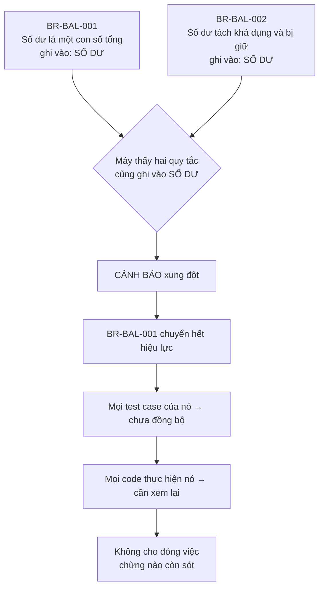

# Trả lời của Claude

Bạn nói đúng. Tôi viết ba tài liệu mà không bao giờ nói bạn phải đọc cái nào, theo thứ tự nào, để quyết cái gì. Và các tài liệu đó đầy những đoạn tôi tự sửa lỗi của mình — đó là quá trình suy nghĩ của tôi, không phải thứ để bạn duyệt.

Đã sắp xếp lại.

---

## Bạn cần đọc gì

Thư mục `design/` giờ được đánh số theo đúng thứ tự đọc:

| File | Đọc khi nào | Dài |
|---|---|---|
| **`00-BAT-DAU-TU-DAY.md`** | **Đọc cái này. Đủ để duyệt.** | ~15 phút |
| `01-BO-MAY.md` | Khi muốn kiểm tra một cơ chế cụ thể | Tra cứu |
| `02-CONG-VIEC-TUNG-TRAM.md` | Khi muốn kiểm tra AI phải làm gì ở mỗi bước | Tra cứu |
| `03-vi-sao-thiet-ke-nhu-vay.md` | Khi thắc mắc "sao không làm cách khác" | Lịch sử |

**Chỉ cần đọc file 00.** Ba file kia là để tra khi bạn nghi ngờ một chỗ nào đó.

---

## Trong file 00 có gì

Chín mục. Ba mục đầu là thứ bạn hỏi mà tôi chưa bao giờ trả lời:

**Mục 2 — Một ngày làm việc.** Ba cảnh cụ thể: ngày 1 nhập tài liệu, ngày 5 bạn sốt ruột và bị chặn, ngày 30 đổi một quy tắc. Có ảnh chụp màn hình dạng chữ để bạn thấy kidea thực sự in ra cái gì.

**Mục 3 — Skill kidea thiết kế như nào.** Bạn hỏi câu này và tôi chưa từng trả lời. Nó gồm ba nhóm file:

| Nhóm | Làm việc gì | Sai thì sao |
|---|---|---|
| **SKILL** | Việc cần hiểu ý nghĩa: soạn nghiệp vụ, tìm lỗ hổng | Sai thì tài liệu kém, Human review thấy được |
| **SCRIPTS** | Việc cần chính xác tuyệt đối: đếm, so sánh, băm | **Không được sai.** Nên viết thành code |
| **HOOK** | Chặn hoặc cho AI ghi file | **Không được sai**, và phải chạy ngoài tầm với của AI |

Kèm sơ đồ chạy lúc nào, cài ở đâu.

**Mục 7 — Ai được làm gì.** Một bảng: việc nào Human quyết, việc nào AI làm, việc nào máy làm. Đây là xương sống của cả thiết kế mà tôi chưa từng trình bày thành bảng.

---

## Bạn cần duyệt 5 điểm

Bốn điểm đầu chỉ cần gật hoặc lắc:

| # | Duyệt gì | Câu hỏi |
|:--:|---|---|
| 1 | Khái niệm **"thực thể nghiệp vụ"** | Đây là thứ **tôi thêm vào**, không có trong yêu cầu gốc của bạn. Đồng ý không? |
| 2 | **Bảy trạm** | Đúng thứ tự chưa? Thừa trạm nào? Thiếu bước nào? |
| 3 | **Chín lệnh** | Thừa gì, thiếu gì? |
| 4 | **Bảng phân quyền** | Có việc nào bạn muốn tự làm mà tôi đang giao cho AI, hoặc ngược lại? |

Điểm 5 cần bạn nghĩ:

**Bảng kiểm 21 dòng ở trạm NGHIỆP VỤ.** Nó định nghĩa "thế nào là nghiệp vụ đủ rõ". Thiếu một dòng là AI được phép đi tiếp trong khi thực ra chưa đủ.

Toàn bộ bảng nằm ở mục 8 file 00.

---

## Điểm 1 tôi muốn giải thích trước, vì nó là thứ tôi tự thêm

Bạn yêu cầu ba tấm bản đồ. Tôi làm ba tấm. Nhưng tôi thêm một khái niệm không có trong yêu cầu của bạn: **thực thể nghiệp vụ**.

Đó là *danh từ* mà nhiều quy tắc cùng động vào — Số dư, Lệnh, Sổ lệnh, Tài khoản.

> Hai quy tắc **không biết gì về nhau**. Nhưng nếu chúng **cùng ghi vào một thực thể** thì chúng liên quan tới nhau.

Áp vào đúng ví dụ bạn đưa ra:

**Vì sao tôi thêm:** không có nó thì bản đồ nghiệp vụ chỉ biết những gì AI khai trực tiếp. Nếu AI quên khai *"quy tắc mới thay quy tắc cũ"* thì không ai phát hiện. Có nó thì máy vẫn bắt được, vì hai quy tắc cùng ghi vào một thực thể là dấu hiệu máy tự thấy.

Nó là **lưới an toàn khi AI khai thiếu**. Nhưng nó cũng là thứ bạn chưa yêu cầu, nên tôi phải hỏi.

---

Đọc `design/00-BAT-DAU-TU-DAY.md`. Duyệt hoặc chỉ ra chỗ sai. Tôi không hỏi thêm gì nữa cho tới khi bạn đọc xong.
