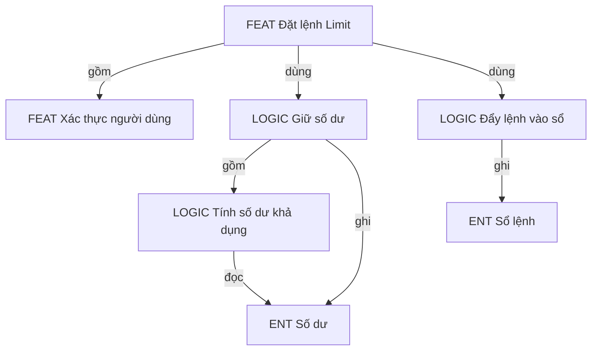
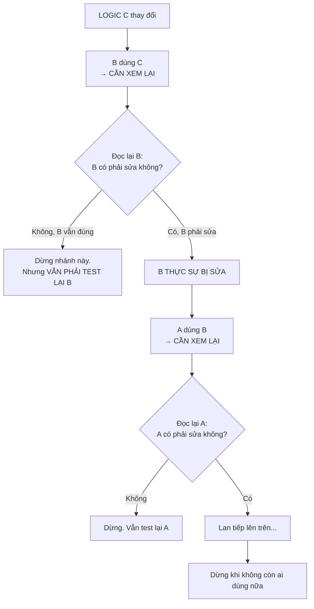
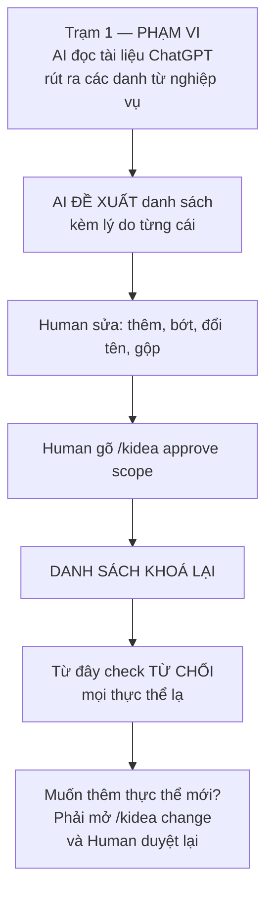
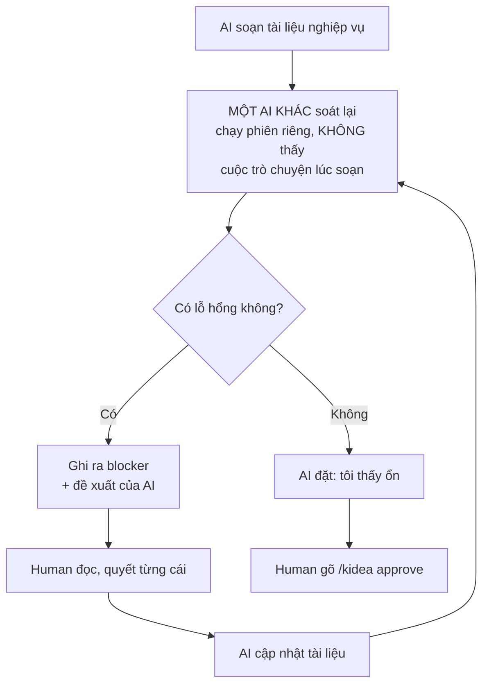
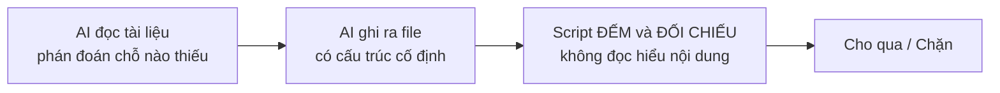
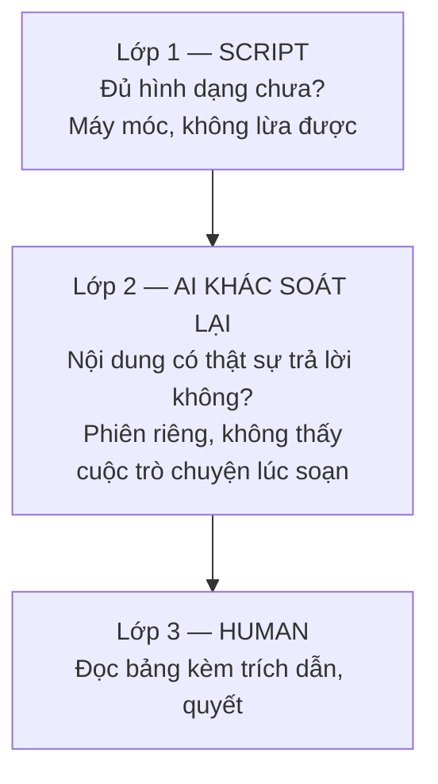

# Trả lời của Claude

Điểm 5 là phần quan trọng nhất, tôi nêu lại ý hiểu trước. Bốn câu kia ở dưới.

Tài liệu đã cập nhật: `design/00-BAT-DAU-TU-DAY.md`.

---

## Điểm 5 — Ý hiểu của tôi về mô hình ba cấp

### Tôi hiểu bạn nói gì

| Cấp | Là gì | Ghép từ đâu |
|---|---|---|
| **Tính năng** | Thứ người dùng thấy | Tính năng khác + logic + thực thể |
| **Logic** | Một phát biểu nghiệp vụ | Logic khác + thực thể |
| **Thực thể** | Đơn vị nhỏ nhất | Đáy, không ghép từ gì |



Tôi đổi tên `BR` thành `LOGIC` trong toàn bộ tài liệu, vì "logic" là từ bạn dùng và bạn sẽ gõ nó hàng ngày.

### Một chỗ tôi chỉnh so với đề xuất của bạn

Bạn nói thực thể là *"đơn vị nhỏ nhất, kiểu như **quản lý số dư của 1 user**"*.

Tôi đề nghị: **thực thể là cái danh từ "Số dư", không phải cái việc "quản lý số dư"**.

| | "Số dư" (danh từ) | "Quản lý số dư" (việc) |
|---|---|---|
| Có mấy cách gọi | Một | Nhiều: quản lý số dư, xử lý số dư, kiểm số dư… |
| Máy so tên có khớp không | **Khớp** | Dễ lệch → lưới an toàn thủng |

**Cái bạn gọi là "quản lý số dư" vẫn còn nguyên** — nó chính là `ENT Số dư` cộng với tất cả logic ghi vào nó. Máy tính ra được, không cần thành một cấp riêng.

Vẫn ba cấp như bạn nói, chỉ khác cách neo cấp dưới cùng. Danh từ làm mỏ neo chắc hơn động từ, vì danh từ chỉ có một cách gọi.

### Lan truyền đệ quy — chỗ bạn nhấn mạnh nhất

Bạn nói: *"logic A gọi B, B gọi C, khi C thay đổi mà B cũng cần update theo thì đệ quy tiếp là cần xem xét, test lại cả A. Chỉ dừng khi không còn ai gọi tới nữa."*

Tôi hiểu là luật có **hai mức**, và chỉ mức thứ hai mới lan tiếp:

| Mức | Nghĩa | Lan tiếp không |
|---|---|---|
| **CẦN XEM LẠI** | Thứ này dùng cái vừa đổi. Phải đọc lại và test lại | Chưa |
| **THỰC SỰ BỊ SỬA** | Đọc lại rồi, và nó phải sửa thật | **Có** |



**Điểm tôi muốn bạn xác nhận:** nhánh dừng lan truyền **vẫn phải test lại**. Không sửa không có nghĩa là không cần kiểm. Tôi hiểu đúng ý bạn chứ?

Máy làm phần khoanh vùng và không cho quên. Việc *"B có phải sửa không"* thì AI đánh giá, Human chốt.

### Kiểm tra trùng lặp trước khi thêm

Bạn nói: *"AI xác định feature mới có thực sự là mới không bằng cách tìm xem các feature cũ có cái nào giống hoặc tương đương không."*

```text
$ /kidea change feature "Đặt lệnh Stop Limit"

So với 12 tính năng đang có:

  GẦN NHẤT   FEAT-MVP-ORDER-LIMIT — Đặt lệnh Limit
             Giống : cùng actor, cùng ghi ENT Lệnh và ENT Số dư,
                     cùng dùng LOGIC-BAL-002
             Khác  : thêm điều kiện kích hoạt theo giá

  Tôi nghiêng về: KHÔNG phải tính năng mới.
                  Nên tách FEAT-MVP-ORDER-LIMIT thành:
                    - LOGIC chung: đặt lệnh có giá
                    - LOGIC riêng: điều kiện kích hoạt

  BẠN CHỐT: mới hoàn toàn / biến thể của cái cũ / thay thế cái cũ
```

### Gộp hay tách sau khi sửa

Bạn nói cần đánh giá gộp/tách *"như vậy mới đảm bảo mọi thứ luôn tinh gọn, clean"*.

```text
$ /kidea check

ĐỀ XUẤT DỌN DẸP

  LOGIC-BAL-002 giờ ghi vào 4 thực thể và có 7 nhánh điều kiện.
  → Đề nghị TÁCH thành 2 logic.

  LOGIC-ORDER-011 và LOGIC-ORDER-014 giờ phát biểu gần trùng nhau.
  → Đề nghị GỘP.

  Đây là ĐỀ XUẤT. Bạn chốt. Bỏ qua cũng được.
```

**Tôi để nó là cảnh báo, không phải cổng chặn.** Bắt buộc dọn dẹp mỗi lần thì thành phiền nhiễu và bạn sẽ tắt nó đi. Bạn thấy nên chặn cứng không?

---

## Câu 1 — Ai định nghĩa và chốt thực thể



**AI đề xuất, Human chốt, sau đó khoá.** AI không bao giờ tự thêm thực thể — vì nếu nó tự thêm thì nó sẽ gọi cùng một thứ bằng nhiều tên, và lưới an toàn thủng.

Tiêu chí để một thứ được làm thực thể:

| Câu hỏi | Phải trả lời |
|---|---|
| Có trạng thái sống qua nhiều request không? | Có. "Số dư" có; "giá hiển thị trên màn" không |
| Có từ hai logic trở lên động vào không? | Có. Một logic động vào thì chưa cần tách |
| Có ai đó phải làm chủ nó không? | Có. Sang trạm kiến trúc, mỗi thực thể được gán đúng một service làm chủ |

---

## Câu 2 — Luồng audit có phải AI làm trước, hỏi Human, rồi Human duyệt không?

**Đúng.** Nhưng nó là vòng lặp, không phải một lượt. Và có một chi tiết bạn chưa biết:



**Chi tiết quan trọng: người soát không phải người soạn.** AI vừa viết xong một tài liệu thì có động cơ bảo vệ nó. Nên bước soát chạy trong một phiên riêng, chỉ nhận tài liệu, không thấy lịch sử — nhiệm vụ là **tìm lỗ hổng**, không phải bảo vệ.

Và AI chỉ được đặt *"tôi thấy ổn"*. Chỉ Human đặt được *"đã duyệt"*.

---

## Câu 3 — Stress test: chưa có. Bạn đúng.

Trước đó **hoàn toàn thiếu**. Giờ nó là **trạm 7 — NGHIỆM THU HỆ THỐNG**, và tách làm hai chỗ đúng như bạn nói:

| Ở đâu | Làm gì |
|---|---|
| **Trạm 4 — KIẾN TRÚC** | **Chốt con số mục tiêu.** Bao nhiêu request/giây, độ trễ p99, bao nhiêu người dùng đồng thời |
| **Trạm 7** | **Chạy thật và so với con số đó** |

Đúng ý bạn — mọi hệ thống đều qua trạm này, chỉ khác con số. Blog cá nhân khai `100 req/s, p99 < 500ms` rồi đi tiếp trong năm phút. Sàn crypto khai khắt khe hơn nhiều và mất vài ngày.

**Nhưng `check` từ chối duyệt trạm 4 nếu chưa khai con số.** Để trống thì trạm 7 không có gì để so, và cả trạm thành hình thức.

Tôi đặt nó thành trạm riêng thay vì nhét vào cuối bước code, vì có ba thứ khác cũng **chỉ kiểm được ở mức hệ thống**, nên gom chung một trạm:

| Kiểm gì | Vì sao không kiểm ở mức tính năng được |
|---|---|
| **Hiệu năng** | Thông lượng là tính chất của cả hệ. Đo một tính năng đứng riêng không học được gì |
| **Luồng đầu-cuối** | Đi xuyên nhiều tính năng, nhiều service |
| **Phục hồi** | Giết service, mất DB, khôi phục backup thật |
| **Bảo mật** | Quét phụ thuộc, thử vượt quyền |

Bốn loại đo hiệu năng: tải bình thường · tải đỉnh · tải kéo dài (rò rỉ bộ nhớ) · tải đột biến.

Thêm một phép đo rẻ ở trạm 6, mức từng tính năng: *"không được chậm hơn lần trước quá X%"*. Nó bắt lỗi thô như truy vấn lặp ngay lúc vừa viết, thay vì để tới cuối.

**Số trạm giờ là 8**, không phải 7.

---

## Câu 4 — Làm sao script Python biết còn thiếu gì

Câu này hay, và câu trả lời đơn giản hơn bạn tưởng.

> **Script không phán đoán ngữ nghĩa. Script chỉ đếm.**

Việc phán đoán *"chỗ này thiếu"* là của AI. Nhưng AI phải ghi phán đoán đó ra một **file có cấu trúc cố định**. Script đọc file đó và áp luật máy móc.



File AI phải ghi:

```yaml
- muc: 14
  ten: "Đồng thời"
  trang_thai: DA_DIEN
  trich_dan: "FEAT-MVP-ORDER-LIMIT.md § Đồng thời — 'Hai lệnh cùng lúc
              trên một tài khoản: số dư được giữ trong một giao dịch
              nguyên tử, lệnh thứ hai thấy số dư đã trừ.'"
  logic: [LOGIC-BAL-002, INV-BALANCE-001]

- muc: 15
  ten: "Trùng lặp, gửi lại, timeout"
  trang_thai: THIEU
  blocker:
    thieu: "Chưa nói client_order_id trùng thì xử lý ra sao"
    ai_de_xuat: "Trả về lệnh đã tạo trước đó, không tạo lệnh mới"
    human_quyet: null
```

Script áp bốn luật, **không luật nào cần hiểu tiếng Việt**:

| Luật | Cách kiểm |
|---|---|
| Mọi mục bắt buộc phải `DA_DIEN` | Đếm. Còn `THIEU` thì chặn |
| Mọi blocker phải có `human_quyet` khác `null` | Đếm. Còn `null` thì chặn |
| Mọi trích dẫn phải trỏ tới mục có thật trong file có thật | Mở file, tìm tiêu đề, so chuỗi |
| Mọi mã được nhắc phải tồn tại trong bản đồ | Tra bảng |

### Nói thẳng giới hạn

Script phân biệt được **"đã điền đủ hình dạng"** và **"còn trống"**. Nó **không** phân biệt được **"điền hay"** và **"điền dở"**.

AI hoàn toàn có thể viết mục § Đồng thời chứa một câu vô nghĩa, và script vẫn cho qua vì trích dẫn trỏ đúng chỗ.

Nên phải ba lớp, script chỉ là lớp đầu:



---

## Bạn cần xác nhận ba điểm

| # | Điểm | Câu hỏi |
|:--:|---|---|
| 1 | Thực thể là **danh từ** ("Số dư") chứ không phải **việc** ("quản lý số dư") | Đồng ý đổi không? |
| 2 | Nhánh dừng lan truyền **vẫn phải test lại** | Tôi hiểu đúng ý bạn chứ? |
| 3 | Đề xuất gộp/tách là **cảnh báo**, không phải cổng chặn | Nên chặn cứng không? |

Ngoài ra còn **bảng kiểm 21 dòng** ở `02-CONG-VIEC-TUNG-TRAM.md` mục 2 — thứ định nghĩa "nghiệp vụ đủ rõ". Đọc khi nào bạn rảnh, không gấp.
