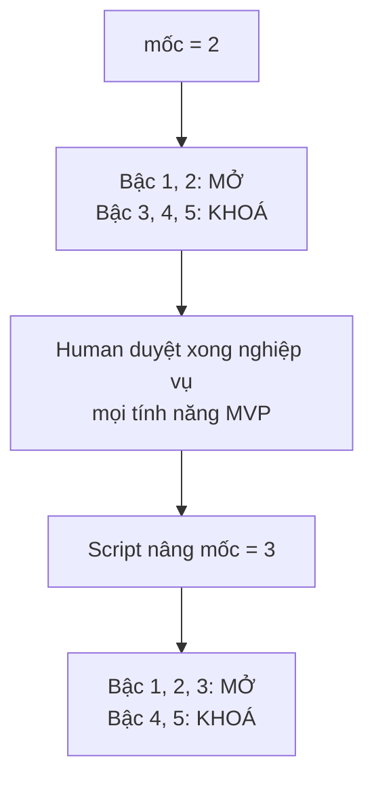
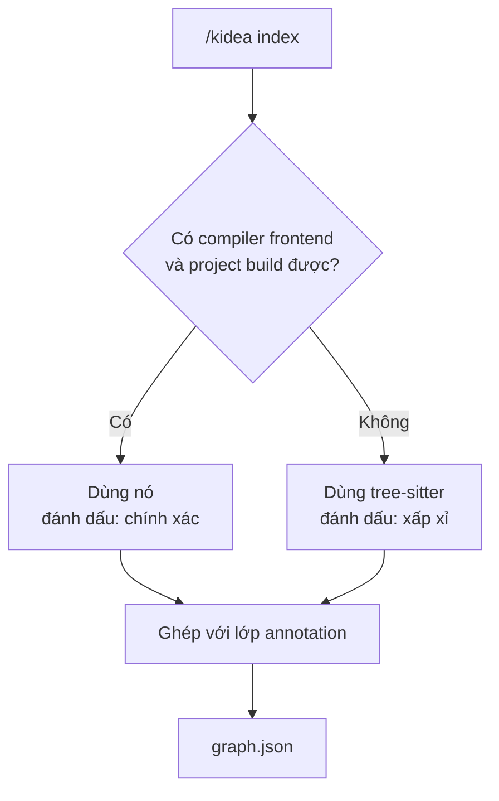

# Trả lời của Claude

Sáu ý của bạn, tôi trả lời từng cái. Ý số 4 làm thay đổi phạm vi nên tôi đã sửa lại đặc tả: `design/KIDEA_SPEC.md` (bỏ hậu tố phiên bản khỏi tên file luôn).

---

## Ý 1 — "Bậc" và "mốc" là gì

Xin lỗi, tôi dùng hai chữ này mà chưa định nghĩa. Giải thích lại.

### Ẩn dụ: toà nhà 5 tầng

Bạn đang xây một toà nhà. **Không thể xây tầng 3 khi tầng 2 chưa xong.**

- **Bậc** = "thư mục này thuộc tầng mấy". Nó **gắn chết vào thư mục**, không bao giờ đổi.
- **Mốc** = "hiện đang xây tới tầng mấy". Nó là **một con số thay đổi được**, ghi trong cuốn sổ.

### Bậc của từng thư mục

| Bậc | Thư mục | Chứa gì |
|:---:|---|---|
| 1 | `docs/product/` | Sản phẩm làm gì, có tính năng nào |
| 2 | `docs/requirements/` | Nghiệp vụ từng tính năng |
| 3 | `docs/logical-tests/`, `docs/ux/` | Test case dạng chữ, thiết kế màn hình |
| 4 | `docs/architecture/` | Chia service, thiết kế dữ liệu, API |
| 5 | `src/`, `tests/` | Code thật |

Cách nhớ: **bậc thấp trả lời "làm cái gì", bậc cao trả lời "làm thế nào"**. Không thể trả lời "làm thế nào" khi chưa biết "làm cái gì".

### Luật chỉ có một dòng

```text
bậc của file  <=  mốc   →  CHO GHI
bậc của file  >   mốc   →  CHẶN
```

### Ví dụ thật

Giả sử `mốc = 2` — bạn đang viết nghiệp vụ, chưa duyệt xong.

| AI muốn ghi vào | Bậc | Kết quả | Vì sao |
|---|:---:|---|---|
| `docs/product/overview.md` | 1 | **CHO** | 1 ≤ 2 |
| `docs/requirements/BR-BAL-003.md` | 2 | **CHO** | 2 ≤ 2, đúng việc đang làm |
| `docs/logical-tests/LT-ORDER-0042.md` | 3 | **CHẶN** | 3 > 2 — nghiệp vụ chưa chốt mà đã viết test |
| `docs/architecture/services.md` | 4 | **CHẶN** | 4 > 2 |
| `src/balance/reserve.cpp` | 5 | **CHẶN** | 5 > 2 — chỗ AI hay nhảy cóc nhất |

Khi bạn gõ `/kidea approve requirements` cho **mọi** tính năng MVP, script nâng mốc từ 2 lên 3. Bậc 3 mở ra ngay, bậc 4 và 5 vẫn khoá.



### Vì sao luật là "≤" chứ không phải "="

Để bạn **luôn được quyền quay lại sửa nghiệp vụ**. Ở mốc 4 bạn vẫn sửa được tài liệu bậc 2.

kidea không cấm bạn đổi ý. Nó chỉ bắt mọi thứ phía sau phải làm lại cho khớp — đúng câu bạn viết trong draft: *"khi sửa hoặc xoá thì truy ra các bên liên quan và làm đến cùng"*.

---

## Ý 2 — Nếu dùng C++20/26 thay Rust thì sao?

Câu trả lời có thể làm bạn bất ngờ: **về mặt đọc code, C++ DỄ HƠN Rust.** Ngược với trực giác.

### Trước hết, hai khái niệm

Muốn vẽ tấm bản đồ "hàm nào gọi hàm nào", có hai cách đọc code:

| | **tree-sitter** | **Compiler frontend** |
|---|---|---|
| Đọc cái gì | Chỉ **cú pháp** — hình dạng chữ | **Ngữ nghĩa** — hiểu như trình biên dịch |
| Cần project biên dịch được | Không | **Có** |
| Tốc độ | Nhanh | Chậm hơn nhiều |
| Chạy trên code chưa viết xong | **Được** | Không |

- **Cú pháp** là hình dạng: *"đây là một lời gọi hàm tên `foo`"*.
- **Ngữ nghĩa** là ý nghĩa: *"`foo` này chính là hàm định nghĩa ở dòng 42 file kia, không phải `foo` trùng tên ở chỗ khác"*.
- **Compiler frontend** là phần đầu của trình biên dịch — phần đọc hiểu code, trước khi sinh ra file chạy.

### So sánh hai ngôn ngữ

| | Rust | C++20/26 |
|---|---|---|
| tree-sitter | Có | Có |
| Compiler frontend cho Python | **Không có bản chính thức** | **`libclang`, binding Python chính thức, dùng nhiều năm rồi** |
| Đọc xuyên qua macro | Không | **Có** |
| Phân giải overload / template | Không cần | **Giải được** |
| Gọi qua `dyn Trait` / hàm ảo | Sót | Sót — **hai bên như nhau** |
| Doxygen dùng được | Không | **Có** |

**Lý do C++ dễ hơn không phải vì C++ đơn giản hơn** — nó phức tạp hơn nhiều. Mà vì **Clang mở cửa cho người ngoài vào đọc**, còn Rust thì chưa mở API ổn định.

Và bạn đã tự nói ra từ đầu: *"index như kiểu Doxygen bên c++ ấy"*. Doxygen chạy trên C++ là thật và đã chạy 20 năm rồi. Doxygen không đọc được Rust.

### Nhưng đừng chọn ngôn ngữ vì kidea

Đây là điều quan trọng nhất trong phần này.

**Chọn ngôn ngữ theo cái sản phẩm của bạn cần.** Chọn C++ chỉ vì kidea dễ đọc hơn là để cái đuôi vẫy con chó.

Vì phần **quan trọng nhất của tấm bản đồ là lớp annotation** — dòng `@kidea:implements BR-BAL-003` bạn viết trong code. Lớp đó **giống hệt nhau ở cả hai ngôn ngữ**, vì cả C++ lẫn Rust đều dùng `///` để viết chú thích. Lớp máy tự đọc chỉ là phần bổ trợ.

### Nên tôi thiết kế động cơ lai, không khoá vào ngôn ngữ nào



Chọn C++ thì nhánh trái chạy được. Chọn Rust thì hiện chỉ có nhánh phải. **Luật gác cổng chỉ dựa trên lớp annotation, nên không bị ảnh hưởng.**

Bạn cứ chọn theo sản phẩm, tôi lo phần còn lại.

---

## Ý 3 — "Đặc tả đã chốt xong những gì", nói dễ hiểu

Trước tôi liệt kê tên file, không giải thích chúng để làm gì. Nói lại theo kiểu **mỗi thứ giải quyết vấn đề gì**.

### 1. Cuốn sổ công trường — `state.yaml`

**Vấn đề:** Hôm nay bạn mở Claude Code, ngày mai mở lại, AI quên sạch. Không biết đang làm tới đâu.

**Cách giải:** Một file nằm trong repo, ghi mọi tính năng đang ở trạm nào, ai đã duyệt, còn thiếu gì. Đóng máy mở lại vẫn còn nguyên.

**Ba luật khoá chặt:**

| Luật | Chống cái gì |
|---|---|
| `human: APPROVED` chỉ đặt được bởi lệnh `/kidea approve` | AI tự phong "đã duyệt" cho chính nó |
| Không duyệt được khi AI còn báo thiếu | Bạn lỡ tay duyệt thứ chưa xong |
| Không duyệt được khi còn file sửa dở chưa commit | Duyệt một nội dung không xác định được |

Luật 3 cần giải thích thêm. **"Working tree bẩn"** = còn file đã sửa mà chưa commit. Duyệt là **chụp lại dấu vân tay nội dung** — chụp lúc nội dung còn đang thay đổi thì dấu vân tay vô nghĩa, và sau này không phát hiện được ai sửa gì.

### 2. Annotation trong code

**Vấn đề:** Nhìn một hàm, không biết nó phục vụ quy tắc nghiệp vụ nào.

**Cách giải:** Viết chú thích ngay trên hàm:

```cpp
/// @kidea:implements BR-BAL-003, BR-BAL-004
ReservationId reserve_balance(const UserId& user, Decimal amount);
```

Ai sửa hàm cũng nhìn thấy dòng này. Đây là nguồn sự thật của tấm bản đồ.

### 3. Tấm bản đồ — `graph.json`

**Vấn đề:** Sửa một quy tắc, không biết còn chỗ nào phụ thuộc nó.

**Cách giải:** Một file sinh ra tự động, ghi cái gì liên quan cái gì. Mỗi mối liên hệ đánh dấu rõ **do người viết** hay **do máy đoán** — để bạn biết tin được bao nhiêu phần.

### 4. Sổ bằng chứng — `log.jsonl`

**Vấn đề:** Ba tháng sau có sự cố, không ai nhớ vì sao lúc đó lại duyệt.

**Cách giải:** Mỗi sự kiện ghi một dòng, **chỉ ghi thêm, không sửa không xoá**. Ai duyệt gì, lúc nào, trên commit nào, đều tra lại được.

### 5. Thông điệp khi chặn

**Vấn đề:** Nếu chỉ nói "bị chặn", AI sẽ loay hoay thử cách khác cho bằng được.

**Cách giải:** Thông điệp phải nói đủ **ba điều**: chặn vì sao · đang kẹt ở đâu · phải làm gì tiếp. Có đủ ba thì AI quay về làm đúng việc thay vì tìm đường vòng.

---

## Ý 4 — Không chia phiên bản. Đã sửa xong.

Tôi đã bỏ toàn bộ v0.1/v0.2/v0.3 khỏi tài liệu. Đổi tên file thành `KIDEA_SPEC.md` và `KIDEA_DESIGN.md`.

Nhưng bạn dặn *"tính năng nào không cần thiết thì đừng vẽ ra"*, nên tôi rà lại từng thứ và **cắt bớt**:

### Cắt hẳn

| Cắt | Vì sao |
|---|---|
| `/kidea next` | Chỉ là vỏ bọc tiện tay của `status`. Không thêm giá trị |
| Giao diện web | Mọi thứ là file text đọc bằng editor hoặc GitHub. Thêm giao diện là thêm một thứ phải nuôi |
| Tự động deploy | kidea *gác* deploy, không *làm* deploy. Việc deploy vẫn do script/CI của bạn chạy |
| Bộ chạy test riêng | Gọi đúng câu lệnh bạn khai trong cấu hình rồi đọc kết quả. Không đẻ ra công cụ mới |
| Quản lý hạ tầng, môi trường | Ngoài phạm vi. Đó là việc của Terraform/Ansible/K8s |

### Giữ lại, vì thiếu thì hỏng

| Giữ | Vì sao bắt buộc |
|---|---|
| `/kidea change` | **Không có nó thì cơ chế "chưa đồng bộ" không chạy được.** Dấu `synced_with` phải trỏ vào một cái gì đó có thật. Đây chính là ý "version của session" trong draft của bạn |
| `/kidea slice` | Vòng lặp làm trọn một tính năng. Đây là phần *dùng hàng ngày* |
| Gói ngữ cảnh + subagent | Yêu cầu số 1 trong draft của bạn: context sạch cho từng sub-task |
| `/kidea adopt` | Để kéo project cũ vào. Rẻ, và chắc chắn có lúc cần |
| Trạm release | Chỉ là thêm một trạm vào bộ máy sẵn có, gần như không tốn gì |

**Kết quả: 9 lệnh.**

`init` · `status` · `check` · `index` · `approve` · `impact` · `change` · `slice` · `adopt`

Bản Codex cũ có khoảng 40 lệnh. Đây là 9.

---

## Ý 5 — "Thứ tự code" nghĩa là gì

Chỗ này tôi viết tắt quá. Nói lại.

### Phân biệt hai khái niệm

Đây là chỗ dễ nhầm, và nó liên quan tới ý 4 của bạn:

| | Nghĩa là gì |
|---|---|
| **Phiên bản** | Có bản v0.1 dùng được rồi, sau đó ra v0.2 phải nâng cấp. Bạn đã nói **không** — đúng, tôi bỏ rồi |
| **Thứ tự xây** | Tôi không viết được 20 file cùng một lúc. Phải có file nào trước file nào |

**Không chia phiên bản khác với làm mọi thứ cùng lúc.** Chỉ có một bản duy nhất, nhưng vẫn phải xây theo thứ tự.

### Vì sao thứ tự lại quan trọng

Vì tôi có thể thiết kế sai. Nếu tôi xây hết 9 lệnh rồi mới đưa bạn xem, mà ý tưởng cốt lõi sai, thì mất trắng nhiều tuần.

Nên tôi sắp thứ tự sao cho **bạn tự tay thử được thứ gì đó càng sớm càng tốt**.

### Bảng thứ tự

| # | Tôi xây gì | Xong thì **bạn tự tay thử** được gì |
|:---:|---|---|
| 1 | Cuốn sổ + bộ test | Chưa thấy gì. Nền móng |
| 2 | **Người gác + hook** | **Bạn bảo tôi viết code khi trạm chưa qua, và xem tôi bị chặn** |
| 3 | `init` + `status` | Đưa tài liệu ChatGPT thật vào, xem kidea báo thiếu gì |
| 4 | `check` + `approve` | Duyệt 1 trạm, rồi sửa tài liệu, xem approval bị thu hồi |
| 5 | Đọc code + `index` + `impact` | Hỏi "sửa quy tắc này ảnh hưởng đâu" trên code thật |
| 6 | `change` + đánh dấu chưa đồng bộ | Mở một việc sửa, xem kidea không cho đóng khi còn sót |
| 7 | `slice` + gói ngữ cảnh + subagent | Làm trọn 1 tính năng, mỗi sub-task chạy context sạch |
| 8 | `adopt` | Kéo một project cũ của bạn vào kidea |
| 9 | Chạy thật | Tìm chỗ thiết kế sai, sửa |

**Bước 2 là bước quan trọng nhất.** Đó là lúc bạn biết ý tưởng cốt lõi — "script chặn AI, không phải lời dặn chặn AI" — có hoạt động thật không. Nếu nó không chạy, cả thiết kế phải nghĩ lại, và tôi muốn biết điều đó sau vài ngày chứ không phải sau vài tuần.

---

## Ý 6 — Quyết định mới có ảnh hưởng "4 chỗ có thể sai" không?

Có, hai chỗ. Và có thêm một rủi ro mới.

### Bị ảnh hưởng bởi việc chọn C++

**Rủi ro số 2 — "ranh giới bậc quá thô" — nặng hơn nếu chọn C++.**

Luật gác cổng dựa trên "thư mục này thuộc bậc mấy". Nhưng project C++ có nhiều thư mục **không thuộc bậc nào rõ ràng**:

```text
CMakeLists.txt        ← file build, bậc mấy?
cmake/                ← script build
build/                ← sinh ra tự động
third_party/          ← thư viện ngoài
include/              ← header, bậc 5 hay riêng?
tools/                ← script phụ trợ
```

Rust gọn hơn nhiều — `Cargo.toml`, `src/`, `tests/` là gần như hết.

**Tôi có sẵn danh sách miễn trừ** cho mấy thư mục này, nhưng danh sách đó phải khớp với project thật của bạn. Nên tôi cần hỏi ở dưới.

### Được cải thiện bởi việc chọn C++

**Rủi ro số 3 — "call graph sẽ sót" — nhẹ hơn hẳn nếu chọn C++**, vì có libclang. Đã giải thích ở ý 2.

### Không bị ảnh hưởng

Rủi ro 1 (hook chặn `Bash` không sạch) và rủi ro 4 (ép commit trước khi duyệt có thể phiền) — không liên quan tới ngôn ngữ.

### Rủi ro mới, sinh ra từ ý 4 của bạn

**Phần `slice` và gói ngữ cảnh là phần tôi phải đoán nhiều nhất.**

Sáu phần đầu dựa trên luật rõ ràng: bậc, mốc, hash, so sánh. Đúng sai kiểm chứng được ngay.

Nhưng `slice` — chia một tính năng thành bao nhiêu sub-task, mỗi sub-task nhận bao nhiêu ngữ cảnh — **phụ thuộc vào cách bạn làm việc thực tế**, mà tôi chưa nhìn thấy bạn làm bao giờ. Đây là chỗ khả năng phải sửa lại sau khi dùng thật là cao nhất.

Trước đây nó nằm ở "v0.2", tức là có thời gian dùng thử phần trước rồi mới thiết kế nó. Giờ không chia phiên bản nữa thì tôi xây nó sớm hơn, dựa trên phỏng đoán nhiều hơn.

**Cách tôi giảm rủi ro:** để nó ở bước 7 trong thứ tự xây. Lúc đó bạn đã dùng 6 bước trước rồi, tôi đã nhìn thấy bạn làm việc thật, nên đoán sẽ sát hơn.

---

## Cần bạn quyết ba điều

**1. Rust hay C++20/26?**
Chọn theo sản phẩm của bạn, đừng chọn theo kidea. Nếu C++ thì tấm bản đồ chính xác hơn, nhưng đó không phải lý do đủ để đổi ngôn ngữ của cả sản phẩm.

**2. Nếu chọn C++ thì có dùng CMake không?**
Cần file `compile_commands.json` để bật động cơ đọc chính xác. CMake sinh ra nó bằng một dòng cấu hình. Nếu bạn dùng build system khác thì tôi phải xem có lấy được không.

**3. Bố cục thư mục code dự kiến của bạn thế nào?**
Cái này ảnh hưởng trực tiếp tới rủi ro số 2 ở trên. Bạn chỉ cần phác đại khái, kiểu:

```text
project/
├── CMakeLists.txt
├── src/
├── include/
├── tests/
└── third_party/
```

Có bản phác đó thì tôi viết đúng ranh giới bậc ngay từ đầu, đỡ phải sửa lắt nhắt.

Trả lời xong ba câu này là tôi bắt đầu code bước 1.
