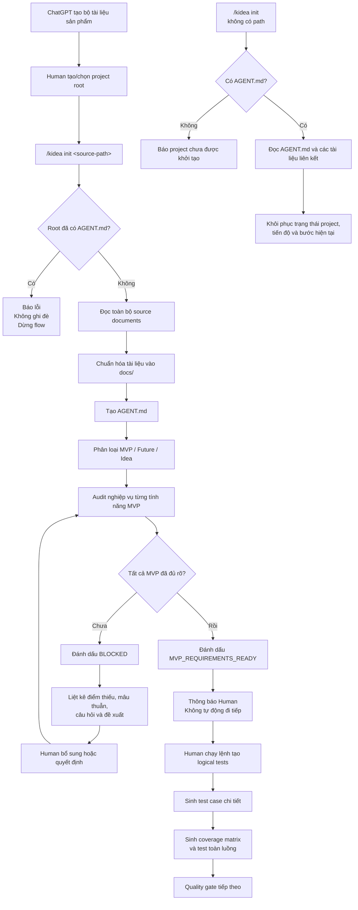

tôi đang muốn tạo 1 skill hoặc 1 flow để sử dụng trên Codex nhằm biến từ 1 ý tưởng trở thành bản MVP và có thể phát triển tiếp các tính năng sau này.

Ví dụ ban đầu tôi sẽ chat với ChatGPT trước để lên ý tưởng, chức năng. Đầu ra của bước chat này sẽ là 1 file chứa thông tin tổng quan về sản phẩm, tất cả các tính năng, gồm 3 nhóm là tính năng nằm trong bản MVP, tính năng sẽ làm sau này và cuối cùng là tính năng ở dạng ý tưởng, chưa có kế hoạch. File này sẽ link tới nhiều file khác đi kèm chứa nghiệp vụ, logic chi tiết của các tính năng trong bản MVP.

Ta để các file này vào trong 1 thư mục. Và tôi sẽ dùng Codex, gõ 1 lệnh ví dụ như "/kidea init <đường dẫn thư mục từ ChatGPT>" để bắt đầu đọc các file trong thư mục kia và cũng chính là bắt đầu flow của chúng ta (lệnh "/kidea" là lệnh tùy chọn tôi đặt tên dựa trên sự kết hợp tên tôi "kendrick" và "idea"). Nếu trong folder hiện tại đã có file AGENT.md rồi thì báo lỗi, vì file này phải được Skill "kidea" khởi tạo và điền nội dung ban đầu. Nếu pass rồi thì skill "kidea" sẽ bảo Codex đọc để nắm thông tin về project, các tính năng. Tiếp đó kidea tạo file AGENT.md chứa thông tin project, các tính năng trong bản MVP, tương lai và đang ở dạng ý tưởng. Nó cũng đọc nghiệp vụ, logic từng chức năng, sau đó lưu chúng vào trong thư mục "docs", ở file AGENT.md sẽ tóm tắt chức năng và link tới file tương ứng trong "docs". Ngoài ra Codex cũng phân tích xem là nghiệp vụ, logic từng chức năng đã đủ chưa, chặt chẽ chưa. Nếu rồi thì nó đánh dấu trong file AGENT.md là tài liệu, business, logic của chức năng này đã ok. Nếu chưa thì nó sẽ đánh dấu trong file AGENT.md là tài liệu, business, logic của chức năng này chưa ổn và chúng nằm ở những điểm nào, nói chi tiết và có hướng đề xuất cho human. Sau khi Codex tổng hợp mà dù chỉ còn 1 chức năng trong MVP chưa ổn về tài liệu, business, logic thì Codex sẽ chưa đi sang step sau trong flow, yêu cầu và phối hợp với human để làm rõ. Sau khi mọi tính năng MVP đã rõ, tài liệu ngon rồi thì Codex báo lại để human biết. Human sẽ gõ tiếp lệnh nào đó trong kidea để đi sang  bước tiếp theo là sinh ra các test case dạng logic cho toàn bộ phần nghiệp vụ trong MVP (ví dụ như bản MVP có chức năng đặt lệnh Limit thì phải có test case cover trường hợp User đặt lệnh mà có đủ số dư thì sao, không đủ số dư thì sao, orderbook cặp BTC/USDT có best ask 76000 mà đặt lệnh Market thì sao...). Ở đây nó sẽ mới là dạng chữ và logic thôi, sau này ta sẽ sinh các test trong code theo cái này. Và phần test tổng quan toàn bộ luồng cũng sẽ dùng. Test case này phải cực kỳ chi tiết, bao phủ hết các phần logic và cả những case ở biên, hiếm gặp.

Tôi buồn ngủ quá, phía sau flow còn nhiều step lắm. Mai tôi sẽ gõ tiếp. Nhưng bạn nên hiểu mục đích của tôi là muốn tạo ra 1 bộ Skill/flow để human + Codex có thể biến ý tưởng thành bản MVP, sau đó phát triển tiếp các tính năng chờ để thành sản phẩm hoàn chỉnh. Do là trong quá trình phát triển sản phẩm trong thời đại AI, tôi nhận ra nếu ta không có quy trình thì với 1 project lớn, ta sẽ rất khó control để phát triển sản phẩm. Ngày mai nhớ nhắc tôi cả tính năng "/kidea init" (không có path chứa file tài liệu từ ChatGPT) để đọc file AGENT.md và Codex biết được project này làm gì, các tính năng trong MVP, tương lai, ý tưởng là gì. Và những tính năng nào đã hoàn thành hoặc đang ở trạng thái nào. Đại ý là trong quá khứ đã làm được gì rồi và đang ở step nào trong flow kidea thì để ta còn biết mà tiếp tục.

File AGENT.md ở root của project đóng vai trò như 1 mục lục, có thể link tới các file khác. Codex đọc file này là sẽ nắm được toàn bộ hệ thống như nào, trạng thái ra sao, phân chia service/module trong nghiệp vụ và code như nào...

Ôi viết đến đây là không chịu nổi cơn buồn ngủ nữa. Tôi sợ nói dài quá bạn không hiểu. Thôi bạn cứ nêu ý hiểu của mình nhé, sai thì tôi sẽ chỉ lại. Cố gắng nhé

Tôi sẽ chốt một “điểm dừng” rõ ràng: mục tiêu, vai trò file gốc, hai chế độ `init`, các cổng chất lượng và bước tiếp theo.

Quan trọng hơn, tôi hiểu `kidea` là một quy trình có trạng thái, có thể tiếp tục xuyên nhiều phiên Codex, chứ không chỉ là lệnh sinh code.

Tôi hiểu ý của bạn khá rõ. **`kidea` không phải là một lệnh để Codex lập tức viết code**, mà là một **quy trình phát triển sản phẩm có trạng thái, có kiểm soát và có các cổng kiểm tra chất lượng** giữa Human và Codex.

Nói ngắn gọn:

> **Ý tưởng → đặc tả nghiệp vụ → kiểm tra độ chặt chẽ → logical test cases → thiết kế → triển khai → code tests → nghiệm thu → phát triển tính năng tiếp theo.**

Codex không được tự ý nhảy cóc từ ý tưởng sang viết code.

---

# 1. Đầu vào do ChatGPT chuẩn bị

Sau khi Human trao đổi với ChatGPT để hình thành sản phẩm, ChatGPT xuất ra một thư mục tài liệu, đại khái như:

```text
chatgpt-product-package/
├── PRODUCT_OVERVIEW.md
├── features/
│   ├── mvp/
│   │   ├── authentication.md
│   │   ├── place-limit-order.md
│   │   └── place-market-order.md
│   ├── future-features.md
│   └── ideas.md
└── business-rules/
    ├── balance-reservation.md
    └── order-matching.md
```

Trong đó có ba nhóm tính năng hoàn toàn khác nhau:

| Nhóm | Ý nghĩa |
|---|---|
| **MVP** | Bắt buộc phải làm trong phiên bản đầu |
| **Future** | Đã xác định sẽ làm sau MVP |
| **Idea** | Ý tưởng đang được lưu lại, chưa cam kết triển khai |

Chỉ các tính năng thuộc **MVP** mới phải có tài liệu nghiệp vụ và logic đủ sâu để vượt qua cổng kiểm tra ban đầu.

Tính năng Future và Idea được ghi nhận để không thất lạc, nhưng **không được làm phức tạp hoặc cản trở quá trình xây MVP**.

---

# 2. Hai chế độ của `/kidea init`

## Chế độ tạo dự án từ bộ tài liệu ChatGPT

```text
/kidea init <đường-dẫn-tới-thư-mục-tài-liệu>
```

Lệnh được chạy tại thư mục root của project đích.

Ví dụ:

```text
my-trading-platform/
```

Codex đang đứng trong thư mục này và chạy:

```text
/kidea init ../chatgpt-product-package
```

Quy tắc đầu tiên:

```text
Nếu root hiện tại đã có AGENT.md
→ dừng ngay
→ báo lỗi
→ không ghi đè
→ không tự sửa file cũ
```

Điều này nhằm tránh trường hợp vô tình khởi tạo lại một dự án đã tồn tại.

Nếu chưa có `AGENT.md`, `kidea` mới được tiếp tục.

---

## Chế độ đọc và tiếp tục dự án hiện tại

```text
/kidea init
```

Không truyền đường dẫn.

Trường hợp này có điều kiện ngược lại:

```text
Nếu root không có AGENT.md
→ báo đây chưa phải project đã được kidea khởi tạo
```

Nếu có `AGENT.md`, Codex sẽ đọc:

- `AGENT.md`;
- các file được liên kết trong `docs`;
- trạng thái từng tính năng;
- bước hiện tại của flow;
- những việc đã hoàn thành;
- những việc đang làm;
- những việc đang bị chặn;
- cấu trúc module/service;
- các quyết định quan trọng;
- bước hợp lệ tiếp theo.

Mục tiêu là dù mở một phiên Codex hoàn toàn mới, Codex vẫn khôi phục được ngữ cảnh dự án mà không phụ thuộc vào lịch sử chat cũ.

Tên lệnh sau này có thể giữ nguyên `/kidea init` hoặc thêm alias dễ hiểu hơn như `/kidea resume`, nhưng **hành vi bạn muốn đã rõ**.

---

# 3. Những gì `/kidea init <path>` phải thực hiện

Sau khi vượt qua kiểm tra `AGENT.md`, Codex thực hiện các bước sau.

## Bước 1: Đọc toàn bộ bộ tài liệu nguồn

Codex phải xác định:

- sản phẩm giải quyết vấn đề gì;
- người dùng là ai;
- phạm vi MVP;
- tính năng tương lai;
- các ý tưởng chưa cam kết;
- mối quan hệ giữa các tính năng;
- các tài liệu chi tiết đang tồn tại;
- tài liệu nào bị thiếu;
- tài liệu nào mâu thuẫn nhau.

Codex không được chỉ đọc tên file hoặc đọc sơ qua.

---

## Bước 2: Chuẩn hóa tài liệu vào `docs`

Các tài liệu cần thiết được đưa vào thư mục:

```text
docs/
```

Ví dụ:

```text
project-root/
├── AGENT.md
└── docs/
    ├── product/
    │   └── overview.md
    ├── features/
    │   ├── mvp/
    │   │   ├── MVP-001-place-limit-order.md
    │   │   └── MVP-002-place-market-order.md
    │   ├── future/
    │   └── ideas/
    ├── business-rules/
    ├── tests/
    ├── architecture/
    └── decisions/
```

Codex có thể cải thiện cách tổ chức, tiêu đề và liên kết, nhưng **không được âm thầm thay đổi ý nghĩa nghiệp vụ**.

Mọi nội dung Codex tự đề xuất phải được phân biệt rõ với nội dung Human đã xác nhận, chẳng hạn:

```text
Status: Proposed by Codex
Human approval: Pending
```

---

## Bước 3: Tạo `AGENT.md`

`AGENT.md` đóng vai trò như:

- mục lục chính;
- bản đồ dự án;
- dashboard trạng thái;
- checkpoint của flow `kidea`;
- điểm bắt đầu để Codex hiểu toàn bộ project.

Nó **không nên chứa toàn bộ tài liệu chi tiết**, vì như vậy sẽ trở thành một file quá lớn và khó duy trì.

Nó nên tóm tắt và liên kết tới các file chuyên biệt.

Ví dụ cấu trúc:

```markdown
# Project

## Product Summary

## Current Kidea Phase

## MVP Features

## Future Features

## Ideas

## Business Documentation Status

## Logical Test Status

## Architecture Overview

## Module / Service Map

## Implementation Progress

## Open Questions and Blockers

## Important Decisions

## Current Recommended Action

## Document Index
```

---

# 4. Mỗi tính năng phải có nhiều loại trạng thái riêng

Một điểm quan trọng tôi hiểu là **phân loại tính năng** và **trạng thái phát triển** không phải cùng một thứ.

Ví dụ một tính năng có thể là:

```text
Scope: MVP
Business Spec: Approved
Logical Tests: Completed
Implementation: In Progress
Code Tests: Not Started
Release: Not Released
```

Do đó trong `AGENT.md`, mỗi tính năng nên có dạng tương tự:

| ID | Tính năng | Scope | Business | Logical Tests | Implementation | Code Tests |
|---|---|---|---|---|---|---|
| MVP-001 | Đặt lệnh Limit | MVP | Approved | Pending | Not Started | Not Started |
| MVP-002 | Đặt lệnh Market | MVP | Needs clarification | Blocked | Not Started | Not Started |
| FUT-001 | Stop Limit | Future | Draft | Not applicable | Not Started | Not Started |

Nhờ vậy Codex biết chính xác:

- tính năng thuộc giai đoạn nào;
- tài liệu đã đủ chưa;
- test logic đã có chưa;
- code đã làm tới đâu;
- còn thiếu gì;
- có được phép đi tiếp hay không.

---

# 5. Codex phải kiểm tra độ hoàn chỉnh của nghiệp vụ MVP

Codex không chỉ tổng hợp tài liệu. Nó phải đóng vai trò reviewer và kiểm tra từng tính năng MVP.

Một tài liệu tính năng chỉ được coi là tương đối hoàn chỉnh khi làm rõ được những nội dung như:

- mục tiêu của tính năng;
- actor nào sử dụng;
- input và output;
- điều kiện trước khi thực hiện;
- luồng chính;
- các luồng thay thế;
- business rules;
- validation;
- quyền hạn;
- trạng thái và chuyển đổi trạng thái;
- các trường hợp lỗi;
- cách xử lý lỗi;
- các giới hạn;
- trường hợp biên;
- tác động tới tính năng khác;
- phụ thuộc hệ thống ngoài;
- tiêu chí nghiệm thu;
- các câu hỏi còn mở.

Ví dụ với tính năng đặt lệnh Limit, chỉ ghi:

> Người dùng nhập giá và số lượng rồi gửi lệnh.

là hoàn toàn chưa đủ.

Codex phải phát hiện những câu hỏi như:

- Số dư được kiểm tra tại thời điểm nào?
- Số dư có bị giữ lại khi order được chấp nhận không?
- Khi hủy order thì hoàn số dư thế nào?
- Giá Limit vượt qua best ask thì order được khớp ngay hay vẫn nằm trên order book?
- Có cho phép partial fill không?
- Min quantity và min notional là bao nhiêu?
- Decimal precision được xử lý thế nào?
- Hai request trùng `client_order_id` được xử lý ra sao?
- Nếu timeout nhưng order thực tế đã được tạo thì retry thế nào?
- Nếu thị trường bị halt thì trạng thái order là gì?
- Nếu số dư thay đổi đồng thời do một order khác thì kết quả thế nào?

Codex phải ghi rõ những điểm chưa ổn và đề xuất hướng xử lý, nhưng không được tự biến đề xuất thành quyết định chính thức.

---

# 6. Quality gate đầu tiên

Sau khi review toàn bộ MVP:

```text
Chỉ cần một tính năng MVP chưa rõ
→ toàn bộ flow bị giữ ở bước Business/Requirements Review
→ không được chuyển sang bước tiếp theo
```

Codex phải cập nhật `AGENT.md`, chẳng hạn:

```text
Current Phase: MVP_REQUIREMENTS_REVIEW
Gate Status: BLOCKED

Blocking Features:
- MVP-002 Place Market Order
- MVP-004 Balance Reservation
```

Mỗi blocker phải có chi tiết:

```text
Feature: MVP-002 Place Market Order

Status: NEEDS_CLARIFICATION

Missing:
1. Chưa có chính sách xử lý khi thanh khoản không đủ.
2. Chưa xác định có cho phép partial fill hay không.
3. Chưa có giới hạn slippage.
4. Chưa xác định nguồn giá dùng để kiểm tra fat-finger.

Codex Suggestions:
1. Cho phép partial fill và hủy phần còn lại.
2. Hỗ trợ tùy chọn maximum slippage.
3. Dùng best bid/ask hiện tại làm reference price.

Human Decision:
Pending
```

Human và Codex tiếp tục phối hợp để giải quyết từng blocker.

Sau mỗi lần bổ sung tài liệu, Codex review lại.

---

# 7. Không để Codex tự chứng nhận hoàn toàn

Tôi thấy nên có hai mức xác nhận khác nhau:

```text
CODEX_REVIEWED
HUMAN_APPROVED
```

Ví dụ:

```text
Business Review: CODEX_REVIEWED_OK
Human Approval: APPROVED
```

Codex có thể kết luận rằng tài liệu đã logic và nhất quán, nhưng Human vẫn là người quyết định cuối cùng.

Như vậy sẽ tránh tình trạng AI vừa viết, vừa tự chấm và tự tuyên bố mọi thứ đã hoàn hảo.

Khi toàn bộ MVP đạt yêu cầu:

```text
Current Phase: MVP_REQUIREMENTS_READY
Gate Status: PASSED
Next Allowed Phase: LOGICAL_TEST_DESIGN
```

Codex chỉ thông báo đã sẵn sàng và dừng lại.

Nó **không tự động chuyển bước**. Human phải chủ động gõ lệnh tiếp theo.

---

# 8. Bước tiếp theo: sinh logical test cases

Tên lệnh chưa chốt. Có thể là một trong các dạng:

```text
/kidea tests
```

hoặc:

```text
/kidea next
```

hoặc rõ nghĩa hơn:

```text
/kidea test-design
```

Tại bước này, Codex sinh test case dạng tài liệu, chưa phải code.

Ví dụ:

```gherkin
Scenario: User places a valid limit buy order with sufficient balance

Given:
- BTC/USDT is in TRADING state
- User has 80,000 USDT available
- Best ask is 76,000 USDT
- Minimum order quantity is 0.0001 BTC

When:
- User places a limit buy order:
  - Price: 75,000 USDT
  - Quantity: 1 BTC

Then:
- Order is accepted
- 75,000 USDT is reserved
- Order status is NEW
- Order is added to the bid side of the order book
- Available balance becomes 5,000 USDT
- Reserved balance becomes 75,000 USDT
```

Và phải bao phủ nhiều nhóm:

- happy path;
- input không hợp lệ;
- không đủ số dư;
- giới hạn min/max;
- precision;
- trạng thái thị trường;
- partial fill;
- full fill;
- cancel;
- retry;
- duplicate request;
- timeout;
- race condition;
- concurrency;
- idempotency;
- dependency failure;
- dữ liệu cũ;
- lỗi hiếm gặp;
- luồng liên chức năng;
- end-to-end toàn bộ MVP.

Mỗi test case phải liên kết ngược được tới:

```text
Feature → Business Rule → Test Case
```

Ví dụ:

```text
MVP-001
└── BR-ORDER-007
    ├── TC-ORDER-041
    ├── TC-ORDER-042
    └── TC-ORDER-043
```

Sau này khi sinh test bằng code, test code cũng tiếp tục tham chiếu tới các ID này.

---

# 9. Chuỗi truy vết xuyên suốt sản phẩm

Tôi hiểu đây là một trong những mục tiêu quan trọng nhất của `kidea`:

```text
Ý tưởng
  ↓
Tính năng
  ↓
Business rule
  ↓
Logical test case
  ↓
Thiết kế module/service
  ↓
Implementation task
  ↓
Source code
  ↓
Automated test
  ↓
Acceptance result
  ↓
Release
```

Nhờ chuỗi này, khi một business rule thay đổi, ta biết ngay:

- tài liệu nào phải sửa;
- test case nào bị ảnh hưởng;
- module nào phải thay đổi;
- source code nào liên quan;
- regression test nào phải chạy lại.

Đây chính là cách kiểm soát một project lớn khi phần lớn code được AI Agent tạo ra.

---

# 10. Sơ đồ flow hiện tại tôi đang hiểu



---

# 11. Vai trò thật sự của `AGENT.md`

Theo tôi hiểu, file này đồng thời là:

1. **Bản đồ:** Codex biết tài liệu và code nằm ở đâu.
2. **Mục lục:** liên kết tới các đặc tả chi tiết.
3. **Dashboard:** biết từng tính năng đang ở trạng thái nào.
4. **Checkpoint:** biết flow `kidea` đang dừng ở bước nào.
5. **Handoff document:** phiên Codex mới có thể tiếp quản project.
6. **Rào chắn:** ngăn Codex triển khai những tính năng chưa đủ điều kiện.
7. **Bản đồ kiến trúc:** biết nghiệp vụ được chia thành module/service nào.
8. **Lịch sử cấp cao:** biết trước đây đã hoàn thành những gì và quyết định quan trọng nào đã được chốt.

Điểm quan trọng là:

> **Trạng thái dự án phải nằm trong repository, không được chỉ tồn tại trong trí nhớ của một phiên chat hoặc một Codex session.**

---

# 12. Những gì hiện chưa được chốt

Phần nền móng đã khá rõ. Những nội dung còn để tiếp tục thiết kế gồm:

- tên đầy đủ và triết lý chính thức của `kidea`;
- danh sách toàn bộ command;
- schema chính xác của `AGENT.md`;
- cấu trúc chuẩn của thư mục `docs`;
- bộ trạng thái chuẩn;
- tiêu chí Definition of Ready cho nghiệp vụ;
- định dạng logical test case;
- coverage matrix;
- bước thiết kế kiến trúc;
- cách chia module/service;
- cách sinh implementation plan;
- cách chia task cho Codex;
- cách theo dõi code đã hoàn thành;
- cách sinh automated tests;
- cách review và nghiệm thu;
- cách release MVP;
- cách đưa một tính năng Future vào vòng phát triển mới;
- cách xử lý thay đổi yêu cầu sau khi code đã tồn tại;
- cách migrate project cũ vào `kidea`.

Những phần này có thể tiếp tục lần lượt, không cần ép phải thiết kế hết trong một lần.

Tôi đã lưu điểm cần nhắc: **khi bạn quay lại tiếp tục, mục đầu tiên cần nhắc là chế độ `/kidea init` không có path để đọc `AGENT.md`, khôi phục toàn bộ ngữ cảnh, trạng thái tính năng, những gì đã làm và bước hiện tại của flow**. Tôi không thể chủ động gửi tin khi bạn chưa mở cuộc trò chuyện, nhưng khi bạn quay lại chủ đề này, tôi sẽ đưa điểm đó lên trước.

tôi gõ tiếp phần còn thiếu hôm qua:

Tôi bổ sung 1 chút cho bước xác định tính năng MVP, future và idea: ta cũng cần phải xác định rõ tính năng MVP, future thì cái nào dành cho mobile, cái nào cho web. Để sau này ta còn biết cách thiết kế hệ thống cho phù hợp. Ngoài ra ta cũng phải xác định nghiệp vụ cho dashboard, có chức năng gì, có cần phân quyền admin truy cập dashboard không....Chỗ dashboard này tôi chưa có kinh nghiệm, bạn tư vấn thêm xem ở bước này có cần gì cho dashboard không nhé.

Sau khi xong bước Human chạy lệnh tạo logical tests và AI sinh ra test case chi tiết thì sẽ tới bước Human review về các test case này. Nếu chưa đạt thì Human và AI tiếp tục bàn luận và update cho tới khi logical tests pass được qua vòng kiểm tra của Human.

Song song với bước trên thì tôi sẽ bảo 1 AI AGENT bên ngoài design giao diện web/mobile để ta biết được cách hiển thị, các màn hình và các API, data sau này cần phục vụ. Phần design sẽ có test để mô tả giao diện, hiệu ứng, action như nào để sau này còn làm test case, đảm bảo giao diện chuẩn xác. Về các loại test cho mục đích này thì nhờ bạn tư vấn thêm. Tương tự với giao diện dashboard nữa nhé.

Tiếp theo là tới bước thiết kế hệ thống. Ở bước này Human và AI sẽ phải chia hệ thống thành các cụm logic (ví dụ như trong hệ thống sàn crypto sẽ có cụm Risk engine và Matching engine chẳng hạn). Trong mỗi cụm logic thì ta sẽ phân chia các service, module. Chức năng cụ thể của từng cái là gì. Đầu vào/ra của từng service. Cách các service giao tiếp với nhau, tech stack từng service. Từng service cụ thể hoạt động như nào, lưu trữ/backup/monitoring như nào. Có cần cơ chế HA, replicate không và nếu cần thì nó cụ thể thế nào. Các service chạy trên máy chủ hệ điều hành gì, có yêu cầu gì về RAM/CPU, phần cứng, cần DB gì...Nghĩa là ta nắm rất rõ các service khi chạy trong thực tế thì cần những gì rồi và cần môi trường xung quanh như nào cho nó. Tiếp đến là ở web/mobile thì với từng tính năng thì flow sẽ là như thế nào, giao tiếp với backend thế nào, req/res data của từng request ra sao. Tech stack của web/mobile là gì. Có lẽ là trên backend thì sẽ có template/swagger hoặc tài liệu dạng markdown để cho client và các bên khác tích hợp dễ dàng. Việc monitoring sẽ diễn ra như nào. Từng flow nghiệp vụ thì đi qua các service như nào. Nói chung đây là bước khá lớn mà theo tôi nghĩ có lẽ còn phải chia thành các step nhỏ hơn, bạn gợi ý giúp tôi.

Sau bước này ta sẽ có 1 bảng/tài liệu để biết từng service đang quản lý nghiệp vụ nào, logic nghiệp vụ sẽ link tới file nghiệp vụ nào. Từ đó ta tạo ra các test case của riêng từng service dựa theo logical test, test đầu vào/ra. Ví dụ như Risk engine thì khi có 1 yêu cầu đặt lệnh nếu đủ số dư thì đi qua risk engine thì số dư này phải bị lock lại để tránh order khác cũng sử dụng. Sau đó là test tích hợp với các service khác. Rồi test full luồng nghiệp vụ. Test từ web/mobile gọi lên thì sao. Nói chung là sinh ra rất nhiều loại test ở đây (thú thật thì tôi cũng chưa biết rõ hết cần những loại test nào, cần bạn tư vấn thêm). Ta cũng cần làm luồng test tương tự cho cả dashboard quản trị nữa, vì muốn quản trị tốt thì số liệu ta nhận được phải đúng và trung thực. Phần dashboard này bạn cũng gợi ý thêm giúp tôi nhé.

Sau bước trên thì ta đã có định hình rất rõ về cách hệ thống hoạt động rồi. Ta sẽ setup môi trường DEV cho hệ thống, ví dụ service A cần CPU/RAM như nào thì ta setup máy chủ cho nó, cần DB X không, máy chủ ta cho chạy chung nhiều service được không, môi trường DEV và PROD thì setup khác nhau như nào. Quy trình setup như nào thì ta cũng sẽ note lại trong tài liệu. Kể cả dùng CI/CD hoặc Gitops...thì cũng note chi tiết trong tài liệu deploy. Có lẽ sẽ có thông tin ta cần chốt ở phía trên, đoạn thiết kế hệ thống ấy. Và dưới này cứ làm theo để setup thôi.

Khi đã có môi trường rồi thì ta sẽ cho AI AGENT code theo tài liệu, đặc tả service, input/output...đã chốt phía trên. Config nào, data nào cần setting/init trước trong DB, máy chủ...thì note lại rõ, có script hoặc hướng dẫn chi tiết và note lại trong mục riêng vê quy trình deploy. Khi AI AGENT code thì bắt nó viết test (có lẽ là test coverage, còn loại nào cần thêm vào thì gợi ý giúp tôi) nữa và code phải đảm bảo pass các test phía trên. Đoạn nào cần chạy service và test thì ta cũng có sẵn môi trường rồi. Tôi nghĩ đoạn này có cả mock data để test trước rồi mới test thật nhiều service call nhau. Thực lòng tôi cũng hơi thiếu kinh nghiệm về chỗ test ở đây nhưng tôi rất mong đủ test để đảm bảo chất lượng code. Sau khi AI code và pass hết các loại test xong thì nó cần hỏi tôi để tôi verify lại. Nếu ok rồi thì sẽ dùng script/CI/CD/Gitops để deploy backend lên môi trường DEV.

Bước tiếp theo ta sẽ cho AI code dashboard và thêm vào trong backend các đoạn code phục vụ cho dashboard cũng như các nghiệp vụ để từ dashboard update vào hệ thống. Nó cũng có đủ hết các test như phần khác trong hệ thống. Tôi coi phần dashboard thậm chí còn quan trọng hơn nhiều phần khác vì nó phải là nơi chính xác nhất, trung thực nhất để ta có thể theo dõi. Ở bước này tôi thiếu xót gì thì cứ gợi ý nhé. À nhớ có cả script/CI/CD/Gitops cho dashboard nữa nhé. PHải đầy đủ đấy.

Sau đó tới bước AI code web/mobile và sinh ra đầy đủ các loại test còn thiếu. Ví dụ các loại test cho giao diện, các màn hình, hiệu ứng dựa trên test từ phần design. Dữ liệu qua các flow, dữ liệu gửi/nhận, test tích hợp với backend. Có thể một trong số các loại test tôi nêu nó nên xuất hiện trước cả khi AI code, cái này cần bạn tư vấn nhé. AI code, pass hết các test thì sẽ báo Human để verify. Nếu ok thì sẽ deploy lên môi trường DEV.

Vậy là đến bước này thì sản phẩm đã xuất hiện trên môi trường DEV rồi. Thứ tôi còn phân vân chưa biết làm thế nào đó là từ DEV lên Prod thì ta cần làm những gì nữa, AI/Human làm gì trong những thứ này. Tiếp nữa là khi ta chọn 1 tính năng để thêm, update tính năng, chuyển 1 ý tưởng thành 1 tính năng thực sự để làm hoặc khi có bug thì quy trình nên đi như nào, có lẽ nó sẽ khác hơn việc ta làm mới. Hoặc nếu thiếu trường hợp thì cứ báo tôi. Tôi cần biết trong thực tế phát triển phần mềm thì có các loại hành động, sự việc nào hay xảy ra để ta xây dựng trước flow đáp ứng cho nó.

Tôi rất thích áp dụng TDD vào phát triển phần mềm với AI nhưng tôi cũng hiểu chỉ bước nào phù hợp ta mới dùng thôi, cái này thì bạn tư vấn giúp tôi. Test nào cần sinh trước code, sau code và tùy từng mục như backend/dashboard/web/mobile thì bạn tư vấn nhé.

Cứ nghĩ kỹ và tư vấn, chỉnh sửa giúp tôi nhé. Tôi rất quan tâm đến quy trình này vì tôi biết cách tôi tận dụng AI chưa tốt, nó chưa theo 1 khung nào cả nên nó làm tôi khó control. Cứ làm kỹ nhé, tôi chờ đợi được, kể cả bạn làm rất lâu.

Tôi sẽ cấu trúc lại flow thành các cổng chất lượng, bao quát dashboard, kiến trúc, testing, DEV→PROD và vòng đời thay đổi/bug. Đồng thời, tôi sẽ đối chiếu khả năng thực tế của Codex.

Có vài chỉnh sửa nền tảng: dùng `AGENTS.md` làm cổng vào ngắn, tách trạng thái máy đọc riêng, và đóng gói workflow thành Skill `$kidea`. Dashboard quản trị cũng cần tách khỏi monitoring.

Bạn đang đi đúng hướng. Sau phần bổ sung này, `kidea` không còn chỉ là một Skill “giúp Codex viết phần mềm”, mà nên được thiết kế như một **hệ điều hành quy trình phát triển sản phẩm**:

> Quản lý ý tưởng, đặc tả, UX, kiến trúc, test, code, môi trường, release và mọi thay đổi về sau bằng một state machine có kiểm soát.

Tuy nhiên, tôi đề xuất chỉnh lại một số điểm quan trọng để flow không trở thành một quy trình quá lớn, tuyến tính và khó vận hành.

# 1. Năm điều chỉnh nền tảng

## 1.1. Tên file chuẩn là `AGENTS.md`

Phần hôm qua chúng ta gọi là `AGENT.md`, nhưng tên Codex tự nhận diện chính thức là:

```text
AGENTS.md
```

Codex đọc `AGENTS.md` ở root và có thể đọc thêm các `AGENTS.md` nằm sâu hơn trong từng thư mục. Các file gần thư mục đang làm việc hơn sẽ bổ sung hoặc ghi đè hướng dẫn cấp trên. Codex hiện tải chuỗi hướng dẫn này khi bắt đầu run/session; vì vậy sau khi `kidea` vừa khởi tạo hoặc cập nhật lớn `AGENTS.md`, nên mở session Codex mới để bảo đảm nó tự nạp đầy đủ. ([developers.openai.com](https://developers.openai.com/codex/agent-configuration/agents-md))

## 1.2. Cách gọi native nên là `$kidea`

Codex Skill hiện được gọi trực tiếp theo dạng:

```text
$kidea init <path>
$kidea status
$kidea resume
```

hoặc mở `/skills` rồi chọn Skill. Cơ chế custom slash prompt cũ đã bị thay bằng Skills, vì vậy `/kidea init` không còn là cách triển khai native tốt nhất. Ta vẫn có thể gọi khái niệm này là “lệnh kidea”, nhưng cú pháp thực tế v1 nên dùng `$kidea ...`. ([developers.openai.com](https://developers.openai.com/codex/build-skills))

## 1.3. Không dùng `AGENTS.md` làm toàn bộ cơ sở dữ liệu trạng thái

`AGENTS.md` nên là:

- cửa vào của Codex;
- bản đồ repository;
- hướng dẫn bắt buộc;
- trạng thái cấp cao;
- đường dẫn đến tài liệu chi tiết;
- cách build, test và deploy;
- quality gate hiện tại.

Nhưng **trạng thái chuẩn của flow** nên nằm trong:

```text
.kidea/state.yaml
```

Lý do là `AGENTS.md` có thể nhanh chóng trở nên quá lớn. Codex mặc định có giới hạn tổng dung lượng hướng dẫn được tải từ các `AGENTS.md`; tài liệu chính thức cũng khuyến nghị giữ file này ngắn và dẫn sang tài liệu chuyên biệt. ([developers.openai.com](https://developers.openai.com/codex/customization/overview))

## 1.4. Flow không nên hoàn toàn tuyến tính

Logical tests và UX design có thể chạy song song.

Thiết kế NFR, capacity và security discovery cũng có thể bắt đầu sớm. Tuy nhiên, kiến trúc cuối cùng chỉ được chốt sau khi:

- nghiệp vụ đã rõ;
- logical tests đã được Human duyệt;
- yêu cầu dữ liệu từ web/mobile/dashboard đã rõ;
- các khác biệt giữa các channel đã được xác định.

Do đó, `kidea` nên là một **đồ thị có nhánh và quality gate**, không phải một chuỗi duy nhất.

## 1.5. Không nên code toàn bộ backend rồi mới đến dashboard và client

Tôi đề xuất dùng **vertical slice**: hoàn thành từng chức năng xuyên suốt từ nghiệp vụ đến backend, dashboard, web/mobile và test.

Ví dụ với chức năng đặt lệnh Limit:

```text
Business rule
→ Logical tests
→ API contract
→ Balance/Risk logic
→ Order logic
→ Admin có thể tìm và xem order
→ Web/mobile có thể đặt order
→ Full-flow tests
→ Deploy DEV
```

Sau đó mới sang chức năng tiếp theo.

Cách này phát hiện sai kiến trúc, sai API và thiếu dữ liệu sớm hơn nhiều so với việc làm toàn bộ backend trong nhiều tháng rồi mới ghép client.

---

# 2. Bốn khái niệm phải tách riêng

Hiện tại có nguy cơ trộn lẫn “MVP”, “đã hoàn thành”, “dành cho mobile” và “tài liệu đã ổn”. Đây là bốn trục trạng thái khác nhau.

| Trục | Ví dụ |
|---|---|
| Phạm vi sản phẩm | `MVP`, `FUTURE`, `IDEA` |
| Channel | `CUSTOMER_WEB`, `CUSTOMER_MOBILE`, `ADMIN_WEB`, `PUBLIC_API`, `INTERNAL` |
| Trạng thái phát triển | `NOT_STARTED`, `IN_PROGRESS`, `DEV_VERIFIED`, `RELEASED` |
| Trạng thái tài liệu | `DRAFT`, `AI_REVIEWED`, `NEEDS_CLARIFICATION`, `HUMAN_APPROVED`, `STALE` |

Ví dụ:

```yaml
id: FEAT-MVP-ORDER-LIMIT
title: Place Limit Order

scope: MVP
risk_level: CRITICAL

actors:
  - CUSTOMER
  - SUPPORT_OPERATOR

channels:
  customer_web: REQUIRED
  customer_mobile: REQUIRED
  admin_web: INSPECT_AND_CANCEL
  public_api: FUTURE
  internal_system: REQUIRED

status:
  business_spec: HUMAN_APPROVED
  logical_tests: HUMAN_APPROVED
  ux_web: HUMAN_APPROVED
  ux_mobile: HUMAN_APPROVED
  admin_ux: IN_REVIEW
  architecture: NOT_STARTED
  implementation: NOT_STARTED
  dev_verification: NOT_STARTED
  production: NOT_RELEASED
```

Nhờ vậy ta biết rõ:

- Đây là chức năng MVP.
- Khách hàng dùng được trên web và mobile.
- Admin chỉ được xem và hủy.
- Public API để sau.
- Nghiệp vụ đã duyệt.
- Thiết kế admin vẫn chưa xong.
- Code chưa bắt đầu.

---

# 3. Cấu trúc repository đề xuất

```text
project-root/
├── AGENTS.md
│
├── .kidea/
│   ├── project.yaml
│   ├── state.yaml
│   ├── workflow.yaml
│   ├── traceability.yaml
│   │
│   ├── schemas/
│   │   ├── project.schema.json
│   │   ├── feature.schema.json
│   │   └── state.schema.json
│   │
│   ├── approvals/
│   │   ├── requirements/
│   │   ├── logical-tests/
│   │   ├── ux/
│   │   ├── architecture/
│   │   └── releases/
│   │
│   └── history/
│       └── workflow-events.jsonl
│
├── docs/
│   ├── index.md
│   │
│   ├── source/
│   │   └── chatgpt-import-2026-08-24/
│   │
│   ├── product/
│   │   ├── overview.md
│   │   ├── actors.md
│   │   ├── scope.md
│   │   ├── channel-matrix.md
│   │   └── feature-catalog.md
│   │
│   ├── requirements/
│   │   ├── features/
│   │   ├── business-rules/
│   │   ├── state-machines/
│   │   ├── invariants/
│   │   └── open-questions.md
│   │
│   ├── logical-tests/
│   │   ├── features/
│   │   ├── cross-feature/
│   │   └── coverage-matrix.md
│   │
│   ├── ux/
│   │   ├── web/
│   │   ├── mobile/
│   │   ├── admin/
│   │   └── design-manifest.yaml
│   │
│   ├── architecture/
│   │   ├── overview.md
│   │   ├── nfr.md
│   │   ├── domain-map.md
│   │   ├── service-catalog.md
│   │   ├── data/
│   │   ├── api/
│   │   ├── flows/
│   │   ├── security/
│   │   ├── observability/
│   │   └── deployment/
│   │
│   ├── test-strategy/
│   │   ├── master-test-plan.md
│   │   ├── service-tests/
│   │   ├── integration-tests/
│   │   ├── ui-tests/
│   │   ├── performance-tests/
│   │   ├── security-tests/
│   │   └── recovery-tests/
│   │
│   ├── operations/
│   │   ├── runbooks/
│   │   ├── alerts/
│   │   ├── backup-restore/
│   │   └── incident-response/
│   │
│   ├── deployment/
│   │   ├── environments.md
│   │   ├── configuration.md
│   │   ├── database-bootstrap.md
│   │   ├── ci-cd.md
│   │   ├── rollback.md
│   │   └── production-release.md
│   │
│   ├── decisions/
│   │   └── ADR-0001-*.md
│   │
│   └── releases/
│
├── services/
├── web/
├── mobile/
└── admin/
```

## Vai trò từng lớp

### `docs/source`

Lưu bản sao nguyên gốc của tài liệu ChatGPT đã nhập vào.

Codex không chỉnh trực tiếp nguồn này. Nhờ đó ta luôn biết:

- ChatGPT ban đầu nói gì;
- Codex đã chuẩn hóa hoặc bổ sung gì;
- có nội dung nào bị thay đổi không.

### `.kidea/state.yaml`

Nguồn trạng thái chuẩn của flow:

```yaml
current_phase: K3_LOGICAL_TEST_REVIEW
current_gate: LOGICAL_TESTS
gate_status: WAITING_HUMAN_APPROVAL

blockers:
  - feature_id: FEAT-MVP-ORDER-MARKET
    reason: Slippage policy is undefined

next_allowed_commands:
  - logical-tests review
  - requirements update
  - approve logical-tests
```

### `AGENTS.md`

Được sinh hoặc đồng bộ từ `.kidea/state.yaml`, gồm:

- project summary;
- current phase;
- quality gate;
- danh sách MVP cấp cao;
- số lượng Future/Idea và link;
- cấu trúc repository;
- tài liệu bắt buộc phải đọc;
- build/test/deploy commands;
- các điều Codex không được phép làm;
- bước hợp lệ tiếp theo.

Có thể dùng marker:

```markdown
<!-- kidea:generated:start -->
...
<!-- kidea:generated:end -->
```

Codex chỉ sinh lại phần này. Phần Human viết bên ngoài marker sẽ được giữ nguyên.

---

# 4. `kidea` nên là Skill cộng với các script kiểm soát

Không nên chỉ viết một prompt rất dài rồi kỳ vọng AI luôn tuân thủ chính xác.

Cấu trúc Skill:

```text
$HOME/.agents/skills/kidea/
├── SKILL.md
├── agents/
│   └── openai.yaml
├── references/
│   ├── phases/
│   ├── quality-gates/
│   └── test-strategy/
├── scripts/
│   ├── init.py
│   ├── resume.py
│   ├── validate.py
│   ├── transition.py
│   ├── approve.py
│   ├── sync_agents.py
│   └── traceability.py
└── assets/
    └── templates/
```

`SKILL.md` điều phối tư duy và quy trình. Script kiểm soát những việc phải chính xác tuyệt đối:

- không ghi đè `AGENTS.md`;
- không tạo ID trùng;
- kiểm tra link hỏng;
- kiểm tra schema;
- kiểm tra gate;
- cập nhật state atomically;
- lưu lịch sử;
- vô hiệu hóa approval khi tài liệu thay đổi;
- sinh lại `AGENTS.md`.

Vì đây là Skill có thể thay đổi trạng thái project, tôi đề xuất tắt implicit invocation:

```yaml
policy:
  allow_implicit_invocation: false
```

Như vậy Codex chỉ dùng `kidea` khi Human gọi rõ `$kidea ...`, không tự suy đoán và kích hoạt flow. Skills hỗ trợ cấu trúc `SKILL.md`, scripts, references, assets và tùy chọn cấm implicit invocation này. ([developers.openai.com](https://developers.openai.com/codex/build-skills))

---

# 5. Flow hoàn chỉnh đề xuất

## K0 — Bootstrap hoặc Resume

### Tạo project mới

```text
$kidea init <source-path>
```

Kiểm tra:

```text
AGENTS.md đã tồn tại?
→ báo lỗi
→ không sửa
→ gợi ý dùng kidea adopt nếu đây là project cũ
```

Nếu chưa tồn tại:

1. Kiểm tra source path.
2. Chụp nguyên trạng source vào `docs/source`.
3. Sinh cấu trúc `.kidea` và `docs`.
4. Tạo ID cho feature và business rule.
5. Tạo `AGENTS.md`.
6. Chạy validator.
7. Báo kết quả.
8. Yêu cầu mở Codex session mới trước khi tiếp tục.

### Tiếp tục project hiện tại

Theo yêu cầu bạn đã nhắc hôm qua:

```text
$kidea init
```

Không truyền path sẽ hoạt động như alias của:

```text
$kidea resume
```

Nó phải:

- tìm root project;
- kiểm tra `.kidea/state.yaml`;
- đọc `AGENTS.md`;
- kiểm tra drift giữa tài liệu, state và code;
- báo project làm gì;
- MVP/Future/Idea gồm gì;
- tính năng nào đã hoàn thành;
- tính năng nào đang bị chặn;
- phase hiện tại;
- lần checkpoint gần nhất;
- bước hợp lệ tiếp theo.

Nếu có `AGENTS.md` nhưng không có `.kidea`, báo đây không phải project Kidea và gợi ý:

```text
$kidea adopt
```

---

## K1 — Product Model và Scope

Đầu ra:

- product overview;
- actor catalog;
- MVP/Future/Idea;
- channel matrix;
- mức độ quan trọng của từng feature;
- dashboard scope;
- external integrations;
- project criticality.

Nên thêm project profile:

```yaml
project_profile:
  criticality: HIGH
  regulated: false
  handles_money: true
  contains_pii: true
  realtime_required: true
  customer_web: true
  customer_mobile: true
  admin_web: true
```

Nhờ đó `kidea` không bắt một website blog phải có HA, disaster recovery và maker-checker giống sàn giao dịch.

### Gate K1

Human phải duyệt:

- MVP scope;
- Future scope;
- Idea list;
- web/mobile/admin channel matrix;
- actor list;
- project risk profile.

---

## K2 — Requirements và Business Logic Audit

Với mỗi feature MVP phải có:

- mục tiêu;
- actor;
- precondition;
- main flow;
- alternate flow;
- validation;
- business rules;
- state machine;
- invariant;
- error handling;
- permission;
- concurrency;
- idempotency;
- audit requirement;
- data retention;
- dependencies;
- acceptance criteria;
- unresolved questions.

Ví dụ, với order:

```text
Invariant:
available_balance + locked_balance = total_balance

Invariant:
available_balance không bao giờ âm

Invariant:
một số dư đã lock cho order A không thể được order B sử dụng

Invariant:
mỗi client_order_id chỉ tạo tối đa một order
```

`Invariant` rất quan trọng vì sau này có thể sinh property-based test và model-based test tốt hơn việc chỉ liệt kê một số ví dụ.

### Gate K2

Chỉ cần một feature MVP còn:

```text
NEEDS_CLARIFICATION
```

thì toàn bộ gate:

```text
MVP_REQUIREMENTS_READY = BLOCKED
```

Codex không được sang logical test generation.

Human approval phải là trạng thái riêng:

```text
AI_REVIEWED_OK
HUMAN_APPROVED
```

AI không được tự gán `HUMAN_APPROVED`.

---

## K3A — Logical Test Design

Sau khi requirements pass, AI sinh logical tests.

Không chỉ sinh Given/When/Then. Với nghiệp vụ phức tạp nên kết hợp:

- scenario tests;
- decision tables;
- state-transition tests;
- boundary-value analysis;
- equivalence partitions;
- invariants;
- property-based test descriptions;
- concurrency scenarios;
- failure/recovery scenarios;
- cross-feature flows.

Mỗi logical test nên có:

```yaml
id: LT-ORDER-0042
feature: FEAT-MVP-ORDER-LIMIT

covers:
  - BR-BALANCE-LOCK-003
  - INV-BALANCE-001

priority: CRITICAL
risk: FINANCIAL_INCONSISTENCY

preconditions:
  - User available balance is 80,000 USDT
  - No balance is currently locked

action:
  - Place limit buy order for 1 BTC at 75,000 USDT

expected:
  - Order is accepted
  - 75,000 USDT is locked atomically
  - Available balance becomes 5,000 USDT
  - A second simultaneous order cannot reuse the locked balance
  - Audit and correlation data are produced

automation_target:
  - SERVICE
  - INTEGRATION
```

### Human review

AI phải tạo kèm một review pack:

- business rules chưa có test;
- số test theo feature;
- boundary coverage;
- state-transition coverage;
- negative coverage;
- concurrency coverage;
- các giả định AI đã dùng;
- các test trùng hoặc mâu thuẫn;
- các rủi ro chưa cover.

Human và AI tiếp tục chỉnh sửa đến khi:

```text
LOGICAL_TESTS = HUMAN_APPROVED
```

Không tự động chuyển bước.

---

## K3B — UX Design cho Web, Mobile và Admin

Nhánh này chạy song song với K3A.

AI Agent thiết kế bên ngoài phải cung cấp một **design package**, không chỉ ảnh giao diện.

Design package nên có:

- danh sách màn hình;
- navigation map;
- user flow;
- component catalog;
- trạng thái `default/loading/empty/error/disabled/success`;
- permission-denied states;
- responsive behavior;
- mobile lifecycle;
- offline/poor-network behavior;
- copy và validation message;
- accessibility requirements;
- animation và transition;
- visual references;
- API data needs;
- analytics events;
- design version.

Ví dụ:

```text
DESIGN-WEB-ORDER-001
Screen: Place Limit Order

States:
- Initial
- Loading market data
- Invalid quantity
- Insufficient balance
- Submission pending
- Submitted
- Submission timeout
- Duplicate submission recovered
```

### Điểm quan trọng

Design Agent chỉ xác định:

```text
Màn hình cần dữ liệu gì.
Người dùng cần thực hiện hành động gì.
```

Nó không tự quyết định service architecture hay API cuối cùng.

Kiến trúc sư AI/Human sẽ dùng data needs này để thiết kế domain API, admin API hoặc BFF phù hợp.

### Gate K3B

Human duyệt riêng:

```text
UX_WEB
UX_MOBILE
UX_ADMIN
```

Một sản phẩm không có mobile thì `UX_MOBILE = NOT_APPLICABLE`, không phải `PENDING`.

---

# 6. Dashboard cần được chia thành ba loại

Hiện tại chữ “dashboard” đang bao hàm quá nhiều thứ. Nên tách thành ba sản phẩm khác nhau.

| Loại | Mục đích |
|---|---|
| Admin Console | Quản trị user, order, config, nghiệp vụ và thao tác hệ thống |
| Operations Dashboard | Theo dõi CPU, RAM, lỗi, latency, queue, database, deployment |
| Business/Analytics Dashboard | Doanh thu, user activity, conversion, volume và KPI |

## 6.1. Admin Console

Đây là phần code riêng của sản phẩm.

Ngay từ K1/K2 phải xác định:

- ai được truy cập;
- role nào được xem gì;
- role nào được thao tác gì;
- hành động nào cần hai người phê duyệt;
- hành động nào chỉ đọc;
- dữ liệu nhạy cảm nào phải che;
- thao tác nào cần nhập lý do;
- thao tác nào có thể hoàn tác;
- thao tác nào là emergency;
- session timeout;
- audit log;
- export;
- tìm kiếm;
- phân trang;
- data freshness.

Ví dụ role:

```text
ADMIN_SUPER
OPS
SUPPORT
RISK
FINANCE
COMPLIANCE
AUDITOR_READ_ONLY
```

Không nhất thiết dự án nào cũng cần tất cả, nhưng phải có permission matrix.

## 6.2. Operations Dashboard

Không nhất thiết phải tự code toàn bộ.

Nó theo dõi:

- health;
- latency;
- throughput;
- error rate;
- queue lag;
- DB connections;
- CPU/RAM/disk;
- deployment version;
- service dependency;
- alert status;
- business-critical invariants.

Ví dụ với trading:

```text
Locked balance mismatch count
Rejected order count by reason
Order stuck by state
Event processing lag
Sequence gap
Reconciliation mismatch
```

## 6.3. Business Dashboard

Mỗi metric phải có “hộ khẩu” rõ ràng:

```yaml
metric_id: METRIC-ORDER-VOLUME
definition: Total successfully executed notional
source_of_truth: trade_ledger
refresh_latency: 60s
timezone: UTC
currency_policy: original_and_usd_converted
owner: trading-domain
```

Dashboard phải hiển thị:

- dữ liệu cập nhật đến thời điểm nào;
- có bị stale không;
- dữ liệu là realtime hay eventual;
- source nào;
- rounding/currency/timezone.

## 6.4. Nguyên tắc quan trọng cho admin

Dashboard không được:

```text
Ghi trực tiếp vào DB nghiệp vụ
```

Mọi thao tác phải đi qua:

```text
Admin UI
→ Admin API
→ Authentication/Authorization
→ Business Service
→ Validation
→ State Change
→ Audit Event
→ Response
```

Với thao tác nhạy cảm nên có maker-checker:

```text
Admin A tạo yêu cầu
→ Admin B phê duyệt
→ hệ thống mới thực hiện
```

Ví dụ:

- điều chỉnh số dư;
- thay đổi risk limit;
- unlock tài khoản;
- thay đổi fee;
- hủy hàng loạt order;
- bật/tắt market.

## 6.5. Test đặc thù cho dashboard

Ngoài UI test thông thường, dashboard phải có:

- permission-matrix tests;
- unauthorized-action tests;
- maker-checker tests;
- audit completeness tests;
- before/after state tests;
- idempotency tests;
- concurrent admin action tests;
- stale-data tests;
- reconciliation tests;
- large-table pagination/filter/export tests;
- timezone/currency/rounding tests;
- masking PII tests;
- session-expiry tests;
- emergency-action tests;
- rollback tests.

Tôi đề xuất **admin dashboard chỉ làm web trong MVP**. Mobile admin chỉ nên là read-only alert hoặc emergency view nếu thật sự có nhu cầu; không nên đưa toàn bộ quyền quản trị nhạy cảm lên mobile ngay từ đầu.

---

# 7. Bước thiết kế hệ thống nên chia thành chín bước nhỏ

## K4.1 — Non-functional Requirements

Trước khi chia service, phải chốt:

- traffic dự kiến;
- concurrent users;
- requests/s hoặc messages/s;
- data volume/ngày;
- latency target;
- availability target;
- consistency;
- security;
- privacy;
- cost limit;
- RPO;
- RTO;
- retention;
- regulatory requirements.

Giải thích ngắn:

- **SLO:** mức chất lượng mong muốn, ví dụ 99.9% request thành công.
- **RPO:** chấp nhận mất tối đa bao nhiêu dữ liệu khi sự cố.
- **RTO:** chấp nhận mất bao lâu để phục hồi.

HA, replication và backup phải xuất phát từ ba yêu cầu này, không phải cứ có service là replicate.

## K4.2 — Domain và Logical Components

Chia hệ thống theo năng lực nghiệp vụ trước:

```text
Trading
Risk
Matching
Accounts
Balances
Identity
Market Data
Notification
Admin
Reporting
```

Một logical component chưa chắc phải là microservice.

Quan hệ đúng là:

```text
Business capability
→ Logical component
→ Module
→ Deployable service/process
→ Container
→ Host/node
```

Ví dụ Risk có thể là:

- một module trong modular monolith ở MVP;
- một process riêng nếu cần latency/isolation;
- một service riêng nếu cần scale và release độc lập.

`kidea` không nên ép mọi logical component thành microservice.

## K4.3 — Data Architecture

Phải xác định:

- data owner;
- source of truth;
- entity;
- state machine;
- transaction boundary;
- consistency;
- idempotency key;
- ordering;
- concurrency;
- retention;
- archival;
- backup;
- restore;
- migration;
- reconciliation.

Ví dụ:

```text
Balance Service là owner của available/locked balance.
Order Service không tự sửa balance.
Admin không sửa bảng balance trực tiếp.
```

## K4.4 — Contracts

Thiết kế:

- HTTP APIs;
- internal APIs;
- events;
- commands;
- schemas;
- error model;
- authentication;
- pagination;
- versioning;
- timeout;
- idempotency;
- backward compatibility.

Đề xuất:

- HTTP: OpenAPI.
- Event: AsyncAPI, Protobuf hoặc JSON Schema.
- Markdown: giải thích nghiệp vụ và ví dụ.
- Không duy trì hai bản schema bằng tay; Markdown nên được sinh hoặc kiểm tra từ contract chuẩn.

Frontend có thể dùng mock server từ API contract để phát triển song song với backend.

## K4.5 — Runtime và Failure Design

Với từng service:

- sync hay async;
- timeout;
- retry;
- retry backoff;
- duplicate handling;
- circuit breaking;
- dead-letter handling;
- replay;
- fail-open hoặc fail-closed;
- degraded mode;
- shutdown;
- restart;
- recovery;
- partition behavior.

Phải có failure matrix:

| Failure | Phát hiện | Hành vi | Recovery | Data impact |
|---|---|---|---|---|
| DB unavailable | Health check | Reject writes | Retry/reconnect | No acknowledged data loss |
| Event duplicated | Event ID | Ignore duplicate | None | No duplicate state |
| Service timeout | Deadline | Return pending/unknown | Reconciliation | Must avoid double order |

## K4.6 — Web, Mobile và Admin Architecture

Xác định:

- tech stack;
- auth;
- state management;
- caching;
- realtime;
- offline;
- BFF có cần không;
- data validation;
- feature flags;
- error reporting;
- analytics;
- accessibility;
- release strategy.

Web/mobile có thể hiển thị khác nhau nhưng **không được có business rule authoritative khác backend**.

## K4.7 — Security và Authorization

Bao gồm:

- threat model;
- authentication;
- authorization;
- admin separation;
- secret management;
- encryption;
- rate limiting;
- PII;
- audit;
- dependency scanning;
- abuse cases;
- permission escalation;
- emergency access.

## K4.8 — Observability và Operations

Với mỗi critical flow phải biết:

- log gì;
- metric gì;
- trace gì;
- correlation ID nào;
- alert khi nào;
- runbook xử lý;
- ai chịu trách nhiệm;
- dashboard nào hiển thị.

Observability cũng phải có test. Ví dụ:

```text
Khi order bị reject do insufficient balance:
- response đúng;
- reject reason đúng;
- metric tăng;
- trace có correlation ID;
- audit/business event xuất hiện.
```

## K4.9 — Deployment, Capacity và Cost

Tài liệu phải có:

- topology;
- environments;
- OS/runtime;
- container/process;
- initial CPU/RAM hypothesis;
- disk;
- DB;
- network;
- dependencies;
- secrets;
- migrations;
- bootstrap data;
- scaling;
- HA;
- backup;
- cost estimate.

Tuy nhiên, CPU/RAM chính xác **không thể chốt chỉ bằng thiết kế**. Kiến trúc chỉ đưa ra:

```text
Initial resource hypothesis
```

Sau đó load test và profiling mới xác nhận.

Ví dụ:

```yaml
initial_resources:
  cpu_request: 1
  memory_request: 512Mi

evidence_status: UNVERIFIED
verification:
  workload: 500 requests_per_second
  p99_latency_target: 50ms
```

---

# 8. Tài liệu Service Catalog mà bạn muốn

Sau K4 phải có bảng kiểu:

| Service/Module | Loại | Nghiệp vụ | Tài liệu | Data owner | Input | Output | SLO | HA | Test plan |
|---|---|---|---|---|---|---|---|---|---|
| Risk Engine | Service | Pre-trade risk | `BR-RISK-*` | Risk limits | PlaceOrder command | RiskAccepted/Rejected | p99 target | Required/Not | `TP-RISK.md` |
| Balance | Module/Service | Available/locked balance | `BR-BAL-*` | Balances | Reserve/Release | Balance events | Strong consistency | Based on RPO | `TP-BAL.md` |

Mỗi service có file riêng:

```text
docs/architecture/services/SVC-RISK.md
```

Cấu trúc:

```text
Purpose
Responsibilities
Non-responsibilities
Owned data
Inputs
Outputs
API/events
Business rules
State machine
Invariants
Dependencies
Consistency model
Failure behavior
Security
SLO
Capacity
Resource hypothesis
HA
Backup/restore
Observability
Deployment
Test mapping
Runbook
```

Sau khi source code xuất hiện, mỗi service có thể có thêm:

```text
services/risk/AGENTS.md
```

để Codex biết riêng cách build, test, benchmark và review Risk service. Cách đặt hướng dẫn theo từng thư mục này phù hợp với cơ chế phân tầng `AGENTS.md` của Codex. ([developers.openai.com](https://developers.openai.com/codex/agent-configuration/agents-md))

---

# 9. Hai cấp độ thiết kế để tránh over-engineering

Không nên thiết kế chi tiết mọi class, table và endpoint của toàn bộ Future ngay từ đầu.

Nên có:

## Cấp 1 — MVP Architecture Baseline

Chốt cho toàn MVP:

- logical boundaries;
- data ownership;
- critical flows;
- contracts cấp cao;
- deployment baseline;
- security;
- observability;
- testing strategy.

## Cấp 2 — Just-in-time Detailed Design

Trước khi làm từng vertical slice mới chi tiết hóa:

- endpoint cụ thể;
- table/index;
- event schema;
- class/module;
- executable tests;
- resource requirement;
- deploy change.

Cách này giữ được chất lượng mà không biến kiến trúc thành một kế hoạch khổng lồ có thể sai trước khi code chạy.

---

# 10. Test specification và executable test là hai thứ khác nhau

Đây là điểm quan trọng nhất để áp dụng TDD đúng.

## Trước code

Ta viết **test specification**:

- business acceptance;
- decision table;
- state transition;
- invariant;
- API contract;
- UX states;
- performance workload;
- failure scenario;
- security abuse case;
- recovery expectation.

## Khi code

Ta viết **executable tests**:

- unit;
- component;
- contract;
- integration;
- E2E;
- visual;
- performance;
- security automation.

Không cần viết tất cả executable tests của toàn hệ thống trước khi có kiến trúc. Nhưng expected behavior phải được mô tả trước.

---

# 11. Ma trận các loại test và thời điểm tạo

| Loại | Định nghĩa trước code | Viết executable | Mục đích |
|---|---:|---:|---|
| Logical/Acceptance | Có | Khi vertical slice bắt đầu | Xác nhận nghiệp vụ |
| Decision-table | Có | Khi implement rule | Cover tổ hợp điều kiện |
| State-machine | Có | Khi implement stateful logic | Cover trạng thái và transition |
| API/Event Contract | Có | Trước hoặc song song provider/consumer | Tránh lệch req/res/schema |
| Unit | Ngay trước code | Trong TDD loop | Logic nhỏ, nhanh |
| Property-based | Viết invariant trước | Trong implementation | Tìm case ngoài ví dụ |
| Model-based | Mô hình trước | Khi engine đủ chạy | So sánh implementation với model |
| Fuzz | Xác định target trước | Sau parser/protocol có code | Input bất thường |
| Component/Service | Test plan trước | Khi service chạy độc lập | Service + DB/dependency thật |
| Consumer-provider contract | Contract trước | Khi hai bên phát triển | Không cần chờ full integration |
| Integration | Flow trước | Khi hai service sẵn sàng | Giao tiếp thật |
| E2E | Scenario trước | Sau vertical slice | Full luồng |
| UI component/interaction | Design states trước | Trong frontend code | Hành vi component |
| Visual regression | Baseline sau design approval | Khi UI đúng lần đầu | Ngăn giao diện bị lệch |
| Accessibility | Tiêu chí trước | Trong code + trước release | Khả năng sử dụng |
| Performance | Workload/SLO trước | Khi flow chạy được | Load, stress, soak, spike |
| Security | Threat cases trước | Scan trong CI, dynamic trước PROD | Lỗ hổng và abuse |
| Resilience/Chaos | Failure cases trước | Trong môi trường đại diện | Khả năng chịu lỗi |
| Backup/Restore | RPO/RTO trước | Trước PROD và định kỳ | Phục hồi thật |
| Deployment smoke | Điều kiện trước | Sau mỗi deploy | Kiểm tra bản deploy |
| Observability | Telemetry expectation trước | Trong integration/E2E | Log/metric/trace đúng |

---

# 12. Khi nào áp dụng TDD

## Rất phù hợp

- business calculations;
- validators;
- pricing;
- fee;
- risk rules;
- balance;
- state machines;
- parsers;
- matching logic;
- idempotency;
- permissions;
- bug fix;
- data transformations;
- API contract implementation.

Loop:

```text
Viết test fail
→ viết code tối thiểu
→ test pass
→ refactor
→ chạy regression
```

## Phù hợp theo kiểu acceptance-first

- full business flow;
- dashboard action;
- API flow;
- web/mobile user journey.

Scenario được viết trước, nhưng executable E2E chỉ hoàn thành khi các thành phần đã tồn tại.

## Không nên ép strict TDD

- khám phá giao diện;
- animation prototype;
- thử công nghệ mới;
- điều tra API bên thứ ba chưa rõ;
- performance optimization chưa có baseline;
- hạ tầng đang thử nghiệm.

Trong các trường hợp này dùng:

```text
Spike/prototype
→ học được điều gì
→ bỏ hoặc làm lại prototype
→ chốt contract
→ viết test
→ viết production code
```

Prototype không tự động trở thành production code.

---

# 13. Coverage không phải một loại test

“Test coverage” là số đo cho biết test đã chạy qua phần nào của code, không chứng minh logic đúng.

Không nên dùng một quy tắc cứng:

```text
Coverage 80% = chất lượng tốt
```

Một module có thể đạt coverage cao nhưng không test:

- boundary;
- race condition;
- invariant;
- error path;
- duplicate;
- rollback.

Tôi đề xuất:

- module bình thường: theo dõi coverage để phát hiện vùng bỏ trống;
- logic tiền bạc/risk/order: ưu tiên branch, condition và state coverage;
- critical logic: thêm mutation testing;
- không đặt cùng một threshold cho UI glue code và accounting engine.

---

# 14. Mock data và dependency strategy

## Unit test

Mock dependency ở boundary nhỏ.

## Service/component test

Nên dùng dependency thật khi khả thi:

- DB thật trong container;
- migration thật;
- cache thật;
- queue thật hoặc embedded equivalent.

## External provider

Mock hoặc service virtualization:

- payment provider;
- exchange;
- email/SMS;
- identity provider.

## Contract test

Bảo đảm mock và provider thật tuân theo cùng schema.

## Integration/E2E

Dùng nhiều service thật.

Nguyên tắc:

> Không mock nội bộ nhiều đến mức mỗi service test pass nhưng khi ghép lại thì hệ thống hỏng.

Test data phải:

- deterministic;
- có seed;
- không chứa dữ liệu production nhạy cảm;
- có factory/fixture;
- có golden datasets cho nghiệp vụ quan trọng.

---

# 15. Platform bootstrap trước khi code lớn

Trước khi implement hàng loạt feature, nên tạo một **walking skeleton**:

```text
Repository
→ Build
→ Một service tối thiểu
→ Một DB migration
→ Một API
→ Một client call
→ Logging
→ Metrics
→ Trace
→ CI
→ Deploy DEV
→ Smoke test
→ Rollback
```

Walking skeleton chứng minh rằng đường từ code đến môi trường chạy thật đã thông.

Sau đó mới bắt đầu vertical slice loop.

---

# 16. Quy trình implement một vertical slice

Ví dụ `FEAT-MVP-ORDER-LIMIT`:

1. Kiểm tra requirements, logical tests và UX đã approved.
2. Tạo detailed design.
3. Chốt API/event contracts.
4. Sinh executable test plan.
5. Viết failing unit/contract tests phù hợp.
6. Code backend tối thiểu.
7. Pass unit/component/contract tests.
8. Code admin capability cần thiết.
9. Code web/mobile.
10. Pass component, visual và accessibility tests.
11. Chạy integration.
12. Chạy full E2E.
13. Kiểm tra audit, metrics, logs và traces.
14. AI reviewer độc lập review diff.
15. Human verify.
16. Deploy slice lên DEV.
17. Smoke test.
18. Cập nhật state và traceability.

AI implementer không nên là reviewer duy nhất. Nên dùng một session hoặc reviewer agent mới để tránh AI tự xác nhận chính công việc của mình.

---

# 17. Môi trường nên có

| Môi trường | Mục đích |
|---|---|
| Local | Dev nhanh |
| CI Ephemeral | Test tự động cho từng PR |
| DEV | Tích hợp thường xuyên và Human verify |
| Pre-production/Staging | Gần giống PROD |
| Performance | Tạm tạo khi benchmark/load test |
| PROD | Người dùng thật |

Với MVP nhỏ, không nhất thiết phải duy trì mọi môi trường 24/7. Performance environment có thể tạo khi cần.

## DEV không cần một server riêng cho mỗi service

Nhiều service có thể chạy chung một máy hoặc một cluster nhỏ nếu:

- không tranh chấp tài nguyên nguy hiểm;
- không cần hardware đặc biệt;
- vẫn giữ config/data isolation;
- topology khác PROD đã được ghi rõ.

## Staging phải đại diện cho PROD

Không nhất thiết cùng công suất, nhưng cần giống về:

- runtime;
- phiên bản DB;
- network path;
- auth;
- migration;
- deployment mechanism;
- observability;
- secrets mechanism;
- replication topology khi cần test HA.

---

# 18. CI/CD và GitOps

Không cần mặc định dùng cả Kubernetes và GitOps cho mọi project.

## MVP nhỏ

Có thể đủ với:

```text
GitHub/GitLab
→ CI build/test
→ container image
→ automated deploy
→ VM hoặc container runtime
```

## Project phức tạp

GitOps hữu ích khi:

- nhiều service;
- nhiều environment;
- Kubernetes;
- cần audit deployment;
- cần drift detection;
- cần rollback qua Git.

Tài liệu deploy phải bao gồm:

- infrastructure setup;
- application deploy;
- environment variables;
- secrets;
- database migration;
- bootstrap data;
- initial config;
- feature flags;
- health checks;
- smoke tests;
- rollback;
- backup/restore;
- verification.

Nên build artifact một lần, sau đó promote cùng artifact:

```text
CI artifact
→ DEV
→ Staging
→ PROD
```

Không rebuild một bản khác riêng cho PROD.

---

# 19. Từ DEV lên PROD cần thêm những gì

Không nên đi trực tiếp:

```text
DEV → PROD
```

Flow nên là:

```text
DEV
→ MVP System Verification
→ Release Candidate
→ Staging/Pre-production
→ Production Readiness Review
→ Production
```

## Production Readiness Gate

Phải kiểm tra:

### Chức năng

- toàn bộ MVP acceptance tests pass;
- critical E2E pass;
- Human UAT pass;
- dashboard hoạt động.

### Dữ liệu

- migrations đã dry-run;
- seed/config rõ;
- backup thành công;
- restore đã thử;
- reconciliation pass.

### Hiệu năng

- workload đại diện;
- load/stress/soak;
- capacity margin;
- bottleneck đã biết.

### Security

- auth/authz;
- admin permission;
- secrets;
- dependency scanning;
- vulnerability review;
- PII;
- audit.

### Operations

- logs/metrics/traces;
- alert;
- runbook;
- ownership;
- incident procedure;
- service health;
- business health.

### Release

- immutable artifact;
- config reviewed;
- feature flags;
- deployment plan;
- rollback plan;
- database compatibility;
- post-deploy smoke;
- monitoring window.

## Vai trò AI và Human

| Công việc | AI | Automation/CI | Human |
|---|---:|---:|---:|
| Sinh test/code/docs | Chính |  | Review |
| Chạy deterministic checks | Hỗ trợ | Chính | Xem evidence |
| Phân tích risk | Đề xuất |  | Quyết định |
| Business approval | Không | Không | Chính |
| UX approval | Không | Không | Chính |
| Production credentials | Không mặc định | Có kiểm soát | Quản lý |
| PROD release approval | Đề xuất | Enforce gate | Chính |
| Irreversible action | Không tự ý | Guardrails | Xác nhận |
| Post-deploy analysis | Chính | Thu thập | Quyết định tiếp tục/rollback |

---

# 20. Dashboard không nên đợi đến cuối backend

Phần backend phục vụ dashboard phải được thiết kế ngay từ đầu:

- admin commands;
- audit events;
- permission checks;
- reason codes;
- data lineage;
- reconciliation;
- admin read models.

UI dashboard có thể làm dần, nhưng không nên code backend xong hết rồi mới bổ sung audit/admin support. Khi đó sẽ rất dễ phải sửa lại toàn bộ nghiệp vụ.

Trình tự tốt hơn:

```text
Vertical slice Order
├── Customer place order
├── Backend process order
├── Admin search/view order
├── Audit order transition
├── Ops metrics
└── E2E tests
```

---

# 21. Khi tài liệu thay đổi, approval phải tự hết hiệu lực

Đây là tính năng rất quan trọng của `kidea`.

Mỗi approval nên lưu:

```yaml
gate: REQUIREMENTS
approved_by: human:kendrick
approved_at: 2026-08-24T23:30:00+07:00
approved_commit: abc123
approved_content_hash: sha256:...
```

Nếu file nghiệp vụ thay đổi:

```text
Requirements approval → STALE
Logical tests → STALE
UX liên quan → NEEDS_REVIEW
Architecture liên quan → NEEDS_REVIEW
Implementation tests → IMPACT_REVIEW_REQUIRED
```

Như vậy không xảy ra trường hợp:

> Nghiệp vụ đã đổi nhưng hệ thống vẫn tưởng test và code cũ còn được approve.

`kidea` phải xây một traceability graph:

```text
Feature
→ Business rule
→ Logical test
→ UX screen
→ API/event
→ Service/module
→ Code test
→ Release
```

---

# 22. Các loại thay đổi thực tế sau MVP

Mọi thay đổi nên bắt đầu bằng một `CHANGE` record:

```yaml
id: CHANGE-2026-0042
type: BUG
reason: Duplicate order is created after retry
affected_features:
  - FEAT-MVP-ORDER-LIMIT
affected_services:
  - SVC-ORDER
risk: CRITICAL
```

## 22.1. Thêm tính năng mới

```text
IDEA/FUTURE
→ Candidate
→ Impact analysis
→ Promote thành Planned
→ Requirements
→ Logical tests
→ UX
→ Architecture impact
→ Vertical slice
→ DEV
→ PROD
```

## 22.2. Update tính năng hiện tại

```text
Change request
→ Xác định business rule thay đổi
→ Trace downstream impact
→ Mark tài liệu/test/code bị STALE
→ Re-approve
→ Implement
→ Regression
→ Release
```

## 22.3. Bug thông thường

TDD rất phù hợp:

```text
Bug evidence
→ Viết failing regression test
→ Xác nhận test fail vì đúng bug
→ Fix tối thiểu
→ Test pass
→ Regression
→ Human verify
→ Deploy
```

## 22.4. Production incident/hotfix

```text
Detect
→ Classify severity
→ Mitigate/rollback
→ Emergency approval
→ Minimal hotfix
→ Critical tests
→ Canary/controlled rollout
→ Monitor
→ Post-incident review
→ Bổ sung đầy đủ docs/tests còn thiếu
```

Hotfix có thể bỏ qua một số gate, nhưng phải tạo `WAIVER`:

```yaml
waiver:
  reason: Production outage
  skipped_gate: FULL_REGRESSION
  approved_by: human
  expires_at: ...
  remediation_required: true
```

## 22.5. Refactor

```text
Characterization tests
→ Xác nhận external behavior
→ Refactor
→ Same behavior tests
→ Performance comparison
→ Review
```

## 22.6. Dependency hoặc security update

```text
Risk/CVE analysis
→ Compatibility analysis
→ Update
→ Unit/integration/security scans
→ Staged rollout
→ Observe
```

## 22.7. Data migration/backfill

```text
Migration plan
→ Backup
→ Dry run
→ Performance estimate
→ Reconciliation definition
→ Rollback/forward-fix plan
→ Staging rehearsal
→ Human approval
→ Production migration
→ Reconciliation
```

## 22.8. Infrastructure/config change

```text
IaC/config diff
→ Impact analysis
→ Plan
→ Apply DEV
→ Verify
→ Staged PROD rollout
→ Monitor
→ Rollback if needed
```

## 22.9. Performance optimization

```text
Baseline
→ Profile
→ Hypothesis
→ Benchmark test
→ Change
→ Compare
→ Correctness regression
→ Release
```

## 22.10. Deprecation/removal

```text
Usage analysis
→ Migration path
→ Compatibility period
→ Warning
→ Disable by flag
→ Observe
→ Remove
```

## 22.11. Experiment/A-B test

```text
Hypothesis
→ Success metric
→ Guardrail metrics
→ Feature flag
→ Exposure rules
→ Experiment
→ Analyze
→ Roll out or remove
→ Clean up flag
```

## 22.12. Existing project adoption

Do không cho `init` ghi đè `AGENTS.md`, cần flow riêng:

```text
$kidea adopt
```

Nó audit:

- code hiện tại;
- docs hiện tại;
- tests;
- services;
- existing `AGENTS.md`;
- feature status;
- gaps.

Sau đó đưa project cũ vào Kidea mà không phá cấu trúc đang có.

---

# 23. Command surface đề xuất

## Core

```text
$kidea init <source-path>
$kidea init
$kidea resume
$kidea status
$kidea doctor
$kidea sync
$kidea adopt
```

## Requirements

```text
$kidea audit requirements
$kidea update requirements <feature-id>
$kidea review requirements
$kidea approve requirements
```

## Logical tests

```text
$kidea logical-tests generate --mvp
$kidea logical-tests generate <feature-id>
$kidea logical-tests review
$kidea approve logical-tests
```

## UX

```text
$kidea design import <path>
$kidea design audit
$kidea approve ux-web
$kidea approve ux-mobile
$kidea approve ux-admin
```

## Architecture

```text
$kidea architecture plan
$kidea architecture design
$kidea architecture review
$kidea approve architecture
```

## Test strategy

```text
$kidea test-plan generate
$kidea test-plan review
$kidea approve test-plan
```

## Platform

```text
$kidea platform bootstrap
$kidea environment validate dev
$kidea deploy dev
```

## Implementation

```text
$kidea slice start <feature-id>
$kidea slice plan <feature-id>
$kidea slice verify <feature-id>
$kidea approve dev-verification <feature-id>
```

## Release

```text
$kidea release prepare
$kidea release validate
$kidea approve production-release
$kidea deploy production
$kidea release verify
```

## Change

```text
$kidea change feature
$kidea change requirement
$kidea change bug
$kidea change hotfix
$kidea change refactor
$kidea change dependency
$kidea change migration
$kidea change infrastructure
$kidea change deprecation
```

---

# 24. Flow tổng thể đã chỉnh sửa

```mermaid
flowchart TD
    A["ChatGPT tạo Product Package"] --> B["$kidea init &lt;source-path&gt;"]

    B --> C{"AGENTS.md hoặc .kidea đã tồn tại?"}
    C -- "Có" --> C1["Dừng<br/>Không ghi đè<br/>Gợi ý resume hoặc adopt"]
    C -- "Không" --> D["Lưu source snapshot<br/>Tạo .kidea + docs + AGENTS.md"]

    D --> E["K1: Product Model<br/>MVP / Future / Idea<br/>Web / Mobile / Admin / API"]
    E --> F{"Human duyệt scope?"}
    F -- "Chưa" --> E
    F -- "Rồi" --> G["K2: Requirements Audit<br/>Business rules / states / invariants"]

    G --> H{"Mọi MVP feature đã rõ?"}
    H -- "Chưa" --> H1["BLOCKED<br/>Human + AI làm rõ"]
    H1 --> G

    H -- "Rồi" --> I["Human approve requirements"]

    I --> J1["K3A: Sinh Logical Tests"]
    I --> J2["K3B: External AI thiết kế<br/>Web / Mobile / Admin"]
    I --> J3["NFR / Capacity / Security Discovery"]

    J1 --> K1["AI review coverage"]
    K1 --> L1{"Human approve tests?"}
    L1 -- "Chưa" --> J1

    J2 --> K2["Import và audit Design Package"]
    K2 --> L2{"Human approve UX?"}
    L2 -- "Chưa" --> J2

    L1 -- "Rồi" --> M["Join Gate"]
    L2 -- "Rồi" --> M
    J3 --> M

    M --> N["K4: Architecture Baseline<br/>Domain / Data / Contracts / Runtime<br/>Security / Ops / Deployment"]

    N --> O{"Human approve architecture?"}
    O -- "Chưa" --> N
    O -- "Rồi" --> P["K5: Master Test Plan<br/>Service / Contract / Integration / E2E<br/>Performance / Security / Recovery"]

    P --> Q["K6: Walking Skeleton<br/>CI / DEV / DB / Observability / Deploy / Rollback"]
    Q --> R{"Platform smoke pass?"}
    R -- "Không" --> Q

    R -- "Có" --> S["K7: Chọn Vertical Slice"]
    S --> T["Detailed design + failing tests"]
    T --> U["Backend + Admin + Web/Mobile"]
    U --> V["Unit / Component / Contract / Integration / E2E"]
    V --> W["Independent AI Review"]
    W --> X{"Human verify?"}

    X -- "Chưa" --> T
    X -- "Rồi" --> Y["Deploy slice lên DEV"]

    Y --> Z{"Còn MVP feature?"}
    Z -- "Có" --> S
    Z -- "Không" --> AA["K8: MVP System Verification"]

    AA --> AB["Staging / Pre-production"]
    AB --> AC["Performance / Security / Recovery<br/>Migration rehearsal / UAT"]
    AC --> AD{"Production Readiness approved?"}

    AD -- "Chưa" --> AC
    AD -- "Rồi" --> AE["Deploy PROD<br/>Smoke / Monitor / Reconcile"]

    AE --> AF["Operate and Learn"]

    AF --> AG{"Sự kiện mới"}
    AG -- "Feature / Requirement" --> E
    AG -- "Bug" --> AH["Failing regression test → Fix"]
    AG -- "Incident / Hotfix" --> AI["Mitigate → Emergency flow → Backfill"]
    AG -- "Refactor / Dependency / Infra / Migration" --> AJ["Specialized change flow"]

    AH --> Y
    AI --> AE
    AJ --> Y

    AK["$kidea init không path<br/>hoặc $kidea resume"] --> AL["Validate state + detect drift"]
    AL --> AM["Tóm tắt project<br/>blockers / current phase / next commands"]
```



---

# 25. Phạm vi nên làm cho phiên bản đầu của chính `kidea`

Không nên xây ngay toàn bộ hệ thống khổng lồ phía trên.

## `kidea v0.1`

Chỉ làm thật tốt:

```text
init
resume
status
doctor
sync

Product scope
Feature/channel matrix
Requirements audit
Logical test generation
Logical test review
Human approval
State/gate enforcement
Traceability cơ bản
```

## `kidea v0.2`

Thêm:

```text
UX design import
Architecture workflow
Service catalog
API/data contracts
Master test plan
```

## `kidea v0.3`

Thêm:

```text
Platform bootstrap
Vertical slice implementation
Executable test orchestration
DEV deployment
```

## `kidea v0.4`

Thêm:

```text
Production readiness
Release
Change management
Bug/hotfix
Migration
Incident
```

Đây chính là cách áp dụng triết lý của bạn vào bản thân `kidea`: **bắt đầu nhỏ, làm chắc từng phần, sau đó mới mở rộng**.

Kết cấu quan trọng nhất cần chốt là:

```text
AGENTS.md = cửa vào và bản đồ
.kidea/state.yaml = trạng thái chuẩn
docs/ = tri thức chi tiết
scripts = luật kiểm soát deterministic
Human approval = quyền quyết định
AI = phân tích, sinh nội dung, triển khai và kiểm chứng
CI = cơ chế cưỡng chế tự động
Git = lịch sử và bằng chứng
```

Bước tiếp theo hợp lý nhất là đóng gói toàn bộ thiết kế này thành bản chuẩn **`KIDEA_WORKFLOW_V0.1`**, sau đó định nghĩa chính xác schema của `.kidea/state.yaml`, template `AGENTS.md` và hành vi của sáu lệnh v0.1 đầu tiên.

gom tất cả phần tôi và bạn đã chat với nhau trong đoạn hội thoại này và ghi vào 1 file Markdown rồi push vào project Kynderis/kendrick-ai-tools trên [@GitHub](plugin://github@openai-curated-remote)  nhé. Tôi muốn lưu lại phần hội thoại nãy giờ để sau này tôi xem lại. Tuyệt đối không thêm/bớt nhé, giữ nguyên nội dung chúng ta đã nói