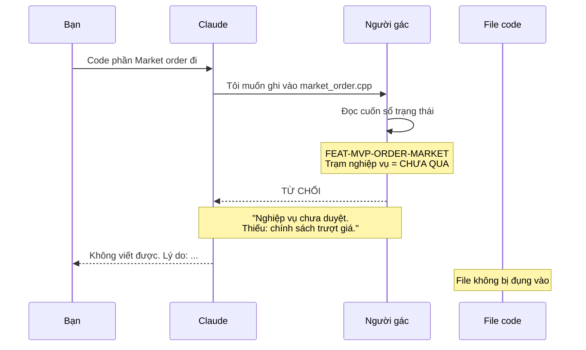
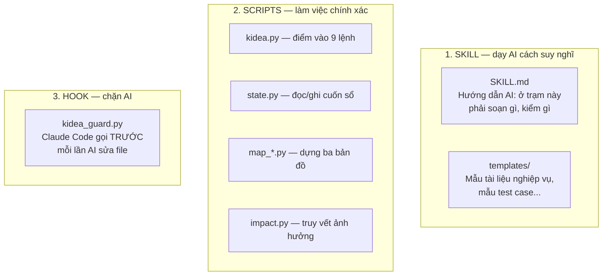
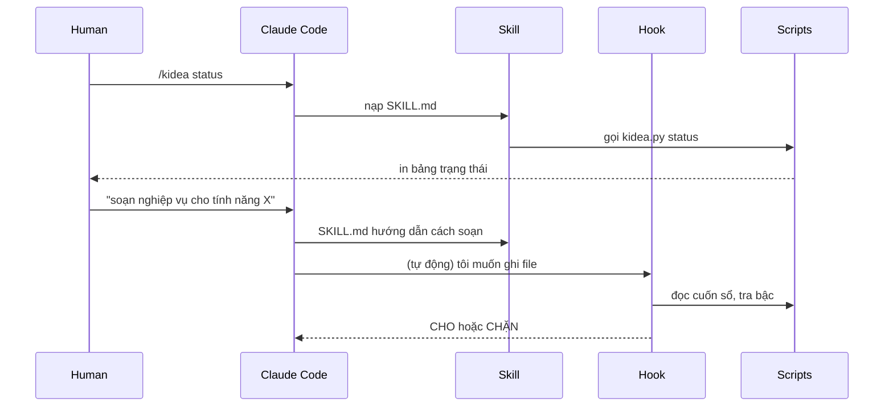
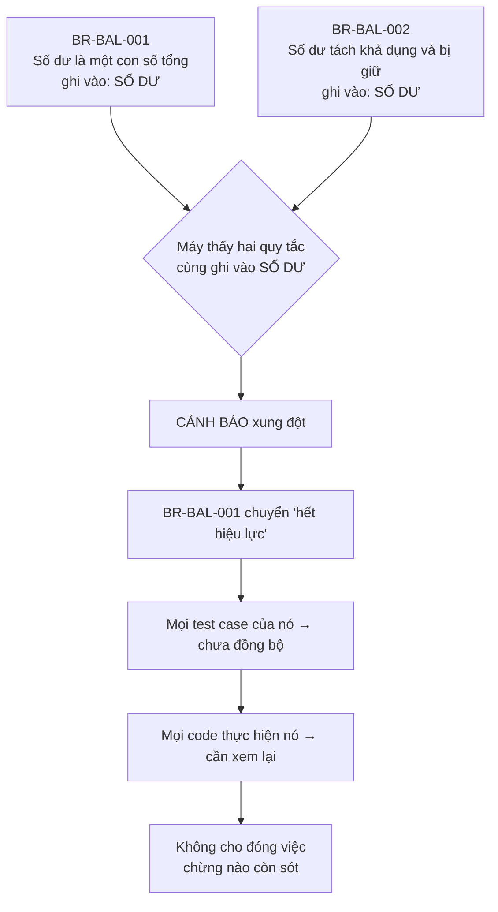
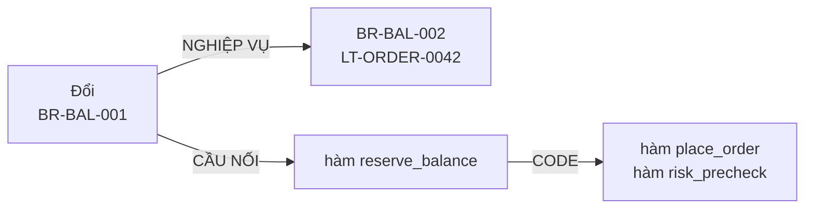
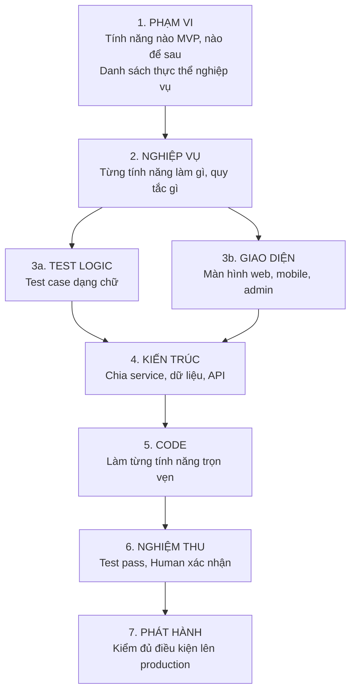
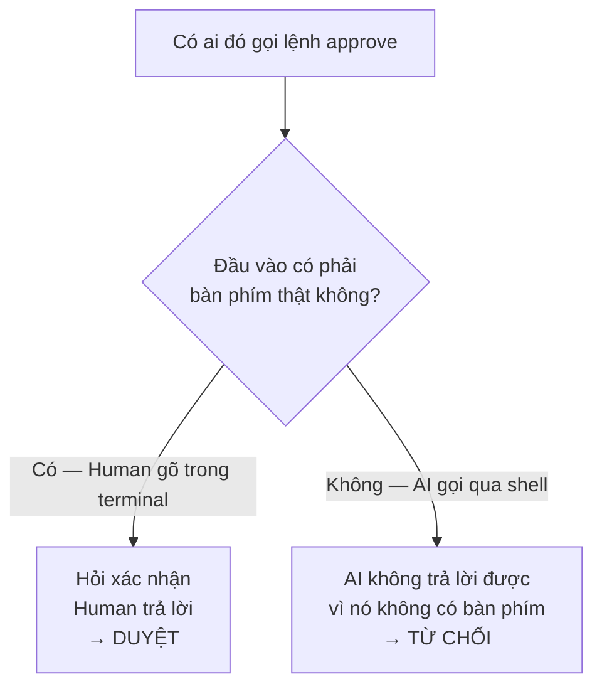
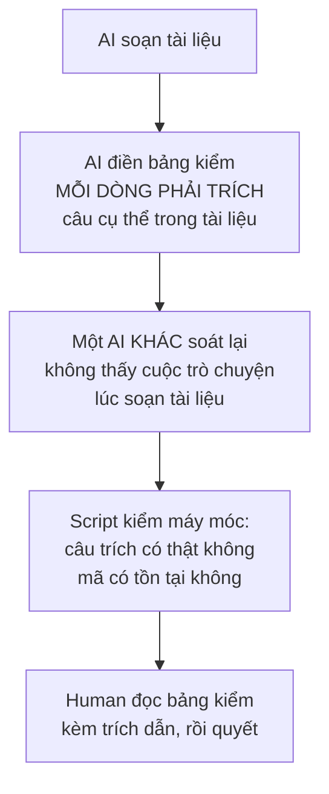

# KIDEA — Bắt đầu từ đây

Cập nhật: 2026-08-29 · Trạng thái: **chờ duyệt**

Đây là tài liệu chính. Đọc hết cái này là đủ để quyết định. Ba tài liệu còn lại chỉ để tra khi cần.

| File | Đọc khi nào | Dài |
|---|---|---|
| **`00-BAT-DAU-TU-DAY.md`** ← bạn đang đọc | Luôn. Đọc để duyệt | ~15 phút |
| `01-BO-MAY.md` | Khi muốn kiểm tra một cơ chế cụ thể | Tra cứu |
| `02-CONG-VIEC-TUNG-TRAM.md` | Khi muốn kiểm tra AI phải làm gì ở mỗi bước | Tra cứu |
| `03-vi-sao-thiet-ke-nhu-vay.md` | Khi thắc mắc "sao không làm cách khác" | Lịch sử |

---

## 1. kidea là gì

Một bộ công cụ chạy trong Claude Code, đặt **trạm kiểm tra** giữa ý tưởng và code.

Nó chặn hai thứ:

| Chặn cái gì | Bằng cách nào |
|---|---|
| AI viết code khi nghiệp vụ chưa rõ | Một script chặn thao tác ghi file, chạy trước mỗi lần AI định sửa |
| AI sửa một chỗ mà bỏ sót các chỗ liên quan | Ba tấm bản đồ ghi cái gì liên quan cái gì |

kidea **không** giúp AI viết code giỏi hơn. Nó chỉ đảm bảo AI làm đúng thứ tự và không bỏ sót.

---

## 2. Một ngày làm việc

Phần này quan trọng nhất. Đọc kỹ phần này là hiểu được kidea.

### Ngày 1 — nhập tài liệu từ ChatGPT

```text
$ /kidea init ../chatgpt-san-crypto

Đã đọc 14 file tài liệu.
Tìm thấy 12 tính năng:  MVP 8 · Future 3 · Idea 1
Tìm thấy 5 thực thể nghiệp vụ: Số dư, Lệnh, Sổ lệnh, Giao dịch, Tài khoản

Kiểm tra nghiệp vụ 8 tính năng MVP:
  5 tính năng — tài liệu đủ rõ
  3 tính năng — THIẾU THÔNG TIN

TRẠM NGHIỆP VỤ CHƯA QUA. Chưa được sang bước sau.
Gõ /kidea status để xem thiếu gì.
```

```text
$ /kidea status

FEAT-MVP-ORDER-MARKET — Đặt lệnh Market
  Thiếu 1: Thanh khoản không đủ thì xử lý thế nào?
  Thiếu 2: Có cho phép khớp một phần không?
  Thiếu 3: Giới hạn trượt giá bao nhiêu?

  Tôi đề xuất:
    1. Khớp được bao nhiêu thì khớp, phần còn lại huỷ
    2. Có, cho phép khớp một phần
    3. Cho người dùng tự đặt mức trượt giá tối đa

  ĐÂY LÀ ĐỀ XUẤT, KHÔNG PHẢI QUYẾT ĐỊNH. Bạn chốt.
```

Bạn trả lời trong chat. AI cập nhật tài liệu. Khi bạn thấy ổn:

```text
$ /kidea approve requirements FEAT-MVP-ORDER-MARKET
```

Lệnh này **chỉ bạn gõ được**. AI không có cách nào tự duyệt cho mình — lý do ở mục 7.

### Ngày 5 — bạn sốt ruột, và kidea chặn bạn lại

Còn một tính năng chưa duyệt xong, nhưng bạn bảo AI:

> "Thôi code luôn phần đặt lệnh Market đi"



Kể cả AI *muốn* nghe lời bạn, nó cũng không làm được. Người gác là một script riêng, không phải AI.

Muốn đi tiếp thì bạn phải duyệt chính thức — tức là **nhìn vào cái mình đang bỏ qua** trước khi bỏ qua nó.

### Ngày 30 — bạn đổi một quy tắc nghiệp vụ

Đây là ví dụ bạn đưa ra: trước sàn chỉ có lệnh Market nên số dư chỉ cần một con số tổng. Giờ thêm lệnh Limit thì phải tách thành số dư khả dụng và số dư bị giữ.

```text
$ /kidea impact BR-BAL-001

Sửa BR-BAL-001 sẽ ảnh hưởng:

  QUY TẮC KHÁC     BR-BAL-002 — cùng ghi vào "Số dư"
                   BR-ORDER-007 — phụ thuộc BR-BAL-001

  TEST CASE        5 case: LT-ORDER-0042, 0043, 0051, 0052, 0067

  CODE             3 file
                     src/balance/reserve.cpp
                     src/order/place_order.cpp
                     src/risk/precheck.cpp

  HÀM GỌI TỚI      order::submit, risk::validate, admin::adjust_balance

  MÀN HÌNH         2: Web đặt lệnh, Admin xem số dư

  Approval sẽ bị thu hồi: nghiệp vụ, test, kiến trúc
```

Đây là câu trả lời của một cái máy đọc từ ba tấm bản đồ, **không phải trí nhớ của AI**. Nên nó không bịa.

Sau khi bạn sửa, kidea đánh dấu 16 thứ trên là "chưa đồng bộ", và **không cho đóng việc** chừng nào còn sót.

---

## 3. Skill kidea gồm những gì

Bạn hỏi "Kidea skill thiết kế như nào". Đây là câu trả lời.

### Ba nhóm file



**Vì sao chia ba?** Vì ba loại việc khác nhau:

| Nhóm | Làm việc gì | Sai thì sao |
|---|---|---|
| SKILL | Việc cần hiểu ý nghĩa: soạn nghiệp vụ, tìm lỗ hổng | Sai thì tài liệu kém, Human phát hiện được khi review |
| SCRIPTS | Việc cần chính xác tuyệt đối: đếm, so sánh, băm | **Không được sai.** Nên viết thành code, không giao cho AI |
| HOOK | Chặn hoặc cho | **Không được sai.** Và phải chạy ngoài tầm với của AI |

Đây là nguyên tắc gốc:

> **Luật nào quan trọng thì viết thành script, không viết thành lời dặn trong prompt.**

### Chạy lúc nào



Hook chạy **tự động, không ai gọi nó**. Claude Code gọi nó trước mỗi thao tác ghi file. Đó là lý do AI không lách được.

### Cài ở đâu

| Cái gì | Ở đâu | Vì sao |
|---|---|---|
| Skill + scripts | `~/.claude/skills/kidea/` | Dùng chung cho mọi project |
| Hook | Trong từng project: `.claude/hooks/` | Commit cùng project, ai clone về cũng bị gác |
| Cuốn sổ, ba bản đồ | Trong từng project: `.kidea/` | Trạng thái thuộc về project, không thuộc về máy bạn |

---

## 4. Ba tấm bản đồ

Bạn yêu cầu ba tấm. Đây là ba tấm đó.

| Tên | Trả lời câu hỏi | Ai tạo ra |
|---|---|---|
| **NGHIỆP VỤ** | *Đổi luật này thì luật nào lung lay?* | AI viết khi soạn tài liệu, Human duyệt |
| **CODE** | *Sửa hàm này thì ai gọi nó?* | Máy tự đọc source, không ai can thiệp |
| **CẦU NỐI** | *Luật này nằm ở đoạn code nào?* | AI viết chú thích khi nó code |

### Bản đồ NGHIỆP VỤ — chỗ khó nhất

Vấn đề nó giải chính là ví dụ của bạn: **thêm lệnh Limit làm hỏng quy tắc số dư đã có**. Làm sao máy phát hiện?

Chìa khoá là một khái niệm gọi là **thực thể nghiệp vụ**. Đó là *danh từ* mà nhiều quy tắc cùng động vào: Số dư, Lệnh, Sổ lệnh, Tài khoản.

> Hai quy tắc **không biết gì về nhau**. Nhưng nếu chúng **cùng ghi vào một thực thể** thì chúng liên quan tới nhau.

Cụ thể:



**Điểm hay nhất:** kể cả khi AI quên khai *"quy tắc mới thay thế quy tắc cũ"*, luật *"hai quy tắc cùng ghi một thực thể"* vẫn bắt được. Đó là **lưới an toàn khi AI khai thiếu**.

Danh sách thực thể được chốt sớm, ngay ở trạm đầu tiên, và **bạn duyệt**. Sau đó máy từ chối mọi thực thể lạ. Muốn thêm thì phải quay lại trạm đầu, và bạn nhìn thấy.

### Ba tấm nối lại



Một lệnh `/kidea impact` đi hết cả ba.

---

## 5. Bảy trạm



Mỗi trạm, Human phải gõ `/kidea approve` mới đi tiếp. **AI không tự chuyển trạm.**

Trạm 3a và 3b chạy song song, cả hai xong mới sang trạm 4.

### Một điểm quan trọng về trạm 5

Từ trạm 1 đến 4 là **cả project cùng đi**. Phải xong nghiệp vụ của mọi tính năng MVP mới được thiết kế kiến trúc — vì kiến trúc cắt ngang mọi tính năng, thiết kế khi còn nửa nghiệp vụ chưa rõ là thiết kế sai.

Từ trạm 5 trở đi là **từng tính năng đi riêng**. Xong kiến trúc rồi thì tính năng A code được ngay, không phải chờ tính năng B.

---

## 6. Chín lệnh

| Lệnh | Làm gì |
|---|---|
| `/kidea init <đường-dẫn>` | Tạo project mới từ bộ tài liệu ChatGPT |
| `/kidea init` | Mở lại project cũ, khôi phục toàn bộ ngữ cảnh |
| `/kidea status` | Đang ở trạm nào, kẹt cái gì, làm gì tiếp |
| `/kidea check` | Soát toàn bộ: ID có thật không, tài liệu có lệch không |
| `/kidea index` | Vẽ lại ba tấm bản đồ |
| `/kidea approve <trạm>` | **Chỉ Human gõ.** Duyệt một trạm |
| `/kidea impact <mã>` | Sửa cái này thì ảnh hưởng đâu |
| `/kidea change <loại>` | Mở một việc: sửa bug, thêm tính năng, refactor... |
| `/kidea slice <tính-năng>` | Làm trọn một tính năng từ thiết kế tới code |
| `/kidea adopt` | Kéo một project cũ vào kidea |

---

## 7. Ai được làm gì

Bảng này là xương sống của cả thiết kế.

| Việc | Human | AI | Máy |
|---|:---:|:---:|:---:|
| Quyết định nghiệp vụ | **Quyết** | Đề xuất | — |
| Duyệt một trạm | **Chỉ Human** | Không được | Kiểm điều kiện |
| Soạn tài liệu nghiệp vụ | Đọc, sửa | **Viết** | — |
| Viết code | Đọc nếu muốn | **Viết** | — |
| Viết test | Đọc nếu muốn | **Viết** | — |
| Vẽ bản đồ CODE | — | — | **Máy đọc source** |
| Vẽ bản đồ NGHIỆP VỤ | Duyệt | **Khai** | Kiểm chéo |
| Chặn thao tác sai | — | Không được lách | **Hook** |
| Đối chiếu, đếm, băm | — | — | **Script** |

### "Chỉ Human mới duyệt" — ép bằng cách nào

AI chạy được lệnh shell, nên về lý thuyết nó có thể tự gõ lệnh duyệt cho mình. Đây là cơ chế chặn:



Công cụ shell mà AI dùng chạy **không có terminal thật**. Lệnh `approve` hỏi một câu xác nhận và đòi đọc từ terminal — AI không có cách nào trả lời.

Cơ chế này không dựa vào việc AI có chịu nghe lời hay không.

### Chống AI tự chấm điểm cho mình

AI có động cơ tự nhiên là muốn qua trạm. Để nó vừa viết vừa tự chấm thì nó sẽ tick hết ô cho xong. Bốn lớp chống:



Lớp 2 quan trọng: **người soát không phải người soạn**. Nó chạy trong một phiên riêng, không thấy lịch sử, nhiệm vụ là tìm lỗ hổng chứ không phải bảo vệ bài của mình.

---

## 8. Bạn cần duyệt gì

Năm điểm. Bốn điểm đầu chỉ cần gật hoặc lắc. Điểm 5 cần bạn nghĩ.

### Điểm 1 — Ba tấm bản đồ, và khái niệm "thực thể nghiệp vụ"

Ba tấm là ý bạn. Nhưng **"thực thể nghiệp vụ" là thứ tôi thêm vào** — nó không có trong yêu cầu gốc của bạn.

Tôi thêm vì không có nó thì bản đồ NGHIỆP VỤ chỉ biết những gì AI khai trực tiếp. Có nó thì máy bắt được cả trường hợp AI khai thiếu.

**Duyệt:** đồng ý thêm khái niệm này không?

### Điểm 2 — Bảy trạm ở mục 5

Đúng thứ tự chưa? Có trạm nào thừa? Có bước nào trong quy trình làm phần mềm mà tôi bỏ sót?

**Duyệt:** bảy trạm này đủ và đúng thứ tự chưa?

### Điểm 3 — Chín lệnh ở mục 6

**Duyệt:** thừa lệnh nào, thiếu lệnh nào?

### Điểm 4 — Bảng phân quyền ở mục 7

Đây là chỗ định nghĩa "Human làm gì, AI làm gì".

**Duyệt:** có ô nào bạn muốn đổi không? Ví dụ có việc nào bạn muốn tự làm mà tôi đang giao cho AI, hoặc ngược lại?

### Điểm 5 — Bảng kiểm 21 dòng ở trạm NGHIỆP VỤ

Đây là điểm cần bạn nghĩ, và là điểm quan trọng nhất.

**Bảng kiểm này định nghĩa "thế nào là nghiệp vụ đủ rõ".** Mỗi dòng là một câu hỏi mà tài liệu nghiệp vụ phải trả lời được. Thiếu một dòng nào là AI được phép đi tiếp trong khi thực ra chưa đủ.

| # | Mục | | # | Mục |
|:--:|---|---|:--:|---|
| 1 | Mục tiêu — tính năng này giải quyết vấn đề gì | | 12 | Quyền hạn — ai được làm gì |
| 2 | Actor — ai dùng | | 13 | Trường hợp lỗi và cách xử lý |
| 3 | Điều kiện trước khi thực hiện | | 14 | Đồng thời — hai request cùng lúc |
| 4 | Đầu vào, đầu ra | | 15 | Trùng lặp, gửi lại, timeout |
| 5 | Luồng chính | | 16 | Giới hạn min/max, độ chính xác số |
| 6 | Luồng thay thế | | 17 | Trường hợp biên |
| 7 | Kiểm tra dữ liệu vào | | 18 | Phụ thuộc tính năng khác, hệ thống ngoài |
| 8 | Quy tắc nghiệp vụ | | 19 | Ghi vết — cần lưu lại gì |
| 9 | Máy trạng thái | | 20 | Tiêu chí nghiệm thu |
| 10 | Bất biến — điều luôn phải đúng | | 21 | Câu hỏi còn mở |
| 11 | Thực thể nào bị đọc, bị ghi | | | |

Ví dụ nó chặn được gì: tài liệu chỉ viết *"Người dùng nhập giá và số lượng rồi gửi lệnh"* thì bảng kiểm bật ra hàng loạt câu chưa trả lời — số dư kiểm lúc nào (dòng 3), có bị giữ không (dòng 8), hai request trùng mã thì sao (dòng 15), timeout nhưng lệnh đã tạo thật thì retry thế nào (dòng 15).

Với tính năng dính tiền, bốn dòng là **bắt buộc, không được bỏ qua**: dòng 14, 15, 16, 19.

**Duyệt:** bảng này thiếu gì không? Bạn làm sàn giao dịch, bạn biết chỗ nào hay sập.

---

## 9. Duyệt xong thì tôi làm gì

| # | Tôi viết gì | Xong thì bạn **tự tay thử** được |
|:---:|---|---|
| 1 | Cuốn sổ trạng thái + bộ test | Chưa gì. Nền móng |
| 2 | **Người gác + hook** | **Bảo AI "code đi" khi trạm chưa qua, xem nó bị chặn** |
| 3 | `init` + `status` | Đưa tài liệu ChatGPT thật vào, xem báo cáo thiếu gì |
| 4 | `check` + `approve` | Duyệt một trạm, sửa tài liệu, xem approval bị thu hồi |
| 5 | **Bản đồ NGHIỆP VỤ + `impact`** | **Hỏi "đổi quy tắc số dư thì quy tắc nào liên quan"** |
| 6 | Bản đồ CODE + CẦU NỐI | Hỏi "đổi quy tắc này thì code nào phải sửa" |
| 7 | `change` | Mở việc sửa, xem không cho đóng khi còn sót |
| 8 | `slice` | Làm trọn một tính năng |
| 9 | `adopt` | Kéo project cũ vào |

Sau **bước 2** bạn đã thử được thứ quan trọng nhất. Sau **bước 5** bạn thử được đúng cái bạn yêu cầu ở ba tấm bản đồ.

Nếu thiết kế của tôi sai, hai mốc đó là lúc phát hiện — khi mới mất vài ngày, không phải vài tuần.
