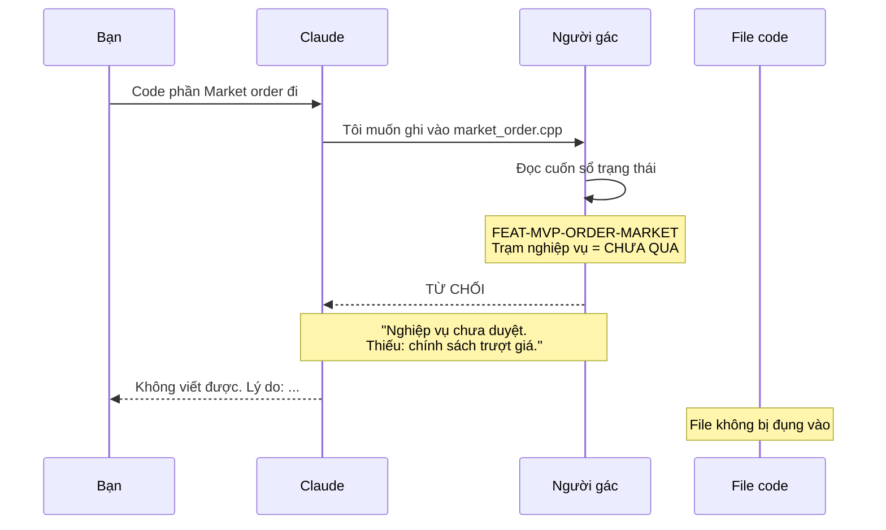
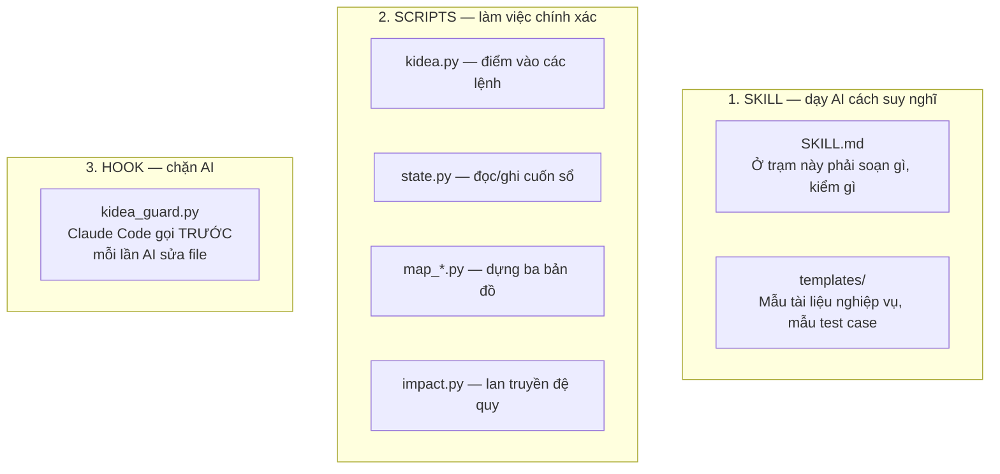
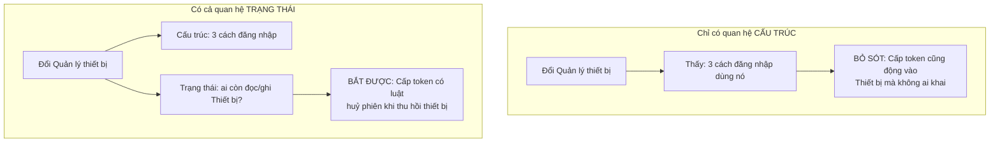
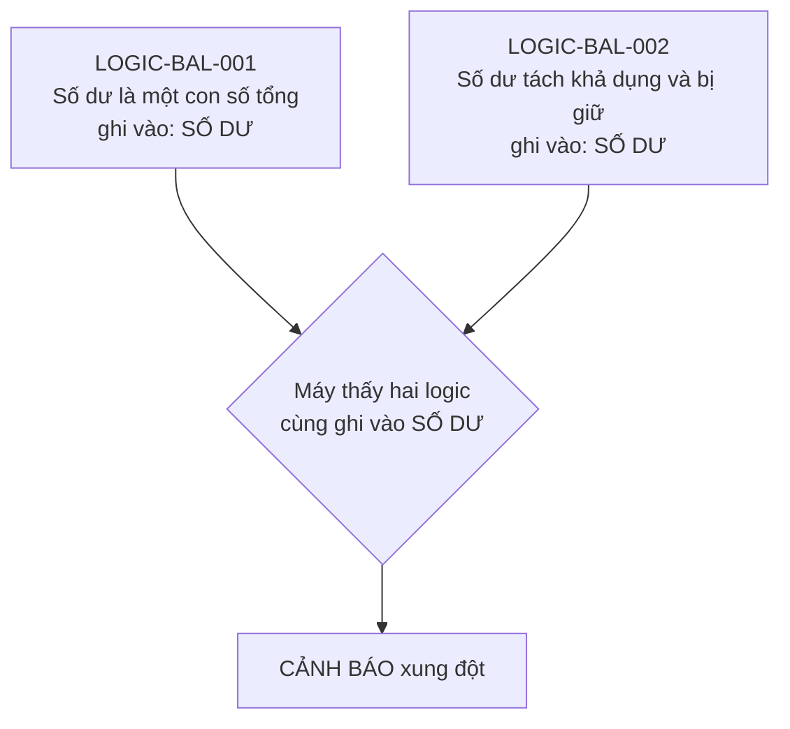
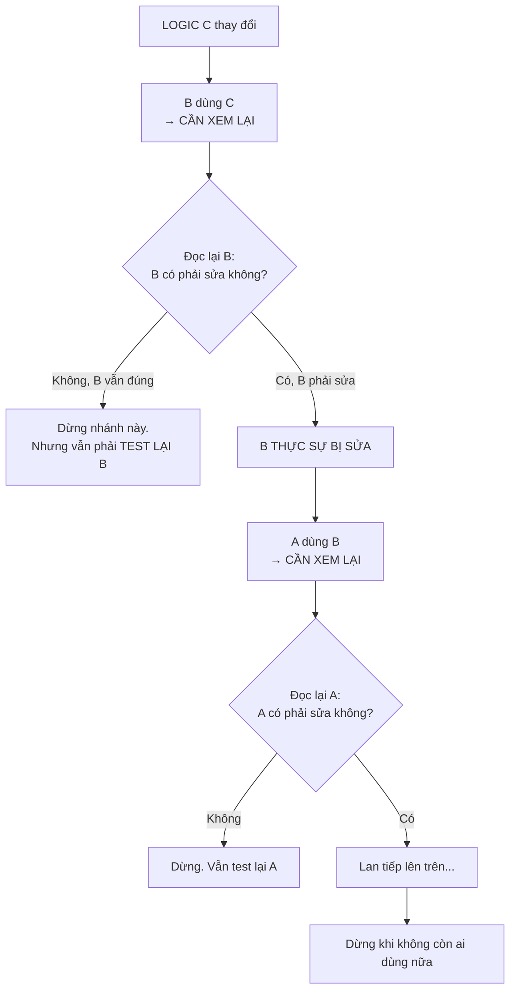
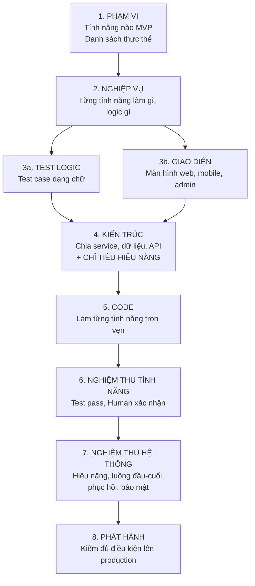
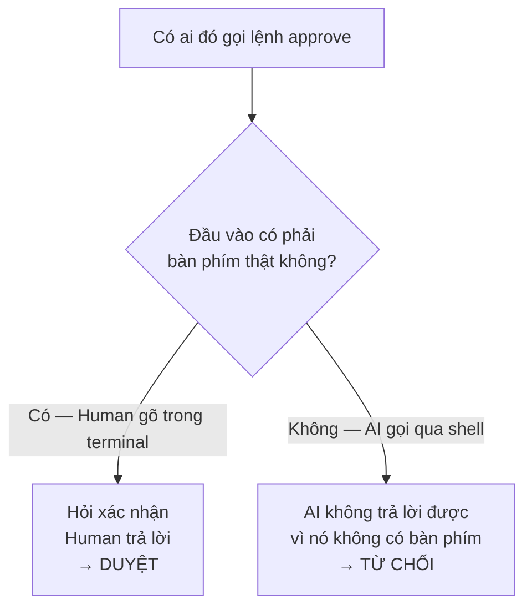
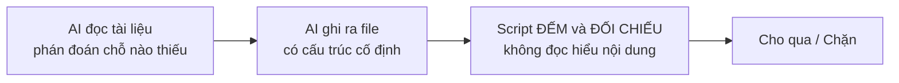
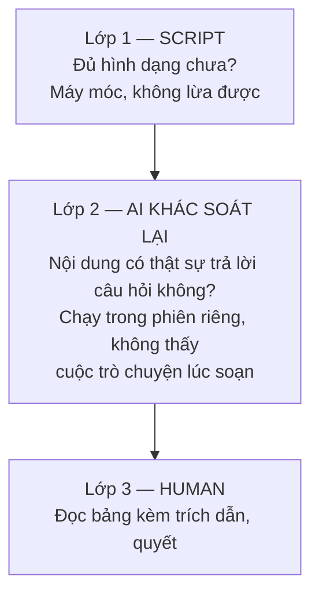

# KIDEA — Bắt đầu từ đây

Cập nhật: 2026-08-30 · Trạng thái: **chờ duyệt**

Đây là tài liệu chính. Đọc file này và `04-BAN-DO-NGHIEP-VU.md` là đủ để quyết định. Ba file còn lại chỉ để tra khi cần.

| File | Đọc khi nào |
|---|---|
| **`00-BAT-DAU-TU-DAY.md`** ← bạn đang đọc | Luôn. Đọc để duyệt |
| `01-BO-MAY.md` | Khi muốn kiểm tra một cơ chế cụ thể |
| `02-CONG-VIEC-TUNG-TRAM.md` | Khi muốn kiểm tra AI phải làm gì ở mỗi bước |
| **`04-BAN-DO-NGHIEP-VU.md`** | **Cách ghi nghiệp vụ thành bản đồ máy đọc được. Đọc cùng file này** |
| **`05-CAC-LOAI-THAY-DOI.md`** | **14 loại thay đổi thực tế, và ngành xử lý ra sao** |
| `03-vi-sao-thiet-ke-nhu-vay.md` | Khi thắc mắc "sao không làm cách khác" |

---

## 0. Mục tiêu

Bằng chính lời Human, buổi đầu tiên:

> *"Tạo ra một bộ Skill/flow để Human + AI có thể biến ý tưởng thành bản MVP, sau đó phát triển tiếp các tính năng chờ để thành sản phẩm hoàn chỉnh."*

Đây mới là mục tiêu. **Đi trọn con đường từ ý tưởng tới sản phẩm chạy thật trên production, và tiếp tục phát triển sau đó.**

Vì sao cần:

> *"Trong thời đại AI, nếu ta không có quy trình thì với một project lớn, ta sẽ rất khó control."*
> *"Cách tôi tận dụng AI chưa tốt, nó chưa theo một khung nào cả nên nó làm tôi khó control."*

### Hai cơ chế giữ cho con đường không đi chệch

Đây là **cách làm**, không phải mục tiêu:

**Một — AI không được nhảy cóc.** Không viết code khi nghiệp vụ chưa rõ, không tự nói "xong rồi", không tự duyệt cho chính mình. Chặn bằng script chạy tự động, không bằng lời dặn trong prompt.

**Hai — sửa gì cũng phải làm đến cùng.** Sửa một luật thì biết ngay chỗ nào phải sửa theo, chỗ nào phải test lại. Trả lời bằng cách tra bản đồ, không bằng trí nhớ AI.

**Và thứ làm cho cả hai chạy được:** trạng thái nằm trong repo, không nằm trong trí nhớ phiên chat.

---

## 0b. Toàn bộ con đường Human đã vạch ra

Đây là phạm vi thật, lấy từ hai buổi đầu. Không cắt bớt.

| # | Bước | Human nói gì |
|:--:|---|---|
| 1 | Nhập tài liệu ChatGPT | Phân MVP / Future / Idea. **Kèm: cái nào web, cái nào mobile, cái nào dashboard** |
| 2 | Soát nghiệp vụ MVP | Còn một tính năng chưa rõ là chặn cả flow |
| 3 | Sinh logical test | Dạng chữ, cực chi tiết, phủ cả case biên và hiếm gặp |
| 4 | Human review test | Bàn tới khi đạt mới đi tiếp |
| 5 | **Nhập thiết kế giao diện** | AI ngoài vẽ web/mobile/dashboard. **Kèm test mô tả giao diện, hiệu ứng, action** |
| 6 | **Thiết kế hệ thống** | Cụm logic → service/module → input/output → giao tiếp → tech stack → lưu trữ/backup/monitoring → HA/replicate → OS/RAM/CPU/DB → flow web-mobile → req/res → swagger |
| 7 | **Bảng service ↔ nghiệp vụ** | Từ đó sinh test riêng từng service, test tích hợp, test full luồng, test từ client |
| 8 | **Setup môi trường DEV** | CPU/RAM/DB/máy chủ. Ghi lại quy trình. CI/CD hoặc GitOps |
| 9 | Code backend | Theo đặc tả đã chốt. Viết test. Pass hết → Human verify → deploy DEV |
| 10 | **Code dashboard** | *"Quan trọng hơn nhiều phần khác vì nó phải là nơi chính xác nhất, trung thực nhất"* |
| 11 | Code web/mobile | Test giao diện, màn hình, hiệu ứng, tích hợp → Human verify → deploy DEV |
| 12 | **DEV lên PROD** | *"Thứ tôi còn phân vân chưa biết làm thế nào"* |
| 13 | **Vòng đời sau MVP** | Thêm tính năng, update, bug, chuyển idea thành tính năng |
| 14 | **TDD đặt ở đâu** | Test nào trước code, test nào sau, tuỳ backend/dashboard/web/mobile |

Bảy chỗ in đậm là chỗ Human **nói rõ là chưa có kinh nghiệm và cần tư vấn**.

---

## 1. kidea là gì

Một bộ công cụ chạy trong Claude Code, đặt **trạm kiểm tra** giữa ý tưởng và code.

Nó chặn hai thứ:

| Chặn cái gì | Bằng cách nào |
|---|---|
| AI viết code khi nghiệp vụ chưa rõ | Một script chặn thao tác ghi file, chạy trước mỗi lần AI định sửa |
| AI sửa một chỗ mà bỏ sót các chỗ liên quan | Ba tấm bản đồ, cộng luật lan truyền đệ quy |

kidea **không** giúp AI viết code giỏi hơn. Nó chỉ đảm bảo AI làm đúng thứ tự và không bỏ sót.

---

## 2. Một ngày làm việc

Phần này quan trọng nhất. Đọc kỹ phần này là hiểu được kidea.

### Ngày 1 — nhập tài liệu từ ChatGPT

```text
$ /kidea init ../chatgpt-san-crypto

Đã đọc 14 file tài liệu.
Tìm thấy 12 tính năng:  MVP 8 · Future 3 · Idea 1
Đề xuất 5 thực thể nghiệp vụ: Số dư, Lệnh, Sổ lệnh, Giao dịch, Tài khoản

Kiểm tra nghiệp vụ 8 tính năng MVP:
  5 tính năng — tài liệu đủ rõ
  3 tính năng — THIẾU THÔNG TIN

TRẠM NGHIỆP VỤ CHƯA QUA. Chưa được sang bước sau.
Gõ /kidea status để xem thiếu gì.
```

```text
$ /kidea status

FEAT-MVP-ORDER-MARKET — Đặt lệnh Market
  Thiếu 1: Thanh khoản không đủ thì xử lý thế nào?
  Thiếu 2: Có cho phép khớp một phần không?
  Thiếu 3: Giới hạn trượt giá bao nhiêu?

  Tôi đề xuất:
    1. Khớp được bao nhiêu thì khớp, phần còn lại huỷ
    2. Có, cho phép khớp một phần
    3. Cho người dùng tự đặt mức trượt giá tối đa

  ĐÂY LÀ ĐỀ XUẤT, KHÔNG PHẢI QUYẾT ĐỊNH. Bạn chốt.
```

Bạn trả lời trong chat. AI cập nhật tài liệu. Khi bạn thấy ổn:

```text
$ /kidea approve requirements FEAT-MVP-ORDER-MARKET
```

Lệnh này **chỉ bạn gõ được**. AI không có cách nào tự duyệt cho mình — lý do ở mục 9.

### Ngày 5 — bạn sốt ruột, và kidea chặn bạn lại

Còn một tính năng chưa duyệt xong, nhưng bạn bảo AI:

> "Thôi code luôn phần đặt lệnh Market đi"



Kể cả AI *muốn* nghe lời bạn, nó cũng không làm được. Người gác là một script riêng, không phải AI.

### Ngày 30 — bạn đổi một quy tắc nghiệp vụ

```text
$ /kidea impact LOGIC-BAL-001

Sửa LOGIC-BAL-001 sẽ ảnh hưởng:

  LOGIC KHÁC       LOGIC-BAL-002 — cùng ghi vào "Số dư"
                   LOGIC-ORDER-007 — dùng LOGIC-BAL-001

  TÍNH NĂNG        FEAT-MVP-ORDER-LIMIT, FEAT-MVP-ORDER-MARKET
                   FEAT-MVP-WITHDRAW  ← lan gián tiếp qua LOGIC-ORDER-007

  TEST CASE        5 case: LT-ORDER-0042, 0043, 0051, 0052, 0067

  CODE             src/balance/reserve.cpp
                   src/order/place_order.cpp
                   src/risk/precheck.cpp

  HÀM GỌI TỚI      order::submit, risk::validate, admin::adjust_balance

  Approval sẽ bị thu hồi: nghiệp vụ, test, kiến trúc
```

Đây là câu trả lời của một cái máy đọc từ ba tấm bản đồ, **không phải trí nhớ của AI**. Nên nó không bịa.

---

## 3. Skill kidea gồm những gì

### Ba nhóm file



| Nhóm | Làm việc gì | Sai thì sao |
|---|---|---|
| SKILL | Việc cần hiểu ý nghĩa: soạn nghiệp vụ, tìm lỗ hổng | Tài liệu kém, Human review thấy được |
| SCRIPTS | Việc cần chính xác tuyệt đối: đếm, so sánh, băm | **Không được sai.** Nên viết thành code |
| HOOK | Chặn hoặc cho | **Không được sai**, và phải chạy ngoài tầm với của AI |

> **Luật nào quan trọng thì viết thành script, không viết thành lời dặn trong prompt.**

### Cài ở đâu

| Cái gì | Ở đâu | Vì sao |
|---|---|---|
| Skill + scripts | `~/.claude/skills/kidea/` | Dùng chung cho mọi project |
| Hook | Trong project: `.claude/hooks/` | Commit cùng project, ai clone về cũng bị gác |
| Cuốn sổ, ba bản đồ | Trong project: `.kidea/` | Trạng thái thuộc về project |

---

## 4. Năm loại mảnh ghép nghiệp vụ

Chi tiết đầy đủ ở [`04-BAN-DO-NGHIEP-VU.md`](04-BAN-DO-NGHIEP-VU.md). Tóm tắt:

| Loại | Mã | Là gì | Ví dụ |
|---|---|---|---|
| **Miền** | `DOM-*` | Vùng lớn, thuần gom nhóm | Đăng nhập và Tài khoản |
| **Tính năng** | `FEAT-*` | Thứ người dùng gọi tên được, đòi được | Đăng nhập bằng Google |
| **Năng lực** | `CAP-*` | Việc dùng chung, không ai đòi nhưng nhiều tính năng cần | Quản lý thiết bị |
| **Luật** | `LOGIC-*` | Phát biểu nguyên tử, **kiểm được đúng/sai** | Tối đa 5 thiết bị hoạt động |
| **Thực thể** | `ENT-*` | Thứ có trạng thái, sống qua nhiều request | Thiết bị · Số dư |

### Thế nào là đơn vị nhỏ nhất — phép thử, không phải cảm tính

> **Một mảnh là Luật khi bạn viết được một test trả lời đúng/sai cho riêng nó.**

"Tối đa 5 thiết bị" — thêm cái thứ 6 phải bị từ chối, test được → là Luật.
"Quản lý thiết bị an toàn" — không test được → chưa phải luật, còn phải chẻ.

### Hai loại quan hệ, và vì sao cần cả hai



> **Cấu trúc cho biết bạn *nghĩ* cái gì liên quan. Trạng thái cho biết cái gì *thực sự* liên quan.**

---

## 5. Ba tấm bản đồ

| Tên | Trả lời câu hỏi | Ai tạo ra |
|---|---|---|
| **NGHIỆP VỤ** | *Đổi logic này thì logic nào lung lay?* | AI viết khi soạn tài liệu, Human duyệt |
| **CODE** | *Sửa hàm này thì ai gọi nó?* | Máy tự đọc source, không ai can thiệp |
| **CẦU NỐI** | *Logic này nằm ở đoạn code nào?* | AI viết chú thích khi nó code |

Bản đồ NGHIỆP VỤ chứa năm loại mảnh ghép ở mục 4, cùng hai loại cạnh: cấu trúc (`gồm` / `dùng`) và trạng thái (`làm chủ` / `đọc` / `ghi`).

### Vì sao thực thể là lưới an toàn



Kể cả khi AI **quên khai** "logic mới thay logic cũ", luật *"hai logic cùng ghi một thực thể"* vẫn bắt được.

---

## 6. Khi có thay đổi thì làm gì

Đây là phần bạn mô tả kỹ nhất. Tôi nêu lại thành quy trình.

### Bước 1 — cái mới có thực sự mới không

Trước khi thêm bất cứ tính năng hay logic nào:

```text
$ /kidea change feature "Đặt lệnh Stop Limit"

So với 12 tính năng đang có:

  GẦN NHẤT   FEAT-MVP-ORDER-LIMIT — Đặt lệnh Limit
             Giống : cùng actor, cùng ghi ENT Lệnh và ENT Số dư,
                     cùng dùng LOGIC-BAL-002
             Khác  : thêm điều kiện kích hoạt theo giá

  Tôi nghiêng về: KHÔNG phải tính năng mới.
                  Nên tách FEAT-MVP-ORDER-LIMIT thành:
                    - LOGIC chung: đặt lệnh có giá
                    - LOGIC riêng: điều kiện kích hoạt

  BẠN CHỐT: mới hoàn toàn / biến thể của cái cũ / thay thế cái cũ
```

**AI phân tích, Human chốt.** Không cho AI tự quyết, vì quyết sai thì catalog phình ra toàn thứ trùng nhau.

### Bước 2 — khoanh vùng, và lan truyền đệ quy

Đây là phần bạn nhấn mạnh nhất: *"phải đệ quy nhé… chỉ dừng lại khi không còn ai gọi tới nữa"*.

Luật có **hai mức**, và chỉ mức thứ hai mới lan tiếp:

| Mức | Nghĩa | Có lan tiếp không |
|---|---|---|
| **CẦN XEM LẠI** | Thứ này dùng cái vừa đổi. Phải đọc lại và test lại | Chưa |
| **THỰC SỰ BỊ SỬA** | Đọc lại rồi, và nó phải sửa thật | **Có.** Lan tiếp từ nó |



Điểm quan trọng: **nhánh dừng lan truyền vẫn phải test lại.** Không sửa không có nghĩa là không cần kiểm.

Máy làm việc khoanh vùng và không cho quên. Việc *"B có phải sửa không"* thì AI đánh giá và Human chốt.

Luật này áp cho cả ba cấp, và cho cả trường hợp sửa bug — bug cũng chỉ là "một logic đang sai".

### Bước 3 — sau khi sửa xong, có nên gộp hay tách

Bạn nêu ý này và tôi thấy nó giữ cho mô hình không phình:

```text
$ /kidea check

ĐỀ XUẤT DỌN DẸP

  LOGIC-BAL-002 giờ ghi vào 4 thực thể và có 7 nhánh điều kiện.
  → Đề nghị TÁCH thành 2 logic.

  LOGIC-ORDER-011 và LOGIC-ORDER-014 giờ phát biểu gần trùng nhau.
  → Đề nghị GỘP.

  Đây là ĐỀ XUẤT. Bạn chốt. Bỏ qua cũng được.
```

Đây là cảnh báo, **không phải cổng chặn**. Bắt buộc dọn dẹp thì thành phiền nhiễu.

---

## 7. Tám trạm



Mỗi trạm, Human phải gõ `/kidea approve` mới đi tiếp.

Từ trạm 1 đến 4 là **cả project cùng đi** — kiến trúc cắt ngang mọi tính năng, thiết kế khi còn nửa nghiệp vụ chưa rõ là thiết kế sai. Từ trạm 5 là **từng tính năng đi riêng**.

### Trạm 7 — bạn hỏi stress test nằm ở đâu

Trước đó **chưa có**. Bạn đúng, thiếu thật. Giờ nó là trạm 7, và tách làm hai chỗ:

| Ở đâu | Làm gì |
|---|---|
| **Trạm 4 — KIẾN TRÚC** | **Chốt con số mục tiêu.** Bao nhiêu request/giây, độ trễ p99 bao nhiêu, bao nhiêu user đồng thời, chịu được mất gì |
| **Trạm 7 — NGHIỆM THU HỆ THỐNG** | **Chạy thật và so với con số đó** |

Đúng ý bạn: mọi hệ thống đều qua trạm này, chỉ khác con số. Blog cá nhân khai "100 req/s, p99 dưới 500ms" rồi đi tiếp trong năm phút. Sàn crypto khai khắt khe hơn nhiều và mất vài ngày.

**Nhưng `check` từ chối duyệt trạm 4 nếu chưa khai con số.** Không được để trống, vì để trống thì trạm 7 không có gì để so.

Trạm 7 kiểm bốn thứ, đều là thứ **không kiểm được ở mức từng tính năng**:

| Kiểm gì | Vì sao phải ở mức hệ thống |
|---|---|
| Hiệu năng | Thông lượng là tính chất của cả hệ, không phải của một tính năng |
| Luồng đầu-cuối | Đi xuyên nhiều tính năng, nhiều service |
| Phục hồi | Giết một service, mất DB, thử khôi phục backup thật |
| Bảo mật | Quét phụ thuộc, thử vượt quyền |

Ngoài ra ở trạm 6, mỗi tính năng có một phép đo rẻ tiền: *"không được chậm hơn lần trước quá X%"*. Nó bắt được lỗi thô như truy vấn lặp, ngay lúc vừa viết ra.

---

## 8. Chín lệnh

| Lệnh | Làm gì |
|---|---|
| `/kidea init <đường-dẫn>` | Tạo project mới từ bộ tài liệu ChatGPT |
| `/kidea init` | Mở lại project cũ, khôi phục toàn bộ ngữ cảnh |
| `/kidea status` | Đang ở trạm nào, kẹt cái gì, làm gì tiếp |
| `/kidea check` | Soát toàn bộ, kèm đề xuất gộp/tách |
| `/kidea index` | Vẽ lại ba tấm bản đồ |
| `/kidea approve <trạm>` | **Chỉ Human gõ.** Duyệt một trạm |
| `/kidea impact <mã>` | Sửa cái này thì ảnh hưởng đâu, đệ quy |
| `/kidea change <loại>` | Mở một việc: thêm tính năng, sửa bug, refactor… |
| `/kidea slice <tính-năng>` | Làm trọn một tính năng từ thiết kế tới code |
| `/kidea adopt` | Kéo một project cũ vào kidea |

---

## 9. Ai được làm gì

| Việc | Human | AI | Máy |
|---|:---:|:---:|:---:|
| Quyết định nghiệp vụ | **Quyết** | Đề xuất | — |
| Duyệt một trạm | **Chỉ Human** | Không được | Kiểm điều kiện |
| Chốt danh sách thực thể | **Chốt** | Đề xuất | Khoá lại, từ chối cái lạ |
| Quyết "cái này mới hay là biến thể" | **Chốt** | Phân tích, so sánh | Tìm ứng viên giống |
| Quyết "logic này có phải sửa không" | **Chốt** | Đánh giá | Khoanh vùng, không cho quên |
| Quyết "nên gộp hay tách" | **Chốt** | Đề xuất | Phát hiện dấu hiệu |
| Soạn tài liệu nghiệp vụ | Đọc, sửa | **Viết** | — |
| Viết code, viết test | Đọc nếu muốn | **Viết** | — |
| Vẽ bản đồ CODE | — | — | **Máy đọc source** |
| Lan truyền đệ quy | — | — | **Máy** |
| Chặn thao tác sai | — | Không được lách | **Hook** |

### "Chỉ Human mới duyệt" — ép bằng cách nào



Công cụ shell mà AI dùng chạy **không có terminal thật**. Cơ chế này không dựa vào việc AI có chịu nghe lời hay không.

---

## 10. Làm sao script biết còn thiếu cái gì

Bạn tò mò chỗ này. Đây là câu trả lời, và nó đơn giản hơn bạn tưởng.

> **Script không phán đoán ngữ nghĩa. Script chỉ đếm.**

Việc phán đoán "chỗ này thiếu" là của AI. Nhưng AI phải ghi phán đoán đó ra một **file có cấu trúc cố định**. Script đọc file đó và áp luật máy móc.



File AI phải ghi trông như thế này:

```yaml
- muc: 14
  ten: "Đồng thời"
  trang_thai: DA_DIEN
  trich_dan: "FEAT-MVP-ORDER-LIMIT.md § Đồng thời — 'Hai lệnh cùng lúc
              trên một tài khoản: số dư được giữ trong một giao dịch
              nguyên tử, lệnh thứ hai thấy số dư đã trừ.'"
  logic: [LOGIC-BAL-002, INV-BALANCE-001]

- muc: 15
  ten: "Trùng lặp, gửi lại, timeout"
  trang_thai: THIEU
  blocker:
    thieu: "Chưa nói client_order_id trùng thì xử lý ra sao"
    ai_de_xuat: "Trả về lệnh đã tạo trước đó, không tạo lệnh mới"
    human_quyet: null
```

Script áp bốn luật, **không luật nào cần hiểu tiếng Việt**:

| Luật | Cách kiểm |
|---|---|
| Mọi mục bắt buộc phải `DA_DIEN` | Đếm. Còn mục nào `THIEU` thì chặn |
| Mọi `blocker` phải có `human_quyet` khác `null` | Đếm. Còn `null` thì chặn |
| Mọi trích dẫn phải trỏ tới mục có thật trong file có thật | Mở file, tìm tiêu đề, so chuỗi |
| Mọi mã được nhắc phải tồn tại trong bản đồ | Tra bảng |

### Nói thẳng giới hạn

Script phân biệt được **"đã điền đủ hình dạng"** và **"còn trống"**. Nó **không** phân biệt được **"điền hay"** và **"điền dở"**.

AI hoàn toàn có thể viết một mục § Đồng thời chứa một câu vô nghĩa, và script vẫn cho qua vì trích dẫn trỏ đúng chỗ.

Nên phải có ba lớp, script chỉ là lớp đầu:



Lớp 2 quan trọng: **người soát không phải người soạn**. Nó không có động cơ bảo vệ bài viết của mình, vì nó không viết ra bài đó.

---

## 11. Bạn cần duyệt gì

| # | Duyệt gì | Ở mục |
|:--:|---|---|
| 1 | **Năm loại mảnh ghép** và bảy luật chia node | `04-BAN-DO-NGHIEP-VU.md` |
| 2 | **Luồng chốt thực thể**: AI đề xuất → Human chốt → khoá lại | 4 |
| 3 | **Luật lan truyền đệ quy** hai mức, và nhánh dừng vẫn phải test lại | 6 |
| 4 | **Tám trạm**, đặc biệt trạm 7 vừa thêm | 7 |
| 5 | **Bảng phân quyền** | 9 |
| 6 | **Bảng kiểm 21 dòng** ở trạm nghiệp vụ | `02-CONG-VIEC-TUNG-TRAM.md` mục 2 |

Điểm 6 là điểm duy nhất cần bạn nghĩ lâu. Nó định nghĩa "thế nào là nghiệp vụ đủ rõ" — thiếu một dòng là AI được đi tiếp trong khi thực ra chưa đủ.

---

## 12. Duyệt xong thì tôi làm gì

| # | Tôi viết gì | Xong thì bạn **tự tay thử** được |
|:---:|---|---|
| 1 | Cuốn sổ trạng thái + bộ test | Chưa gì. Nền móng |
| 2 | **Người gác + hook** | **Bảo AI "code đi" khi trạm chưa qua, xem nó bị chặn** |
| 3 | `init` + `status` | Đưa tài liệu ChatGPT thật vào, xem báo cáo thiếu gì |
| 4 | `check` + `approve` | Duyệt một trạm, sửa tài liệu, xem approval bị thu hồi |
| 5 | **Bản đồ NGHIỆP VỤ + `impact` đệ quy** | **Đổi một logic, xem máy khoanh vùng tới đâu** |
| 6 | Bản đồ CODE + CẦU NỐI | Hỏi "đổi logic này thì code nào phải sửa" |
| 7 | `change` + kiểm tra trùng lặp | Thêm một tính năng, xem AI tìm ra cái cũ giống nó |
| 8 | `slice` | Làm trọn một tính năng |
| 9 | `adopt` | Kéo project cũ vào |

Bạn nói muốn làm chặt phần quản lý tính năng và nghiệp vụ trước. Đúng ý tôi: **bước 1 đến 7 đều nằm trong phần đó.** Code và deploy chỉ vào ở bước 8.
