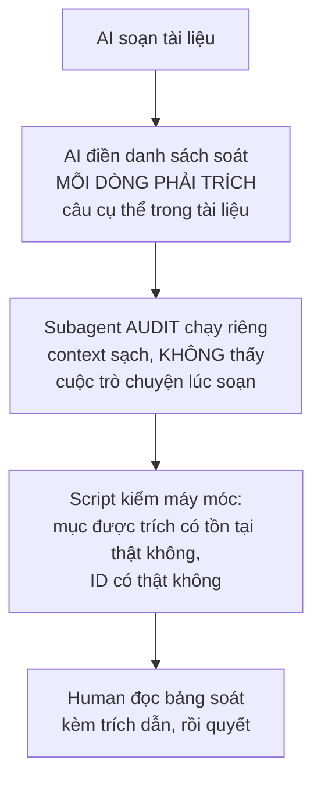
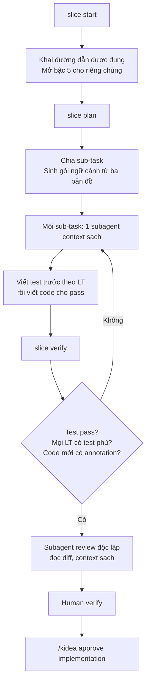

# KIDEA — Công việc ở từng trạm

Trạng thái: **Chờ Human duyệt**
Cập nhật: 2026-08-29
Tài liệu nền: [`01-BO-MAY.md`](01-BO-MAY.md)

`01-BO-MAY.md` đặc tả **bộ máy**: cuốn sổ, người gác, ba bản đồ, chín lệnh. Tài liệu này đặc tả **công việc**: AI thực sự làm gì ở mỗi trạm.

Đây là phần chiếm 90% thời gian chạy thật, và trước đó chưa có dòng nào.

---

## 0. Khung chung — mọi trạm đều có bảy phần này

| Phần | Câu hỏi nó trả lời |
|---|---|
| **Vào** | Cần gì mới được bắt đầu trạm này |
| **AI làm** | Các bước cụ thể AI phải chạy |
| **Ra** | File nào được tạo, theo mẫu nào |
| **Danh sách soát** | Bảng kiểm AI phải điền, từng dòng một |
| **Điều kiện `REVIEWED_OK`** | Khi nào AI được phép nói "tôi thấy ổn" |
| **Human duyệt gì** | Human nhìn vào cái gì để quyết |
| **Mở bậc** | Duyệt xong thì mốc lên mấy |

### Luật chống AI tự chấm điểm mình

Đây là luật quan trọng nhất của cả tài liệu.

AI có động cơ tự nhiên là **muốn qua trạm**. Nếu để nó vừa viết vừa tự chấm, nó sẽ tick hết ô cho xong. Bốn lớp chống:



| Lớp | Chống được gì |
|---|---|
| Bắt trích dẫn, không cho tick suông | Tick bừa. Muốn trích thì phải có nội dung thật |
| Subagent audit context sạch | AI bào chữa cho chính bài của mình. Người soát **không phải** người soạn |
| Script kiểm mục và ID | Trích dẫn bịa, ID không tồn tại |
| Human đọc bảng có trích dẫn | Mọi thứ ba lớp trên bỏ lọt |

Lớp 2 cần nói rõ: **subagent audit không được thấy lịch sử trò chuyện lúc soạn tài liệu.** Nó chỉ nhận tài liệu và danh sách soát, nhiệm vụ là **tìm lỗ hổng**, không phải bảo vệ. Đây là chỗ Claude Code làm được mà Codex không.

---

## 1. Trạm SCOPE — chốt phạm vi

### Vào

`/kidea init <path>` đã chạy xong. Tài liệu gốc nằm trong `docs/source/`.

### AI làm

1. Đọc **toàn bộ** tài liệu nguồn, không lướt.
2. Rút ra danh sách tính năng, phân vào ba nhóm `MVP` / `FUTURE` / `IDEA`.
3. Rút ra danh sách **actor** — ai dùng hệ thống.
4. Rút ra **danh sách `ENT`** — các thực thể nghiệp vụ. *Đây là việc quan trọng nhất của trạm này.*
5. Với mỗi tính năng, xác định chạy trên kênh nào: web khách, mobile khách, admin, API công khai.
6. Đánh mức rủi ro từng tính năng.
7. Ghi nhận chỗ tài liệu nguồn mâu thuẫn nhau, chỗ thiếu.

### Vì sao `ENT` phải chốt ở đây, không để sau

Vì `ENT` là lưới an toàn của bản đồ NGHIỆP VỤ. Nếu để AI đẻ thực thể tuỳ tiện khi soạn nghiệp vụ, nó sẽ gọi cùng một thứ bằng nhiều tên và lưới thủng.

Chốt sớm, Human duyệt, sau đó `check` **từ chối** mọi `ENT` không có trong danh sách. Muốn thêm thì phải quay lại trạm này và Human nhìn thấy.

Danh sách `ENT` nên ở mức **danh từ nghiệp vụ**, không phải bảng cơ sở dữ liệu:

```yaml
entities:
  - id: ENT-BALANCE
    name: "Số dư tài khoản"
    owner_hint: "Balance domain"
  - id: ENT-ORDER
    name: "Lệnh giao dịch"
  - id: ENT-ORDERBOOK
    name: "Sổ lệnh"
  - id: ENT-TRADE
    name: "Giao dịch đã khớp"
  - id: ENT-ACCOUNT
    name: "Tài khoản người dùng"
```

### Ra

| File | Nội dung |
|---|---|
| `docs/product/overview.md` | Sản phẩm giải quyết vấn đề gì, cho ai |
| `docs/product/actors.md` | Danh sách actor và quyền hạn tổng quát |
| `docs/product/entities.md` | **Danh sách `ENT`** |
| `docs/product/feature-catalog.md` | Bảng tính năng: ID, tên, nhóm, kênh, rủi ro |
| `docs/product/open-questions.md` | Chỗ mâu thuẫn, chỗ thiếu trong tài liệu nguồn |

### Danh sách soát

| # | Mục | Bắt buộc |
|:--:|---|---|
| 1 | Mọi tính năng trong tài liệu nguồn đều đã vào bảng, không sót | Có |
| 2 | Mỗi tính năng có đúng một nhóm MVP/FUTURE/IDEA | Có |
| 3 | Mỗi tính năng MVP khai đủ kênh | Có |
| 4 | Mỗi tính năng có mức rủi ro | Có |
| 5 | Danh sách `ENT` phủ hết danh từ nghiệp vụ xuất hiện trong tài liệu | Có |
| 6 | Không có hai `ENT` trùng ý nghĩa khác tên | Có |
| 7 | Danh sách actor đầy đủ, gồm cả actor nội bộ và hệ thống ngoài | Có |
| 8 | Chỗ mâu thuẫn trong tài liệu nguồn đã ghi lại, không tự ý chọn bên | Có |

### `REVIEWED_OK` khi

Cả 8 dòng đạt, mỗi dòng có trích dẫn cụ thể.

### Human duyệt gì

Phạm vi MVP có đúng ý mình không · danh sách `ENT` có thiếu gì không · các câu hỏi mở AI nêu ra.

**Đây là trạm Human phải đọc kỹ nhất**, vì mọi thứ sau đều dựng trên danh sách này.

### Mở bậc

`milestone: 2`.

---

## 2. Trạm REQUIREMENTS — chốt nghiệp vụ

Trạm nặng nhất, và là trạm quyết định chất lượng mọi thứ phía sau.

### Vào

Trạm `scope` đã `human: APPROVED`.

### AI làm

Với **từng tính năng MVP**:

1. Đọc tài liệu nguồn phần liên quan.
2. Soạn tài liệu nghiệp vụ theo mẫu ở dưới.
3. Tách các quy tắc rời rạc thành `BR-*` riêng, mỗi quy tắc một file.
4. Xác định `INV-*` — điều luôn phải đúng, bất kể luồng nào.
5. Khai `reads` / `writes` `ENT` cho từng `BR`.
6. Khai `depends_on` / `supersedes` giữa các `BR`.
7. Điền danh sách soát, **mỗi dòng trích câu cụ thể**.
8. Chạy subagent audit context sạch để soát lại.
9. Chỗ nào thiếu thì tạo `blocker` kèm đề xuất, **không tự quyết**.

### Ra

```text
docs/requirements/
├── features/
│   └── FEAT-MVP-ORDER-LIMIT.md      # tài liệu tính năng
├── business-rules/
│   ├── BR-BAL-002.md                # mỗi quy tắc một file
│   └── BR-ORDER-007.md
└── invariants/
    └── INV-BALANCE-001.md
```

Tách mỗi `BR` một file vì **băm nội dung theo từng quy tắc**. Gộp chung một file thì sửa một quy tắc làm hash cả file đổi, và mọi thứ liên quan tới các quy tắc khác cũng bị đánh dấu chưa đồng bộ oan.

### Mẫu tài liệu tính năng

```markdown
---
id: FEAT-MVP-ORDER-LIMIT
kind: feature
scope: MVP
risk: CRITICAL
channels: [customer_web, customer_mobile, admin_web]
entities: [ENT-BALANCE, ENT-ORDER, ENT-ORDERBOOK]
---

# Đặt lệnh Limit

## Mục tiêu
## Actor
## Điều kiện trước
## Đầu vào / Đầu ra
## Luồng chính
## Luồng thay thế
## Kiểm tra dữ liệu vào
## Quy tắc nghiệp vụ      ← chỉ liệt kê ID, nội dung ở file riêng
## Máy trạng thái
## Bất biến               ← chỉ liệt kê ID
## Quyền hạn
## Trường hợp lỗi
## Đồng thời
## Trùng lặp và gửi lại
## Giới hạn và độ chính xác
## Trường hợp biên
## Phụ thuộc
## Ghi vết
## Tiêu chí nghiệm thu
## Câu hỏi còn mở
```

### Mẫu file quy tắc

```markdown
---
id: BR-BAL-002
kind: business-rule
feature: FEAT-MVP-ORDER-LIMIT
title: "Số dư tách thành khả dụng và bị giữ"
reads:  [ENT-BALANCE]
writes: [ENT-BALANCE]
depends_on: [BR-ACCOUNT-001]
supersedes: [BR-BAL-001]
status: active
---

## Phát biểu
## Vì sao cần
## Điều kiện áp dụng
## Hệ quả khi vi phạm
```

### Danh sách soát — 21 dòng

Đây là "thế nào là đủ rõ", nói bằng danh sách kiểm được.

| # | Mục | LOW | HIGH | CRITICAL + tiền |
|:--:|---|:--:|:--:|:--:|
| 1 | Mục tiêu — giải quyết vấn đề gì | ✔ | ✔ | ✔ |
| 2 | Actor — ai dùng | ✔ | ✔ | ✔ |
| 3 | Điều kiện trước | ✔ | ✔ | ✔ |
| 4 | Đầu vào và đầu ra | ✔ | ✔ | ✔ |
| 5 | Luồng chính | ✔ | ✔ | ✔ |
| 6 | Luồng thay thế | — | ✔ | ✔ |
| 7 | Kiểm tra dữ liệu vào | ✔ | ✔ | ✔ |
| 8 | Quy tắc nghiệp vụ, mỗi cái một `BR` | ✔ | ✔ | ✔ |
| 9 | Máy trạng thái, nếu có trạng thái | — | ✔ | ✔ |
| 10 | Bất biến `INV` | — | ✔ | **✔ bắt buộc** |
| 11 | `reads` / `writes` `ENT` cho mọi `BR` | ✔ | ✔ | ✔ |
| 12 | Quyền hạn — ai được làm gì | ✔ | ✔ | ✔ |
| 13 | Trường hợp lỗi và cách xử lý | ✔ | ✔ | ✔ |
| 14 | Đồng thời — hai request cùng lúc | — | ✔ | **✔ bắt buộc** |
| 15 | Trùng lặp, gửi lại, timeout | — | ✔ | **✔ bắt buộc** |
| 16 | Giới hạn min/max, độ chính xác số | — | ✔ | **✔ bắt buộc** |
| 17 | Trường hợp biên | — | ✔ | ✔ |
| 18 | Phụ thuộc tính năng khác, hệ thống ngoài | ✔ | ✔ | ✔ |
| 19 | Ghi vết — cần lưu lại gì | — | ✔ | **✔ bắt buộc** |
| 20 | Tiêu chí nghiệm thu | ✔ | ✔ | ✔ |
| 21 | Câu hỏi còn mở | ✔ | ✔ | ✔ |

`—` nghĩa là được đánh **không áp dụng**, nhưng **phải kèm một dòng lý do**. Không cho bỏ trống, vì bỏ trống thì AI sẽ bỏ trống hết.

`✔ bắt buộc` nghĩa là **không được đánh không-áp-dụng**, kể cả có lý do. Đây là chỗ `profile.handles_money: true` trong `kidea.yaml` thực sự có tác dụng, thay vì chỉ là một dòng trang trí.

### Cách điền — phải trích dẫn

Không cho tick suông. Mỗi dòng phải chỉ ra nội dung thật:

```yaml
- item: 14
  name: "Đồng thời"
  status: FILLED
  evidence: "FEAT-MVP-ORDER-LIMIT.md § Đồng thời — 'Hai lệnh cùng lúc trên
             một tài khoản: số dư được giữ trong một giao dịch nguyên tử,
             lệnh thứ hai thấy số dư đã trừ.'"
  rules: [BR-BAL-002, INV-BALANCE-001]

- item: 15
  name: "Trùng lặp, gửi lại, timeout"
  status: MISSING
  blocker:
    missing: "Chưa nói client_order_id trùng thì xử lý ra sao"
    ai_suggestion: "Trả về lệnh đã tạo trước đó, không tạo lệnh mới"
    human_decision: null
```

Script kiểm: mục được trích có tồn tại trong file không · `BR`/`INV` được nhắc có tồn tại không · trích dẫn có khớp nội dung file không.

### Ví dụ: thế nào là chưa đủ rõ

Tài liệu viết:

> Người dùng nhập giá và số lượng rồi gửi lệnh.

Subagent audit phải bật ra được những câu này:

| Dòng soát | Câu hỏi chưa trả lời |
|:--:|---|
| 3 | Số dư kiểm tra tại thời điểm nào |
| 8 | Số dư có bị giữ lại khi lệnh được nhận không |
| 9 | Huỷ lệnh thì hoàn số dư thế nào |
| 5 | Giá Limit vượt qua giá bán tốt nhất thì khớp ngay hay nằm chờ |
| 6 | Có cho khớp một phần không |
| 16 | Số lượng tối thiểu, giá trị tối thiểu là bao nhiêu |
| 16 | Số lẻ thập phân xử lý thế nào |
| 15 | Hai request trùng `client_order_id` thì sao |
| 15 | Timeout nhưng lệnh đã tạo thật thì retry thế nào |
| 13 | Thị trường tạm dừng thì lệnh ở trạng thái gì |
| 14 | Số dư đổi đồng thời do lệnh khác thì kết quả thế nào |

Mỗi câu thành một `blocker`, kèm đề xuất của AI, **chờ Human quyết**.

### `REVIEWED_OK` khi

Mọi dòng bắt buộc ở mức rủi ro tương ứng đều `FILLED` · không còn `blocker` nào `human_decision: null` · subagent audit không tìm thêm lỗ hổng · script kiểm trích dẫn sạch.

### Human duyệt gì

Từng `blocker` đã quyết đúng ý mình chưa · các `BR` phát biểu có đúng nghiệp vụ không · `INV` có đủ không · có quy tắc nào mình muốn mà AI chưa nghĩ ra không.

### Mở bậc

Khi **mọi** tính năng MVP qua trạm này: `milestone: 3`.

---

## 3. Trạm LOGICAL_TESTS

### Vào

`requirements` đã `human: APPROVED` cho mọi tính năng MVP.

### AI làm

Sinh test case dạng chữ, mỗi case một file, liên kết ngược tới `BR` và `INV`.

Không chỉ Given/When/Then. Với nghiệp vụ phức tạp phải có đủ các nhóm:

| Nhóm | Sinh từ đâu |
|---|---|
| Luồng thuận | Luồng chính |
| Luồng thay thế | Luồng thay thế |
| Bảng quyết định | Tổ hợp điều kiện trong `BR` |
| Chuyển trạng thái | Máy trạng thái |
| Giá trị biên | Dòng soát 16 |
| Vi phạm bất biến | Mỗi `INV` |
| Đồng thời | Dòng soát 14 |
| Trùng lặp và gửi lại | Dòng soát 15 |
| Lỗi và phục hồi | Dòng soát 13 |
| Liên tính năng | Dòng soát 18 |

### Mẫu

```yaml
---
id: LT-ORDER-0042
kind: logical-test
feature: FEAT-MVP-ORDER-LIMIT
covers: [BR-BAL-002, INV-BALANCE-001]
group: concurrency
priority: CRITICAL
---
Cho trước:
  - Số dư khả dụng 80.000 USDT, chưa giữ đồng nào
Khi:
  - Đặt lệnh mua Limit 1 BTC giá 75.000 USDT
Thì:
  - Lệnh được nhận
  - 75.000 USDT bị giữ nguyên tử
  - Khả dụng còn 5.000 USDT
  - Lệnh thứ hai đồng thời không dùng lại được phần đã giữ
```

### Danh sách soát

Mọi `BR` có ít nhất một `LT` phủ · mọi `INV` có ít nhất một `LT` thử vi phạm · mọi trạng thái trong máy trạng thái có `LT` đi vào và đi ra · mọi dòng soát bắt buộc ở trạm requirements có `LT` tương ứng · không có `LT` trùng nhau · không có `LT` mâu thuẫn nhau.

### Human duyệt gì

Bảng phủ: quy tắc nào có bao nhiêu test · nhóm nào mỏng · giả định AI đã dùng · rủi ro AI tự nhận là chưa phủ.

---

## 4. Trạm UX_WEB / UX_MOBILE / UX_ADMIN

Chạy **song song** với trạm logical tests.

Bộ thiết kế nhập từ ngoài vào bằng `/kidea design import <path>`, không phải AI tự vẽ. AI **audit** bộ đó.

### AI audit gì

Mỗi màn hình có đủ trạng thái: mặc định, đang tải, rỗng, lỗi, bị khoá quyền, thành công · mỗi hành động trên màn ánh xạ được tới ít nhất một `BR` · mỗi màn khai rõ **cần dữ liệu gì** · thông báo lỗi khớp với trường hợp lỗi ở dòng soát 13 · hành vi mạng yếu và ngoại tuyến, với mobile.

Bộ thiết kế **chỉ nói cần dữ liệu gì**, không quyết API. API là việc của trạm kiến trúc.

### Mở bậc

Khi cả `logical_tests` lẫn mọi `ux_*` áp dụng đều duyệt xong: `milestone: 4`.

---

## 5. Trạm ARCHITECTURE

### Vào

`logical_tests` và `ux_*` đã duyệt.

### Ra — sáu nhóm tài liệu

| Nhóm | Chốt gì |
|---|---|
| Yêu cầu phi chức năng | Lưu lượng, độ trễ mục tiêu, mức sẵn sàng, RPO, RTO, thời gian lưu dữ liệu |
| Chia cụm và service | Mỗi `ENT` có đúng **một** service làm chủ |
| Dữ liệu | Ranh giới giao dịch, mô hình nhất quán, khoá chống trùng, thứ tự |
| Hợp đồng | API, sự kiện, lược đồ, mô hình lỗi, phiên bản |
| Hành vi khi hỏng | Bảng: hỏng gì, phát hiện ra sao, hành vi, phục hồi, ảnh hưởng dữ liệu |
| Vận hành | Log, chỉ số, trace, cảnh báo, sổ tay xử lý, triển khai |

### Luật quan trọng nhất của trạm này

> **Mỗi `ENT` có đúng một service làm chủ.**

Đây là chỗ bản đồ NGHIỆP VỤ trả công. Danh sách `ENT` đã chốt từ trạm `scope`, giờ mỗi cái được gán một chủ. Hai service cùng ghi một `ENT` là lỗi kiến trúc, và `check` bắt được.

### Mở bậc

`milestone: 5` — nhưng bậc 5 mở **theo từng tính năng** qua `/kidea slice start`, không mở đại trà. Xem `01-BO-MAY.md` mục 15.2.

---

## 6. Trạm IMPLEMENTATION

Chạy qua `/kidea slice`. Vòng lặp cho một tính năng:



Test viết trước code ở những chỗ hợp: tính toán nghiệp vụ, luật kiểm tra, máy trạng thái, số dư, phí, chống trùng, phân quyền, sửa bug. Không ép ở chỗ đang dò dẫm: thử công nghệ mới, tối ưu hiệu năng chưa có mốc so sánh.

---

## 7. Trạm RELEASE

Bảng kiểm trước khi lên production. kidea **kiểm**, không **làm** — deploy vẫn do script hoặc CI của bạn chạy.

Mọi tính năng MVP `DEV_VERIFIED` · mọi `LT` mức CRITICAL có test tự động và pass · không còn gì chưa đồng bộ · không còn `WAIVER` quá hạn · migration đã diễn tập · backup đã thử phục hồi thật · có kế hoạch quay lui.

---

## 8. Phần tài liệu này cố ý làm mỏng

Trạm `SCOPE` và `REQUIREMENTS` viết đầy đủ vì đó là hai trạm bạn dùng đầu tiên, dùng lâu nhất, và quyết định chất lượng mọi thứ sau.

Năm trạm còn lại mới ở mức khung. **Cố ý.** Chi tiết hoá chúng bây giờ là viết dựa trên phỏng đoán về một project chưa tồn tại — đúng cái lỗi mà kidea sinh ra để chống.

Chi tiết hoá dần khi đi tới, theo đúng nguyên tắc *thiết kế vừa đủ, đúng lúc*.

---

## 9. Cần Human quyết

**Danh sách 21 dòng soát ở trạm REQUIREMENTS có thiếu gì không?**

Đây là câu duy nhất tôi cần trước khi code, vì nó định nghĩa "thế nào là nghiệp vụ đủ rõ" — thứ chi phối toàn bộ chất lượng phía sau. Bạn làm sàn giao dịch, bạn biết chỗ nào hay sập mà tôi không biết.

Không thiếu gì thì nói **"danh sách đủ rồi"**.
