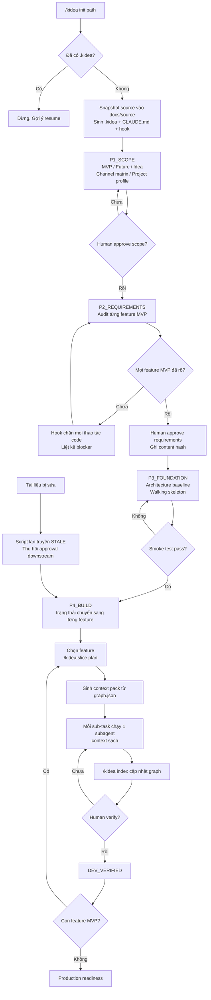

# KIDEA — Thiết kế cho Claude Code

Trạng thái: **Đề xuất, chờ Human chốt**
Ngày: 2026-08-28
Thay thế: phần cơ chế trong `conversations/kidea-workflow-chat-2026-08-24-25.md`

---

## 0. Tài liệu này giữ gì và bỏ gì

Bản thiết kế cũ (Codex + GPT-5.6) đúng về **triết lý** nhưng sai về **cơ chế**, và quá nặng về **quy mô**.

**Giữ lại:** quy trình có quality gate; tách AI review khỏi Human approval; approval tự hết hiệu lực khi tài liệu đổi; traceability xuyên suốt; vertical slice; phân biệt test specification và executable test; tách dashboard thành 3 loại; state nằm trong repo chứ không nằm trong trí nhớ session.

**Bỏ hoặc sửa:** 6 điểm ở mục 1.

---

## 1. Sáu điều chỉnh nền tảng

### 1.1. Gate phải được **chặn cứng**, không phải được **nhắc nhở**

Đây là lý do lớn nhất khiến bản Codex không hoạt động như bạn muốn.

Trên Codex, quy tắc "AI không được sang bước sau khi gate chưa pass" chỉ tồn tại dưới dạng chữ trong prompt. AI đọc, gật đầu, rồi vài nghìn token sau nó quên và bắt đầu viết code. Bạn không có cách nào ngăn.

Claude Code có **hook**. Một `PreToolUse` hook chạy **trước** mỗi lần AI gọi Write/Edit/Bash, đọc state hiện tại, và **từ chối** thao tác không hợp lệ — trả về lý do cho AI đọc. AI không thể bỏ qua, vì nó không phải là bên quyết định.

```text
AI muốn sửa services/order/place_order.py
        ↓
PreToolUse hook: kidea_guard.py
        ↓
Đọc .kidea/state.yaml
        ↓
FEAT-MVP-ORDER-LIMIT.requirements = NEEDS_CLARIFICATION
        ↓
DENY: "Gate REQUIREMENTS chưa pass cho FEAT-MVP-ORDER-LIMIT.
       Thiếu: chính sách slippage. Chạy /kidea status để xem chi tiết."
```

Nguyên tắc rút ra:

> **Luật nào quan trọng thì viết thành script, không viết thành prompt.**
> `SKILL.md` dạy AI *cách suy nghĩ*. Hook và script *cưỡng chế*.

### 1.2. Đơn vị trạng thái là **feature**, không phải **project**

Bản cũ mâu thuẫn với chính nó: vừa nói `current_phase: K3_LOGICAL_TEST_REVIEW` cho cả project, vừa nói làm theo vertical slice. Hai thứ này không cùng tồn tại được — nếu mỗi feature đi riêng một slice thì không có "phase của project".

Sửa lại: project chỉ có phase trong **giai đoạn bootstrap**, sau đó đứng yên vĩnh viễn ở `BUILD`.

```text
P0_INIT → P1_SCOPE → P2_REQUIREMENTS → P3_FOUNDATION → P4_BUILD (mãi mãi)
```

- `P1_SCOPE` — chốt MVP/Future/Idea, actor, channel matrix, project profile.
- `P2_REQUIREMENTS` — audit nghiệp vụ toàn bộ MVP. Gate cứng: một feature chưa rõ thì cả gate chặn.
- `P3_FOUNDATION` — architecture baseline + walking skeleton (code → build → deploy DEV → smoke → rollback đã thông).
- `P4_BUILD` — từ đây mọi thứ là **trạng thái của từng feature**. Project không còn phase.

Trong `P4_BUILD`, mỗi feature tự đi qua vòng đời của nó:

```text
DRAFT → SPEC_APPROVED → TESTS_APPROVED → UX_APPROVED
      → DESIGNED → IMPLEMENTING → DEV_VERIFIED → RELEASED
```

Nhiều feature ở nhiều trạng thái khác nhau cùng lúc là **bình thường và đúng**.

### 1.3. Bốn file, không phải một cây thư mục

Bản cũ đề xuất `.kidea/` với `project.yaml`, `state.yaml`, `workflow.yaml`, `traceability.yaml`, `schemas/`, `approvals/`, `history/`. Quá nhiều bộ phận chuyển động, và mỗi file thêm vào là một chỗ để lệch nhau.

```text
.kidea/
├── kidea.yaml     # Human sở hữu. Project profile + config. Hiếm khi đổi.
├── state.yaml     # Script sở hữu. Mọi thứ mutable: feature, gate, approval.
├── graph.json     # SINH RA. Traceability graph. Không bao giờ sửa tay.
└── log.jsonl      # Append-only. Lịch sử sự kiện.
```

Quy tắc quyền sở hữu rất quan trọng: **AI không được ghi trực tiếp vào `state.yaml`.** Nó chỉ được gọi script. Script validate rồi mới ghi. Nếu AI ghi tay được thì nó sẽ tự phong `HUMAN_APPROVED` cho chính nó — đúng cái bạn sợ.

Hook chặn luôn việc Write/Edit vào `.kidea/state.yaml` và `.kidea/graph.json`.

### 1.4. Traceability phải được **trích xuất**, không được **kê khai**

Đây là chỗ tôi sửa yêu cầu trong draft của bạn.

Bạn viết: *"Sau khi xong 1 task con thì update trong 1 file index hoặc mapping nào đó để biết các file/module đã làm gì, đang gọi đến đâu và được đâu gọi đến."*

Nếu **AI tự tay update** file index đó, nó sẽ lệch khỏi thực tế trong vòng vài ngày, và sau đó AI sẽ tin vào index sai — tức là hallucinate, đúng cái bạn đang muốn chống. Một index do AI kê khai không đáng tin hơn trí nhớ của AI.

Bạn đã nói đúng từ khoá mà chưa khai thác hết: **Doxygen**. Doxygen không bắt ai duy trì file index. Nó **đọc source code có annotation rồi tự sinh index**. Đó mới là mô hình đúng.

Nên `kidea` chia index thành **ba tấm bản đồ** — nghiệp vụ, code, và cầu nối giữa hai bên. Chi tiết ở [`01-BO-MAY.md`](01-BO-MAY.md) mục 5.

**Tấm code — máy tự đọc, không ai viết:**
ai gọi ai, ai bị ai gọi, file nào import file nào. Trích bằng parser từ chính source. Không thể sai, vì code đổi thì lần chạy sau ra kết quả mới.

**Tấm cầu nối — AI viết khi nó code, nhưng viết *trong code*, không viết ra file riêng:**

```python
# @kidea:feature FEAT-MVP-ORDER-LIMIT
# @kidea:implements BR-BAL-003, BR-BAL-004
# @kidea:invariant INV-BALANCE-001
def reserve_balance(user_id: str, amount: Decimal) -> ReservationId:
    ...
```

```python
# @kidea:covers LT-ORDER-0042, LT-ORDER-0043
def test_reserve_balance_locks_atomically():
    ...
```

Tài liệu cũng có frontmatter tương tự:

```yaml
---
id: BR-BAL-003
feature: FEAT-MVP-ORDER-LIMIT
kind: business-rule
---
```

Rồi `/kidea index` chạy script:

1. Quét source, trích `@kidea:` annotation.
2. Quét source, dựng call/import graph bằng parser.
3. Quét `docs/`, đọc frontmatter.
4. Join lại thành `.kidea/graph.json`.
5. Báo cáo lỗ hổng: BR không có code nào implement, code không khai báo BR nào, LT không có test nào cover, ID trỏ tới thứ không tồn tại.

Trong kidea thì **AI viết toàn bộ code, kể cả annotation** — Human không gõ phím. Vậy annotation cũng do AI khai ra, sao lại tin được hơn một file index cũng do AI khai ra? Hai lý do:

**Một — cùng một hành động.** AI viết hàm và viết annotation trong cùng một lần sửa, cùng một file. Không có bước thứ hai để quên. File index tách rời thì luôn có bước thứ hai.

**Hai, và đây mới là lý do thật — máy đối chiếu chéo được.** Annotation không được tin vì "AI khai thì chắc đúng", mà vì kidea kiểm tra nó bằng hai tấm bản đồ còn lại: mọi `BR` phải có ít nhất một hàm khai `implements`; mọi hàm trong đường dẫn nghiệp vụ phải khai `implements`; mọi ID trong annotation phải tồn tại thật; hàm khai `implements BR-X` mà `BR-X` đã bị thay thế thì báo động. Một file index tách rời không có gì để đối chiếu, nên không kiểm được.

Và câu hỏi *"sửa BR-BAL-003 thì ảnh hưởng những đâu"* trở thành **một truy vấn graph do script trả lời**, không phải một câu hỏi AI phải nhớ.

### 1.5. Đơn vị version là **CHANGE**, không phải **session**

Bạn viết: *"mỗi lần sửa đổi kèm version của session đang sửa. Nếu session file cũ thì buộc phải sửa. Nếu session trùng session hiện tại thì xem xét update."*

Logic đúng. Nhưng "session" là khái niệm sai để lưu: session chết khi bạn đóng terminal, và một tháng sau `session_id: 8f3a` không nói lên điều gì.

Thay bằng **CHANGE record** — thứ tồn tại lâu dài, review được, và bạn vốn đã muốn có:

```yaml
id: CHANGE-2026-0042
type: BUG
reason: Duplicate order created after retry
```

Mỗi node trong graph mang hai trường:

```json
{
  "id": "BR-BAL-003",
  "content_hash": "sha256:9f2c...",
  "synced_with": "CHANGE-2026-0042"
}
```

Quy tắc của bạn giữ nguyên, chỉ đổi trục:

| Tình huống | Hành động |
|---|---|
| `synced_with` bằng change hiện tại | Đã xử lý trong change này, bỏ qua |
| `synced_with` cũ hơn change hiện tại | **Bắt buộc** xem lại, đây là nợ |
| `content_hash` của upstream đổi | Toàn bộ downstream chuyển `STALE` |

Chuỗi lan truyền `STALE`:

```text
Business rule đổi
  → Logical test  → STALE
  → UX screen     → NEEDS_REVIEW
  → API contract  → NEEDS_REVIEW
  → Code          → IMPACT_REVIEW_REQUIRED
  → Test code     → IMPACT_REVIEW_REQUIRED
  → Approval của mọi gate liên quan → thu hồi
```

Script làm việc này, không phải AI.

### 1.6. Context sạch cho từng sub-task là **subagent**

Đây là yêu cầu đầu tiên trong draft của bạn: *"mỗi task con trong đó khi bắt đầu thì load lại context để hiểu cho trọn vẹn, tránh hallucinate... AI cũng dễ nắm bắt hơn và tiết kiệm token trong khi context sạch."*

Trên Codex việc này phải làm thủ công. Trên Claude Code nó là cơ chế có sẵn: **subagent chạy trong context window riêng, hoàn toàn sạch.**

Thiết kế:

```text
/kidea slice plan FEAT-MVP-ORDER-LIMIT
        ↓
Chia thành các sub-task
        ↓
Với mỗi sub-task, script sinh CONTEXT PACK từ graph.json:
  - Đúng những BR mà sub-task này implement
  - Đúng những LT mà nó phải pass
  - Đúng những file code nó được sửa
  - Neighbor trong call graph: nó gọi ai, ai gọi nó
  - Contract của các bên liên quan
        ↓
Mỗi sub-task chạy trong 1 subagent riêng, chỉ nhận context pack đó
        ↓
Subagent xong → trả kết quả → script update state + reindex
        ↓
Subagent tiếp theo khởi động với context sạch
```

Context pack **được tính từ graph**, nên nó vừa đủ và không thiếu. AI không phải đoán xem cần đọc file nào — nó được đưa đúng thứ cần.

Đây chính xác là điều bạn mô tả, và nó chỉ khả thi vì bạn đã chuyển sang Claude Code.

---

## 2. Bố cục repo của project dùng kidea

```text
project-root/
├── CLAUDE.md              # sinh ra; cửa vào + bản đồ + luật
├── .kidea/
│   ├── kidea.yaml
│   ├── state.yaml
│   ├── graph.json
│   └── log.jsonl
├── .claude/
│   ├── settings.json      # đăng ký hook
│   ├── hooks/
│   │   └── kidea_guard.py
│   └── skills/kidea/
│       ├── SKILL.md
│       ├── scripts/
│       └── references/
├── docs/
│   ├── product/           # overview, actors, scope, channel matrix
│   ├── requirements/      # features/, business-rules/, invariants/
│   ├── logical-tests/
│   ├── ux/
│   ├── architecture/
│   ├── changes/           # CHANGE-*.md
│   └── source/            # snapshot nguyên gốc từ ChatGPT, chỉ đọc
└── (code sản phẩm)
```

`docs/` gọn hơn bản cũ rõ rệt. Thư mục chỉ được tạo khi thực sự có nội dung — không dựng sẵn 50 folder rỗng.

---

## 3. `state.yaml`

```yaml
kidea_version: "0.1"
phase: P4_BUILD
current_change: CHANGE-2026-0042

features:
  FEAT-MVP-ORDER-LIMIT:
    title: Đặt lệnh Limit
    scope: MVP
    risk: CRITICAL
    channels:
      customer_web: REQUIRED
      customer_mobile: REQUIRED
      admin_web: INSPECT_AND_CANCEL
    lifecycle: IMPLEMENTING
    gates:
      requirements:
        ai: REVIEWED_OK
        human: APPROVED
        approved_at: 2026-08-26T10:00:00+07:00
        approved_hash: sha256:4a1f...
      logical_tests:
        ai: REVIEWED_OK
        human: APPROVED
        approved_hash: sha256:b7e2...
      ux_web:    { ai: REVIEWED_OK, human: APPROVED }
      ux_mobile: { ai: REVIEWED_OK, human: PENDING }
      architecture: { ai: REVIEWED_OK, human: APPROVED }
      dev_verification: { ai: PENDING, human: PENDING }

  FEAT-MVP-ORDER-MARKET:
    lifecycle: DRAFT
    gates:
      requirements:
        ai: NEEDS_CLARIFICATION
        human: PENDING
        blockers:
          - Chưa có chính sách khi thanh khoản không đủ
          - Chưa xác định có cho phép partial fill không
          - Chưa có giới hạn slippage
```

Hai trục `ai` và `human` tách hẳn nhau. **Script từ chối set `human: APPROVED` nếu lệnh không đến từ `/kidea approve`.** AI không có đường tự duyệt chính mình.

---

## 4. Command surface — gọn lại còn 9 lệnh

Bản cũ liệt kê khoảng 40 lệnh. Số đó không bao giờ được xây xong, và phần lớn chỉ là "một template tài liệu cộng một gate". Gộp lại:

| Lệnh | Việc |
|---|---|
| `/kidea init [path]` | Có path: tạo project từ bộ tài liệu ChatGPT. Không path: resume, khôi phục ngữ cảnh, báo drift |
| `/kidea status` | Đang ở đâu, feature nào bị chặn vì lý do gì, bước hợp lệ tiếp theo |
| `/kidea check` | Chạy toàn bộ validator: schema, link hỏng, ID mồ côi, gate, staleness |
| `/kidea index` | Dựng lại `graph.json` từ docs và code |
| `/kidea next` | AI đề xuất và thực thi bước hợp lệ kế tiếp — chỉ bước kế tiếp |
| `/kidea approve <gate> [feature]` | Human duyệt. Ghi hash. Lệnh duy nhất set được `human: APPROVED` |
| `/kidea impact <id>` | Sửa hoặc xoá thứ này thì ảnh hưởng những đâu. Truy vấn graph |
| `/kidea change <type> "<lý do>"` | Mở CHANGE record. type: `feature`, `bug`, `hotfix`, `refactor`, `migration`, `deps`, `infra` |

9 lệnh `change *` của bản cũ thu thành một lệnh có tham số `type`. Mỗi type nạp một checklist khác nhau từ `references/`, nhưng chỉ có một đường code.

---

## 5. Phạm vi

Human đã chốt: **không chia phiên bản.** Xây một bản đầy đủ, nhưng chỉ đúng thứ cần dùng.

Toàn bộ phạm vi và danh sách những thứ cố tình không làm nằm ở [`01-BO-MAY.md`](01-BO-MAY.md) mục 12.

Không chia phiên bản khác với làm mọi thứ cùng lúc. Thứ tự xây vẫn tồn tại, và được sắp sao cho Human nhìn thấy thứ chạy được sớm nhất — xem `01-BO-MAY.md` mục 13.

---

## 6. Sơ đồ tổng thể



---

## 7. Bốn điểm đã chốt (2026-08-28)

| # | Câu hỏi | Human quyết |
|---|---|---|
| 1 | Ngôn ngữ script | **Python** |
| 2 | Ngôn ngữ project đầu tiên | **Rust** |
| 3 | Mức chặt của hook | **Chặn cứng cả code lẫn tài liệu** |
| 4 | Xây kidea bằng kidea | **Không** |
| 5 | Chia phiên bản | **Không.** Xây một bản đầy đủ |

Đặc tả chi tiết dựa trên bốn quyết định này nằm ở [`01-BO-MAY.md`](01-BO-MAY.md). Lưu ý quyết định số 3 cần diễn giải để không tự khoá chính nó — xem mục 1 của bản spec.
