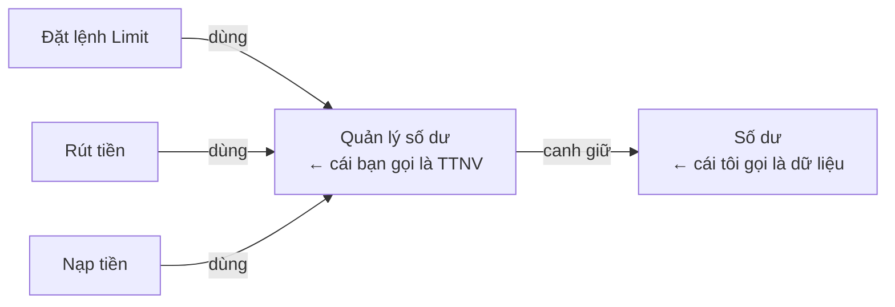
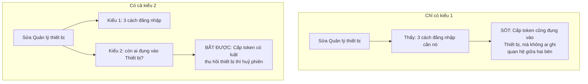
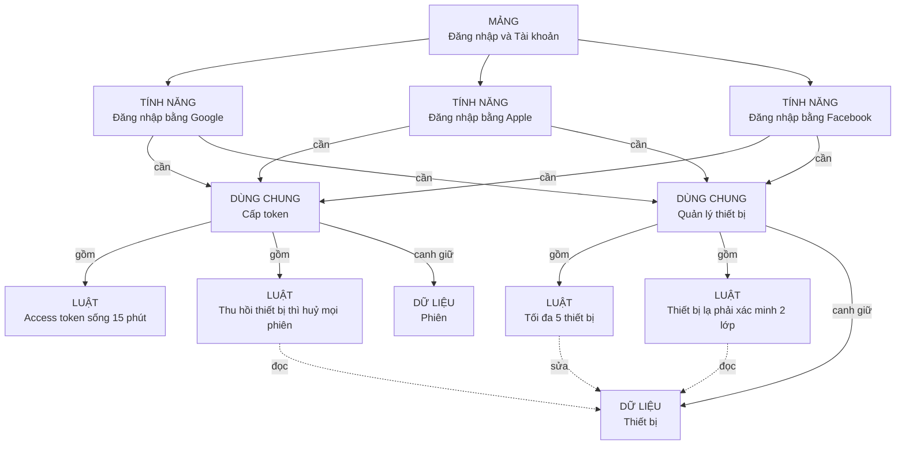
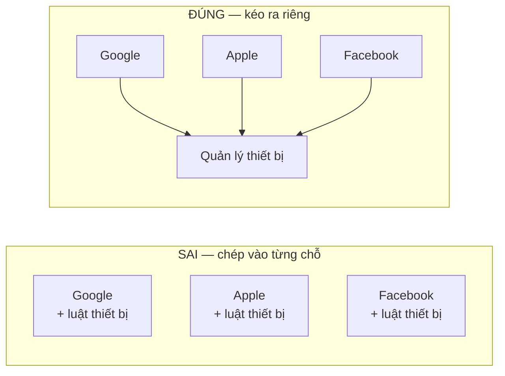
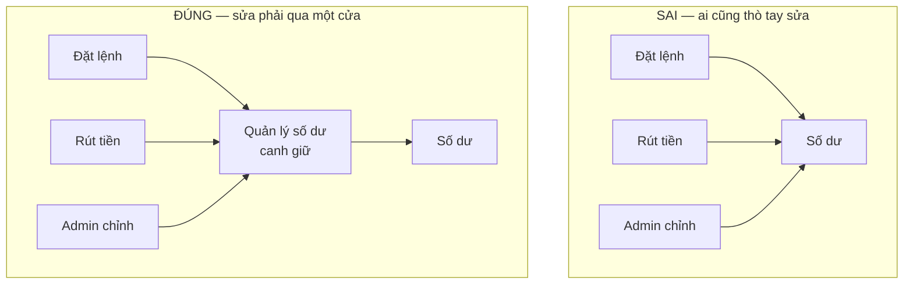
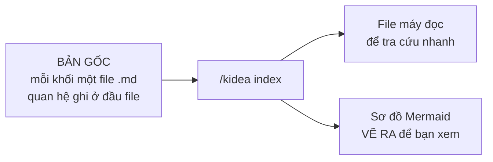
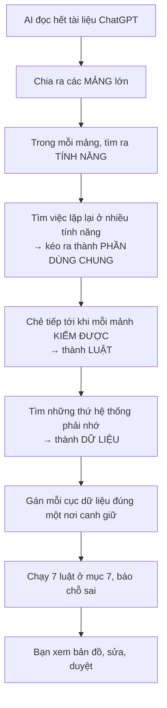

# KIDEA — Bản đồ nghiệp vụ

Cập nhật: 2026-08-30 · Trạng thái: **chờ duyệt**

Tài liệu này nói về cách ghi toàn bộ nghiệp vụ ra thành một **bản đồ máy đọc được**, thay vì để nó nằm rải rác trong các file chữ.

---

## 1. Vấn đề

Bạn nói: tài liệu để dạng chữ thì AI phải đọc hết rồi tự nhớ. Sửa chỗ nào, nó phải ngồi nghĩ xem chỗ nào bị ảnh hưởng. Cái nào quan trọng, dính nhiều nơi, thì càng dễ sót. Human đọc lại cũng sót.

Đúng. Và gốc rễ là **số lượng**.

Một sàn giao dịch có hàng trăm quy tắc nghiệp vụ. Không ai nhớ nổi hết quan hệ giữa chúng — người không nhớ nổi, AI cũng không.

Tệ hơn: khi nhớ sót, **không ai biết là mình đang sót**. Bạn hỏi AI "sửa cái này ảnh hưởng đâu", nó trả lời 5 chỗ, nghe rất tự tin. Thực ra có 8 chỗ. Bạn không có cách nào biết.

Cách thoát duy nhất:

> **Đừng bắt ai nhớ. Ghi ra rõ ràng, rồi để máy dò.**

---

## 2. Chuyện này không mới, nhưng bây giờ mới làm nổi

Bạn đoán đúng là ngày xưa người ta đã gặp vấn đề này.

Nó có tên: **bảng dò ngược**. Từ một yêu cầu, dò được xuống tận dòng code nào lo cho nó, bài kiểm tra nào phủ nó.

Ngành hàng không, thiết bị y tế, ô tô **bắt buộc** phải có cái bảng này. Phần mềm điều khiển máy bay không được cấp phép nếu không dò ngược được.

Vậy tại sao các công ty phần mềm bình thường không làm? Ba lý do:

| Lý do bỏ cuộc | Ngày xưa | Bây giờ |
|---|---|---|
| Cập nhật bảng quá mệt | Người ngồi gõ tay từng dòng | **AI gõ, và gõ ngay lúc sửa code** |
| Bảng lệch mà không ai biết | Không có cách kiểm | **Máy so nội dung, lệch là báo ngay** |
| Làm cực mà lâu mới thấy lợi | Vài tháng sau mới dùng tới | **AI dùng ngay từ ngày đầu** |

Dòng cuối mới là chỗ đổi cục diện.

Ngày xưa bảng này là **việc phải làm thêm**. Ai cũng ghét. Bây giờ nó là **thứ giúp AI làm việc** — không có bảng thì AI phải mò cả repo mỗi lần sửa; có bảng thì nó được đưa đúng phần cần đọc.

Từ gánh nặng thành công cụ. Đó là lý do bây giờ đáng làm.

---

## 3. Chẻ nghiệp vụ ra thành năm loại khối

Lấy đúng ví dụ đăng nhập của bạn.

| Loại khối | Mã | Nói dễ hiểu | Ví dụ của bạn |
|---|---|---|---|
| **Mảng** | `DOM` | Một vùng lớn của hệ thống | Đăng nhập · Risk Engine · Khớp lệnh Spot |
| **Tính năng** | `FEAT` | Thứ người dùng đòi, gọi tên được | Đăng nhập bằng Google |
| **Phần dùng chung** | `CAP` | Việc mà nhiều tính năng cùng cần | **Quản lý thiết bị · Cấp token** |
| **Luật** | `LOGIC` | Một câu, đúng hay sai kiểm được ngay | Tối đa 5 thiết bị |
| **Dữ liệu** | `ENT` | Thứ hệ thống phải nhớ và cập nhật | Thiết bị · Phiên · Số dư |

### Vì sao "Tính năng" và "Phần dùng chung" phải tách ra

Chính ví dụ của bạn cho thấy.

**Đăng nhập bằng Google** là thứ bạn viết vào danh sách MVP. Có người đòi nó.

**Quản lý thiết bị** thì không ai đòi. Không ai nói "cho tôi tính năng quản lý thiết bị". Nhưng cả ba cách đăng nhập đều cần nó.

Hai thứ này khác nhau ở chỗ:

| | Tính năng | Phần dùng chung |
|---|---|---|
| Có ai đòi không | Có | Không. Nó lộ ra khi ta thấy 3 chỗ làm cùng một việc |
| Xếp vào MVP hay để sau | Bạn xếp | Không xếp. Tính năng nào dùng nó là MVP thì nó cũng là MVP |
| Chạy trên web hay mobile | Bạn ghi rõ | Không ghi. Suy ra từ tính năng dùng nó |

### Làm sao biết một câu đã đủ nhỏ

Bạn hỏi khối nhỏ nhất nên là gì. Đây là cách thử, không phải đoán mò:

> **Viết thử một bài kiểm tra cho riêng câu đó. Chạy được, ra đúng hoặc sai — thì nó đủ nhỏ.**

| Câu | Đủ nhỏ chưa? | Vì sao |
|---|---|---|
| "Tối đa 5 thiết bị hoạt động" | **Rồi** | Thêm cái thứ 6 phải bị chặn. Kiểm được ngay |
| "Refresh token dùng một lần rồi đổi" | **Rồi** | Dùng lại token cũ phải bị chặn. Kiểm được |
| "Quản lý thiết bị an toàn" | Chưa | Kiểm kiểu gì? Đây là mong muốn, chưa phải luật |
| "Đăng nhập bằng Google" | Chưa | Là cả một mớ luật gộp lại. Đây là tính năng |

Cách thử này chặn được cả hai lỗi: chẻ vụn quá, và gom to quá.

### Chuyện "TTNV" lần trước — hoá ra cả hai chúng ta đều đúng

Lần trước bạn nói khối nhỏ nhất là *"quản lý số dư của 1 user"*. Tôi bảo nên là danh từ "Số dư". Giờ nhìn lại thì đây là **hai thứ khác nhau, và cần cả hai**:



- **Số dư** là *con số được lưu*.
- **Quản lý số dư** là *nơi viết ra mọi luật về số dư*, và là nơi duy nhất được sửa con số đó.

Bạn nghĩ đúng, chỉ là hai thứ này bị gộp vào một tên.

---

## 4. Hai kiểu quan hệ — đây là phần quan trọng nhất

Trong bản đồ có **hai kiểu quan hệ khác hẳn nhau**. Phải có cả hai.

### Kiểu 1 — mình tự viết ra

```text
A gồm B     B là một phần của A
A cần B     A phải có B mới chạy được
```

Đây chính là cây bạn mô tả: đăng nhập Google cần quản lý thiết bị, quản lý thiết bị gồm luật tối đa 5 cái.

Kiểu này **do người viết ra**. Ai đó phải nhớ và ghi.

### Kiểu 2 — máy tự thấy

```text
A canh giữ  Số dư
B đọc       Số dư
C sửa       Số dư
```

Mỗi khối chỉ khai một câu: *"tôi đụng vào Số dư"*. Không cần biết ai khác cũng đụng.

Rồi máy tự ghép: ai cùng đụng vào Số dư thì liên quan tới nhau.

### Vì sao thiếu kiểu 2 là hỏng



Nói gọn:

> **Kiểu 1 chỉ có những gì mình nhớ ra và ghi lại.**
> **Kiểu 2 bắt được cả những gì mình quên.**

Đó là lý do phải có cả hai. Kiểu 1 dễ hiểu, đọc là thấy. Kiểu 2 mới là cái lưới hứng.

---

## 5. Ví dụ đăng nhập, vẽ đầy đủ



Nhìn đường **nét đứt** từ luật *"Thu hồi thiết bị thì huỷ mọi phiên"* sang **Thiết bị**.

Luật đó nằm trong **Cấp token**. Còn **Quản lý thiết bị** là nhánh khác hẳn. Trên cây, hai bên không dính gì nhau.

Nhưng chúng đụng chung một chỗ: **Thiết bị**.

Đây đúng là loại quan hệ mà người ta hay quên.

---

## 6. Thử sửa: đổi "tối đa 5 thiết bị" thành 3

```text
$ /kidea impact LOGIC-DEV-001

═══ MÁY DÒ ═══

Vòng 1 — theo quan hệ mình đã ghi
  Quản lý thiết bị       chứa luật này              → PHẢI XEM LẠI

Vòng 2 — ai cần Quản lý thiết bị
  Đăng nhập bằng Google                             → PHẢI XEM LẠI
  Đăng nhập bằng Apple                              → PHẢI XEM LẠI
  Đăng nhập bằng Facebook                           → PHẢI XEM LẠI

Vòng 3 — còn ai đụng vào Thiết bị nữa không
  Luật "Thu hồi thiết bị thì huỷ mọi phiên"
       nằm trong Cấp token
       trên cây KHÔNG dính gì tới Quản lý thiết bị
       ⚠ ĐÂY LÀ CHỖ DỄ QUÊN NHẤT                    → PHẢI XEM LẠI

═══ HỎI BẠN ═══

1. Giảm còn 3 thì user đang có 5 thiết bị xử lý sao?
   Tôi đề xuất: giữ nguyên cho họ, chỉ chặn thêm mới.
   Nếu vậy phải viết thêm một luật.

2. Luật "thu hồi thiết bị thì huỷ phiên" có phải sửa không?
   Tôi đánh giá: KHÔNG. Nó không dính gì tới con số 5.
   → Nhánh này dừng. NHƯNG VẪN PHẢI CHẠY LẠI TEST.

3. Ba cách đăng nhập có phải sửa không?
   Tôi đánh giá: KHÔNG. Chúng chỉ gọi sang, không tự đếm.
   → Dừng. VẪN PHẢI CHẠY LẠI TEST cả ba.
```

**Vòng 3 mới là chỗ ăn tiền.** Không có kiểu quan hệ thứ hai thì chẳng ai nghĩ tới cái luật đó — nó nằm ở nhánh khác hoàn toàn.

---

## 7. Bảy luật chẻ khối

Bạn hỏi chẻ thế nào cho đúng. Đây là bảy luật. AI theo khi dựng bản đồ, bạn dùng khi soi lại.

### Luật 1 — Một khối chỉ nên sửa vì một lý do

Nếu một khối phải sửa vì hai chuyện chẳng liên quan gì nhau thì **chẻ đôi**.

Ví dụ: *Quản lý thiết bị* phải sửa khi đổi số lượng tối đa, và cũng phải sửa khi đổi cách nhận diện trình duyệt. Hai chuyện khác nhau → cân nhắc chẻ.

### Luật 2 — Khối nhỏ nhất phải kiểm được

Chưa viết được bài kiểm tra riêng cho nó thì nó chưa đủ nhỏ, phải chẻ tiếp.

### Luật 3 — Cái gì dùng chung thì kéo ra riêng

Từ **hai chỗ trở lên** dùng cùng một thứ → thứ đó phải thành khối riêng. Không được chép vào từng chỗ.



Chép vào từng chỗ thì sửa một chỗ, quên hai chỗ. Kéo ra riêng thì sửa một chỗ, máy chỉ ra ngay cả ba.

Đây chính là ý *"manager device thì dùng chung"* của bạn.

### Luật 4 — Không được vòng tròn

*A gồm B* mà *B lại cần A* là chẻ sai. Máy từ chối.

### Luật 5 — Mỗi cục dữ liệu chỉ một nơi canh giữ

Nhiều chỗ được **đọc**. Nhưng muốn **sửa** thì phải đi qua nơi canh giữ.



Bên trái: cái điều luôn phải đúng — *khả dụng cộng bị giữ bằng tổng* — không có ai canh. Mỗi chỗ tự lo, và chỉ cần một chỗ lo sai là số dư sai.

Bên phải: một chỗ canh cho tất cả.

Đây là luật đáng giá nhất về lâu dài.

### Luật 6 — Đừng sâu quá

Ba tới năm tầng là vừa. Sâu hơn thì không ai đọc nổi, nông hơn thì mỗi khối to quá.

Không phải luật cứng. Vượt thì máy nhắc.

### Luật 7 — Đặt tên theo một kiểu

| Loại | Kiểu đặt tên | Ví dụ |
|---|---|---|
| Mảng | Tên vùng | "Đăng nhập và Tài khoản" |
| Tính năng | Động từ + cái gì | "Đăng nhập bằng Google" |
| Dùng chung | Động từ + cái gì | "Quản lý thiết bị" |
| Luật | Một câu hoàn chỉnh | "Tối đa 5 thiết bị hoạt động" |
| Dữ liệu | **Danh từ, càng gọn càng tốt** | "Thiết bị" |

Đặt tên lung tung thì máy không nhận ra hai khối đang nói cùng một chuyện. Việc **tìm trùng lặp** phụ thuộc hoàn toàn vào chỗ này.

---

## 8. Lưu bản đồ dưới dạng gì

Bạn nói *"giả sử dùng Mermaid đi, thực tế dùng cái nào phù hợp thì bạn chọn"*.

**Mermaid để xem, không để lưu.** So sánh:

| | Một file Mermaid to | Mỗi khối một file .md |
|---|---|---|
| Nhìn bằng mắt | Tốt | Phải vẽ ra mới xem được |
| Máy tra cứu | Khó | Dễ |
| Ghi thêm mô tả cho từng khối | Không chỗ nào ghi | Ghi thoải mái |
| **So nội dung từng khối xem có đổi không** | **Không làm được** | Làm được |
| Hai người sửa hai khối khác nhau | Đụng nhau | Không đụng |
| Đưa cho AI đúng phần nó cần | Phải cắt tay | Lấy đúng file |

Dòng thứ tư quan trọng nhất. Cả cơ chế "sửa cái này thì cái kia hết hiệu lực" dựa vào việc so nội dung từng khối. Nhét chung một file thì sửa một chỗ, cả file đổi, không biết chỗ nào.

Nên:



**Sơ đồ luôn được vẽ lại từ đầu, không bao giờ sửa tay.** Sửa tay là lệch ngay.

### Một khối trông như thế nào

```markdown
---
id: CAP-AUTH-DEVICE
kind: capability
title: "Quản lý thiết bị"
domain: DOM-AUTH

gom:      [LOGIC-DEV-001, LOGIC-DEV-002]
can:      [CAP-NOTIFY-PUSH]

canh_giu: [ENT-DEVICE]
doc:      [ENT-ACCOUNT]
sua:      [ENT-DEVICE]
---

## Để làm gì
Giữ danh sách máy mà một tài khoản đã đăng nhập.

## Không lo phần nào
Không lo phiên đăng nhập. Việc đó của Cấp token.
```

Phần *"Không lo phần nào"* nghe thừa nhưng thực ra rất quan trọng. Nó chặn việc khối này phình dần sang lấn việc khối khác.

---

## 9. Gộp và tách để bản đồ không phình

Bạn nói cần gộp/tách cho gọn gàng. Máy phát hiện bằng những dấu hiệu **đếm được**, không đoán:

| Thấy gì | Đề nghị | Vì sao |
|---|---|---|
| Một khối có hơn 9 khối con | **Chẻ ra** | Không ai nắm nổi |
| Một khối sửa từ 3 cục dữ liệu trở lên | **Chẻ ra** | Nó đang ôm quá nhiều việc |
| Hai khối cứ sửa là sửa cùng nhau, 5 lần gần nhất đều thế | **Gộp lại** | Chúng thực ra là một |
| Một khối chỉ có đúng một nơi dùng | **Gộp vào nơi đó** | Tách ra chẳng được gì |
| Hai khối tên gần giống nhau | **Xem lại** | Có thể trùng |
| Khối không ai dùng, không thuộc về đâu | **Xoá hoặc nối lại** | Bị bỏ rơi |

Dấu hiệu *"cứ sửa là sửa cùng nhau"* lấy từ lịch sử git. Đếm được, không phải đoán.

**Đây là lời nhắc, không phải rào chặn.** Bắt dọn dẹp mỗi lần thì một tuần sau bạn sẽ tắt nó đi.

---

## 10. Bản đồ được dựng lần đầu ra sao



Bước D là chỗ AI hay làm ẩu nhất. Nó thường để ba cách đăng nhập, mỗi cách tự mô tả luật thiết bị riêng, thay vì nhận ra ba cái đó là một.

Nên máy có luật riêng cho chỗ này: **hai khối có luật viết na ná nhau → nhắc là có thể phải kéo ra dùng chung**.

---

## 11. Cần bạn quyết

| # | Quyết gì | Tôi nghiêng về |
|:--:|---|---|
| 1 | Năm loại khối có đủ không | Đủ. Nhưng sàn crypto có thứ nào không nhét vừa thì bạn nói |
| 2 | Tách "Tính năng" và "Phần dùng chung" | Nên tách |
| 3 | Luật 5 — muốn sửa dữ liệu phải qua một cửa | Giữ. Đáng giá nhất về lâu dài |
| 4 | Mỗi khối một file, sơ đồ vẽ ra để xem | Giữ |
| 5 | Gộp/tách là lời nhắc hay rào chặn | Lời nhắc |
