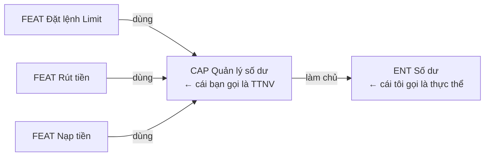
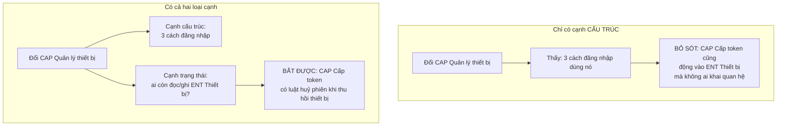
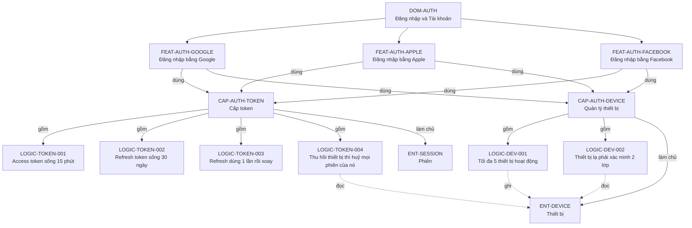
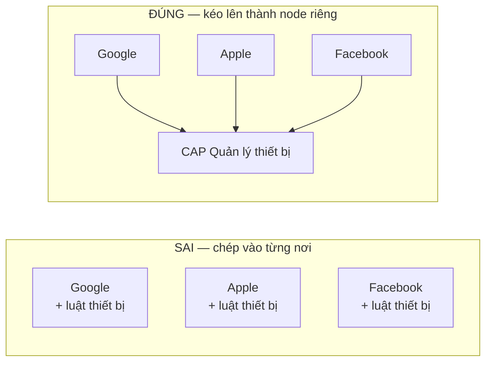
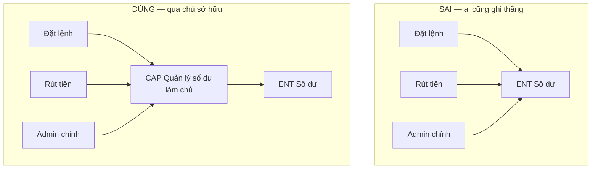
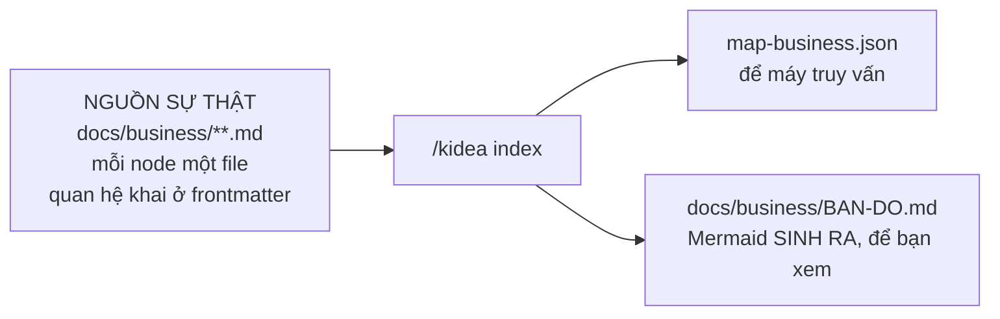
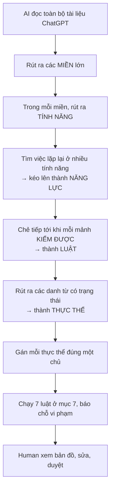

# KIDEA — Bản đồ nghiệp vụ

Cập nhật: 2026-08-30 · Trạng thái: **chờ duyệt**

Tài liệu này thiết kế **cách biểu diễn toàn bộ nghiệp vụ thành một bản đồ máy đọc được**, thay vì để nó nằm rải rác trong các file chữ mà AI phải đọc rồi tự nhớ.

---

## 1. Vấn đề

Bạn nói:

> *"Thay vì tài liệu ở dạng chữ, AI phải tự đọc tất cả rồi ghi nhớ, sau đó thay đổi phần nào nó phải tự suy nghĩ rất nhiều thì mới biết được ở đâu ảnh hưởng. Nếu feature/logic nào quan trọng có thể ảnh hưởng nhiều nơi thì nguy cơ thiếu sót rất cao, và bản thân Human dù có review lại cũng không tránh khỏi thiếu sót."*

Đúng. Và vấn đề nằm ở chỗ **quy mô**:

| | Người | AI |
|---|---|---|
| Nhớ được bao nhiêu quan hệ | Vài chục | Vài trăm, nhưng không chắc chắn |
| Có bỏ sót không | Có | Có, và không biết là mình sót |
| Có nhất quán giữa hai lần hỏi không | Không | Không |

Một hệ thống như sàn giao dịch có hàng trăm luật nghiệp vụ. Không ai — người hay máy — giữ nổi toàn bộ quan hệ giữa chúng trong đầu.

**Cách duy nhất đúng: đừng bắt ai nhớ. Ghi ra thành cấu trúc, rồi để máy duyệt.**

---

## 2. Vì sao bây giờ mới làm được

Bạn đoán đúng: *"trong quá khứ mô hình phát triển phần mềm đã gặp vấn đề này rồi"*.

Nó có tên: **ma trận truy vết yêu cầu** (requirements traceability matrix). Ngành hàng không, thiết bị y tế và ô tô **bắt buộc** phải có theo luật — phần mềm điều khiển máy bay không được chứng nhận nếu không truy được từ yêu cầu xuống tận dòng code và test.

Nên câu hỏi đúng không phải *"tại sao chưa ai làm"* mà là **"tại sao hầu hết không làm"**:

| Lý do | Ngày xưa | Với AI |
|---|---|---|
| Bảo trì tốn quá nhiều công | Người ngồi cập nhật tay | **AI cập nhật, và nó cập nhật cùng lúc với việc sửa** |
| Cập nhật xong vẫn lệch, không ai biết | Không có cách phát hiện | **Băm nội dung, lệch là máy báo ngay** |
| Lợi ích đến muộn, chi phí đến sớm | Vài tháng sau mới thấy giá trị | **AI hưởng lợi ngay: bản đồ chính là thứ sinh ra ngữ cảnh cho từng task** |

Dòng cuối là chỗ lật ngược tình thế. Ngày xưa bản đồ là **gánh nặng tài liệu**. Bây giờ nó là **nhiên liệu cho AI** — không có nó thì AI phải đọc mò cả repo, có nó thì AI được đưa đúng thứ cần.

Ba nguồn tôi lấy ý:

| Nguồn | Lấy gì |
|---|---|
| Ma trận truy vết yêu cầu | Kỷ luật: mọi thứ phải truy ngược được, không có node mồ côi |
| Mô hình tính năng trong dòng sản phẩm phần mềm | Ngữ nghĩa ghép: bắt buộc, tuỳ chọn, thay thế lẫn nhau |
| Thiết kế hướng miền (DDD) | **Mỗi thực thể có đúng một chủ sở hữu** định nghĩa bất biến của nó |

---

## 3. Năm loại node

Lấy đúng ví dụ của bạn để đặt tên.

| Loại | Mã | Là gì | Ví dụ của bạn |
|---|---|---|---|
| **Miền** | `DOM-*` | Vùng lớn, thuần gom nhóm, không có hành vi riêng | Đăng nhập/Đăng ký · Risk Engine · Spot Matching |
| **Tính năng** | `FEAT-*` | Thứ người dùng gọi tên được, đòi được | Đăng nhập bằng Google |
| **Năng lực** | `CAP-*` | Việc dùng chung, không ai đòi trực tiếp nhưng nhiều tính năng cần | Quản lý thiết bị · Cấp token |
| **Luật** | `LOGIC-*` | Phát biểu nguyên tử, **kiểm được đúng/sai** | Tối đa 5 thiết bị đang hoạt động |
| **Thực thể** | `ENT-*` | Thứ có trạng thái, sống qua nhiều request | Thiết bị · Phiên · Số dư |

### Khác nhau giữa Tính năng và Năng lực

Đây là chỗ ví dụ của bạn chỉ ra rõ nhất.

`Đăng nhập bằng Google` là thứ bạn viết vào danh sách tính năng MVP. `Quản lý thiết bị` thì không — không ai đòi "cho tôi tính năng quản lý thiết bị", nhưng cả ba cách đăng nhập đều cần nó.

| | Tính năng | Năng lực |
|---|---|---|
| Ai đòi | Người dùng, khách hàng | Không ai. Nó lộ ra khi ta thấy ba chỗ làm cùng một việc |
| Có nhóm MVP/Future/Idea không | **Có** | Không. Suy ra: tính năng nào dùng nó là MVP thì nó là MVP |
| Có kênh web/mobile/admin không | **Có** | Không. Suy ra từ tính năng dùng nó |
| Đi qua trạm kiểm tra không | **Có** | Có, nhưng theo tính năng dùng nó |

### Thế nào là một Luật — định nghĩa kiểm được

Bạn hỏi đơn vị nhỏ nhất là gì. Đây là phép thử, không phải cảm tính:

> **Một node là Luật khi bạn viết được một test trả lời đúng/sai cho riêng nó, không cần biết gì khác.**

| Phát biểu | Là Luật? | Vì sao |
|---|---|---|
| "Tối đa 5 thiết bị đang hoạt động" | **Có** | Thêm thiết bị thứ 6 → phải bị từ chối. Test được |
| "Refresh token dùng một lần rồi xoay" | **Có** | Dùng lại token cũ → phải bị từ chối. Test được |
| "Quản lý thiết bị an toàn" | Không | Không test được. Đây là mong muốn, chưa phải luật |
| "Đăng nhập bằng Google" | Không | Là tập hợp nhiều luật. Đây là Tính năng |

Phép thử này quan trọng vì nó **chặn việc chẻ quá nhỏ hoặc gom quá to**.

### Thực thể, và cái bạn gọi là TTNV

Lần trước bạn nói đơn vị nhỏ nhất là *"quản lý số dư của 1 user"*. Tôi bảo nên là danh từ "Số dư". **Giờ thì rõ là cả hai đều đúng, và là hai thứ khác nhau:**



- **`ENT Số dư`** là *cái danh từ* — thứ có trạng thái.
- **`CAP Quản lý số dư`** là *cái node làm chủ nó* — nơi định nghĩa mọi luật về số dư.

Bạn nghĩ đúng, chỉ là bạn gộp hai khái niệm vào một tên. Tách ra thì cả hai cùng dùng được.

---

## 4. Hai loại cạnh — đây là ý quan trọng nhất tài liệu này

Bản đồ có **hai loại quan hệ hoàn toàn khác nhau**, và cần cả hai.

### Cạnh cấu trúc — do người khai

```text
gồm    A gồm B    B là một phần của A
dùng   A dùng B    A cần B để chạy được
```

Đây là cây phân rã bạn mô tả. Nó **tường minh** — ai đó viết ra.

### Cạnh trạng thái — lưới an toàn

```text
làm chủ   CAP làm chủ ENT   nơi định nghĩa luật của thực thể đó
đọc       node đọc ENT
ghi       node ghi ENT
```

Đây là chỗ bắt được quan hệ mà **không ai khai**.

### Vì sao phải có cả hai



Cạnh cấu trúc phụ thuộc vào việc **AI có nhớ khai không**. Cạnh trạng thái thì không — chỉ cần mỗi node khai nó đọc/ghi thực thể nào, và máy tự bắt cặp.

> **Cấu trúc cho biết bạn nghĩ cái gì liên quan. Trạng thái cho biết cái gì thực sự liên quan.**

---

## 5. Ví dụ đầy đủ — miền Đăng nhập của sàn crypto

Đây là ví dụ của bạn, vẽ ra hoàn chỉnh.



Chú ý đường nét đứt từ `LOGIC-TOKEN-004` sang `ENT-DEVICE`. Nó **không nằm trong cây phân rã** — `Cấp token` và `Quản lý thiết bị` là hai nhánh riêng. Nhưng chúng đụng nhau qua thực thể `Thiết bị`.

Đó chính là loại quan hệ mà con người hay bỏ sót.

---

## 6. Kịch bản: đổi "tối đa 5 thiết bị" thành 3

```text
$ /kidea impact LOGIC-DEV-001

═══ LAN TRUYỀN ═══

Vòng 1 — cạnh CẤU TRÚC
  CAP-AUTH-DEVICE          làm chủ luật này        → CẦN XEM LẠI

Vòng 2 — ai dùng CAP-AUTH-DEVICE
  FEAT-AUTH-GOOGLE                                 → CẦN XEM LẠI
  FEAT-AUTH-APPLE                                  → CẦN XEM LẠI
  FEAT-AUTH-FACEBOOK                               → CẦN XEM LẠI

Vòng 3 — cạnh TRẠNG THÁI: ai còn động vào ENT-DEVICE
  LOGIC-TOKEN-004  "Thu hồi thiết bị thì huỷ phiên"
                   ↳ đọc ENT-DEVICE, thuộc CAP-AUTH-TOKEN
                   ↳ KHÔNG có quan hệ cấu trúc với CAP-AUTH-DEVICE
                   ⚠ ĐÂY LÀ CHỖ DỄ SÓT NHẤT       → CẦN XEM LẠI

═══ CÂU HỎI CHO HUMAN ═══

1. Giảm còn 3 thì user đang có 5 thiết bị xử lý sao?
   Đề xuất: giữ nguyên, chỉ chặn thêm mới. Cần LOGIC mới.

2. LOGIC-TOKEN-004 có phải sửa không?
   Tôi đánh giá: KHÔNG. Nó không phụ thuộc con số 5.
   → Dừng lan truyền nhánh này. NHƯNG VẪN PHẢI TEST LẠI.

3. Ba cách đăng nhập có phải sửa không?
   Tôi đánh giá: KHÔNG. Chúng chỉ gọi, không tự đếm.
   → Dừng lan truyền. VẪN PHẢI TEST LẠI cả ba.

═══ SAU KHI HUMAN CHỐT ═══

  Phải sửa   LOGIC-DEV-001 · thêm LOGIC-DEV-003 (xử lý user đang vượt)
  Test lại   3 tính năng đăng nhập · LOGIC-TOKEN-004 · CAP-AUTH-DEVICE
  Không cho đóng việc chừng nào còn thứ chưa test lại
```

Điểm ăn tiền là **vòng 3**. Không có lớp thực thể thì không ai nghĩ tới `LOGIC-TOKEN-004` — nó nằm ở nhánh khác hoàn toàn của cây.

---

## 7. Bảy luật chia node

Bạn hỏi *"nên xây dựng cụ thể và các rule, structure thế nào"*. Đây là bảy luật. AI theo khi dựng bản đồ, Human dùng khi review.

### Luật 1 — Một node, một lý do để đổi

Nếu một node phải sửa vì hai lý do không liên quan nhau thì **tách**.

> `CAP Quản lý thiết bị` sửa vì đổi giới hạn số thiết bị, và cũng sửa vì đổi cách nhận diện trình duyệt → hai lý do khác nhau → cân nhắc tách.

### Luật 2 — Leaf phải kiểm được

Một node chỉ được là `LOGIC` khi viết được test trả lời đúng/sai cho riêng nó. Chưa test được thì nó vẫn là node ghép, phải chẻ tiếp.

### Luật 3 — Dùng chung thì phải kéo lên

Từ **hai node trở lên** dùng cùng một thứ → thứ đó phải thành node riêng, không được chép vào từng nơi.

Đây chính là `Quản lý thiết bị` trong ví dụ của bạn.



Chép vào từng nơi thì đổi một chỗ quên hai chỗ. Kéo lên thì đổi một chỗ, máy chỉ ra cả ba.

### Luật 4 — Không có vòng lặp

`A gồm B` và `B dùng A` cùng lúc là mô hình sai. `check` từ chối.

### Luật 5 — Mỗi thực thể có đúng một chủ

Một `ENT` chỉ được **một** node khai `làm chủ`. Nhiều node đọc được, nhưng **ghi thì phải đi qua chủ**.

Đây là luật quan trọng nhất về mặt kiến trúc, và nó đến từ thiết kế hướng miền.



Bên trái: bất biến *"khả dụng + bị giữ = tổng"* không có ai canh, mỗi chỗ tự lo. Bên phải: một chỗ canh cho tất cả.

`check` phát hiện node ghi thẳng vào thực thể mà không phải chủ → cảnh báo nặng.

### Luật 6 — Sâu vừa phải

Ba đến năm tầng là hợp lý: `DOM → FEAT → CAP → LOGIC → ENT`. Sâu hơn thì không ai đọc nổi, nông hơn thì node quá to.

Không phải luật cứng, là cảnh báo khi vượt.

### Luật 7 — Đặt tên nhất quán

| Loại | Kiểu tên | Ví dụ |
|---|---|---|
| `DOM` | Danh từ vùng | "Đăng nhập và Tài khoản" |
| `FEAT` | Động từ + tân ngữ | "Đăng nhập bằng Google" |
| `CAP` | Động từ + tân ngữ | "Quản lý thiết bị" |
| `LOGIC` | Câu phát biểu đầy đủ | "Tối đa 5 thiết bị đang hoạt động" |
| `ENT` | **Danh từ đơn** | "Thiết bị" |

Nhất quán tên là điều kiện để việc **tìm trùng lặp** chạy được. Tên lung tung thì AI không nhận ra hai node đang nói cùng một thứ.

---

## 8. Lưu bản đồ dưới dạng gì

Bạn nói *"giả sử ta dùng Mermaid đi… thực tế dùng cái nào phù hợp nhất nhé"*.

**Mermaid để xem, không để lưu.** Lý do:

| | Một file Mermaid lớn | Một file markdown mỗi node |
|---|---|---|
| Xem bằng mắt | Tốt | Phải sinh ra mới xem được |
| Máy truy vấn | Khó | Dễ |
| Gắn thêm thông tin cho từng node | Không | Được: mô tả, trạng thái, ai duyệt |
| Băm nội dung từng node | **Không được** | Được — cần cho cơ chế phát hiện lệch |
| Hai người sửa hai node khác nhau | Đụng nhau khi merge | Không đụng |
| Đưa cho subagent đúng phần nó cần | Phải cắt tay | Lấy đúng file |

Nên:



Mermaid **luôn được sinh lại**, không bao giờ sửa tay. Sửa tay là nó lệch ngay.

### Cấu trúc thư mục

```text
docs/business/
├── BAN-DO.md                    # Mermaid sinh ra, chỉ để xem
├── domains/
│   └── DOM-AUTH.md
├── features/
│   ├── FEAT-AUTH-GOOGLE.md
│   ├── FEAT-AUTH-APPLE.md
│   └── FEAT-AUTH-FACEBOOK.md
├── capabilities/
│   ├── CAP-AUTH-TOKEN.md
│   └── CAP-AUTH-DEVICE.md
├── logic/
│   ├── LOGIC-DEV-001.md
│   └── LOGIC-TOKEN-004.md
└── entities/
    ├── ENT-DEVICE.md
    └── ENT-SESSION.md
```

### Một node trông như thế nào

Node năng lực:

```markdown
---
id: CAP-AUTH-DEVICE
kind: capability
title: "Quản lý thiết bị"
domain: DOM-AUTH

gom:      [LOGIC-DEV-001, LOGIC-DEV-002]
dung:     [CAP-NOTIFY-PUSH]

lam_chu:  [ENT-DEVICE]
doc:      [ENT-ACCOUNT]
ghi:      [ENT-DEVICE]

status: active
---

## Mục đích
Quản lý danh sách thiết bị mà một tài khoản đã đăng nhập.

## Không thuộc phạm vi
Không quản lý phiên đăng nhập — việc đó thuộc CAP-AUTH-TOKEN.
```

Node luật:

```markdown
---
id: LOGIC-DEV-001
kind: logic
title: "Tối đa 5 thiết bị đang hoạt động"
thuoc: CAP-AUTH-DEVICE

doc: [ENT-DEVICE]
ghi: [ENT-DEVICE]

kiem_duoc: true
status: active
---

## Phát biểu
Một tài khoản có tối đa 5 thiết bị ở trạng thái hoạt động.
Đăng nhập trên thiết bị thứ 6 bị từ chối, kèm mã lỗi DEVICE_LIMIT.

## Vì sao cần
Giảm rủi ro tài khoản bị dùng chung hoặc bị chiếm.

## Hệ quả khi vi phạm
Không giới hạn được phạm vi thiệt hại khi lộ thông tin đăng nhập.
```

Node thực thể:

```markdown
---
id: ENT-DEVICE
kind: entity
title: "Thiết bị"
chu_so_huu: CAP-AUTH-DEVICE

trang_thai: [PENDING_VERIFY, ACTIVE, REVOKED]
---

## Là gì
Một máy cụ thể mà tài khoản đã đăng nhập.

## Bất biến
- Một thiết bị chỉ thuộc về đúng một tài khoản
- Thiết bị REVOKED không quay lại ACTIVE được
```

---

## 9. Gộp và tách — giữ bản đồ không phình

Bạn nói: *"ta có thể tối ưu bằng việc gộp/tách các node lại cho logic clear, clean, gọn gàng hơn"*.

`check` phát hiện bằng dấu hiệu đếm được:

| Dấu hiệu | Đề nghị | Vì sao |
|---|---|---|
| Node có trên 9 con | **Tách** | Không ai nắm nổi |
| Node ghi vào từ 3 thực thể trở lên | **Tách** | Đang làm quá nhiều việc |
| Hai node luôn cùng sửa trong 5 lần thay đổi gần nhất | **Gộp** | Chúng thực ra là một |
| Node chỉ có đúng một node dùng, và không dùng ở đâu khác | **Gộp vào nơi dùng nó** | Tách ra không được lợi gì |
| Hai node có tiêu đề gần trùng | **Xem lại** | Có thể trùng lặp |
| Node không ai dùng, không ai gồm | **Xoá hoặc nối lại** | Node mồ côi |

Dấu hiệu *"luôn cùng sửa"* lấy từ lịch sử git — đếm được, không cần đoán.

**Đây là cảnh báo, không phải cổng chặn.** Bắt buộc dọn dẹp mỗi lần thì bạn sẽ tắt nó đi sau một tuần.

---

## 10. Bản đồ này được dựng lần đầu như thế nào

Ở trạm PHẠM VI và trạm NGHIỆP VỤ:



Bước D là bước AI dễ làm ẩu nhất — nó hay để ba tính năng đăng nhập mỗi cái tự mô tả luật thiết bị riêng, thay vì nhận ra chúng là một. Nên `check` có luật riêng: **hai node có luật phát biểu gần giống nhau → cảnh báo có thể phải kéo lên**.

---

## 11. Cần Human quyết

| # | Quyết gì | Đề xuất của tôi |
|:--:|---|---|
| 1 | Năm loại node ở mục 3 có đúng và đủ không | Đủ. Nhưng nếu bạn thấy sàn crypto có loại nào không nhét vừa thì nói |
| 2 | Tách **Tính năng** và **Năng lực** làm hai loại | Nên tách. `Quản lý thiết bị` không phải tính năng ai đòi, nhưng vẫn cần là node |
| 3 | Luật 5 — mỗi thực thể một chủ, ghi phải qua chủ | Giữ. Đây là luật giá trị nhất về lâu dài |
| 4 | Lưu mỗi node một file, Mermaid sinh ra để xem | Giữ. Mermaid làm nguồn sự thật thì mất khả năng băm và merge |
| 5 | Gộp/tách là cảnh báo hay cổng chặn | Cảnh báo |
