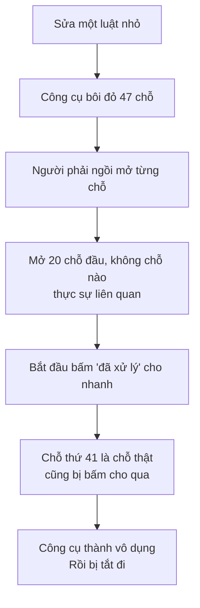

# KIDEA — Các loại thay đổi và cách ngành xử lý

Cập nhật: 2026-08-30 · Trạng thái: **chờ duyệt**

Bạn hỏi: trong thực tế, phần tài liệu có những loại quyết định nào? Hệ thống lớn thì người ta tìm phần liên quan bằng cách nào?

Tôi tra lại. Có sẵn nhiều thứ đáng lấy.

---

## 1. Ngành đã có sẵn ba thứ đáng lấy

### 1.1. "Liên kết đáng ngờ" — đúng cái bạn nghĩ ra, có từ hơn 20 năm trước

Bạn nói: sửa một luật thì mọi thứ dựa vào nó phải bị đánh dấu, và không cho đóng việc chừng nào chưa xử lý hết.

Ngành có sẵn khái niệm này, tên là **suspect link** — liên kết đáng ngờ.

Cách nó chạy: bạn nối yêu cầu A với thiết kế B với test C. Khi A đổi, mọi liên kết từ A đi ra **tự động bị đánh dấu là đáng ngờ**. Ai đó phải mở ra, xem, và xác nhận là "đã xử lý" hoặc "không ảnh hưởng". Chưa xác nhận thì nó cứ nằm đó.

Đây là tính năng cốt lõi của các công cụ như IBM DOORS và Jama — thứ mà ngành hàng không, thiết bị y tế, ô tô bắt buộc phải dùng.

**Bạn nghĩ ra đúng cái người ta đã làm.** Khác biệt là ngày xưa con người phải ngồi mở từng liên kết đáng ngờ ra xem.

### 1.2. Bốn cái rổ — cách gọi tên chuẩn cho việc dò ảnh hưởng

Giới nghiên cứu có bộ từ vựng cho đúng việc chúng ta đang bàn:

| Rổ | Là gì |
|---|---|
| **Rổ khởi điểm** | Chỗ mình biết chắc phải sửa. Ví dụ: luật "5 thiết bị" |
| **Rổ máy đoán** | Những chỗ máy dò ra là có thể bị ảnh hưởng |
| **Rổ thật** | Những chỗ cuối cùng thực sự phải sửa |
| **Rổ báo nhầm** | Máy bảo bị ảnh hưởng, hoá ra không |

Cái đáng học nằm ở rổ cuối.

### 1.3. Quyết định thì không xoá, chỉ thay thế

Có một cách làm phổ biến tên là **bản ghi quyết định kiến trúc**: mỗi quyết định lớn được ghi thành một tờ ngắn — bối cảnh, quyết định gì, hệ quả gì, trạng thái.

Điểm hay: **không bao giờ xoá một quyết định.** Muốn đổi thì viết tờ mới, và đánh dấu tờ cũ là "đã bị thay thế bởi tờ số N".

Vì sao quan trọng: sáu tháng sau có người hỏi *"sao hồi đó lại làm thế này?"* — vẫn tra ra được. Xoá đi thì mất luôn lý do.

Đây đúng là điều tôi đã đề xuất cho kidea: khối bị bỏ thì đánh dấu **đã nghỉ**, nằm nguyên tại chỗ, không xoá.

---

## 2. Bài học lớn nhất: báo thừa cũng chết như báo thiếu

Đây là thứ giá trị nhất tôi tìm được, và nó buộc tôi phải sửa thiết kế.

Ngày xưa các công cụ dò ảnh hưởng thất bại **không phải vì chúng dò sót**. Chúng dò ra quá nhiều.

Hai kiểu sai, hậu quả khác nhau:

| Kiểu sai | Hậu quả trước mắt | Hậu quả thật |
|---|---|---|
| **Báo thiếu** | Không thấy gì | Bug ra production |
| **Báo thừa** | Danh sách dài | Người ta ngừng đọc → rồi cũng bug ra production |

Báo thừa **trông có vẻ an toàn** nhưng dẫn tới cùng một kết cục, chỉ chậm hơn.

### Điều này bắt tôi sửa thiết kế

Bản trước tôi cho máy quét một lượt rồi bôi đỏ mọi thứ ở dưới. Sai. Bạn cũng đã chỉ ra ở ví dụ "5 thiết bị".

Ba chỗ sửa:

**Một — đi từng bậc, đánh giá xong mới sang bậc sau.**
Không mở bậc 2 khi bậc 1 chưa đánh giá. Nếu bậc 1 không phải sửa thì bậc 2 không bao giờ bị nhắc tới.

**Hai — chia mức chắc chắn, đừng dồn một đống.**

| Mức | Là gì | Máy nói sao |
|---|---|---|
| **Chắc** | A chứa hoặc trực tiếp cần B, B vừa đổi | "Phải xem" |
| **Có thể** | A và B cùng đụng một cục dữ liệu | "Nên xem, đây là chỗ hay quên" |
| **Xa** | Cách 3 bậc trở lên | "Ghi nhận, xem sau cũng được" |

**Ba — AI lọc trước, người chỉ xem cái khó.**
Đây là chỗ AI đổi cục diện. Ngày xưa người phải mở cả 47 chỗ. Giờ AI đọc 47 chỗ, loại 40 chỗ rõ ràng không liên quan, và **đưa bạn 7 chỗ kèm lý do tại sao nó không chắc**.

Con người vẫn quyết. Nhưng quyết trên 7 thứ đáng quyết, không phải 47 thứ.

---

## 3. Mười bốn loại thay đổi

Bạn hỏi thực tế có những loại nào. Đây là danh sách, chia bốn nhóm.

### Nhóm A — Nghiệp vụ đổi thật

| # | Loại | Ví dụ | Bản đồ đổi gì | Chỗ nguy hiểm |
|:--:|---|---|---|---|
| 1 | **Thêm tính năng** | Thêm đăng nhập bằng SMS | Thêm khối, nối vào phần dùng chung có sẵn | Quên kiểm xem có trùng cái cũ không |
| 2 | **Đổi một luật** | 5 → 3 thiết bị | Sửa một khối lá | Quên chỗ khác cũng đụng cùng cục dữ liệu |
| 3 | **Đổi luồng** | Chèn bước xác minh vào giữa | Đổi thứ tự, thêm khối | Luật cũ ngầm giả định thứ tự cũ |
| 4 | **Đổi dữ liệu** | Số dư tách khả dụng / bị giữ | Đổi khối dữ liệu | **Nguy hiểm nhất.** Mọi nơi đụng vào nó đều lung lay |
| 5 | **Bỏ tính năng** | Bỏ đăng nhập Facebook | Đánh dấu đã nghỉ | Phần dùng chung giờ chỉ còn một nơi dùng — có nên gộp lại? |
| 6 | **Đổi ưu tiên** | Kéo một tính năng từ "để sau" lên MVP | Đổi nhãn | Phần dùng chung của nó cũng thành MVP theo, có kịp không? |

### Nhóm B — Mô hình đổi, hành vi giữ nguyên

| # | Loại | Ví dụ | Bản đồ đổi gì | Chỗ nguy hiểm |
|:--:|---|---|---|---|
| 7 | **Tách một khối** | Đặt lệnh tách thành Limit và Stop | Một khối thành nhiều | Chia cạnh sai — cái nào theo bên nào |
| 8 | **Gộp nhiều khối** | Hai luật hoá ra trùng nhau | Nhiều thành một | Mã cũ phải đánh dấu đã nghỉ, không xoá |
| 9 | **Refactor code** | Đổi cấu trúc code, nghiệp vụ y nguyên | **Bản đồ nghiệp vụ không đổi.** Chỉ bản đồ code đổi | Refactor xong lỡ đổi luôn hành vi mà không biết |

Nhóm này quan trọng vì nó cho thấy **ba tấm bản đồ đổi độc lập với nhau**. Refactor code thì tấm nghiệp vụ đứng yên.

### Nhóm C — Sửa cái sai

| # | Loại | Ai sai | Làm gì |
|:--:|---|---|---|
| 10 | **Sửa bug** | Code sai, tài liệu đúng | Viết bài test tái hiện lỗi trước, rồi sửa code |
| 11 | **Sửa tài liệu** | Tài liệu sai, code đúng | Sửa tài liệu. **Nhưng phải truy: ai đã duyệt cái sai đó, và vì sao lọt** |

Có một trường hợp thứ ba hay bị bỏ qua: **cả hai đều nghe hợp lý nhưng khác nhau**. Lúc đó không phải sửa lỗi, mà là **phải quyết định** cái nào mới đúng. Việc này thuộc về bạn, không thuộc về AI.

### Nhóm D — Sức ép từ bên ngoài

| # | Loại | Ví dụ | Chỗ nguy hiểm |
|:--:|---|---|---|
| 12 | **Đổi chỉ tiêu hiệu năng** | p99 từ 200ms xuống 50ms | Nghiệp vụ không đổi, nhưng có thể phải đổi cả kiến trúc |
| 13 | **Yêu cầu tuân thủ mới** | Bắt buộc KYC | Cắt ngang rất nhiều tính năng cùng lúc |
| 14 | **Bên thứ ba đổi** | Google đổi cách trả token | Trông như chuyện kỹ thuật, thực ra đổi nghiệp vụ |

Loại 14 hay bị coi nhẹ. Ví dụ Google bỏ một trường trong token — nghe như việc của lập trình viên. Nhưng nếu trường đó đang dùng để nhận diện thiết bị, thì luật *"thiết bị lạ phải xác minh 2 lớp"* đổi ý nghĩa. Đó là chuyện nghiệp vụ.

---

## 4. Bốn mức nặng nhẹ — quy trình phải co giãn theo

Ngành IT doanh nghiệp chia thay đổi làm ba loại: **có sẵn quy trình** (duyệt trước rồi, cứ làm), **bình thường** (phải xét duyệt), **khẩn cấp** (làm trước, hợp thức sau).

kidea nên co giãn tương tự. Bắt mọi thay đổi đi qua đủ tám trạm thì sửa một dòng chữ cũng mất nửa ngày, và bạn sẽ bỏ dùng.

| Mức | Loại nào | Đi qua gì |
|---|---|---|
| **Nhẹ** | 10 (bug), 11 (sửa tài liệu), 9 (refactor) | Dò ảnh hưởng · sửa · test lại · xong |
| **Vừa** | 2 (đổi luật), 3 (đổi luồng), 14 (bên thứ ba) | Thêm: bạn duyệt phần nghiệp vụ |
| **Nặng** | 1 (thêm tính năng), 5 (bỏ), 6 (đổi ưu tiên), 7, 8 (tách/gộp) | Đi đủ các trạm, từ phạm vi trở đi |
| **Rất nặng** | 4 (đổi dữ liệu), 12 (hiệu năng), 13 (tuân thủ) | Đủ trạm, cộng nghiệm thu hệ thống lại từ đầu |

Mức nào thì máy tự đoán và đề xuất, **bạn có quyền nâng hoặc hạ**. Nâng lên thì luôn được. Hạ xuống thì phải ghi lý do.

---

## 5. Bốn thứ kidea lấy về

| Lấy gì | Từ đâu | Dùng ở kidea |
|---|---|---|
| Liên kết đáng ngờ | Công cụ quản lý yêu cầu | Sửa một khối thì mọi thứ dựa vào nó bị đánh dấu, không xoá dấu được cho tới khi xử lý |
| Không xoá, chỉ thay thế | Bản ghi quyết định kiến trúc | Khối bị bỏ đánh dấu "đã nghỉ", nằm nguyên chỗ cũ |
| Đo cả báo thừa lẫn báo thiếu | Nghiên cứu dò ảnh hưởng | Chia mức chắc chắn, đi từng bậc, AI lọc trước |
| Quy trình co giãn theo mức nặng | Quản lý thay đổi doanh nghiệp | Bốn mức ở mục 4 |

---

## 6. Và một thứ ngành chưa có

Cả bốn thứ trên đều giả định **con người là người dò và người đánh giá**. Đó là lý do chúng đắt, chậm, và hầu hết công ty bỏ.

Ba việc giờ giao được cho máy và AI:

| Việc | Ngày xưa ai làm | Giờ ai làm |
|---|---|---|
| Cập nhật bản đồ khi code đổi | Người, và hay quên | **AI, ngay lúc sửa code** |
| Dò xem ai bị ảnh hưởng | Người, đọc tài liệu | **Máy, tra bản đồ. Không quên, không mệt** |
| Đánh giá "cái này có thật sự phải sửa không" | Người, từng cái một | **AI lọc trước, người quyết cái khó** |

Việc còn lại của con người: **quyết**. Đó là việc đúng nên để cho con người, và cũng là việc duy nhất máy không làm được.

---

## 7. Cần bạn quyết

| # | Quyết gì | Tôi nghiêng về |
|:--:|---|---|
| 1 | Mười bốn loại thay đổi có thiếu loại nào không | Bạn làm sàn, bạn biết loại nào hay gặp mà tôi chưa nêu |
| 2 | Bốn mức nặng nhẹ, và loại nào thuộc mức nào | Như bảng mục 4 |
| 3 | Máy đoán mức, bạn được nâng hoặc hạ, hạ thì phải ghi lý do | Giữ |
| 4 | Chia ba mức chắc chắn khi báo ảnh hưởng | Giữ. Đây là chỗ tôi sửa sau khi tra cứu |

---

## Nguồn

- [IBM DOORS — liên kết và truy vết](https://www.ibm.com/docs/en/engineering-lifecycle-management-suite/doors/9.7.1?topic=requirements-links-traceability)
- [Jama Software — DOORS và giới hạn của nó](https://www.jamasoftware.com/blog/ibm-doors-software/)
- [Jama Software — dò ảnh hưởng thay đổi](https://www.jamasoftware.com/blog/2013/07/12/change-impact-analysis/)
- [Dò ảnh hưởng tích hợp cho quản lý thay đổi phần mềm](https://www.cs.wm.edu/~denys/pubs/ICSE12-ImpactAnalysis.pdf)
- [Nghiên cứu quy mô lớn về dự đoán ảnh hưởng dựa trên đồ thị lời gọi](https://arxiv.org/pdf/1812.06286)
