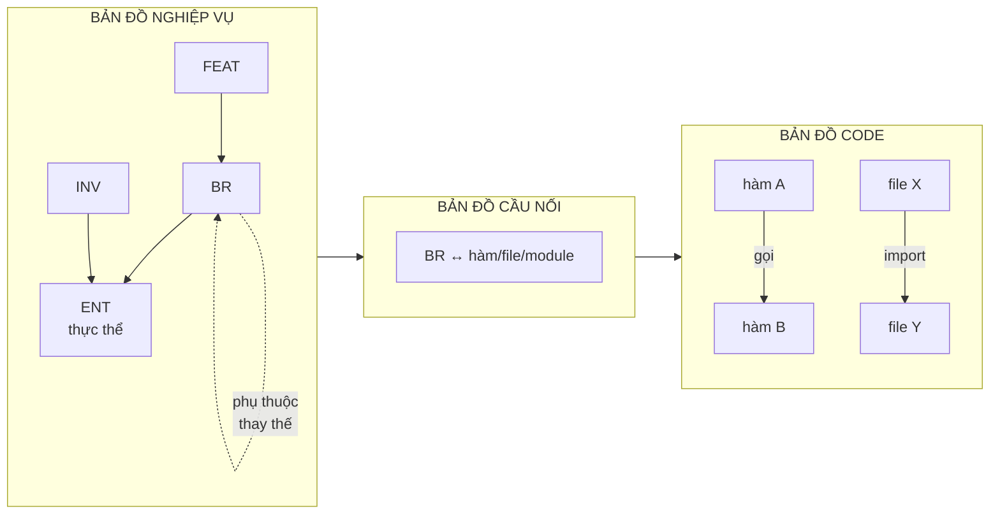
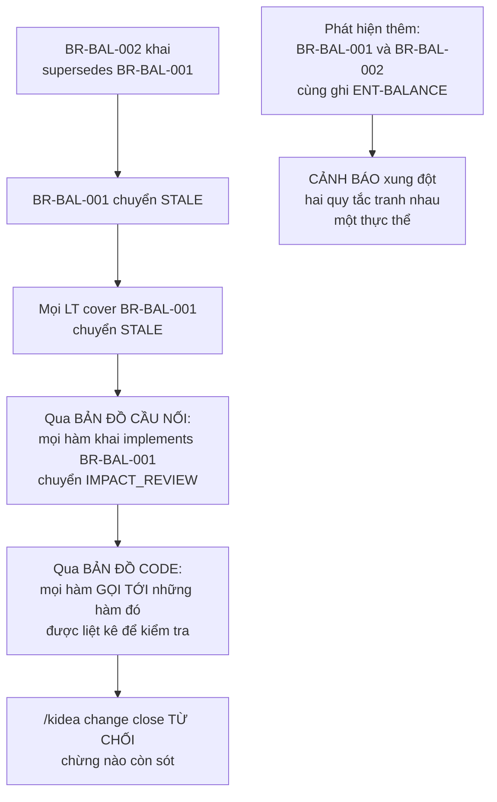
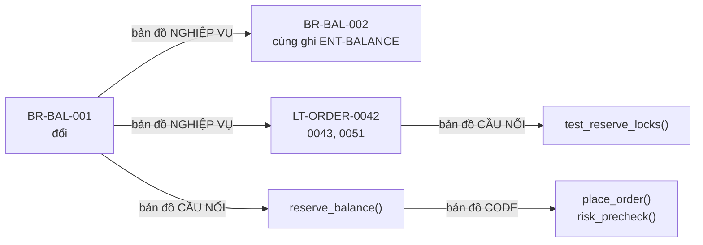
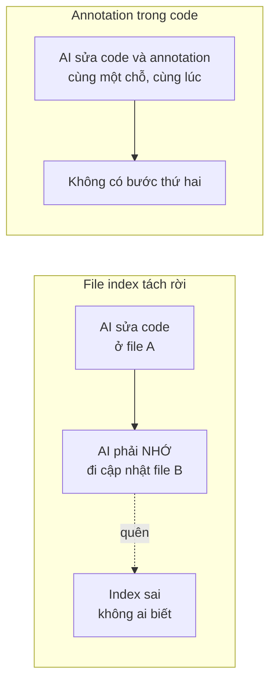
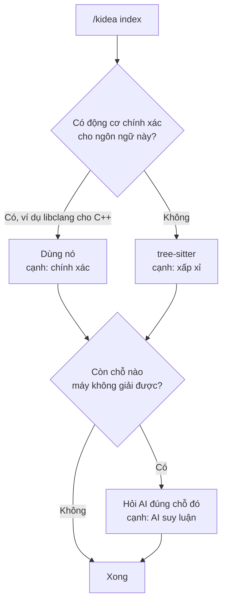
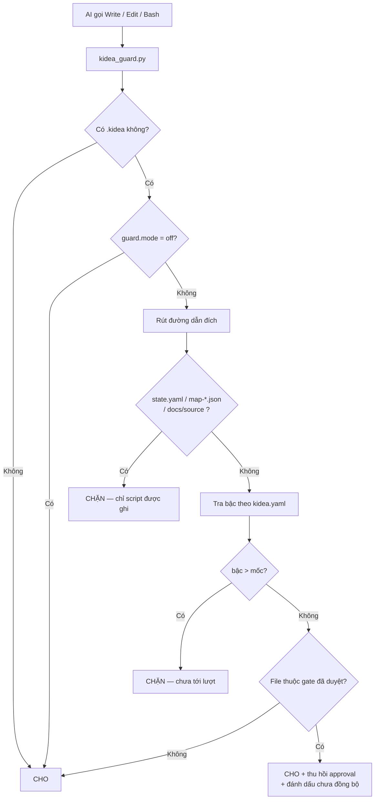
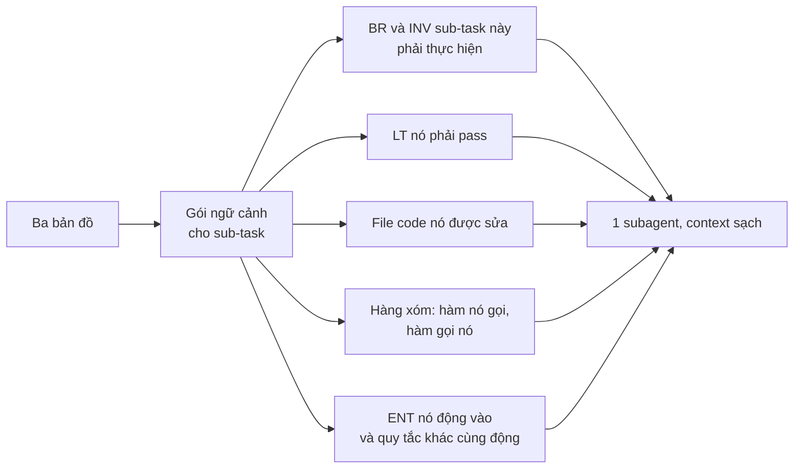

# KIDEA — Đặc tả kỹ thuật

Trạng thái: **Chờ Human duyệt**
Cập nhật: 2026-08-28
Tài liệu nền: [`KIDEA_DESIGN.md`](KIDEA_DESIGN.md)

Bản đặc tả **đầy đủ và cuối cùng**, không chia phiên bản. Mọi thứ ghi trong đây sẽ được xây. Mọi thứ không ghi thì cố tình không xây — lý do ở mục 12.

---

## 0. Quyết định đã chốt

| # | Câu hỏi | Quyết định |
|---|---|---|
| 1 | Ngôn ngữ viết kidea | **Python** |
| 2 | Ngôn ngữ project đích | **Không phụ thuộc.** Ngôn ngữ nào cũng chạy — xem mục 7 |
| 3 | Mức chặt của người gác | **Chặn cứng cả code lẫn tài liệu**, theo luật ở mục 1 |
| 4 | Dùng kidea xây kidea | **Không** |
| 5 | Chia phiên bản | **Không.** Xây một bản đầy đủ |
| 6 | Ai viết code | **AI viết toàn bộ.** Human đọc, review, phê duyệt |

Quyết định số 6 là quyết định nền tảng nhất và nó chi phối mục 6 và mục 7.

---

## 1. Hai khái niệm nền: bậc và mốc

### Bậc — thuộc tính của thư mục, không bao giờ đổi

| Bậc | Thư mục | Giai đoạn |
|:---:|---|---|
| 1 | `docs/product/` | Sản phẩm làm gì, có tính năng nào |
| 2 | `docs/requirements/` | Nghiệp vụ từng tính năng, quy tắc, bất biến |
| 3 | `docs/logical-tests/`, `docs/ux/` | Test case dạng chữ, thiết kế màn hình |
| 4 | `docs/architecture/` | Chia service, thiết kế dữ liệu, API |
| 5 | `src/`, `tests/`, … | Code thật |

Bậc thấp trả lời **"làm cái gì"**, bậc cao trả lời **"làm thế nào"**.

### Mốc — con số trong `state.yaml`, tăng khi duyệt xong một giai đoạn

```text
bậc của file  <=  mốc   →  CHO GHI
bậc của file  >   mốc   →  CHẶN
```

Ví dụ với `milestone: 2`:

| Đường dẫn | Bậc | Kết quả |
|---|:---:|---|
| `docs/product/overview.md` | 1 | CHO |
| `docs/requirements/BR-BAL-003.md` | 2 | CHO |
| `docs/logical-tests/LT-ORDER-0042.md` | 3 | CHẶN |
| `src/balance/reserve.cpp` | 5 | CHẶN |

Luật là `<=` chứ không phải `==`, nên **luôn được quay lại sửa bậc thấp**. Sửa tài liệu đã duyệt thì được cho ghi, nhưng approval bị thu hồi và mọi thứ phía sau bị đánh dấu chưa đồng bộ.

### Ba trường hợp chặn tuyệt đối

| Đường dẫn | Vì sao |
|---|---|
| `.kidea/state.yaml` | AI ghi được thì nó tự phong "đã duyệt" cho chính mình |
| `.kidea/map-*.json` | Bản đồ phải sinh ra từ nguồn thật, không được bịa |
| `docs/source/**` | Bản gốc tài liệu ChatGPT, giữ nguyên để đối chiếu |

### Ranh giới bậc là cấu hình, không phải luật cứng

Mỗi project có bố cục khác nhau. `kidea.yaml` khai bảng ánh xạ đường dẫn sang bậc, `init` sinh sẵn bản mặc định theo ngôn ngữ và bạn chỉnh được.

---

## 2. Bố cục

### Repo này — nơi viết kidea

```text
kendrick-ai-tools-claude/
├── CLAUDE.md
├── design/
│   ├── KIDEA_DESIGN.md
│   └── KIDEA_SPEC.md
└── skill/kidea/
    ├── SKILL.md
    ├── scripts/
    │   ├── kidea.py            # điểm vào duy nhất
    │   ├── state.py            # đọc/ghi cuốn sổ
    │   ├── guard.py            # logic người gác
    │   ├── map_business.py     # dựng bản đồ NGHIỆP VỤ
    │   ├── map_code.py         # dựng bản đồ CODE
    │   ├── map_link.py         # dựng bản đồ CẦU NỐI
    │   ├── impact.py           # đi xuyên ba bản đồ
    │   ├── hashing.py
    │   ├── contextpack.py
    │   └── validate.py
    ├── hook/kidea_guard.py
    └── templates/
```

### Project đích

```text
project-root/
├── CLAUDE.md
├── .kidea/
│   ├── kidea.yaml          # Human sở hữu, cấu hình
│   ├── state.yaml          # Script sở hữu, cuốn sổ trạng thái
│   ├── map-business.json   # bản đồ NGHIỆP VỤ
│   ├── map-code.json       # bản đồ CODE
│   ├── map-link.json       # bản đồ CẦU NỐI
│   └── log.jsonl           # Sổ bằng chứng
├── .claude/
│   ├── settings.json
│   └── hooks/kidea_guard.py
├── docs/
│   ├── source/  product/  requirements/
│   ├── logical-tests/  ux/  architecture/  changes/
└── (code)
```

---

## 3. `.kidea/kidea.yaml` — Human sở hữu

```yaml
kidea_version: "1.0"
project_name: "san-crypto"

language:
  primary: cpp                  # cpp | rust | go | ts | python | java | ...
  test_command: "ctest --test-dir build"
  precise_engine:               # tuỳ chọn, chỉ để tăng độ chính xác bản đồ CODE
    kind: libclang
    compile_commands: "build/compile_commands.json"

stages:                         # ranh giới bậc, chỉnh được
  1: ["docs/product/**"]
  2: ["docs/requirements/**"]
  3: ["docs/logical-tests/**", "docs/ux/**"]
  4: ["docs/architecture/**"]
  5: ["src/**", "include/**", "tests/**"]

profile:
  criticality: HIGH
  handles_money: true
  contains_pii: true

channels:
  customer_web: true
  customer_mobile: true
  admin_web: true

guard:
  mode: strict                  # strict | warn | off
  exempt_paths:
    - "README.md"
    - "CMakeLists.txt"
    - "cmake/**"
    - "build/**"
    - "third_party/**"
```

`guard.mode: off` cho lúc khẩn cấp. Đổi nó là hành động **nhìn thấy trong git diff**, không phải AI tự lách.

---

## 4. `.kidea/state.yaml` — Script sở hữu

```yaml
kidea_version: "1.0"
phase: P2_REQUIREMENTS
milestone: 2
current_change: CHANGE-2026-0042

features:
  FEAT-MVP-ORDER-LIMIT:
    title: "Đặt lệnh Limit"
    scope: MVP
    risk: CRITICAL
    channels: { customer_web: REQUIRED, customer_mobile: REQUIRED, admin_web: INSPECT_AND_CANCEL }
    lifecycle: SPEC_APPROVED
    paths: []                   # slice start khai báo
    gates:
      requirements:
        ai: REVIEWED_OK
        human: APPROVED
        approved_at: "2026-08-26T10:00:00+07:00"
        approved_commit: "a1b2c3d"
        approved_hash: "sha256:4a1f..."
        files:
          - { path: "docs/requirements/features/FEAT-MVP-ORDER-LIMIT.md", hash: "sha256:7e9b..." }
        stale: false
        blockers: []
      logical_tests:  { ai: PENDING, human: PENDING, stale: false, blockers: [] }
      ux_web:         { ai: PENDING, human: PENDING, stale: false, blockers: [] }
      ux_mobile:      { ai: PENDING, human: PENDING, stale: false, blockers: [] }
      ux_admin:       { ai: PENDING, human: PENDING, stale: false, blockers: [] }
      architecture:   { ai: PENDING, human: PENDING, stale: false, blockers: [] }
      implementation: { ai: PENDING, human: PENDING, stale: false, blockers: [] }
      release:        { ai: PENDING, human: PENDING, stale: false, blockers: [] }
```

### Giá trị hợp lệ

| Trường | Giá trị |
|---|---|
| `phase` | `P0_INIT` `P1_SCOPE` `P2_REQUIREMENTS` `P3_FOUNDATION` `P4_BUILD` |
| `milestone` | `1`…`5` |
| `lifecycle` | `DRAFT` `SPEC_APPROVED` `TESTS_APPROVED` `UX_APPROVED` `DESIGNED` `IMPLEMENTING` `DEV_VERIFIED` `RELEASED` |
| `gates.*.ai` | `PENDING` `REVIEWED_OK` `NEEDS_CLARIFICATION` |
| `gates.*.human` | `PENDING` `APPROVED` |
| `scope` | `MVP` `FUTURE` `IDEA` |

### Ba luật bất khả xâm phạm

1. `human: APPROVED` **chỉ đặt được bởi lệnh `/kidea approve`**.
2. Không duyệt được khi `ai != REVIEWED_OK` hoặc còn `blockers`.
3. Không duyệt được khi working tree bẩn — duyệt là chụp dấu vân tay nội dung, chụp lúc nội dung đang đổi thì vô nghĩa.

---

## 5. Ba tấm bản đồ

Đây là phần cốt lõi. Trước đây tôi gộp tất cả vào một file; tách thành ba đúng hơn, vì **ba tấm được dựng từ ba nguồn khác nhau, vào ba thời điểm khác nhau**.



### 5.1. Bản đồ NGHIỆP VỤ — luật nào liên quan luật nào

Đây là tấm bạn nêu trong ý 3, và là tấm tôi thiếu hẳn ở bản trước.

**Vấn đề nó giải:** *"trước đây sàn chỉ có lệnh Market thì số dư chỉ cần tổng. Giờ thêm lệnh Limit thì cần available và locked."* Tức là **thêm một tính năng làm hỏng một quy tắc đã có**. Phải phát hiện được điều đó.

**Chìa khoá là khái niệm `ENT` — thực thể nghiệp vụ.** Đây là danh từ mà các quy tắc cùng động vào: số dư, lệnh, sổ lệnh, tài khoản. Hai quy tắc **không biết nhau** nhưng nếu **cùng ghi vào một thực thể** thì chúng liên quan tới nhau.

| Loại node | Nghĩa | Ví dụ |
|---|---|---|
| `FEAT-*` | Tính năng | `FEAT-MVP-ORDER-LIMIT` |
| `BR-*` | Quy tắc nghiệp vụ | `BR-BAL-002` |
| `INV-*` | Bất biến, luôn phải đúng | `INV-BALANCE-001` |
| `ENT-*` | **Thực thể nghiệp vụ** | `ENT-BALANCE`, `ENT-ORDER` |
| `LT-*` | Logical test | `LT-ORDER-0042` |
| `UX-*` | Màn hình | `UX-WEB-012` |

Nguồn: **frontmatter của file markdown**, do AI viết khi soạn tài liệu nghiệp vụ.

```yaml
---
id: BR-BAL-002
kind: business-rule
feature: FEAT-MVP-ORDER-LIMIT
title: "Số dư tách thành khả dụng và bị giữ"
reads:  [ENT-BALANCE]
writes: [ENT-BALANCE]
depends_on: [BR-ACCOUNT-001]
supersedes: [BR-BAL-001]
---
```

#### Kịch bản của bạn, chạy đầy đủ

**Trước** — sàn chỉ có lệnh Market:

```yaml
id: BR-BAL-001
title: "Số dư là một con số tổng"
feature: FEAT-MVP-ORDER-MARKET
writes: [ENT-BALANCE]
```

**Sau** — thêm lệnh Limit, AI soạn `BR-BAL-002` và khai `supersedes: [BR-BAL-001]`.

kidea chạy `check`:



**Kể cả khi AI quên khai `supersedes`**, luật "hai quy tắc cùng ghi một thực thể" vẫn bắt được. Đó là lý do `ENT` tồn tại: nó là lưới an toàn khi khai báo trực tiếp bị bỏ sót.

#### Các loại cạnh

| Cạnh | Nghĩa | Dùng để |
|---|---|---|
| `FEAT → BR` | Tính năng có quy tắc này | Gom nhóm |
| `BR → ENT` (`reads`/`writes`) | Quy tắc đọc/ghi thực thể | **Phát hiện quy tắc liên quan gián tiếp** |
| `BR → BR` (`depends_on`) | Quy tắc này giả định quy tắc kia đúng | Lan truyền chưa đồng bộ |
| `BR → BR` (`supersedes`) | Quy tắc này thay thế quy tắc kia | Đánh dấu cái cũ hết hiệu lực |
| `INV → ENT` | Bất biến ràng buộc thực thể | Quy tắc nào động vào thực thể phải giữ được bất biến |
| `LT → BR` | Test bao phủ quy tắc | Phát hiện quy tắc chưa có test |
| `UX → BR` | Màn hình thể hiện quy tắc | Nghiệp vụ đổi thì màn hình phải xem lại |

### 5.2. Bản đồ CODE — hàm nào gọi hàm nào

**Vấn đề nó giải:** sửa một hàm, phải biết hàm nào gọi nó để test cho trọn.

Nguồn: **máy đọc code**, hoàn toàn tự động, không ai khai báo.

| Node | Ví dụ |
|---|---|
| `file` | `src/balance/reserve.cpp` |
| `symbol` | hàm, method, class |
| `module` | namespace, package, crate |

| Cạnh | Nghĩa |
|---|---|
| `calls` | Hàm A gọi hàm B |
| `called_by` | Chiều ngược, sinh sẵn để tra nhanh |
| `imports` | File X dùng file Y |
| `defines` | File chứa symbol |

Tấm này **không cần ai duyệt** vì nó không phải ý kiến — nó là sự thật đọc ra từ code. Sai duy nhất có thể xảy ra là **thiếu**, không phải sai. Xem mục 7.

### 5.3. Bản đồ CẦU NỐI — luật nào nằm ở code nào

**Vấn đề nó giải:** *"logic này được xử lý bởi file/function/module nào"* — câu hỏi bạn nêu trong ý 3.

Nguồn: **annotation trong code**, do AI viết khi nó code.

```cpp
/// @kidea:implements BR-BAL-002
/// @kidea:invariant  INV-BALANCE-001
ReservationId reserve_balance(const UserId& user, Decimal amount);
```

```cpp
// @kidea:covers LT-ORDER-0042, LT-ORDER-0043
TEST(BalanceTest, ReserveLocksAtomically) { }
```

| Cạnh | Từ | Tới |
|---|---|---|
| `implements` | symbol | `BR-*` |
| `guards` | symbol | `INV-*` |
| `covers` | test symbol | `LT-*` |
| `owns` | module | `ENT-*` |

### 5.4. Ba bản đồ nối lại thành một chuỗi

Đây là toàn bộ giá trị của thiết kế:



`/kidea impact BR-BAL-001` đi hết cả ba và in ra một danh sách duy nhất.

### 5.5. Vì sao tách ba file thay vì một

| Bản đồ | Dựng lại khi nào | Chi phí |
|---|---|---|
| NGHIỆP VỤ | Tài liệu đổi | Rẻ, vài trăm file markdown |
| CODE | Code đổi | Đắt nhất, phải đọc toàn bộ source |
| CẦU NỐI | Code đổi | Rẻ, chỉ quét comment |

Tách ra thì dựng lại được từng cái, và trả lời được câu **"tấm nào đang cũ"** — nếu gộp một file thì không biết phần nào cũ.

---

## 6. Ai tạo ra cái gì

Đây là chỗ tôi sai ở bản trước, và ý 2 của bạn đã sửa lại.

Trong kidea, **Human không viết code, cũng không viết annotation.** AI viết tất cả. Human đọc, review, phê duyệt.

| Thứ | Ai tạo | Kiểm chứng bằng gì |
|---|---|---|
| NGHIỆP VỤ — nghiệp vụ | **AI viết** frontmatter khi soạn tài liệu | Human **duyệt** ở trạm requirements |
| CODE — code | **Máy đọc**, không ai can thiệp | Không cần — nó là sự thật |
| CẦU NỐI — cầu nối | **AI viết** annotation khi code | Máy đối chiếu chéo, xem dưới |

### Vì sao tin được thứ chính AI khai ra

Câu hỏi đúng phải hỏi, vì tôi từng nói *"index do AI kê khai không đáng tin hơn trí nhớ AI"*. Vẫn đúng — nhưng câu đó nói về **một file index nằm tách rời**. Annotation khác ở hai điểm:

**Điểm 1 — cùng một hành động, không có bước thứ hai để quên.**



**Điểm 2 — quan trọng hơn: máy đối chiếu chéo được.**

Annotation không được tin vì "AI khai thì chắc đúng". Nó được tin vì **kidea kiểm tra được nó bằng một nguồn khác**:

| Luật kiểm tra | Bắt được lỗi gì |
|---|---|
| Mọi `BR` phải có ít nhất một symbol khai `implements` | Quy tắc chưa ai code |
| Mọi symbol trong đường dẫn nghiệp vụ phải khai `implements` | AI code mà quên khai |
| Mọi `LT` phải có ít nhất một test khai `covers` | Test case chưa có test code |
| Mọi ID trong annotation phải tồn tại thật trong bản đồ NGHIỆP VỤ | AI bịa ra `BR-BAL-999` |
| Symbol khai `implements BR-X` nhưng `BR-X` đã `supersedes` | Code đang chạy theo quy tắc hết hiệu lực |

Bốn luật đầu **đối chiếu bản đồ CẦU NỐI với bản đồ NGHIỆP VỤ và CODE**. Một file index tách rời không có gì để đối chiếu, nên không kiểm được. Đó mới là khác biệt thật, chứ không phải chuyện ai gõ phím.

### Phân công giữa máy và AI

| Việc | Giao cho | Vì sao |
|---|---|---|
| Hàm nào gọi hàm nào | **Máy** | Cần đầy đủ và lặp lại y hệt. AI đọc 500 file mỗi lần index thì vừa chậm vừa tốn vừa có thể bịa |
| Hàm này phục vụ quy tắc nào | **AI** | Cần hiểu ý nghĩa. Máy không làm được |
| Quy tắc này liên quan quy tắc kia | **AI**, Human duyệt | Là phán đoán nghiệp vụ |
| Đối chiếu ba bản đồ, tìm chỗ hở | **Máy** | Luật rõ ràng, phải chính xác tuyệt đối |

Nguyên tắc: **máy làm việc đếm được, AI làm việc hiểu được, Human quyết việc chọn được.**

---

## 7. Đọc code: không phụ thuộc ngôn ngữ

Bản trước tôi nói chọn C++ thì bản đồ chính xác hơn Rust. **Đúng về kỹ thuật nhưng sai về mức độ quan trọng** — bạn đã chỉ ra điều đó.

Lý do nó không quan trọng: **phần mang ý nghĩa nghiệp vụ nằm ở bản đồ NGHIỆP VỤ và CẦU NỐI, mà cả hai đều do AI viết ra bằng chữ, không phụ thuộc ngôn ngữ.** Bản đồ CODE chỉ trả lời "ai gọi ai" — thiếu vài cạnh thì mất một ít gợi ý, không làm hỏng luật gác cổng.

### Ba lớp, dùng lớp nào có sẵn



| Lớp | Dùng khi | Ghi vào cạnh |
|---|---|---|
| tree-sitter | Luôn có. Hỗ trợ hầu hết ngôn ngữ phổ biến | `confidence: approximate` |
| Động cơ chính xác | Ngôn ngữ có sẵn công cụ, ví dụ libclang cho C++ | `confidence: exact` |
| Hỏi AI | Chỉ cho **những chỗ cụ thể máy không giải được** | `confidence: inferred` |

Lớp 3 quan trọng và nó chính là ý bạn nói *"hoặc các model AI làm được"*. Nhưng dùng đúng liều: **không bắt AI đọc cả codebase mỗi lần index** — vừa chậm, vừa tốn token, vừa có thể bịa. Chỉ hỏi khi máy bó tay, ví dụ một lời gọi qua interface không rõ trỏ tới đâu. Câu hỏi hẹp, câu trả lời kiểm chứng được.

### Kết luận về ngôn ngữ

**Chọn ngôn ngữ theo sản phẩm của bạn.** kidea chạy với Rust, C++, Go, TypeScript, Python, Java — bất kỳ ngôn ngữ nào tree-sitter đọc được, và gần như mọi ngôn ngữ phổ biến đều có.

Việc có động cơ chính xác hay không chỉ ảnh hưởng **độ đầy đủ của gợi ý trong `impact`**, không ảnh hưởng luật gác cổng, không ảnh hưởng bản đồ NGHIỆP VỤ và CẦU NỐI.

---

## 8. `.kidea/log.jsonl` — sổ bằng chứng

Mỗi dòng một sự kiện, chỉ ghi thêm, không sửa không xoá.

```json
{"ts":"2026-08-28T15:00:00+07:00","event":"gate_approved","gate":"requirements","feature":"FEAT-MVP-ORDER-LIMIT","actor":"human","commit":"a1b2c3d","hash":"sha256:4a1f..."}
{"ts":"2026-08-28T16:12:00+07:00","event":"guard_denied","tool":"Write","path":"src/order/market.cpp","reason":"milestone=2, path stage=5"}
{"ts":"2026-08-29T09:03:00+07:00","event":"approval_revoked","gate":"requirements","feature":"FEAT-MVP-ORDER-LIMIT","cause":"content_hash_changed"}
```

---

## 9. Người gác cổng

Chạy như hook loại `PreToolUse` — Claude Code gọi nó **trước** khi cho AI dùng `Write`, `Edit` hay `Bash`.



Với `Bash`, người gác đọc câu lệnh và chặn dạng ghi file (`>`, `>>`, `tee`, `sed -i`, `cp`, `mv`) trỏ vào đường dẫn cấm. Lưới chắn thô — chặn được đường vòng hiển nhiên, không chặn được người cố tình.

### Thông điệp khi chặn phải nói ba điều

```text
KIDEA CHẶN: không được ghi src/order/market.cpp

  Lý do : đường dẫn thuộc bậc 5 (code), mốc hiện tại là bậc 2 (nghiệp vụ)
  Kẹt ở : FEAT-MVP-ORDER-MARKET, trạm REQUIREMENTS
  Thiếu : chính sách trượt giá; có cho phép khớp một phần không

  Việc hợp lệ tiếp theo:
    - Bổ sung docs/requirements/features/FEAT-MVP-ORDER-MARKET.md
    - Rồi Human gõ: /kidea approve requirements FEAT-MVP-ORDER-MARKET
```

Thiếu một trong ba thì AI sẽ loay hoay thử đường khác.

---

## 10. Chín lệnh

### `/kidea init <path>` — tạo project mới

Điều kiện: trong git repo · `.kidea/` chưa có · working tree sạch · `<path>` có ít nhất một file `.md`.

Chép `<path>` vào `docs/source/import-<ngày>/` chỉ đọc → hỏi Human dựng `kidea.yaml` → sinh `state.yaml` (`phase: P1_SCOPE`, `milestone: 1`) → chép hook, đăng ký trong `.claude/settings.json` → sinh `CLAUDE.md` giữ phần Human viết ngoài marker → AI đọc tài liệu nguồn, đề xuất danh sách tính năng và thực thể `ENT-*`, ghi `docs/product/feature-catalog.md` → chạy `check`, in báo cáo. **Dừng, không tự sang bước sau.**

### `/kidea init` — mở lại project cũ

Không path. Tìm `.kidea/` ngược lên. Không thấy → gợi ý `init <path>` hoặc `adopt`. Thấy → đọc state, chạy `check` ngầm, in bảng định hướng: project làm gì · mốc · bảng tính năng · blocker · thứ chưa đồng bộ · lệnh hợp lệ tiếp theo.

### `/kidea status`

Chỉ đọc. Mốc, bảng tính năng, blocker kèm đề xuất AI, danh sách chưa đồng bộ, lệnh hợp lệ tiếp theo.

### `/kidea check`

| Kiểm tra | Nguồn | Hỏng thì sao |
|---|---|---|
| `state.yaml` đúng schema | — | Lỗi nặng |
| Mọi ID được nhắc đều tồn tại | 3 bản đồ | Lỗi nặng |
| Không có ID trùng | 3 bản đồ | Lỗi nặng |
| Hai `BR` cùng `writes` một `ENT` | NGHIỆP VỤ | **Cảnh báo xung đột** |
| `BR` bị `supersedes` mà code vẫn khai `implements` | 1 + 3 | **Cảnh báo nặng** |
| `BR` chưa có symbol nào `implements` | 1 + 3 | Cảnh báo |
| `LT` chưa có test nào `covers` | 1 + 3 | Cảnh báo |
| Symbol trong đường dẫn nghiệp vụ chưa khai `implements` | 2 + 3 | Cảnh báo |
| Hash tài liệu đã duyệt còn khớp | state | Thu hồi approval |
| `synced_with` cũ hơn change hiện tại | 3 bản đồ | Liệt kê nợ |

Ghi kết quả ngược vào `state.yaml`, ghi log. Mã thoát 0 nếu sạch.

### `/kidea index [--business|--code|--link]`

Dựng lại bản đồ. Không tham số thì dựng cả ba. In thống kê và danh sách mồ côi.

### `/kidea approve <gate> [feature]`

**Chỉ Human gõ.** Lệnh duy nhất đặt được `human: APPROVED`.

Điều kiện: `ai == REVIEWED_OK` · `blockers` rỗng · working tree sạch · `check` không lỗi nặng.

Băm từng file thuộc gate; hash gate = băm của danh sách `(đường dẫn, hash)` đã sắp xếp. Lưu hash, commit, thời điểm, danh sách file. Nâng `lifecycle`. Nếu **mọi** tính năng MVP qua gate này thì nâng `milestone`.

### `/kidea impact <id>`

Đi xuyên ba bản đồ như mục 5.4, in theo nhóm, kèm approval sẽ bị thu hồi. Cạnh `approximate` và `inferred` in kèm cảnh báo.

Nhận mọi loại ID: `BR-*`, `ENT-*`, `LT-*`, `FEAT-*`, hoặc đường dẫn file.

### `/kidea change <type> "<lý do>"`

**Thiếu lệnh này thì cơ chế "chưa đồng bộ" không chạy được** — dấu `synced_with` phải trỏ vào một thứ có thật và tồn tại lâu dài.

Loại: `feature` `bug` `hotfix` `refactor` `migration` `deps` `infra`.

Sinh `docs/changes/CHANGE-<năm>-<số>.md` từ template riêng từng loại → đặt `state.current_change` → từ đây mọi thay đổi đóng dấu `synced_with`.

`/kidea change close` **từ chối đóng nếu còn thứ chưa đồng bộ**. Đây là cách kidea ép "làm đến cùng".

`hotfix` được bỏ qua một số trạm nhưng bắt buộc sinh `WAIVER` ghi rõ bỏ qua gì, ai duyệt, trả nợ trước hạn nào.

### `/kidea slice <start|plan|verify> <feature>`

Vòng lặp làm trọn một tính năng từ nghiệp vụ tới code.

**`start`** — kiểm tra tính năng đã qua các trạm cần thiết; khai báo danh sách đường dẫn code slice này được đụng vào; mở bậc 5 **chỉ cho những đường dẫn đó**.

**`plan`** — AI chia thành sub-task. Với mỗi sub-task, script sinh **gói ngữ cảnh** từ ba bản đồ:



**`verify`** — chạy `language.test_command`; kiểm tra mọi LT có test cover; kiểm tra code mới có annotation; báo cáo. **Không tự duyệt** — Human vẫn phải gõ `approve`.

### `/kidea adopt`

Cho project đã có code nhưng chưa có `.kidea/`. Quét code dựng bản đồ CODE, suy ra module, dựng `state.yaml` mọi thứ ở `DRAFT`, liệt kê chỗ thiếu tài liệu. **Không bịa nghiệp vụ** — chỉ vẽ lại cái đang có và chỉ ra lỗ hổng.

---

## 11. Toàn bộ trạm kiểm tra

| Trạm | Human duyệt gì | Mở bậc |
|---|---|:---:|
| `scope` | MVP/Future/Idea, actor, channel matrix, danh sách `ENT` | 2 |
| `requirements` | Nghiệp vụ, quy tắc, bất biến, quan hệ giữa các quy tắc | 3 |
| `logical_tests` | Test case dạng chữ, độ bao phủ | — |
| `ux_web` / `ux_mobile` / `ux_admin` | Màn hình, trạng thái, dữ liệu cần | 4 |
| `architecture` | Chia service, dữ liệu, API, vận hành | 5 |
| `implementation` | Code chạy, test pass | — |
| `release` | Sẵn sàng lên production | — |

`logical_tests` và `ux_*` chạy song song; cả hai xong mới mở bậc 4.

---

## 12. Những gì kidea cố tình KHÔNG làm

Quyết định vĩnh viễn, không phải hoãn.

| Không làm | Vì sao |
|---|---|
| **Không deploy** | kidea *gác* deploy — kiểm tra đủ approval chưa. Deploy vẫn do script/CI của bạn chạy |
| **Không tự chạy test** | Gọi câu lệnh bạn khai rồi đọc mã thoát. Không đẻ bộ chạy test riêng |
| **Không viết nghiệp vụ thay Human quyết** | AI soạn và đề xuất, Human quyết. AI vừa viết vừa tự duyệt thì cả hệ thống vô nghĩa |
| **Không quản lý hạ tầng** | Việc của Terraform/Ansible/K8s |
| **Không có `/kidea next`** | Chỉ là vỏ bọc tiện tay của `status` |
| **Không bắt AI đọc cả codebase để dựng bản đồ CODE** | Chậm, tốn, có thể bịa. Chỉ hỏi AI đúng chỗ máy bó tay |

---

## 13. Thứ tự xây

Không chia phiên bản, nhưng vẫn phải viết file nào trước file nào. Thứ tự được sắp sao cho **Human tự tay thử được sớm nhất**, để phát hiện thiết kế sai lúc còn rẻ.

| # | Xây gì | Xong thì Human **tự tay thử** được gì |
|:---:|---|---|
| 1 | `state.py` + schema + bộ test | Nền móng, chưa thấy gì |
| 2 | `guard.py` + hook | **Bảo AI viết code khi trạm chưa qua, xem nó bị chặn** |
| 3 | `init` + `status` | Đưa tài liệu ChatGPT thật vào, xem kidea báo thiếu gì |
| 4 | `check` + `approve` | Duyệt một trạm, sửa tài liệu, xem approval bị thu hồi |
| 5 | NGHIỆP VỤ + `impact` trên nghiệp vụ | **Hỏi "đổi quy tắc này thì quy tắc nào liên quan"** |
| 6 | CODE + 3 + `impact` đầy đủ | Hỏi "đổi quy tắc này thì code nào phải sửa" |
| 7 | `change` + đánh dấu chưa đồng bộ | Mở việc sửa, xem kidea không cho đóng khi còn sót |
| 8 | `slice` + gói ngữ cảnh + subagent | Làm trọn một tính năng, mỗi sub-task context sạch |
| 9 | `adopt` | Kéo một project cũ vào |
| 10 | Chạy thật | Tìm chỗ thiết kế sai |

Bước 2 và bước 5 là hai mốc quan trọng nhất: bước 2 chứng minh cơ chế chặn hoạt động, bước 5 chứng minh bản đồ nghiệp vụ trả lời được đúng câu bạn cần.

---

## 14. Chỗ tôi nghĩ có thể sai

1. **AI khai `ENT` không nhất quán.** Bản đồ NGHIỆP VỤ chỉ mạnh khi AI gọi cùng một thứ bằng cùng một tên. Nếu chỗ này viết `ENT-BALANCE`, chỗ kia `ENT-USER-BALANCE`, lưới an toàn thủng. **Cách chống:** danh sách `ENT` được chốt ở trạm `scope` và Human duyệt; sau đó `check` từ chối `ENT` lạ không có trong danh sách.
2. **Hook chặn `Bash` không sạch.** Đoán câu lệnh shell ghi vào đâu là việc bẩn. Còn đường vòng tôi chưa nghĩ ra.
3. **Ranh giới bậc.** Đã hạ rủi ro bằng cách cho cấu hình trong `kidea.yaml` thay vì cắm cứng.
4. **Ép working tree sạch trước khi duyệt có thể phiền.** Phải dùng thật mới biết.
5. **`slice` và gói ngữ cảnh là phần tôi đoán nhiều nhất.** Bảy phần đầu dựa trên luật rõ ràng, kiểm chứng được ngay. Phần này phụ thuộc cách Human làm việc thực tế. Đặt ở bước 8 để lúc đó đã quan sát đủ.

---

## 15. Mười quyết định chi tiết

Rà lại toàn bộ đặc tả, đây là những chỗ trước còn để lửng. Chốt luôn.

### 15.1. ID được đánh số thế nào

AI đặt ID khi tạo tài liệu, lấy số kế tiếp còn trống trong miền đó. `check` bắt trùng.

**ID không bao giờ được dùng lại, không bao giờ đánh số lại.** Xoá một quy tắc thì nó chuyển `status: retired` và **nằm nguyên tại chỗ**, không bị xoá khỏi file — vì code và test cũ vẫn có thể còn trỏ tới nó, và ta cần biết chúng đang trỏ vào một thứ đã chết.

Phần miền (`BAL`, `ORDER`) lấy từ danh sách `ENT` đã duyệt ở trạm `scope`, nên miền cũng có giới hạn, không đẻ tuỳ tiện.

### 15.2. Mốc project-wide hay per-feature

Đây là mâu thuẫn thật trong bản trước: mốc tính cho cả project thì thành waterfall, mà vertical slice lại cần từng tính năng đi riêng.

**Cắt đôi:**

| Bậc | Cách tính mốc | Vì sao |
|:---:|---|---|
| 1 → 4 (tài liệu) | **Cả project.** Mọi tính năng MVP phải qua thì mốc mới lên | Kiến trúc là thứ cắt ngang. Thiết kế kiến trúc khi còn nửa số nghiệp vụ chưa rõ là thiết kế sai |
| 5 (code) | **Từng tính năng.** `slice start` mở bậc 5 cho riêng tính năng đó | Sau khi kiến trúc chốt, mỗi tính năng code độc lập được |

Nên vẫn giữ được điều bạn muốn từ đầu — *một tính năng MVP chưa rõ thì chặn cả flow* — mà không biến giai đoạn code thành waterfall.

### 15.3. File dùng chung nhiều tính năng

`src/balance/reserve.cpp` có thể phục vụ cả FEAT-A lẫn FEAT-B. Đang làm slice A mà sửa vào code có annotation `implements` một quy tắc của FEAT-B thì sao?

**Cho sửa, nhưng ghi nhận.** Cấm là vô lý, code dùng chung là chuyện bình thường. `check` phát hiện và đánh dấu FEAT-B là `IMPACT_REVIEW_REQUIRED`, tức là FEAT-B phải verify lại. Không im lặng bỏ qua.

### 15.4. Làm sao ép được "chỉ Human mới duyệt"

Bản trước tôi viết *"script kiểm tra một dấu hiệu do lệnh đó đặt ra"* — nói cho có, không phải cơ chế thật. Chốt lại, **hai lớp**:

**Lớp 1 — cần bàn phím thật.** Lệnh `approve` hỏi xác nhận và đòi đọc từ terminal thật (`stdin.isatty()`). Công cụ Bash mà AI dùng chạy không có terminal, đầu vào nối vào thiết bị rỗng. **AI không trả lời được câu hỏi xác nhận, kể cả khi nó gọi trực tiếp `python kidea.py approve`.**

**Lớp 2 — người gác chặn.** Hook chặn luôn mọi lệnh Bash khớp mẫu gọi tới `approve`.

Lớp 1 là lớp thật. Lớp 2 chỉ để AI nhận thông báo rõ ràng thay vì gặp lỗi khó hiểu.

### 15.5. "Đường dẫn nghiệp vụ" là gì

Luật *"mọi hàm trong đường dẫn nghiệp vụ phải khai `implements`"* cần định nghĩa. Khai trong `kidea.yaml`:

```yaml
business_paths:
  - "src/domain/**"
  - "src/services/**"
```

Chỉ hàm nằm trong những đường dẫn này mới bắt buộc khai. Code keo dán, `main()`, tiện ích chung thì không. Nếu ép mọi hàm phải khai thì annotation thành nhiễu và AI sẽ khai bừa cho xong.

### 15.6. Git và nhánh

- `state.yaml` được commit. Đổi nhánh là đổi trạng thái — đúng và nên như vậy.
- Ghi `state.yaml` theo thứ tự khoá cố định để diff nhỏ nhất và ít xung đột merge.
- Sau khi merge hoặc rebase, `approved_commit` có thể không còn là tổ tiên của HEAD. `check` phát hiện và cảnh báo, không tự thu hồi — vì rebase không đổi nội dung.
- Sau mỗi lần merge, `check` chạy lại toàn bộ hash.

### 15.7. Hai phiên chạy cùng lúc

`.kidea/.lock` giữ trong lúc ghi. Phiên thứ hai gặp khoá thì báo lỗi và dừng, không chờ. Đơn giản, đủ dùng.

### 15.8. Gói ngữ cảnh trông như thế nào

Sinh ra file `.kidea/packs/<task-id>.md`, cấu trúc cố định:

```markdown
# Task: <mô tả>
Thuộc: FEAT-MVP-ORDER-LIMIT · CHANGE-2026-0042

## Phải thực hiện
BR-BAL-002 — <tóm tắt 1 dòng> — docs/requirements/business-rules/BR-BAL-002.md
INV-BALANCE-001 — <tóm tắt>

## Phải pass
LT-ORDER-0042, LT-ORDER-0043

## Được sửa
src/balance/reserve.cpp
src/balance/reserve.hpp

## Hàng xóm (chỉ đọc, không sửa)
Gọi tới đây: order::place_order, risk::precheck
Từ đây gọi ra: db::transaction

## Thực thể động vào
ENT-BALANCE — quy tắc khác cũng ghi: BR-BAL-001 (đã retired), BR-BAL-004

## Bắt buộc
- Mọi hàm mới phải có @kidea:implements
- Không sửa file ngoài mục "Được sửa"
```

Subagent nhận đúng file này làm ngữ cảnh mở đầu.

### 15.9. Tài liệu và code lệch nhau về ngôn ngữ tự nhiên

Tài liệu nghiệp vụ viết tiếng Việt, ID và annotation viết tiếng Anh. `check` chỉ đối chiếu ID, không đọc nội dung, nên không vấn đề.

### 15.10. Nếu `check` báo lỗi mà Human muốn đi tiếp

Không có cửa "bỏ qua nhanh". Có hai đường, cả hai đều để lại vết:

| Đường | Dùng khi | Để lại gì |
|---|---|---|
| Sửa cho hết lỗi | Bình thường | Không gì |
| `/kidea change hotfix` | Sự cố production | Bản `WAIVER` ghi bỏ qua gì, ai duyệt, hạn trả nợ |

`guard.mode: off` là đường thứ ba nhưng nó nằm trong file cấu hình, hiện lên trong git diff, và không ai vô tình bật được.

---

## 16. Chỗ đặc tả này CHƯA nói tới

Nói thẳng để không ai tưởng là đã xong.

**Toàn bộ tài liệu này đặc tả BỘ MÁY, chưa đặc tả CÔNG VIỆC.**

Bộ máy là: cuốn sổ, người gác, ba bản đồ, chín lệnh, luật băm và lan truyền. Phần đó giờ đã chặt.

Công việc là: **AI thực sự làm gì ở mỗi trạm.** Ví dụ ở trạm `requirements`, "audit nghiệp vụ" nghĩa là gì? Kiểm theo danh sách nào? Thế nào là "đủ rõ"? Tài liệu ra trông như thế nào?

Phần đó chiếm 90% thời gian chạy thật, và hiện chưa có một dòng nào. Nó nằm ở [`KIDEA_STATIONS.md`](KIDEA_STATIONS.md).

---

## 17. Cần Human quyết

Không còn câu nào chặn việc code bộ máy. Câu duy nhất còn lại thuộc về `KIDEA_STATIONS.md`.
