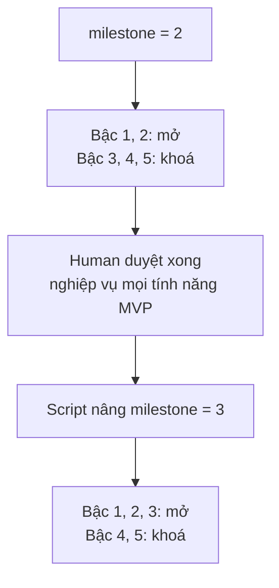
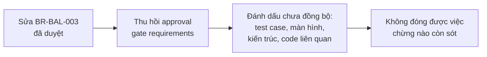
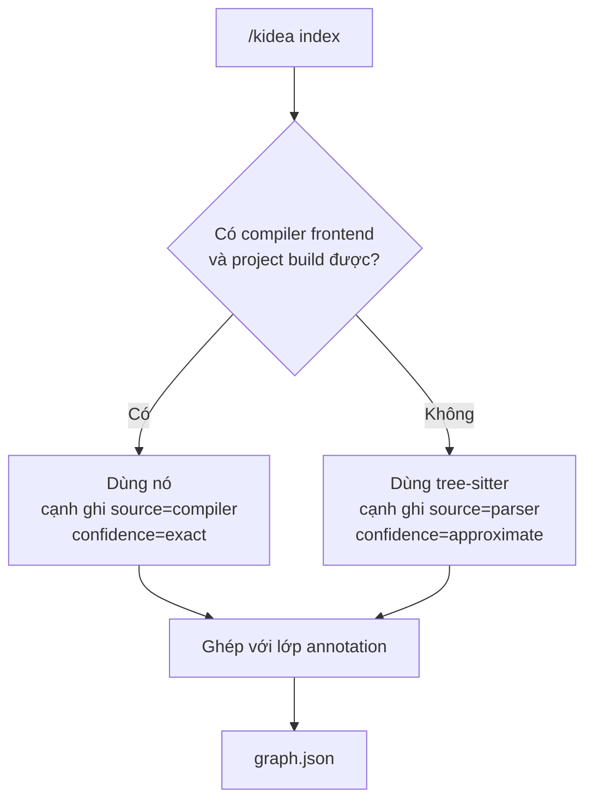
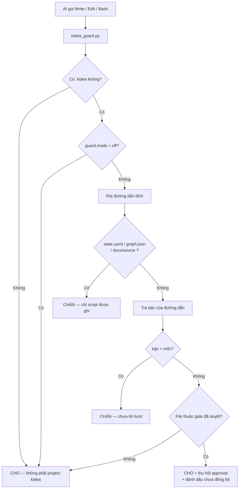
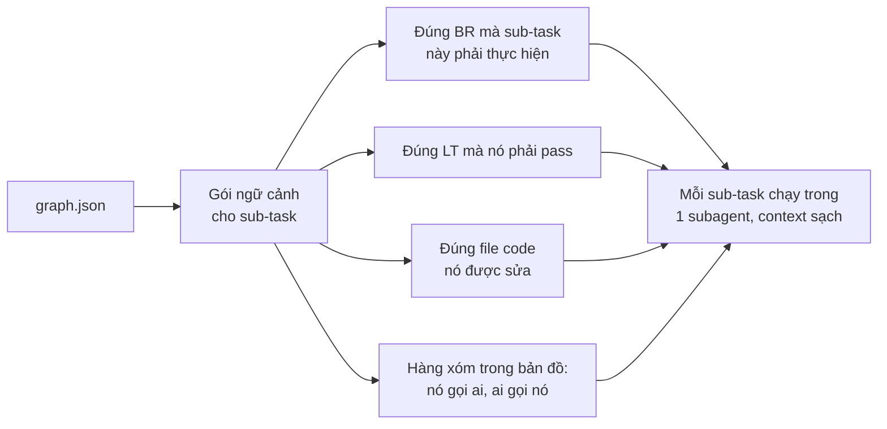

# KIDEA — Đặc tả kỹ thuật

Trạng thái: **Chờ Human duyệt**
Cập nhật: 2026-08-28
Tài liệu nền: [`KIDEA_DESIGN.md`](KIDEA_DESIGN.md)

Đây là bản đặc tả **đầy đủ và cuối cùng**, không chia phiên bản. Mọi thứ ghi trong đây đều sẽ được xây. Mọi thứ không ghi trong đây thì cố tình không xây — lý do ở mục 12.

---

## 0. Quyết định đã chốt

| # | Câu hỏi | Quyết định |
|---|---|---|
| 1 | Ngôn ngữ viết kidea | **Python** |
| 2 | Ngôn ngữ project đích | **Chờ chốt** — Rust hoặc C++20/26, xem mục 7 |
| 3 | Mức chặt của người gác | **Chặn cứng cả code lẫn tài liệu**, theo luật ở mục 2 |
| 4 | Dùng kidea xây kidea | **Không** |
| 5 | Chia phiên bản | **Không.** Xây một bản đầy đủ |

---

## 1. Hai khái niệm nền: bậc và mốc

Hai chữ này xuất hiện khắp tài liệu, nên định nghĩa trước.

### Bậc — thuộc tính của thư mục

**Bậc** là "thư mục này thuộc giai đoạn nào của quy trình". Nó gắn chết vào đường dẫn, không bao giờ đổi.

| Bậc | Thư mục | Giai đoạn |
|:---:|---|---|
| 1 | `docs/product/` | Sản phẩm làm gì, có những tính năng nào |
| 2 | `docs/requirements/` | Nghiệp vụ từng tính năng, quy tắc, bất biến |
| 3 | `docs/logical-tests/`, `docs/ux/` | Test case dạng chữ, thiết kế màn hình |
| 4 | `docs/architecture/` | Chia service, thiết kế dữ liệu, API |
| 5 | `src/`, `tests/`, `include/` | Code thật |

Cách nhớ: **bậc thấp trả lời "làm cái gì", bậc cao trả lời "làm thế nào"**. Không thể trả lời "làm thế nào" khi chưa biết "làm cái gì".

### Mốc — trạng thái hiện tại của project

**Mốc** là "hiện đang được phép làm tới bậc mấy". Nó là một con số trong `state.yaml`, tăng dần khi bạn duyệt xong một giai đoạn.

```yaml
milestone: 2
```

### Luật của người gác

```text
bậc của file  <=  mốc   →  CHO GHI
bậc của file  >   mốc   →  CHẶN
```

### Ví dụ cụ thể

Giả sử `milestone: 2` — bạn đang viết nghiệp vụ, chưa duyệt xong.

| AI muốn ghi vào | Bậc | Kết quả | Vì sao |
|---|:---:|---|---|
| `docs/product/overview.md` | 1 | **CHO** | 1 ≤ 2 |
| `docs/requirements/BR-BAL-003.md` | 2 | **CHO** | 2 ≤ 2, đúng việc đang làm |
| `docs/logical-tests/LT-ORDER-0042.md` | 3 | **CHẶN** | 3 > 2, nghiệp vụ chưa chốt mà đã viết test |
| `docs/architecture/services.md` | 4 | **CHẶN** | 4 > 2 |
| `src/balance/reserve.rs` | 5 | **CHẶN** | 5 > 2, đây là chỗ AI hay nhảy cóc nhất |

Khi bạn gõ `/kidea approve requirements` cho **mọi** tính năng MVP, script nâng `milestone: 2` → `3`. Ngay lập tức bậc 3 mở ra, bậc 4 và 5 vẫn khoá.



### Vì sao vẫn được sửa bậc thấp

Chú ý luật là `<=`, không phải `==`. Ở mốc 4 bạn vẫn sửa được tài liệu nghiệp vụ ở bậc 2.

Bởi vì **đổi ý về nghiệp vụ là chuyện bình thường**. kidea không cấm. Nhưng nếu tài liệu đó đã được duyệt, việc sửa sẽ kích hoạt:



Đây chính là câu bạn viết trong draft: *"khi sửa hoặc xoá thì truy ra các bên liên quan và làm đến cùng"*.

### Ba trường hợp chặn tuyệt đối

Không phụ thuộc mốc:

| Đường dẫn | Vì sao chặn |
|---|---|
| `.kidea/state.yaml` | Cuốn sổ trạng thái. AI ghi được thì nó tự phong "đã duyệt" cho chính mình |
| `.kidea/graph.json` | Tấm bản đồ. Phải sinh ra từ code, không được bịa |
| `docs/source/**` | Bản gốc tài liệu ChatGPT. Giữ nguyên để đối chiếu sau này |

---

## 2. Bố cục

### Repo này — nơi viết kidea

```text
kendrick-ai-tools-claude/
├── CLAUDE.md
├── design/
│   ├── KIDEA_DESIGN.md           # vì sao thiết kế như vậy
│   └── KIDEA_SPEC.md             # file này
└── skill/kidea/
    ├── SKILL.md                  # hướng dẫn cách AI suy nghĩ
    ├── scripts/
    │   ├── kidea.py              # điểm vào duy nhất
    │   ├── state.py              # đọc/ghi cuốn sổ
    │   ├── guard.py              # logic người gác
    │   ├── indexer.py            # dựng tấm bản đồ
    │   ├── parser_ts.py          # đọc code bằng tree-sitter
    │   ├── parser_clang.py       # đọc code bằng libclang (nếu chọn C++)
    │   ├── hashing.py            # băm nội dung, phát hiện lệch
    │   ├── contextpack.py        # gói ngữ cảnh cho từng sub-task
    │   └── validate.py
    ├── hook/kidea_guard.py       # bản copy vào project đích
    └── templates/
```

Khi dùng thật, `skill/kidea/` cài vào `~/.claude/skills/kidea/`.

### Project đích

```text
project-root/
├── CLAUDE.md
├── .kidea/
│   ├── kidea.yaml     # Human sở hữu, cấu hình
│   ├── state.yaml     # Script sở hữu, cuốn sổ trạng thái
│   ├── graph.json     # Sinh ra, tấm bản đồ
│   └── log.jsonl      # Chỉ ghi thêm, sổ bằng chứng
├── .claude/
│   ├── settings.json
│   └── hooks/kidea_guard.py
├── docs/
│   ├── source/        # bản gốc, bất biến
│   ├── product/       # bậc 1
│   ├── requirements/  # bậc 2
│   ├── logical-tests/ # bậc 3
│   ├── ux/            # bậc 3
│   ├── architecture/  # bậc 4
│   └── changes/       # CHANGE-*.md
└── src/ tests/        # bậc 5
```

Hook nằm **trong project đích**, không trong skill — để nó được commit cùng project, ai clone về cũng bị gác như nhau.

---

## 3. `.kidea/kidea.yaml` — Human sở hữu

```yaml
kidea_version: "1.0"
project_name: "san-crypto"
created_at: "2026-08-28T10:00:00+07:00"

language:
  primary: cpp                    # cpp | rust
  standard: "c++20"
  source_dirs: ["src", "include"]
  test_dirs: ["tests"]
  build:
    compile_commands: "build/compile_commands.json"
    test_command: "ctest --test-dir build"

profile:
  criticality: HIGH
  handles_money: true
  contains_pii: true

channels:
  customer_web: true
  customer_mobile: true
  admin_web: true

guard:
  mode: strict                    # strict | warn | off
  exempt_paths:
    - "README.md"
    - "CMakeLists.txt"
    - ".gitignore"
    - "build/**"
```

`guard.mode: off` tồn tại cho lúc khẩn cấp. Đổi nó là hành động **có ý thức và nhìn thấy trong git diff**, không phải AI tự lách.

---

## 4. `.kidea/state.yaml` — Script sở hữu

```yaml
kidea_version: "1.0"
phase: P2_REQUIREMENTS
milestone: 2
current_change: CHANGE-2026-0042

features:
  FEAT-MVP-ORDER-LIMIT:
    title: "Đặt lệnh Limit"
    scope: MVP
    risk: CRITICAL
    channels:
      customer_web: REQUIRED
      customer_mobile: REQUIRED
      admin_web: INSPECT_AND_CANCEL
    lifecycle: SPEC_APPROVED
    paths: []                     # slice start khai báo, người gác dùng
    gates:
      requirements:
        ai: REVIEWED_OK
        human: APPROVED
        approved_at: "2026-08-26T10:00:00+07:00"
        approved_commit: "a1b2c3d"
        approved_hash: "sha256:4a1f..."
        files:
          - path: docs/requirements/features/FEAT-MVP-ORDER-LIMIT.md
            hash: "sha256:7e9b..."
        stale: false
        blockers: []
      logical_tests: { ai: PENDING, human: PENDING, stale: false, blockers: [] }
      ux_web:        { ai: PENDING, human: PENDING, stale: false, blockers: [] }
      ux_mobile:     { ai: PENDING, human: PENDING, stale: false, blockers: [] }
      ux_admin:      { ai: PENDING, human: PENDING, stale: false, blockers: [] }
      architecture:  { ai: PENDING, human: PENDING, stale: false, blockers: [] }
      implementation:{ ai: PENDING, human: PENDING, stale: false, blockers: [] }
      release:       { ai: PENDING, human: PENDING, stale: false, blockers: [] }

  FEAT-MVP-ORDER-MARKET:
    title: "Đặt lệnh Market"
    scope: MVP
    lifecycle: DRAFT
    gates:
      requirements:
        ai: NEEDS_CLARIFICATION
        human: PENDING
        blockers:
          - id: BLK-001
            missing: "Thanh khoản không đủ thì xử lý thế nào"
            ai_suggestion: "Khớp được bao nhiêu thì khớp, phần còn lại huỷ"
            human_decision: null
```

### Giá trị hợp lệ

| Trường | Giá trị |
|---|---|
| `phase` | `P0_INIT` `P1_SCOPE` `P2_REQUIREMENTS` `P3_FOUNDATION` `P4_BUILD` |
| `milestone` | `1`…`5` |
| `lifecycle` | `DRAFT` `SPEC_APPROVED` `TESTS_APPROVED` `UX_APPROVED` `DESIGNED` `IMPLEMENTING` `DEV_VERIFIED` `RELEASED` |
| `gates.*.ai` | `PENDING` `REVIEWED_OK` `NEEDS_CLARIFICATION` |
| `gates.*.human` | `PENDING` `APPROVED` |
| `scope` | `MVP` `FUTURE` `IDEA` |
| `risk` | `LOW` `MEDIUM` `HIGH` `CRITICAL` |

### Ba luật bất khả xâm phạm

1. **`human: APPROVED` chỉ đặt được bởi lệnh `/kidea approve`.** Script kiểm tra một dấu hiệu do lệnh đó đặt ra; thiếu thì từ chối ghi.
2. **Không duyệt được khi `ai != REVIEWED_OK` hoặc còn `blockers`.** Bạn không duyệt thứ chính AI còn đang báo là thiếu.
3. **Không duyệt được khi working tree bẩn.** "Working tree bẩn" nghĩa là còn file đã sửa mà chưa commit. Duyệt là chụp lại dấu vân tay nội dung — chụp lúc nội dung còn đang thay đổi thì dấu vân tay vô nghĩa.

---

## 5. Annotation trong code

**Annotation** = dòng chú thích đặc biệt trong code, để máy đọc được. Đây là lớp ngữ nghĩa của tấm bản đồ.

C++:

```cpp
/// Giữ số dư cho một lệnh chờ khớp.
///
/// @kidea:feature FEAT-MVP-ORDER-LIMIT
/// @kidea:implements BR-BAL-003, BR-BAL-004
/// @kidea:invariant INV-BALANCE-001
ReservationId reserve_balance(const UserId& user, Decimal amount);
```

Rust:

```rust
/// @kidea:feature FEAT-MVP-ORDER-LIMIT
/// @kidea:implements BR-BAL-003, BR-BAL-004
pub fn reserve_balance(user_id: &UserId, amount: Decimal) -> Result<ReservationId> { }
```

Test, cả hai ngôn ngữ:

```cpp
// @kidea:covers LT-ORDER-0042, LT-ORDER-0043
TEST(BalanceTest, ReserveLocksAtomically) { }
```

Nhận diện bằng biểu thức:

```
@kidea:(feature|implements|invariant|covers|owns)\s+([A-Z0-9_-]+(?:\s*,\s*[A-Z0-9_-]+)*)
```

Cú pháp `///` của C++ và Rust giống nhau, nên **cùng một bộ luật chạy được cho cả hai**.

Tài liệu markdown khai bằng frontmatter:

```yaml
---
id: BR-BAL-003
kind: business-rule
feature: FEAT-MVP-ORDER-LIMIT
title: "Số dư bị giữ ngay khi lệnh được chấp nhận"
---
```

### Quy ước ID

| Tiền tố | Nghĩa |
|---|---|
| `FEAT-{MVP\|FUT\|IDEA}-<TÊN>` | Tính năng |
| `BR-<MIỀN>-<SỐ>` | Quy tắc nghiệp vụ |
| `INV-<MIỀN>-<SỐ>` | Bất biến |
| `LT-<MIỀN>-<SỐ>` | Logical test |
| `UX-{WEB\|MOB\|ADM}-<SỐ>` | Màn hình |
| `CHANGE-<NĂM>-<SỐ>` | Việc thay đổi |

---

## 6. `.kidea/graph.json` — sinh ra, không sửa tay

```json
{
  "generated_at": "2026-08-28T15:00:00+07:00",
  "generated_commit": "a1b2c3d",
  "engine": "libclang",
  "nodes": [
    { "id": "BR-BAL-003", "kind": "business-rule",
      "path": "docs/requirements/business-rules/BR-BAL-003.md",
      "content_hash": "sha256:9f2c...", "synced_with": "CHANGE-2026-0042" },
    { "id": "cpp:balance::reserve_balance(UserId const&, Decimal)",
      "kind": "code-symbol", "path": "src/balance/reserve.cpp", "line": 42,
      "content_hash": "sha256:3d81...", "confidence": "exact" }
  ],
  "edges": [
    { "from": "cpp:balance::reserve_balance(UserId const&, Decimal)",
      "to": "BR-BAL-003", "kind": "implements", "source": "annotation" },
    { "from": "cpp:order::place_order(Order const&)",
      "to": "cpp:balance::reserve_balance(UserId const&, Decimal)",
      "kind": "calls", "source": "compiler", "confidence": "exact" }
  ]
}
```

Mỗi cạnh ghi rõ `source`: `annotation` (người viết) hay `parser`/`compiler` (máy đọc).

---

## 7. Đọc code: hai động cơ, và chuyện Rust so với C++

### Hai cách đọc code

| | **tree-sitter** | **Compiler frontend** |
|---|---|---|
| Đọc cái gì | Chỉ **cú pháp** — hình dạng chữ | **Ngữ nghĩa** — hiểu như trình biên dịch |
| Cần project biên dịch được | Không | **Có** |
| Tốc độ | Nhanh | Chậm hơn nhiều |
| Chạy trên code chưa xong | **Được** | Không |

**Cú pháp** là hình dạng: "đây là một lời gọi hàm tên `foo`". **Ngữ nghĩa** là ý nghĩa: "`foo` này chính là hàm định nghĩa ở dòng 42 file kia, chứ không phải `foo` trùng tên ở chỗ khác".

### Khác biệt giữa hai ngôn ngữ

| | Rust | C++20/26 |
|---|---|---|
| tree-sitter | Có | Có |
| Compiler frontend cho Python | **Không có bản chính thức** — rust-analyzer không mở API ổn định | **`libclang`, có binding Python chính thức, đã dùng nhiều năm** |
| Đọc xuyên qua macro | Không | **Có** (libclang chạy sau bước tiền xử lý) |
| Phân giải overload / template | Không cần (Rust ít nhập nhằng hơn) | **Giải được** khi có compiler frontend |
| Gọi qua `dyn Trait` / hàm ảo | Sót | Sót — **hai bên như nhau** |
| Doxygen dùng được | Không | **Có** |

### Kết luận thẳng

**Về mặt đọc code, C++ dễ hơn Rust** — ngược với trực giác. Không phải vì C++ đơn giản hơn (nó phức tạp hơn nhiều), mà vì **Clang mở cửa cho người ngoài vào đọc**, còn Rust thì chưa.

Và bạn đã tự nói ra từ đầu: *"index như kiểu Doxygen bên c++ ấy"*. Doxygen chạy trên C++ là thật và đã chạy 20 năm. Doxygen không đọc được Rust.

### Nhưng đừng chọn ngôn ngữ vì kidea

Đây là điều quan trọng nhất trong mục này.

**Chọn ngôn ngữ theo cái sản phẩm của bạn cần**, không phải theo cái tiện cho công cụ. Chọn C++ chỉ vì kidea dễ đọc hơn là để cái đuôi vẫy con chó.

Vì phần **quan trọng nhất của tấm bản đồ là lớp annotation**, mà lớp đó **giống hệt nhau ở cả hai ngôn ngữ**. Lớp máy tự đọc chỉ là phần bổ trợ.

### Thiết kế cuối: động cơ lai, tự chọn

kidea không khoá vào một động cơ:



Với C++ thì nhánh trái chạy khi có `compile_commands.json`. Với Rust thì hiện chỉ có nhánh phải.

**Và luật gác cổng chỉ dựa trên lớp annotation, bất kể động cơ nào.** Không xây luật cứng lên trên dữ liệu xấp xỉ.

> `compile_commands.json` là file do CMake sinh ra khi bật `CMAKE_EXPORT_COMPILE_COMMANDS`. Nó liệt kê chính xác lệnh biên dịch từng file. Có nó thì libclang đọc code y như trình biên dịch đọc.

---

## 8. `.kidea/log.jsonl` — sổ bằng chứng

Mỗi dòng một sự kiện, chỉ ghi thêm, không sửa không xoá.

```json
{"ts":"2026-08-28T15:00:00+07:00","event":"gate_approved","gate":"requirements","feature":"FEAT-MVP-ORDER-LIMIT","actor":"human","commit":"a1b2c3d","hash":"sha256:4a1f..."}
{"ts":"2026-08-28T16:12:00+07:00","event":"guard_denied","tool":"Write","path":"src/order/market.cpp","reason":"milestone=2, path stage=5"}
{"ts":"2026-08-29T09:03:00+07:00","event":"approval_revoked","gate":"requirements","feature":"FEAT-MVP-ORDER-LIMIT","cause":"content_hash_changed"}
```

Khi có sự cố, bạn xem lại được ai duyệt gì, lúc nào, trên commit nào.

---

## 9. Người gác cổng

Chạy như hook loại `PreToolUse` — nghĩa là Claude Code gọi nó **trước** khi cho AI dùng công cụ `Write`, `Edit` hay `Bash`.



Với `Bash`, người gác đọc câu lệnh và chặn nếu thấy dạng ghi file (`>`, `>>`, `tee`, `sed -i`, `cp`, `mv`) trỏ vào đường dẫn cấm. Đây là lưới chắn thô: chặn được đường vòng hiển nhiên, không chặn được người cố tình phá. Chấp nhận được — mục tiêu là chống AI trôi dạt.

### Thông điệp khi chặn phải nói ba điều

Nếu không, AI sẽ loay hoay thử lại bằng cách khác:

```text
KIDEA CHẶN: không được ghi src/order/market.cpp

  Lý do : đường dẫn thuộc bậc 5 (code), mốc hiện tại là bậc 2 (nghiệp vụ)
  Kẹt ở : FEAT-MVP-ORDER-MARKET, trạm REQUIREMENTS
  Thiếu : chính sách trượt giá; có cho phép khớp một phần không

  Việc hợp lệ tiếp theo:
    - Bổ sung docs/requirements/features/FEAT-MVP-ORDER-MARKET.md
    - Rồi Human gõ: /kidea approve requirements FEAT-MVP-ORDER-MARKET
```

---

## 10. Chín lệnh

### `/kidea init <path>` — tạo project mới

Điều kiện: đang trong git repo · `.kidea/` chưa có · working tree sạch · `<path>` có ít nhất một file `.md`.

1. Chép `<path>` vào `docs/source/import-<ngày>/`, đặt chỉ đọc.
2. Hỏi Human vài câu để dựng `kidea.yaml`.
3. Sinh `state.yaml`: `phase: P1_SCOPE`, `milestone: 1`.
4. Chép hook vào `.claude/hooks/`, đăng ký trong `.claude/settings.json`.
5. Sinh `CLAUDE.md`, giữ nguyên phần Human viết ngoài marker `<!-- kidea:start -->`.
6. AI đọc tài liệu nguồn, đề xuất danh sách tính năng kèm ID, ghi `docs/product/feature-catalog.md`.
7. Chạy `check`, in báo cáo. **Dừng lại, không tự sang bước sau.**

### `/kidea init` — mở lại project cũ

Không có path. Tìm `.kidea/` ngược lên từ thư mục hiện tại.
Không thấy → gợi ý `init <path>` hoặc `adopt`.
Thấy → đọc state, chạy `check` ngầm, in bảng định hướng: project làm gì · mốc hiện tại · bảng tính năng · blocker · thứ chưa đồng bộ · lệnh hợp lệ tiếp theo.

### `/kidea status`

Chỉ đọc. In mốc, bảng tính năng, blocker kèm đề xuất của AI, danh sách chưa đồng bộ, lệnh hợp lệ tiếp theo.

### `/kidea check`

| Kiểm tra | Hỏng thì sao |
|---|---|
| `state.yaml` đúng schema | Lỗi nặng, dừng |
| Mọi ID được nhắc đều tồn tại | Lỗi nặng |
| Không có ID trùng | Lỗi nặng |
| Link markdown không gãy | Cảnh báo |
| Hash tài liệu đã duyệt còn khớp | Thu hồi approval, đánh dấu chưa đồng bộ |
| BR nào chưa có LT cover | Cảnh báo |
| FEAT nào chưa có BR | Cảnh báo |
| LT nào chưa có test code cover | Cảnh báo |
| `synced_with` cũ hơn change hiện tại | Liệt kê nợ |

Ghi kết quả ngược vào `state.yaml`, ghi log. Mã thoát 0 nếu sạch, 1 nếu có lỗi nặng.

### `/kidea index`

Dựng lại `graph.json`: quét frontmatter tài liệu → node; quét code bằng động cơ chọn được ở mục 7 → node ký hiệu, cạnh `calls`/`imports`; rút `@kidea:` → cạnh `implements`/`covers`. In thống kê và danh sách mồ côi.

### `/kidea approve <gate> [feature]`

**Chỉ Human gõ.** Lệnh duy nhất đặt được `human: APPROVED`.

Điều kiện: `ai == REVIEWED_OK` · `blockers` rỗng · working tree sạch · `check` không lỗi nặng.

Tính `sha256` từng file thuộc gate; hash của gate = `sha256` của danh sách `(đường dẫn, hash)` đã sắp xếp. Lưu hash, commit, thời điểm, danh sách file. Ghi log. Nâng `lifecycle`. Nếu **mọi** tính năng MVP đã qua gate này thì nâng `milestone` — người gác lập tức mở bậc kế tiếp.

Gate không xác định được danh sách file thì từ chối: **không duyệt thứ không biết nội dung là gì**.

### `/kidea impact <id>`

Đọc `graph.json`, duyệt xuôi từ node, in theo nhóm, kèm danh sách approval sẽ bị thu hồi. Cạnh từ tree-sitter in kèm cảnh báo có thể sót.

### `/kidea change <type> "<lý do>"`

**Đây là thứ làm cho cơ chế "chưa đồng bộ" hoạt động được.** Không có nó thì `synced_with` không trỏ vào đâu cả.

Loại: `feature` `bug` `hotfix` `refactor` `migration` `deps` `infra`.

1. Sinh `docs/changes/CHANGE-<năm>-<số>.md` từ template riêng của từng loại.
2. Đặt `state.current_change`.
3. Từ đây mọi thay đổi được đóng dấu `synced_with: <change-id>`.

`/kidea change close` đóng việc — **từ chối nếu còn thứ chưa đồng bộ**. Đây là cách kidea ép "làm đến cùng".

Loại `hotfix` được phép bỏ qua một số trạm, nhưng bắt buộc sinh một bản `WAIVER` ghi rõ bỏ qua cái gì, ai duyệt, và phải trả nợ trước hạn nào.

### `/kidea slice <start|plan|verify> <feature>`

Vòng lặp làm một tính năng trọn vẹn từ nghiệp vụ tới code.

**`start`** — kiểm tra tính năng đã qua các trạm cần thiết; khai báo danh sách đường dẫn code mà slice này được đụng vào (ghi `features.<id>.paths`); mở bậc 5 **chỉ cho những đường dẫn đó**. Đây là cách người gác biết file code nào thuộc tính năng nào.

**`plan`** — AI chia slice thành sub-task. Với mỗi sub-task, script sinh **gói ngữ cảnh** từ `graph.json`:



**Subagent** = một phiên Claude con, có bộ nhớ ngữ cảnh riêng, hoàn toàn trống khi bắt đầu. Đây chính là điều bạn viết trong draft: *"mỗi task con khi bắt đầu thì load lại context để hiểu cho trọn vẹn, tránh hallucinate... tiết kiệm token trong khi context sạch"*.

**`verify`** — chạy `language.build.test_command`; kiểm tra mọi LT của tính năng đều có test code cover; kiểm tra code mới có annotation; báo cáo. Không tự duyệt — Human vẫn phải gõ `approve`.

### `/kidea adopt`

Cho project đã có code nhưng chưa có `.kidea/`. Quét code, suy ra module, dựng `state.yaml` với mọi thứ ở `DRAFT`, liệt kê chỗ thiếu tài liệu. **Không bịa ra nghiệp vụ** — chỉ vẽ lại cái đang có và chỉ ra lỗ hổng.

---

## 11. Toàn bộ trạm kiểm tra

Bản đầy đủ, không cắt bớt:

| Trạm | Human duyệt cái gì | Mở ra bậc |
|---|---|:---:|
| `scope` | MVP / Future / Idea, actor, channel matrix | 2 |
| `requirements` | Nghiệp vụ, quy tắc, bất biến từng tính năng MVP | 3 |
| `logical_tests` | Test case dạng chữ, độ bao phủ | — |
| `ux_web` / `ux_mobile` / `ux_admin` | Màn hình, trạng thái, dữ liệu cần | 4 |
| `architecture` | Chia service, dữ liệu, API, vận hành | 5 |
| `implementation` | Code chạy, test pass, Human xác nhận | — |
| `release` | Sẵn sàng lên production | — |

`logical_tests` và `ux_*` chạy **song song** — cả hai xong mới mở bậc 4.

---

## 12. Những gì kidea cố tình KHÔNG làm

Đây không phải hoãn lại. Đây là quyết định vĩnh viễn, có lý do.

| Không làm | Vì sao |
|---|---|
| **Không deploy** | kidea *gác* việc deploy — kiểm tra đủ approval chưa. Việc deploy vẫn do script/CI của bạn chạy. Viết lại công cụ deploy là vẽ thêm việc |
| **Không tự chạy test** | kidea gọi đúng câu lệnh bạn khai trong `kidea.yaml` rồi đọc mã thoát. Không đẻ ra bộ chạy test riêng |
| **Không viết nghiệp vụ thay bạn** | Nó audit, hỏi, đề xuất. Quyết định là của bạn. Nếu AI vừa viết vừa tự duyệt thì cả hệ thống vô nghĩa |
| **Không quản lý hạ tầng, môi trường** | Ngoài phạm vi. Đó là việc của Terraform/Ansible/K8s |
| **Không có `/kidea next`** | Từng định làm. Cắt: nó chỉ là vỏ bọc tiện tay của `status`, không thêm giá trị |
| **Không có giao diện web** | Mọi thứ là file text trong repo, đọc bằng editor hoặc GitHub. Thêm giao diện là thêm một thứ phải nuôi |
| **Không tự sinh call graph chính xác cho Rust** | Rust chưa mở API. Đã xử lý bằng động cơ lai ở mục 7 |

---

## 13. Thứ tự xây và thứ bạn nhìn thấy

**"Không chia phiên bản" khác với "làm mọi thứ cùng lúc".** Không có phiên bản nghĩa là không có bản v0.1 rồi v0.2 phải nâng cấp — chỉ có một bản duy nhất. Nhưng vẫn phải viết file này trước file kia, và tôi sắp thứ tự sao cho **bạn nhìn thấy thứ chạy được sớm nhất có thể**, để nếu thiết kế sai thì phát hiện lúc còn rẻ.

| # | Xây gì | Xong thì bạn **tự tay thử** được gì |
|:---:|---|---|
| 1 | Cuốn sổ + schema + bộ test | Chưa thấy gì. Nền móng |
| 2 | Người gác + hook | **Bảo tôi viết code khi trạm chưa qua, xem tôi bị chặn** |
| 3 | `init` + `status` | **Đưa tài liệu ChatGPT thật vào, xem kidea báo cáo thiếu gì** |
| 4 | `check` + `approve` | **Duyệt 1 trạm, rồi sửa tài liệu, xem approval bị thu hồi** |
| 5 | Đọc code + `index` + `impact` | **Hỏi "sửa quy tắc này ảnh hưởng đâu" trên code thật** |
| 6 | `change` + đóng dấu chưa đồng bộ | **Mở một việc sửa, xem kidea không cho đóng khi còn sót** |
| 7 | `slice` + gói ngữ cảnh + subagent | **Làm trọn 1 tính năng, mỗi sub-task chạy context sạch** |
| 8 | `adopt` | **Kéo một project cũ của bạn vào kidea** |
| 9 | Chạy thật trên project của bạn | Tìm chỗ thiết kế sai, sửa |

Mốc số 2 là mốc quan trọng nhất — đó là lúc bạn biết ý tưởng cốt lõi có hoạt động thật không.

---

## 14. Chỗ tôi nghĩ có thể sai

1. **Hook chặn `Bash` không sạch.** Đoán câu lệnh shell ghi vào đâu là việc bẩn. Chặn được dạng phổ biến, chắc chắn còn đường vòng tôi chưa nghĩ ra.
2. **Ranh giới bậc có thể quá thô.** Đời thật có file không thuộc bậc nào rõ ràng: `CMakeLists.txt`, script migration, file cấu hình, thư mục `build/`, `third_party/`. Có danh sách miễn trừ nhưng sẽ phải chỉnh dần. **Nếu chọn C++ thì chỗ này nặng hơn Rust**, vì C++ có nhiều thư mục phụ trợ hơn.
3. **Cạnh từ tree-sitter sẽ sót.** Đã xử lý: gác cổng chỉ dựa trên annotation.
4. **Ép working tree sạch trước khi duyệt có thể phiền.** Đúng về kỹ thuật, nhưng phải dùng thật mới biết có khó chịu không.
5. **`slice` và gói ngữ cảnh là phần tôi đoán nhiều nhất.** Sáu phần đầu dựa trên luật rõ ràng. Phần này dựa trên phỏng đoán về cách bạn làm việc, nên khả năng phải sửa lại sau khi dùng thật là cao nhất.

---

## 15. Cần bạn quyết

1. **Rust hay C++20/26?** Xem mục 7. Chọn theo sản phẩm, đừng chọn theo kidea.
2. **Nếu C++: dùng CMake chứ?** Cần `compile_commands.json` để bật động cơ chính xác.
3. **Bố cục thư mục code dự kiến?** Ảnh hưởng trực tiếp tới ranh giới bậc — xem rủi ro số 2 ở mục 14.

Duyệt xong, tôi bắt đầu từ mục 13 bước 1.
