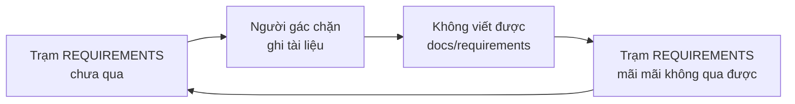
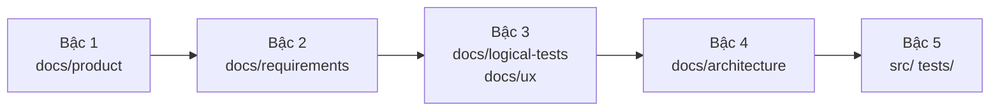
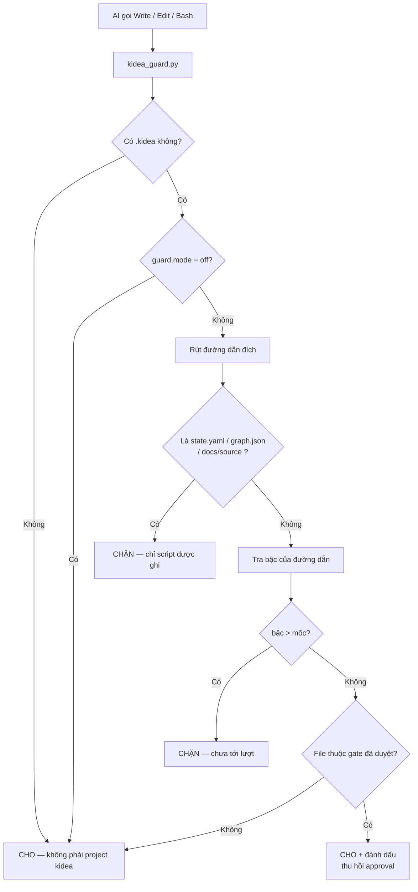
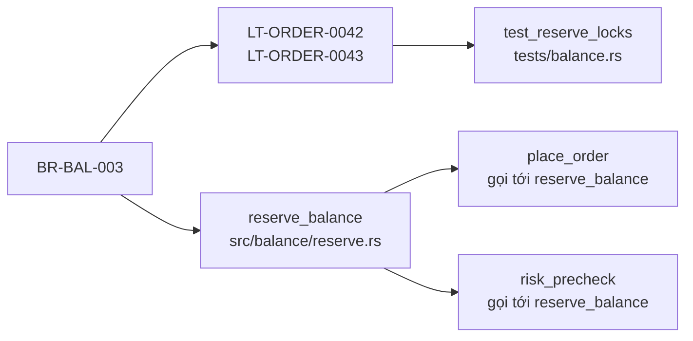
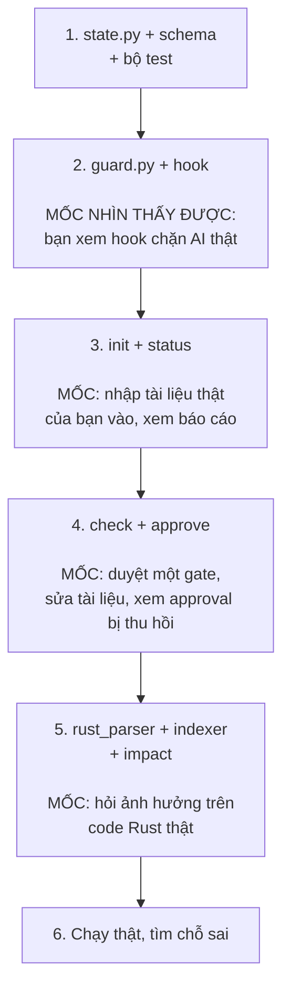

# KIDEA — Đặc tả kỹ thuật v0.1

Trạng thái: **Chờ Human duyệt**
Ngày: 2026-08-28
Tài liệu nền: [`KIDEA_DESIGN_V0.1.md`](KIDEA_DESIGN_V0.1.md)

Tài liệu này mô tả chính xác từng file, từng luật, từng lệnh — đủ chi tiết để viết code mà không phải đoán.

---

## 0. Quyết định đã chốt

| # | Câu hỏi | Quyết định |
|---|---|---|
| 1 | Ngôn ngữ script | **Python** |
| 2 | Ngôn ngữ project đầu tiên | **Rust** |
| 3 | Mức chặt của người gác | **Chặn cứng cả code lẫn tài liệu** |
| 4 | Dùng kidea xây kidea | **Không**, ở v0.1 |

---

## 1. Câu 3 có một cái bẫy — cách tôi xử lý

Bạn chọn chặn cứng cả tài liệu. Nếu hiểu theo nghĩa đen nhất thì hệ thống **tự khoá chính nó**:



Muốn qua trạm nghiệp vụ thì phải viết tài liệu nghiệp vụ. Chặn viết tài liệu thì không bao giờ qua trạm.

**Nên tôi hiểu ý bạn là:** không phải "cấm viết tài liệu", mà là **"cấm viết tài liệu của bước sau khi bước trước chưa xong"**.

Tức là AI không được nhảy sang viết tài liệu kiến trúc khi nghiệp vụ còn dang dở. Đó mới đúng tinh thần "không nhảy cóc".

### Luật viết chính thức

Mỗi đường dẫn thuộc về một **bậc**. Bậc hiện tại gọi là **mốc**.



Ba phán quyết của người gác:

| Trường hợp | Phán quyết |
|---|---|
| Ghi vào bậc **bằng hoặc thấp hơn** mốc | **CHO** |
| Ghi vào bậc **cao hơn** mốc | **CHẶN** |
| Ghi vào tài liệu **đã duyệt** ở bậc thấp hơn | **CHO**, nhưng thu hồi approval và đánh dấu mọi thứ phía sau là chưa đồng bộ |
| Ghi vào `.kidea/state.yaml`, `.kidea/graph.json` | **CHẶN** luôn — chỉ script được ghi |
| Ghi vào `docs/source/**` | **CHẶN** luôn — bản gốc bất biến |

Hàng thứ ba quan trọng: **bạn luôn được quyền đổi ý về nghiệp vụ**. kidea không cấm, nó chỉ bắt mọi thứ phía sau phải làm lại cho khớp.

Nếu bạn muốn nghĩa đen hơn nữa — kể cả sửa tài liệu bậc thấp cũng phải xin phép — thì báo tôi, nhưng tôi không khuyến nghị.

---

## 2. Bố cục

### Repo này (nơi phát triển kidea)

```text
kendrick-ai-tools-claude/
├── CLAUDE.md
├── design/
│   ├── KIDEA_DESIGN_V0.1.md      # vì sao thiết kế như vậy
│   └── KIDEA_SPEC_V0.1.md        # file này
└── skill/kidea/                  # code kidea
    ├── SKILL.md
    ├── scripts/
    │   ├── kidea.py              # điểm vào duy nhất
    │   ├── state.py              # đọc/ghi state.yaml
    │   ├── guard.py              # logic người gác
    │   ├── indexer.py            # dựng graph.json
    │   ├── rust_parser.py        # đọc code Rust
    │   ├── hashing.py            # băm nội dung, phát hiện lệch
    │   └── validate.py
    ├── hook/
    │   └── kidea_guard.py        # bản sẽ copy vào project đích
    └── templates/
        ├── kidea.yaml.tmpl
        ├── state.yaml.tmpl
        ├── CLAUDE.md.tmpl
        └── docs/...
```

Khi dùng thật, `skill/kidea/` được cài vào `~/.claude/skills/kidea/`.

### Project đích (project bạn xây bằng kidea)

```text
project-root/
├── CLAUDE.md
├── .kidea/
│   ├── kidea.yaml
│   ├── state.yaml
│   ├── graph.json
│   └── log.jsonl
├── .claude/
│   ├── settings.json             # kidea ghi vào để đăng ký hook
│   └── hooks/kidea_guard.py      # kidea copy vào
├── docs/
│   ├── source/import-2026-08-28/ # bản gốc ChatGPT, bất biến
│   ├── product/
│   ├── requirements/
│   ├── logical-tests/
│   ├── ux/
│   └── architecture/
├── src/
└── tests/
```

Hook nằm **trong project đích**, không nằm trong skill. Lý do: nó phải được commit cùng project, để bất kỳ ai clone về cũng bị gác như nhau.

---

## 3. `.kidea/kidea.yaml` — Human sở hữu

Cấu hình ít khi đổi. Người gác đọc nhưng không ghi.

```yaml
kidea_version: "0.1"
project_name: "san-crypto"
created_at: "2026-08-28T10:00:00+07:00"

language:
  primary: rust
  source_dirs: ["src", "crates"]
  test_dirs: ["tests"]

profile:
  criticality: HIGH
  handles_money: true
  contains_pii: true
  realtime_required: true

channels:
  customer_web: true
  customer_mobile: true
  admin_web: true
  public_api: false

guard:
  mode: strict          # strict | warn | off
  code_paths: ["src/**", "crates/**", "tests/**"]
  exempt_paths: ["README.md", "*.log", ".gitignore"]
```

`guard.mode: off` tồn tại cho trường hợp khẩn cấp. Đổi nó là một hành động **có ý thức, thấy được trong git diff**, chứ không phải AI tự lách.

---

## 4. `.kidea/state.yaml` — Script sở hữu

Đây là cuốn sổ công trường. **AI không được ghi trực tiếp, người gác chặn.**

```yaml
kidea_version: "0.1"
phase: P2_REQUIREMENTS
current_change: null

milestone: 2        # mốc hiện tại, quyết định người gác cho ghi tới bậc nào

features:
  FEAT-MVP-ORDER-LIMIT:
    title: "Đặt lệnh Limit"
    scope: MVP
    risk: CRITICAL
    channels:
      customer_web: REQUIRED
      customer_mobile: REQUIRED
      admin_web: INSPECT_AND_CANCEL
    lifecycle: SPEC_APPROVED
    docs:
      - docs/requirements/features/FEAT-MVP-ORDER-LIMIT.md
    gates:
      requirements:
        ai: REVIEWED_OK
        human: APPROVED
        approved_at: "2026-08-26T10:00:00+07:00"
        approved_commit: "a1b2c3d"
        approved_hash: "sha256:4a1f..."
        files:
          - path: docs/requirements/features/FEAT-MVP-ORDER-LIMIT.md
            hash: "sha256:7e9b..."
        stale: false
        blockers: []
      logical_tests:
        ai: PENDING
        human: PENDING
        stale: false
        blockers: []

  FEAT-MVP-ORDER-MARKET:
    title: "Đặt lệnh Market"
    scope: MVP
    risk: CRITICAL
    lifecycle: DRAFT
    gates:
      requirements:
        ai: NEEDS_CLARIFICATION
        human: PENDING
        stale: false
        blockers:
          - id: BLK-001
            missing: "Thanh khoản không đủ thì xử lý thế nào"
            ai_suggestion: "Khớp được bao nhiêu thì khớp, phần còn lại huỷ"
            human_decision: null
```

### Giá trị hợp lệ

| Trường | Giá trị |
|---|---|
| `phase` | `P0_INIT` `P1_SCOPE` `P2_REQUIREMENTS` `P3_FOUNDATION` `P4_BUILD` |
| `lifecycle` | `DRAFT` `SPEC_APPROVED` `TESTS_APPROVED` `UX_APPROVED` `DESIGNED` `IMPLEMENTING` `DEV_VERIFIED` `RELEASED` |
| `gates.*.ai` | `PENDING` `REVIEWED_OK` `NEEDS_CLARIFICATION` |
| `gates.*.human` | `PENDING` `APPROVED` |
| `scope` | `MVP` `FUTURE` `IDEA` |
| `risk` | `LOW` `MEDIUM` `HIGH` `CRITICAL` |

### Hai luật bất khả xâm phạm

1. **`human: APPROVED` chỉ được đặt bởi lệnh `/kidea approve`.** Script kiểm tra biến môi trường do lệnh này đặt; thiếu nó thì từ chối ghi.
2. **Không đặt được `human: APPROVED` khi `ai != REVIEWED_OK` hoặc còn `blockers`.** Bạn không duyệt được thứ chính AI còn đang báo là thiếu.

---

## 5. Annotation trong code Rust

Đặt trong comment ngay trên item.

```rust
/// Giữ số dư cho một lệnh chờ khớp.
///
/// @kidea:feature FEAT-MVP-ORDER-LIMIT
/// @kidea:implements BR-BAL-003, BR-BAL-004
/// @kidea:invariant INV-BALANCE-001
pub fn reserve_balance(user_id: &UserId, amount: Decimal) -> Result<ReservationId> {
    ...
}
```

```rust
// @kidea:covers LT-ORDER-0042, LT-ORDER-0043
#[test]
fn reserve_balance_locks_atomically() { ... }
```

Dùng được cả `///` và `//`. Nhận diện bằng regex:

```
@kidea:(feature|implements|invariant|covers|owns)\s+([A-Z0-9-]+(?:\s*,\s*[A-Z0-9-]+)*)
```

Tài liệu markdown khai bằng frontmatter:

```yaml
---
id: BR-BAL-003
kind: business-rule
feature: FEAT-MVP-ORDER-LIMIT
title: "Số dư bị giữ ngay khi lệnh được chấp nhận"
---
```

### Quy ước ID

| Tiền tố | Nghĩa |
|---|---|
| `FEAT-{MVP\|FUT\|IDEA}-<TÊN>` | Tính năng |
| `BR-<MIỀN>-<SỐ>` | Quy tắc nghiệp vụ |
| `INV-<MIỀN>-<SỐ>` | Bất biến |
| `LT-<MIỀN>-<SỐ>` | Logical test |
| `UX-{WEB\|MOB\|ADM}-<SỐ>` | Màn hình |
| `CHANGE-<NĂM>-<SỐ>` | Việc thay đổi |

---

## 6. `.kidea/graph.json` — sinh ra, không sửa tay

```json
{
  "generated_at": "2026-08-28T15:00:00+07:00",
  "generated_commit": "a1b2c3d",
  "nodes": [
    {
      "id": "BR-BAL-003",
      "kind": "business-rule",
      "path": "docs/requirements/business-rules/BR-BAL-003.md",
      "content_hash": "sha256:9f2c...",
      "synced_with": "CHANGE-2026-0042"
    },
    {
      "id": "rust:crate::balance::reserve_balance",
      "kind": "code-symbol",
      "path": "src/balance/reserve.rs",
      "line": 42,
      "content_hash": "sha256:3d81...",
      "confidence": "exact"
    }
  ],
  "edges": [
    { "from": "rust:crate::balance::reserve_balance",
      "to": "BR-BAL-003",
      "kind": "implements",
      "source": "annotation" },
    { "from": "rust:crate::order::place_order",
      "to": "rust:crate::balance::reserve_balance",
      "kind": "calls",
      "source": "parser",
      "confidence": "approximate" }
  ]
}
```

### Hai nguồn cạnh, hai mức tin cậy

| Nguồn | Cách lấy | Độ tin |
|---|---|---|
| `annotation` | Đọc `@kidea:` trong code | **Chính xác** — người viết ra |
| `parser` | tree-sitter đọc cú pháp Rust | **Xấp xỉ** — xem bên dưới |

### Nói thẳng về giới hạn với Rust

Dựng call graph Rust chính xác 100% là **không làm được** bằng tree-sitter. Rust có trait dispatch, generic, macro, closure — muốn chính xác phải chạy qua `rustc` hoặc `rust-analyzer`, tức là project phải biên dịch được, chậm và nặng.

Nên v0.1 chọn tree-sitter và chấp nhận xấp xỉ:

| Loại cạnh | Chất lượng |
|---|---|
| `use` / import giữa module | Chính xác |
| Gọi hàm trực tiếp `foo::bar()` | Chính xác |
| Gọi method trên kiểu cụ thể | Gần chính xác |
| Gọi qua trait `dyn Trait` | **Bỏ sót** |
| Code sinh bởi macro | **Bỏ sót** |

**Hệ quả thiết kế, rất quan trọng:**

> Cạnh từ **annotation** là nguồn sự thật, được dùng để gác cổng.
> Cạnh từ **parser** chỉ để gợi ý khi trả lời `impact`, và luôn hiện kèm cảnh báo có thể sót.

Không xây luật cứng lên trên dữ liệu xấp xỉ. Nếu sau này bạn muốn chính xác tuyệt đối, v0.3 có thể thêm nguồn từ `rust-analyzer`.

---

## 7. `.kidea/log.jsonl` — chỉ ghi thêm

Mỗi dòng một sự kiện. Không sửa, không xoá.

```json
{"ts":"2026-08-28T15:00:00+07:00","event":"gate_approved","gate":"requirements","feature":"FEAT-MVP-ORDER-LIMIT","actor":"human","commit":"a1b2c3d","hash":"sha256:4a1f..."}
{"ts":"2026-08-28T16:12:00+07:00","event":"guard_denied","tool":"Write","path":"src/order/market.rs","reason":"milestone=2, path stage=5"}
{"ts":"2026-08-29T09:03:00+07:00","event":"approval_revoked","gate":"requirements","feature":"FEAT-MVP-ORDER-LIMIT","cause":"content_hash_changed"}
```

Đây là bằng chứng. Khi có sự cố, bạn xem lại được ai duyệt gì, lúc nào, trên commit nào.

---

## 8. Người gác cổng

Chạy như `PreToolUse` hook, khớp với `Write`, `Edit`, và `Bash`.



Với `Bash`, người gác đọc câu lệnh và chặn nếu thấy dạng ghi file (`>`, `>>`, `tee`, `sed -i`, `cp`, `mv`) trỏ vào đường dẫn bị cấm. Đây là lưới chắn thô — nó chặn được đường vòng hiển nhiên, không chặn được người cố tình. Chấp nhận được: mục tiêu là chống AI trôi dạt, không phải chống kẻ tấn công.

### Thông điệp khi chặn

Phải nói được ba điều, nếu không AI sẽ loay hoay thử lại:

```
KIDEA CHẶN: không được ghi src/order/market.rs

  Lý do : đường dẫn thuộc bậc 5 (code), mốc hiện tại là bậc 2 (nghiệp vụ)
  Kẹt ở : FEAT-MVP-ORDER-MARKET, trạm REQUIREMENTS
  Thiếu : chính sách trượt giá; có cho phép khớp một phần không

  Việc hợp lệ tiếp theo:
    - Bổ sung docs/requirements/features/FEAT-MVP-ORDER-MARKET.md
    - Rồi Human gõ: /kidea approve requirements FEAT-MVP-ORDER-MARKET
```

---

## 9. Sáu lệnh của v0.1

### `/kidea init <path>` — tạo project mới

**Điều kiện:** đang trong git repo · `.kidea/` chưa tồn tại · working tree sạch · `<path>` tồn tại và có ít nhất một file `.md`.

1. Chép `<path>` vào `docs/source/import-<ngày>/`, đặt chỉ đọc.
2. Hỏi Human vài câu để dựng `kidea.yaml` (ngôn ngữ, channel, mức nghiêm trọng).
3. Sinh `state.yaml` với `phase: P1_SCOPE`, `milestone: 1`.
4. Chép hook vào `.claude/hooks/`, đăng ký trong `.claude/settings.json`.
5. Sinh `CLAUDE.md` (giữ nguyên phần Human viết ngoài marker `<!-- kidea:start -->`).
6. AI đọc tài liệu nguồn, đề xuất danh sách tính năng kèm ID, ghi `docs/product/feature-catalog.md`.
7. Chạy `check`, in báo cáo.

**Kết thúc:** dừng lại. Không tự sang bước sau.

### `/kidea init` — mở lại project cũ

Không có path. Tìm `.kidea/` đi ngược lên từ thư mục hiện tại.

- Không thấy → báo lỗi, gợi ý `init <path>`.
- Có `CLAUDE.md` nhưng không có `.kidea/` → "đây không phải project kidea", gợi ý `adopt` (v0.2).
- Thấy → đọc state, chạy `check` ngầm, in bảng định hướng: project làm gì · phase · bảng tính năng và trạng thái · blocker · lệch trạng thái · lệnh hợp lệ tiếp theo.

### `/kidea status`

Chỉ đọc, không ghi. In: mốc hiện tại · bảng tính năng · blocker kèm đề xuất của AI · thứ đang chưa đồng bộ · lệnh hợp lệ tiếp theo.

### `/kidea check`

Chạy toàn bộ kiểm tra:

| Kiểm tra | Hỏng thì sao |
|---|---|
| `state.yaml` đúng schema | Lỗi nặng, dừng |
| Mọi ID được nhắc đều tồn tại | Lỗi nặng |
| Không có ID trùng | Lỗi nặng |
| Link markdown không gãy | Cảnh báo |
| Hash tài liệu đã duyệt còn khớp | Thu hồi approval, đánh dấu chưa đồng bộ |
| BR nào chưa có LT nào cover | Cảnh báo |
| FEAT nào chưa có BR nào | Cảnh báo |
| `synced_with` cũ hơn change hiện tại | Liệt kê nợ |

Ghi kết quả staleness ngược vào `state.yaml`, ghi log. Trả về mã 0 nếu không lỗi nặng, 1 nếu có.

### `/kidea index`

Dựng lại `graph.json`:

1. Quét `docs/**/*.md`, đọc frontmatter → node tài liệu.
2. Quét `src/**/*.rs` và `tests/**/*.rs` bằng tree-sitter → node ký hiệu, cạnh `calls`/`imports`.
3. Rút `@kidea:` → cạnh `implements`/`covers`/`invariant`.
4. Ghi `graph.json`.
5. In thống kê và danh sách mồ côi.

### `/kidea approve <gate> [feature]`

**Chỉ Human gõ.** Đây là lệnh duy nhất đặt được `human: APPROVED`.

**Điều kiện:** `ai == REVIEWED_OK` · `blockers` rỗng · working tree sạch (để hash có ý nghĩa) · `check` không lỗi nặng.

Với mỗi file thuộc gate: tính `sha256`. Hash của gate = `sha256` của danh sách `(đường dẫn, hash)` đã sắp xếp. Lưu hash, commit, thời điểm, danh sách file. Ghi log. Nâng `lifecycle` nếu đủ điều kiện. Nếu mọi feature MVP đã qua gate này thì nâng `milestone` — người gác lập tức mở bậc kế tiếp.

Không có gate nào lưu được danh sách file thì từ chối duyệt: **không duyệt thứ không xác định được nội dung**.

### `/kidea impact <id>`

Đọc `graph.json`, duyệt xuôi từ node.



In theo nhóm, kèm approval sẽ bị thu hồi. Cạnh `parser` in kèm cảnh báo *"có thể bỏ sót lời gọi qua trait và macro"*.

---

## 10. v0.1 cố tình KHÔNG làm

Ghi rõ để sau này không ai tưởng là quên:

- `next`, `change`, `adopt`, `slice` — v0.2
- Context pack và điều phối subagent — v0.2
- Sinh logical test tự động — v0.2
- Nhập UX, tài liệu kiến trúc — v0.2
- Deploy, CI, production gate — v0.3
- Ngôn ngữ khác Rust — sau khi Rust chạy ổn
- Call graph chính xác qua `rust-analyzer` — v0.3

---

## 11. Thứ tự làm và thứ bạn nhìn thấy



Mỗi mốc là thứ bạn **bấm vào xem được**, không phải báo cáo tiến độ.

---

## 12. Chỗ tôi nghĩ có thể sai

Nói trước để bạn để ý khi chạy thử:

1. **Hook có chặn được `Bash` sạch không.** Đọc câu lệnh shell để đoán nó ghi vào đâu là việc bẩn. Tôi sẽ chặn các dạng phổ biến, nhưng chắc chắn có đường vòng tôi không nghĩ ra.
2. **Ranh giới bậc có thể quá thô.** Đời thật sẽ có file không thuộc bậc nào rõ ràng — script build, migration, config. Tôi để `exempt_paths`, nhưng danh sách đó sẽ phải chỉnh dần.
3. **Call graph Rust sẽ sót.** Đã nói ở mục 6. Nếu project của bạn dùng nhiều trait object thì phần `impact` từ parser sẽ mỏng — lúc đó annotation gánh phần chính.
4. **Ép working tree sạch trước khi duyệt có thể phiền.** Đúng về mặt kỹ thuật nhưng có thể gây khó chịu. Chạy thật rồi mới biết.

---

## 13. Cần bạn duyệt

Đọc xong, nếu ổn thì trả lời **"duyệt spec"** và tôi bắt đầu code từ mục 11.

Chỗ tôi muốn bạn để ý nhất:

- **Mục 1** — cách tôi diễn giải "chặn cứng cả tài liệu". Nếu tôi hiểu sai ý bạn thì phải sửa trước khi code.
- **Mục 6** — giới hạn của call graph Rust. Đây là chỗ kỳ vọng dễ lệch nhất.
- **Mục 10** — danh sách thứ v0.1 không làm. Nếu có cái nào bạn thấy bắt buộc phải có ngay thì nói bây giờ.
